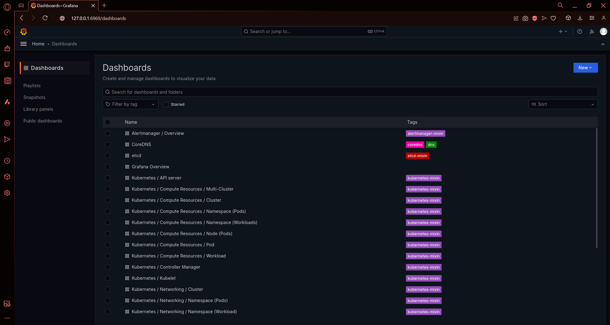
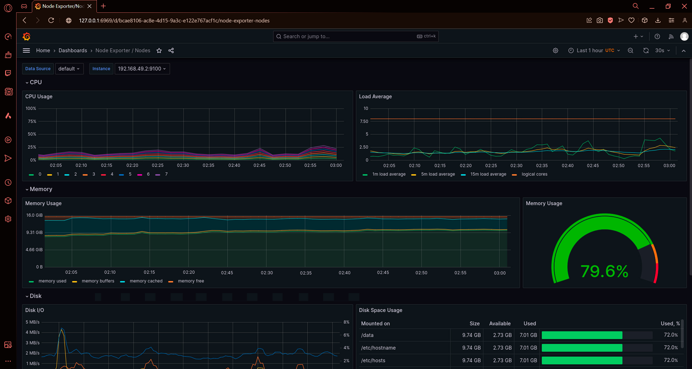
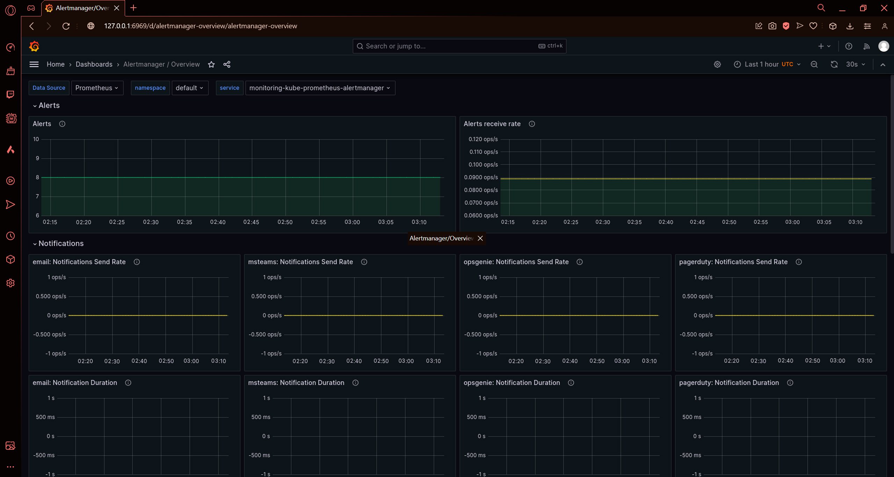
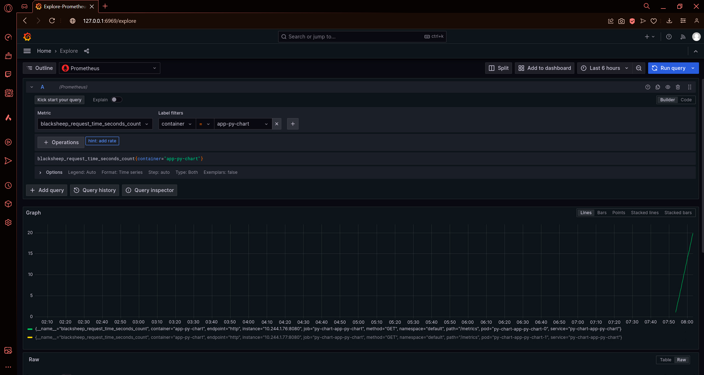

# Kubernetes Monitoring and Init Containers

### Prometheus Stack
Th main components of the Prometheus Stack are:
- **The Prometheus Operator** - manages deployment and configuration of Prometheus, Alertmanager and other monitoring-related components.
- **Highly available Prometheus** - collects metrics. Includes timeseries database and query language.
- **Highly available Alertmanager** - handles alerts and sends them to configured receivers.
- **Prometheus node-exporter** - collects metrics from the host machine.
- **Prometheus Adapter for Kubernetes Metrics APIs** - using Kubernetes metrics APIs as source for Prometheus.
- **kube-state-metrics** - collects metrics from Kubernetes objects.
- **Grafana** - visualizes metrics from Prometheus.

Using [guide](https://github.com/prometheus-community/helm-charts/tree/main/charts/kube-prometheus-stack) to install monitoring stack.
```bash
┌──(ramprin㉿ramprin-strix)-[~]
└─$  helm repo add prometheus-community https://prometheus-community.github.io/helm-charts
"prometheus-community" has been added to your repositories
┌──(ramprin㉿ramprin-strix)-[~]
└─$  helm repo update
Hang tight while we grab the latest from your chart repositories...
...Successfully got an update from the "hashicorp" chart repository
...Successfully got an update from the "prometheus-community" chart repository
Update Complete. ⎈Happy Helming!⎈
```

Installing application charts.
```bash
┌──(ramprin㉿ramprin-strix)-[~/Study/DevOps-S24/k8s]
└─$ helm install py-chart app-py-chart/
NAME: py-chart
LAST DEPLOYED: Wed May 8 02:03:24 2024
NAMESPACE: default
STATUS: deployed
REVISION: 1
NOTES:
1. Get the application URL by running these commands:
  export NODE_PORT=$(kubectl get --namespace default -o jsonpath="{.spec.ports[0].nodePort}" services py-chart-app-py-chart)
  export NODE_IP=$(kubectl get nodes --namespace default -o jsonpath="{.items[0].status.addresses[0].address}")
  echo http://$NODE_IP:$NODE_PORT
```

Output of `kubectl get po,sts,svc,pvc,cm`
```bash
┌──(ramprin㉿ramprin-strix)-[~/Study/DevOps-S24/k8s]
└─$ kubectl get po,sts,svc,pvc,cm
NAME                                                         READY   STATUS    RESTARTS       AGE
pod/alertmanager-monitoring-kube-prometheus-alertmanager-0   2/2     Running   0              10m
pod/monitoring-grafana-6f8d546676-vgzpn                      3/3     Running   0              10m
pod/monitoring-kube-prometheus-operator-5fbb66b4b-8rk8n      1/1     Running   0              10m
pod/monitoring-kube-state-metrics-74f4d8858f-pqcz6           1/1     Running   0              10m
pod/monitoring-prometheus-node-exporter-b26f9                1/1     Running   0              10m
pod/prometheus-monitoring-kube-prometheus-prometheus-0       2/2     Running   0              10m
pod/py-chart-app-py-chart-0                                  2/2     Running   0              7m32s
pod/py-chart-app-py-chart-1                                  2/2     Running   0              7m32s
pod/vault-0                                                  1/1     Running   10 (24m ago)   21d
pod/vault-agent-injector-5cd8b87c6c-7ktn5                    1/1     Running   7 (24m ago)    20d

NAME                                                                    READY   AGE
statefulset.apps/alertmanager-monitoring-kube-prometheus-alertmanager   1/1     10m
statefulset.apps/prometheus-monitoring-kube-prometheus-prometheus       1/1     10m
statefulset.apps/py-chart-app-py-chart                                  2/2     7m32s
statefulset.apps/vault                                                  1/1     21d

NAME                                              TYPE        CLUSTER-IP       EXTERNAL-IP   PORT(S)                      AGE
service/alertmanager-operated                     ClusterIP   None             <none>        9093/TCP,9094/TCP,9094/UDP   10m
service/kubernetes                                ClusterIP   10.96.0.1        <none>        443/TCP                      28d
service/monitoring-grafana                        ClusterIP   10.106.157.253   <none>        80/TCP                       10m
service/monitoring-kube-prometheus-alertmanager   ClusterIP   10.104.214.240   <none>        9093/TCP,8080/TCP            10m
service/monitoring-kube-prometheus-operator       ClusterIP   10.109.211.135   <none>        443/TCP                      10m
service/monitoring-kube-prometheus-prometheus     ClusterIP   10.98.4.134      <none>        9090/TCP,8080/TCP            10m
service/monitoring-kube-state-metrics             ClusterIP   10.105.77.4      <none>        8080/TCP                     10m
service/monitoring-prometheus-node-exporter       ClusterIP   10.108.238.149   <none>        9100/TCP                     10m
service/prometheus-operated                       ClusterIP   None             <none>        9090/TCP                     10m
service/py-chart-app-py-chart                     NodePort    10.105.78.186    <none>        8080:32545/TCP               7m32s
service/vault                                     ClusterIP   10.106.142.207   <none>        8200/TCP,8201/TCP            21d
service/vault-agent-injector-svc                  ClusterIP   10.102.46.250    <none>        443/TCP                      21d
service/vault-internal                            ClusterIP   None             <none>        8200/TCP,8201/TCP            21d

NAME                                                                              STATUS   VOLUME                                       CAPACITY   ACCESS MODES   STORAGECLASS   AGE
persistentvolumeclaim/python-persistent-volume-py-chart-app-py-chart-0            Bound    pvc-56db77fb-95f6-4d9e-9b3f-b9b32d4ad31b   1Mi        RWO            standard       22h
persistentvolumeclaim/python-persistent-volume-py-chart-app-py-chart-1            Bound    pvc-e13b50e3-89ce-451d-bca8-33c9ecf52c6c   1Mi        RWO            standard       22h
persistentvolumeclaim/python-persistent-volume-py-hooks-app-py-chart-0            Bound    pvc-8fdbb6f8-fbb4-42b5-93b8-c5e771814143   1Mi        RWO            standard       7d21h
persistentvolumeclaim/python-persistent-volume-py-hooks-app-py-chart-1            Bound    pvc-a7e2164b-c5b3-4524-9dd8-80e90ae48833   1Mi        RWO            standard       7d21h

NAME                                                                     DATA   AGE
configmap/chart-configmap                                                1      6m15s
configmap/chart-configmap-envfrom                                        4      6m15s
configmap/kube-root-ca.crt                                               1      28d
configmap/monitoring-grafana                                             1      10m
configmap/monitoring-grafana-config-dashboards                           1      10m
configmap/monitoring-kube-prometheus-alertmanager-overview               1      10m
configmap/monitoring-kube-prometheus-apiserver                           1      10m
configmap/monitoring-kube-prometheus-cluster-total                       1      10m
configmap/monitoring-kube-prometheus-controller-manager                  1      10m
configmap/monitoring-kube-prometheus-etcd                                1      10m
configmap/monitoring-kube-prometheus-grafana-datasource                  1      10m
configmap/monitoring-kube-prometheus-grafana-overview                    1      10m
configmap/monitoring-kube-prometheus-k8s-coredns                         1      10m
configmap/monitoring-kube-prometheus-k8s-resources-cluster               1      10m
configmap/monitoring-kube-prometheus-k8s-resources-multicluster          1      10m
configmap/monitoring-kube-prometheus-k8s-resources-namespace             1      10m
configmap/monitoring-kube-prometheus-k8s-resources-node                  1      10m
configmap/monitoring-kube-prometheus-k8s-resources-pod                   1      10m
configmap/monitoring-kube-prometheus-k8s-resources-workload              1      10m
configmap/monitoring-kube-prometheus-k8s-resources-workloads-namespace   1      10m
configmap/monitoring-kube-prometheus-kubelet                             1      10m
configmap/monitoring-kube-prometheus-namespace-by-pod                    1      10m
configmap/monitoring-kube-prometheus-namespace-by-workload               1      10m
configmap/monitoring-kube-prometheus-node-cluster-rsrc-use               1      10m
configmap/monitoring-kube-prometheus-node-rsrc-use                       1      10m
configmap/monitoring-kube-prometheus-nodes                               1      10m
configmap/monitoring-kube-prometheus-nodes-darwin                        1      10m
configmap/monitoring-kube-prometheus-persistentvolumesusage              1      10m
configmap/monitoring-kube-prometheus-pod-total                           1      10m
configmap/monitoring-kube-prometheus-prometheus                          1      10m
configmap/monitoring-kube-prometheus-proxy                               1      10m
configmap/monitoring-kube-prometheus-scheduler                           1      10m
configmap/monitoring-kube-prometheus-workload-total                      1      10m
configmap/prometheus-monitoring-kube-prometheus-prometheus-rulefiles-0   34     10m
```

Forward port for Grafana
```bash
┌──(ramprin㉿ramprin-strix)-[~/Study/DevOps-S24/k8s]
└─$ kubectl port-forward service/monitoring-grafana 6969:80
Forwarding from 127.0.0.1:6969 -> 3000
Handling connection for 6969
```
Grafana dashboard


Python app 


Node memory usage in percentage and megabytes.


Number of active alerts.


### Init Containers
```yaml
      initContainers:
        - name: init-container-one
          image: busybox:1.28
          command:
          - wget
          - "-O"
          - "/work-dir/index.html"
          - http://info.cern.ch
          volumeMounts:
          - name: init-volume
            mountPath: "/work-dir"
```

```bash
┌──(ramprin㉿ramprin-strix)-[~/Study/DevOps-S24/k8s]
└─$ kubectl exec pod/py-chart-app-py-chart-0 -it -- /bin/sh
Defaulted container "app-py-chart" out of: app-py-chart, vault-agent, init-container-one (init)
~ $ cd /app/init_workdir/
~/init_workdir $ ls
index.html
~/init_workdir $ cat index.html
<html><head></head><body><header>
<title>http://info.cern.ch</title>
</header>

<h1>http://info.cern.ch - home of the first website</h1>
<p>From here you can:</p>
<ul>
<li><a href="http://info.cern.ch/hypertext/WWW/TheProject.html">Browse the first website</a></li>
<li><a href="http://line-mode.cern.ch/www/hypertext/WWW/TheProject.html">Browse the first website using the line-mode browser simulator</a></li>
<li><a href="http://home.web.cern.ch/topics/birth-web">Learn about the birth of the web</a></li>
<li><a href="http://home.web.cern.ch/about">Learn about CERN, the physics laboratory where the web was born</a></li>
</ul>
</body></html>
```

To access application metrics, Ive configured prometheus target to scrape metrics from the python and golang apps.
```yaml
prometheus:
  additionalServiceMonitors:
  - name: "python-chart-target"
    selector:
      matchLabels:
        app.kubernetes.io/instance: python-chart
    namespaceSelector:
      any: true
    endpoints:
    - port: http
```

Installing prometheus stack with the config above.
```bash
┌──(ramprin㉿ramprin-strix)-[~/Study/DevOps-S24/k8s]
└─$ helm install monitoring prometheus-community/kube-prometheus-stack -f promconfig/values.yaml
NAME: monitoring
LAST DEPLOYED: Wed May 8 02:46:20 2024
NAMESPACE: default
STATUS: deployed
REVISION: 1
NOTES:
kube-prometheus-stack has been installed. Check its status by running:
  kubectl --namespace default get pods -l "release=monitoring"
```

Python app metric from underlaying blacksheep framework.

