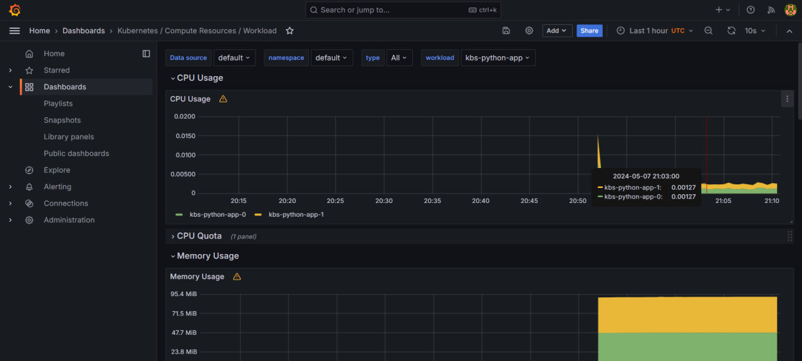
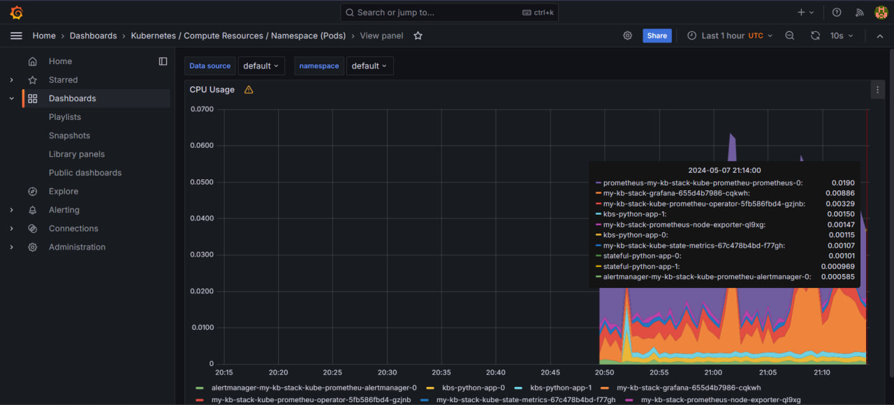
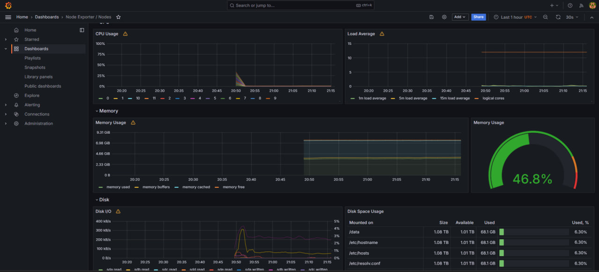
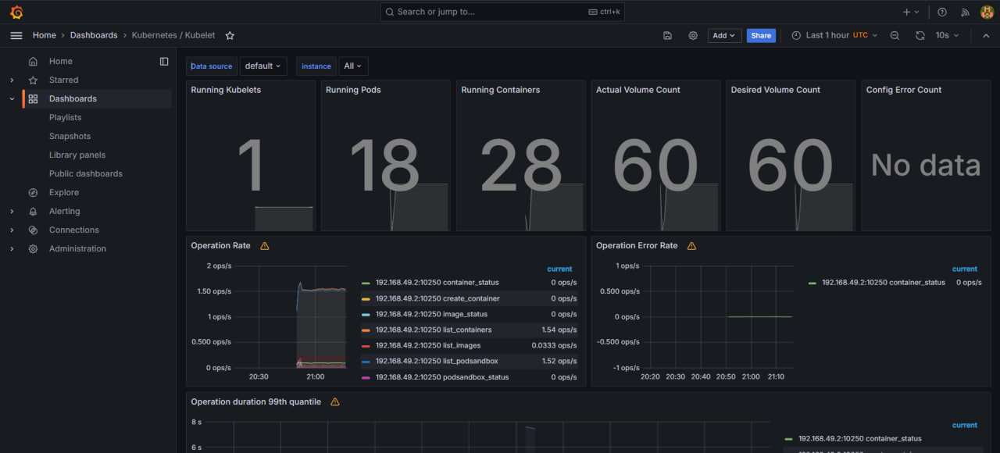
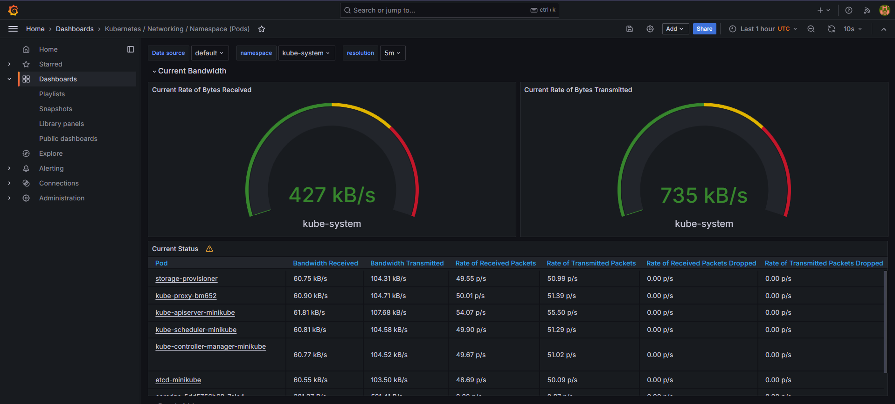
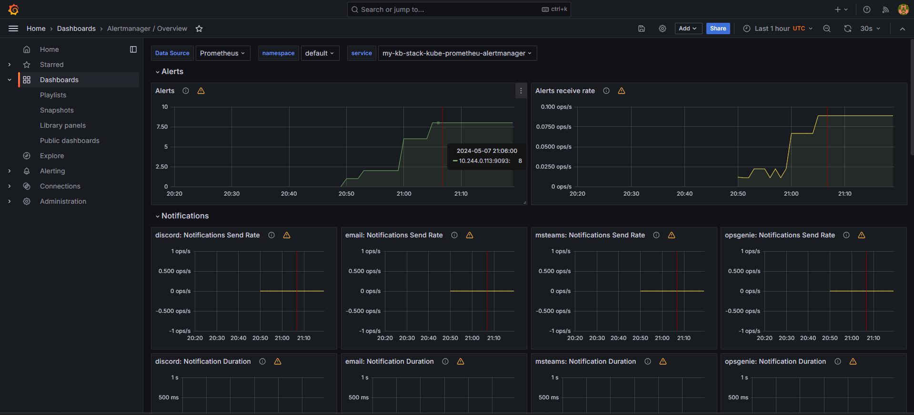
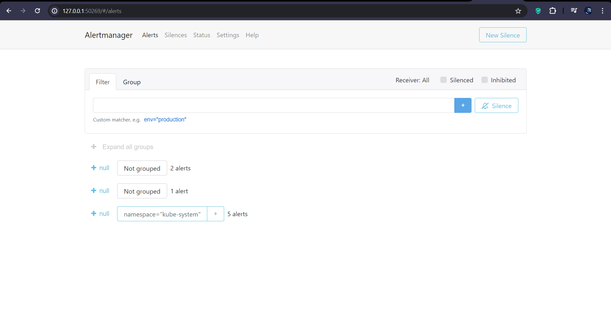

# Kubernetes Monitoring and Init Containers

## Kubernetes Cluster Monitoring with Prometheus

### Kube Prometheus Stack components:

* **Prometheus Operator:** Prometheus Operator is like the manager that keeps track of all the Prometheus instances in the Kubernetes cluster. It automates the setup, scaling, and updates, making sure everything runs smoothly.

* **Prometheus Node-Exporter:** 
This component collects information about our Kubernetes nodes, like CPU usage, memory usage, and network stats.

* **Prometheus Blackbox-Exporter:**
The Blackbox Exporter checks if our endpoints are alive. It can ping, HTTP, TCP, and ICMP to ensure everything is reachable.

* **Prometheus Adapter for Kubernetes Metrics APIs:**
The Prometheus Adapter connects Prometheus metrics with Kubernetes Metrics APIs. This is useful if we want to use custom metrics for things like autoscaling.

* **Kube-State-Metrics:**
Kube State Metrics collects data about Kubernetes objects like Deployments, StatefulSets, and Pods, giving Prometheus info about the state of the cluster.

* **Highly Available Prometheus:**
This componenet is designed to be fault-tolerant. It ensures reliability by running multiple Prometheus instances, typically in a clustered setup.

* **Highly Available Alertmanager:**
Manages alerts from Prometheus, allowing for grouping, routing, and silencing. A highly available setup ensures continuous alert processing.

* **Grafana:**
Grafana is the visualization tool that takes metrics from Prometheus and turns them into dashboards, which allow to create charts, graphs, and alerts.

### Installing charts and output

After installing the charts, the output of `helm list`:

```bash
NAME            NAMESPACE       REVISION        UPDATED                                 STATUS          CHART                  
        APP VERSION
kbs-python-app  default         1               2024-05-07 23:50:40.817351 +0300 MSK    deployed        python-app-0.1.0               1.16.0
my-kb-stack     default         1               2024-05-07 23:45:26.4654234 +0300 MSK   deployed        kube-prometheus-stack-58.4.0   v0.73.2
```

---

The output of the command `kubectl get po,sts,svc,pvc,cm`:

```bash
NAME                                                         READY   STATUS      RESTARTS   AGE
pod/alertmanager-my-kb-stack-kube-prometheu-alertmanager-0   2/2     Running     0          5m26s
pod/kbs-python-app-0                                         1/1     Running     0          79s
pod/kbs-python-app-1                                         1/1     Running     0          79s
pod/my-kb-stack-grafana-655d4b7986-cqkwh                     3/3     Running     0          6m17s
pod/my-kb-stack-kube-prometheu-operator-5fb586fbd4-gzjnb     1/1     Running     0          6m17s
pod/my-kb-stack-kube-state-metrics-67c478b4bd-f77gh          1/1     Running     0          6m17s
pod/my-kb-stack-prometheus-node-exporter-ql9xg               1/1     Running     0          6m17s
pod/post-install-hook                                        0/1     Completed   0          79s
pod/pre-install-hook                                         0/1     Completed   0          91s
pod/prometheus-my-kb-stack-kube-prometheu-prometheus-0       2/2     Running     0          5m26s

NAME                                                                    READY   AGE
statefulset.apps/alertmanager-my-kb-stack-kube-prometheu-alertmanager   1/1     5m26s
statefulset.apps/kbs-python-app                                         2/2     79s
statefulset.apps/prometheus-my-kb-stack-kube-prometheu-prometheus       1/1     5m26s

NAME                                              TYPE           CLUSTER-IP       EXTERNAL-IP   PORT(S)                      AGE
service/alertmanager-operated                     ClusterIP      None             <none>        9093/TCP,9094/TCP,9094/UDP   5m26s
service/kbs-python-app                            LoadBalancer   10.110.98.223    <pending>     5000:31419/TCP               79s
service/kubernetes                                ClusterIP      10.96.0.1        <none>        443/TCP                      34d
service/my-kb-stack-grafana                       ClusterIP      10.106.33.126    <none>        80/TCP                       6m17s
service/my-kb-stack-kube-prometheu-alertmanager   ClusterIP      10.107.189.166   <none>        9093/TCP,8080/TCP            6m17s
service/my-kb-stack-kube-prometheu-operator       ClusterIP      10.96.223.94     <none>        443/TCP                      6m17s
service/my-kb-stack-kube-prometheu-prometheus     ClusterIP      10.96.190.41     <none>        9090/TCP,8080/TCP            6m17s
service/my-kb-stack-kube-state-metrics            ClusterIP      10.102.139.240   <none>        8080/TCP                     6m17s
service/my-kb-stack-prometheus-node-exporter      ClusterIP      10.105.117.10    <none>        9100/TCP                     6m17s
service/prometheus-operated                       ClusterIP      None             <none>        9090/TCP                     5m26s

NAME                                                     STATUS   VOLUME                                     CAPACITY   ACCESS MODES   STORAGECLASS   AGE
persistentvolumeclaim/mymetadata-kbs-python-app-0        Bound    pvc-0e852383-55ff-476f-ad72-8db26efe6252   1Gi        RWO            standard       79s
persistentvolumeclaim/mymetadata-kbs-python-app-1        Bound    pvc-7b5eda4a-dbae-4344-bd15-64995b054f87   1Gi        RWO            standard       79s
persistentvolumeclaim/mymetadata-stateful-python-app-0   Bound    pvc-c825971d-2b6e-41a3-b6e5-a93d737170b3   1Gi        RWO            standard       6d19h
persistentvolumeclaim/mymetadata-stateful-python-app-1   Bound    pvc-5c446f44-e00a-4985-ad3d-1ea58113aa2d   1Gi        RWO            standard       6d19h

NAME                                                                     DATA   AGE
configmap/ghadeer-app-configmap                                          2      79s
configmap/kube-root-ca.crt                                               1      34d
configmap/my-kb-stack-grafana                                            1      6m17s
configmap/my-kb-stack-grafana-config-dashboards                          1      6m17s
configmap/my-kb-stack-kube-prometheu-alertmanager-overview               1      6m17s
configmap/my-kb-stack-kube-prometheu-apiserver                           1      6m17s
configmap/my-kb-stack-kube-prometheu-cluster-total                       1      6m17s
configmap/my-kb-stack-kube-prometheu-controller-manager                  1      6m17s
configmap/my-kb-stack-kube-prometheu-etcd                                1      6m17s
configmap/my-kb-stack-kube-prometheu-grafana-datasource                  1      6m17s
configmap/my-kb-stack-kube-prometheu-grafana-overview                    1      6m17s
configmap/my-kb-stack-kube-prometheu-k8s-coredns                         1      6m17s
configmap/my-kb-stack-kube-prometheu-k8s-resources-cluster               1      6m17s
configmap/my-kb-stack-kube-prometheu-k8s-resources-multicluster          1      6m17s
configmap/my-kb-stack-kube-prometheu-k8s-resources-namespace             1      6m17s
configmap/my-kb-stack-kube-prometheu-k8s-resources-node                  1      6m17s
configmap/my-kb-stack-kube-prometheu-k8s-resources-pod                   1      6m17s
configmap/my-kb-stack-kube-prometheu-k8s-resources-workload              1      6m17s
configmap/my-kb-stack-kube-prometheu-k8s-resources-workloads-namespace   1      6m17s
configmap/my-kb-stack-kube-prometheu-kubelet                             1      6m17s
configmap/my-kb-stack-kube-prometheu-namespace-by-pod                    1      6m17s
configmap/my-kb-stack-kube-prometheu-namespace-by-workload               1      6m17s
configmap/my-kb-stack-kube-prometheu-node-cluster-rsrc-use               1      6m17s
configmap/my-kb-stack-kube-prometheu-node-rsrc-use                       1      6m17s
configmap/my-kb-stack-kube-prometheu-nodes                               1      6m17s
configmap/my-kb-stack-kube-prometheu-nodes-darwin                        1      6m17s
configmap/my-kb-stack-kube-prometheu-persistentvolumesusage              1      6m17s
configmap/my-kb-stack-kube-prometheu-pod-total                           1      6m17s
configmap/my-kb-stack-kube-prometheu-prometheus                          1      6m17s
configmap/my-kb-stack-kube-prometheu-proxy                               1      6m17s
configmap/my-kb-stack-kube-prometheu-scheduler                           1      6m17s
configmap/my-kb-stack-kube-prometheu-workload-total                      1      6m17s
configmap/prometheus-my-kb-stack-kube-prometheu-prometheus-rulefiles-0   35     5m26s
```

#### Explanation of each part of the command output

The command `kubectl get po,sts,svc,pvc,cm` is used to gather information about several Kubernetes resources: pods, StatefulSets, services, persistent volume claims, and ConfigMaps.

- **pods (po):** 
Pods are the running instances of containers in Kubernetes.
Some of my running pods:
    - The application pods (kbs-python-app-0, kbs-python-app-1): These represent my python app, both are running.
    - Kube Prometheus Stack pods: Pods for Prometheus, Grafana, Alertmanager, and other monitoring components, indicating that the monitoring stack is active.

- **StatefulSets (sts):**
StatefulSets manage stateful workloads in Kubernetes, ensuring stable storage and identity for pods.

    - kbs-python-app: Represents your application's StatefulSet, with 2 replicas.
    - StatefulSets for monitoring stack: Alertmanager and Prometheus, with 1 replica each.

- **Services (svc):**
Services provide networking in Kubernetes, exposing applications internally or externally. The ClusterIP services are internal-only, while LoadBalancer services may have external IPs.
    - kbs-python-app: A LoadBalancer service exposing port 5000.
    - Monitoring stack services: all as ClusterIP.

- **Persistent Volume Claims (pvc):**
Persistent volume claims represent requests for storage resources in Kubernetes. These are associated with StatefulSets and ensure data persistence.
    - PVCs for kbs-python-app: These indicate that my StatefulSet pods have storage attached, each with 1Gi capacity.
    - Additional PVCs: Related to StatefulSets in the monitoring stack.

- **ConfigMaps (cm):** 
Store configuration data. Includes ConfigMaps for my Python app and components of the Kube Prometheus Stack.
    - ghadeer-app-configmap: ConfigMap for my Python app.
    - Other ConfigMaps are related to the Kube Prometheus Stack, showing configurations for Prometheus, Grafana, and other components.

---

### Grafana dashboards

1. **CPU and Memory Consumption**
    
    CPU: 0.00127, Memory: 93.2 MiB

    

2. **Pods with Higher and Lower CPU Usage**
    
    Highest cpu usage pod: prometheus-my-kb-stack
    
    Lowest cpu usage pod: alertmanager-my-kb-stack

    

3. **Node Memory Usage in Percentage and Megabytes**
    Node Memory Usage in Percentage: 46.8%

    

4. **Number of Pods and Containers**
    
    Pods: 18, Containers: 28

    

5. **Network Usage of Pods**

    

6. **Number of Active Alerts**

    Active Alerts: 8

    

    The web UI:

    

---

## Init Containers

*After refreshing all pods and helm charts*

Output of the command `kubectl get po`:

```bash
NAME                    READY   STATUS      RESTARTS   AGE
kbs-python-app-init-0   1/1     Running     0          31s
kbs-python-app-init-1   1/1     Running     0          31s
post-install-hook       0/1     Completed   0          31s
pre-install-hook        0/1     Completed   0          38s
```

---

Output of the command `kubectl exec pod/kbs-python-app-init-0 -- cat /work-dir/index.html`:

```bash
Defaulted container "python-app" out of: python-app, getcernpage (init)
<html><head></head><body><header>
<title>http://info.cern.ch</title>
</header>

<h1>http://info.cern.ch - home of the first website</h1>
<p>From here you can:</p>
<ul>
<li><a href="http://info.cern.ch/hypertext/WWW/TheProject.html">Browse the first website</a></li>
<li><a href="http://line-mode.cern.ch/www/hypertext/WWW/TheProject.html">Browse the first website using the line-mode browser simulator</a></li>
<li><a href="http://home.web.cern.ch/topics/birth-web">Learn about the birth of the web</a></li>
<li><a href="http://home.web.cern.ch/about">Learn about CERN, the physics laboratory where the web was born</a></li>
</ul>
</body></html>
```

---

Output of the commmand `kubectl exec pod/kbs-python-app-init-0 -- head -n 5 /work-dir/index.html`:

```bash
index.html
Defaulted container "python-app" out of: python-app, getcernpage (init)
<html><head></head><body><header>
<title>http://info.cern.ch</title>
</header>

<h1>http://info.cern.ch - home of the first website</h1>
```