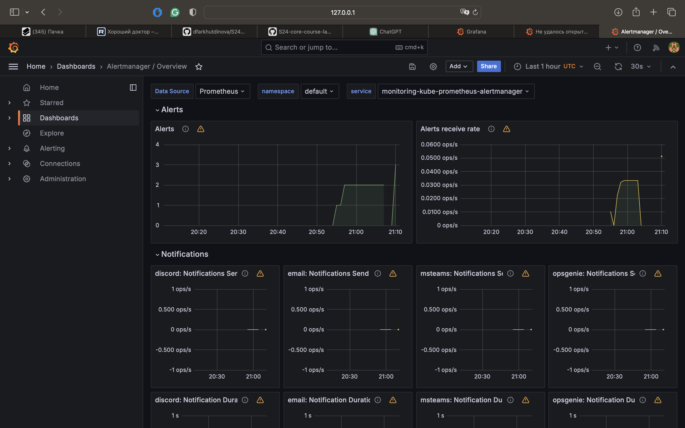
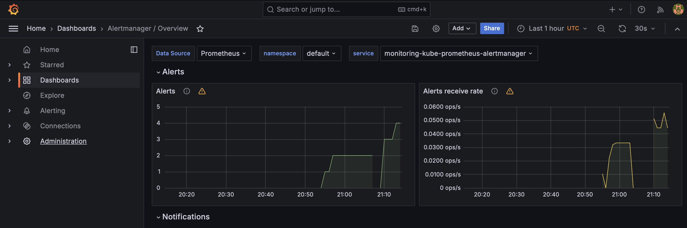
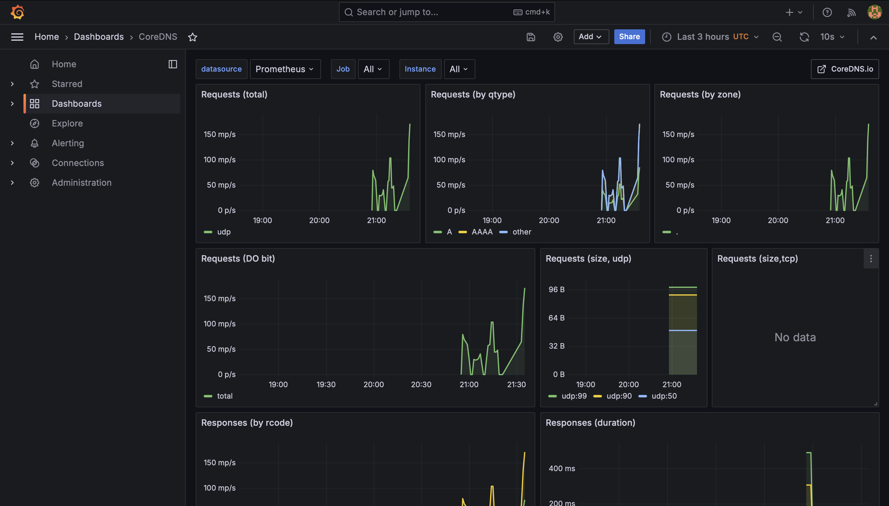
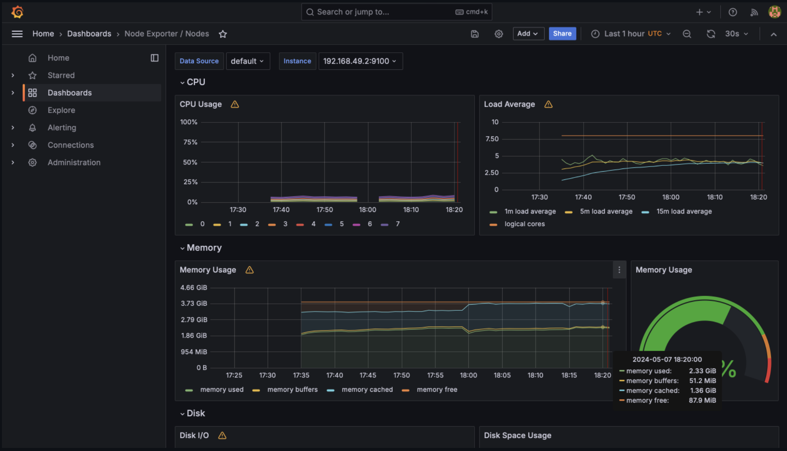

# Components of the Kube Prometheus Stack

The Kube Prometheus Stack is a comprehensive solution for Kubernetes monitoring and alerting. It consists of several key components, each playing a crucial role in monitoring the health and performance of Kubernetes clusters:

## 1. Prometheus Operator

The Prometheus Operator automates the deployment and management of Prometheus instances on Kubernetes. It provides a Kubernetes-native way to define and configure Prometheus servers, alerting rules, and recording rules using custom resources.

### Role:
- Automates the lifecycle management of Prometheus instances.
- Provides declarative configuration for Prometheus and related resources.
- Enables easy scaling and management of Prometheus deployments.

## 2. Alertmanager

Alertmanager is responsible for handling alerts generated by Prometheus and routing them to the appropriate receivers such as email, Slack, PagerDuty, etc. It takes care of deduplicating, grouping, and routing alerts based on predefined configurations.

### Role:
- Receives alerts from Prometheus.
- Groups and deduplicates alerts based on configured criteria.
- Routes alerts to the appropriate receiver integration for further action.

## 3. Grafana

Grafana is a powerful open-source analytics and visualization platform used for creating, exploring, and sharing dashboards and data. It integrates seamlessly with Prometheus to provide rich visualizations of metrics collected from Kubernetes clusters.

### Role:
- Provides a user-friendly interface for visualizing metrics.
- Allows the creation of custom dashboards to monitor Kubernetes resources.
- Supports the integration of various data sources, including Prometheus.

## 4. kube-state-metrics

kube-state-metrics is a simple service that listens to the Kubernetes API server and generates metrics about the state of Kubernetes objects (e.g., pods, nodes, services). It exposes these metrics in a format that Prometheus can scrape and store for monitoring purposes.

### Role:
- Collects metrics about the state of Kubernetes objects.
- Exposes metrics in a Prometheus-compatible format.
- Enables monitoring of Kubernetes resource utilization and health.

## 5. node-exporter

node-exporter is a Prometheus exporter that collects hardware and OS metrics from *NIX-based systems. It provides metrics related to CPU usage, memory utilization, disk I/O, network statistics, and more from Kubernetes nodes.

### Role:
- Collects system-level metrics from Kubernetes nodes.
- Exposes metrics in a Prometheus-compatible format.
- Enables monitoring of node-level resource consumption and health.

These components work together to provide a comprehensive monitoring and alerting solution for Kubernetes clusters, ensuring the reliability and performance of containerized applications.


```
(venv) (base) dilaraf@MacBook-Air S24-core-course-labs % kubectl get po,sts,svc,pvc,cm
NAME                                                         READY   STATUS    RESTARTS   AGE
pod/alertmanager-monitoring-kube-prometheus-alertmanager-0   2/2     Running   0          4m37s
pod/monitoring-grafana-657659866f-2sqjk                      3/3     Running   0          5m9s
pod/monitoring-kube-prometheus-operator-7f557c868d-jdrhf     1/1     Running   0          5m9s
pod/monitoring-kube-state-metrics-7fc7cf6558-fc44g           1/1     Running   0          5m9s
pod/monitoring-prometheus-node-exporter-hn5h8                1/1     Running   0          5m9s
pod/my-app-bb94d8f7d-6494g                                   1/1     Running   2          14d
pod/my-app-bb94d8f7d-pph9l                                   1/1     Running   2          14d
pod/my-app-bb94d8f7d-zmj52                                   1/1     Running   2          14d
pod/new-app-684f958d54-4tjhh                                 1/1     Running   19         28d
pod/prometheus-monitoring-kube-prometheus-prometheus-0       2/2     Running   0          4m36s
pod/vault-0                                                  1/1     Running   3          20d
pod/vault-agent-injector-dbfc5cd77-wvtkw                     1/1     Running   11         20d

NAME                                                                    READY   AGE
statefulset.apps/alertmanager-monitoring-kube-prometheus-alertmanager   1/1     4m37s
statefulset.apps/my-new-chart-new-app                                   0/1     7d1h
statefulset.apps/prometheus-monitoring-kube-prometheus-prometheus       1/1     4m36s
statefulset.apps/vault                                                  1/1     20d

NAME                                              TYPE        CLUSTER-IP       EXTERNAL-IP   PORT(S)                      AGE
service/alertmanager-operated                     ClusterIP   None             <none>        9093/TCP,9094/TCP,9094/UDP   4m37s
service/kubernetes                                ClusterIP   10.96.0.1        <none>        443/TCP                      34d
service/monitoring-grafana                        ClusterIP   10.108.77.64     <none>        80/TCP                       5m9s
service/monitoring-kube-prometheus-alertmanager   ClusterIP   10.110.48.207    <none>        9093/TCP,8080/TCP            5m9s
service/monitoring-kube-prometheus-operator       ClusterIP   10.96.33.51      <none>        443/TCP                      5m9s
service/monitoring-kube-prometheus-prometheus     ClusterIP   10.100.70.106    <none>        9090/TCP,8080/TCP            5m9s
service/monitoring-kube-state-metrics             ClusterIP   10.108.221.254   <none>        8080/TCP                     5m9s
service/monitoring-prometheus-node-exporter       ClusterIP   10.108.227.127   <none>        9100/TCP                     5m9s
service/my-new-chart-new-app                      ClusterIP   10.97.235.199    <none>        80/TCP                       7d1h
service/new-app                                   ClusterIP   10.109.11.167    <none>        80/TCP                       28d
service/prometheus-operated                       ClusterIP   None             <none>        9090/TCP                     4m36s
service/vault                                     ClusterIP   10.110.116.148   <none>        8200/TCP,8201/TCP            20d
service/vault-agent-injector-svc                  ClusterIP   10.99.100.207    <none>        443/TCP                      20d
service/vault-internal                            ClusterIP   None             <none>        8200/TCP,8201/TCP            20d

NAME                                                                     DATA   AGE
configmap/app-config                                                     1      7d1h
configmap/kube-root-ca.crt                                               1      35d
configmap/monitoring-grafana                                             1      5m9s
configmap/monitoring-grafana-config-dashboards                           1      5m9s
configmap/monitoring-kube-prometheus-alertmanager-overview               1      5m9s
configmap/monitoring-kube-prometheus-apiserver                           1      5m9s
configmap/monitoring-kube-prometheus-cluster-total                       1      5m9s
configmap/monitoring-kube-prometheus-controller-manager                  1      5m9s
configmap/monitoring-kube-prometheus-etcd                                1      5m9s
configmap/monitoring-kube-prometheus-grafana-datasource                  1      5m9s
configmap/monitoring-kube-prometheus-grafana-overview                    1      5m9s
configmap/monitoring-kube-prometheus-k8s-coredns                         1      5m9s
configmap/monitoring-kube-prometheus-k8s-resources-cluster               1      5m9s
configmap/monitoring-kube-prometheus-k8s-resources-multicluster          1      5m9s
configmap/monitoring-kube-prometheus-k8s-resources-namespace             1      5m9s
configmap/monitoring-kube-prometheus-k8s-resources-node                  1      5m9s
configmap/monitoring-kube-prometheus-k8s-resources-pod                   1      5m9s
configmap/monitoring-kube-prometheus-k8s-resources-workload              1      5m9s
configmap/monitoring-kube-prometheus-k8s-resources-workloads-namespace   1      5m9s
configmap/monitoring-kube-prometheus-kubelet                             1      5m9s
configmap/monitoring-kube-prometheus-namespace-by-pod                    1      5m9s
configmap/monitoring-kube-prometheus-namespace-by-workload               1      5m9s
configmap/monitoring-kube-prometheus-node-cluster-rsrc-use               1      5m9s
configmap/monitoring-kube-prometheus-node-rsrc-use                       1      5m9s
configmap/monitoring-kube-prometheus-nodes                               1      5m9s
configmap/monitoring-kube-prometheus-nodes-darwin                        1      5m9s
configmap/monitoring-kube-prometheus-persistentvolumesusage              1      5m9s
configmap/monitoring-kube-prometheus-pod-total                           1      5m9s
configmap/monitoring-kube-prometheus-prometheus                          1      5m9s
configmap/monitoring-kube-prometheus-proxy                               1      5m9s
configmap/monitoring-kube-prometheus-scheduler                           1      5m9s
configmap/monitoring-kube-prometheus-workload-total                      1      5m9s
configmap/prometheus-monitoring-kube-prometheus-prometheus-rulefiles-0   35     4m36s
(venv) (base) dilaraf@MacBook-Air S24-core-course-labs % 
```






# Containers
```
(venv) (base) dilaraf@MacBook-Air S24-core-course-labs % kubectl exec python-web-app-0  -- cat /app_python/web_page.html 
Defaulted container "python-web-app" out of: python-web-app, download-file (init)
<!doctype html>
<html>
<head>
    <title>Example Domain</title>

    <meta charset="utf-8" />
    <meta http-equiv="Content-type" content="text/html; charset=utf-8" />
    <meta name="viewport" content="width=device-width, initial-scale=1" />
    <style type="text/css">
    body {
        background-color: #f0f0f2;
        margin: 0;
        padding: 0;
        font-family: -apple-system, system-ui, BlinkMacSystemFont, "Segoe UI", "Open Sans", "Helvetica Neue", Helvetica, Arial, sans-serif;
        
    }
    div {
        width: 600px;
        margin: 5em auto;
        padding: 2em;
        background-color: #fdfdff;
        border-radius: 0.5em;
        box-shadow: 2px 3px 7px 2px rgba(0,0,0,0.02);
    }
    a:link, a:visited {
        color: #38488f;
        text-decoration: none;
    }
    @media (max-width: 700px) {
        div {
            margin: 0 auto;
            width: auto;
        }
    }
    </style>    
</head>

<body>
<div>
    <h1>Example Domain</h1>
    <p>This domain is for use in illustrative examples in documents. You may use this
    domain in literature without prior coordination or asking for permission.</p>
    <p><a href="https://www.iana.org/domains/example">More information...</a></p>
</div>
</body>
</html>```