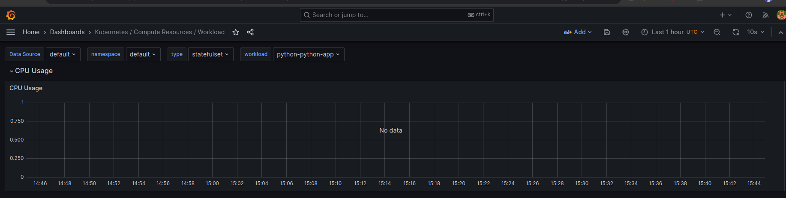
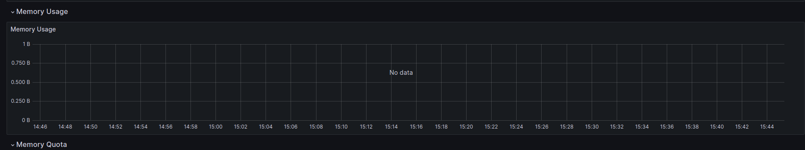
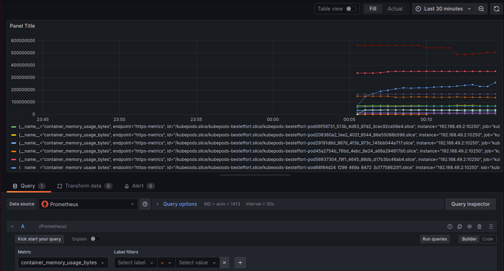
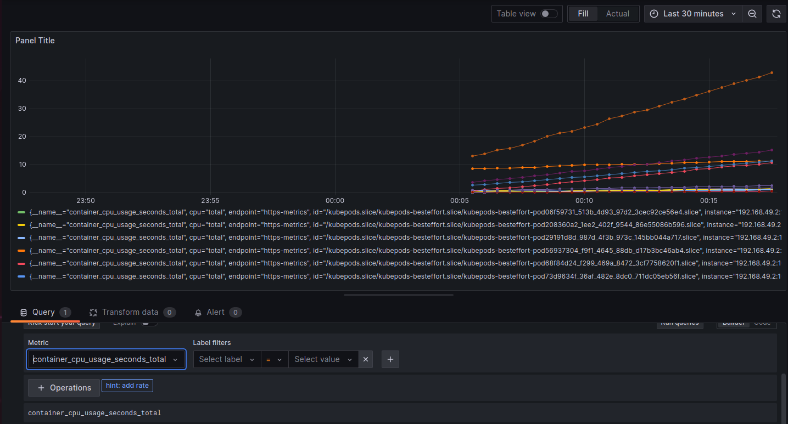
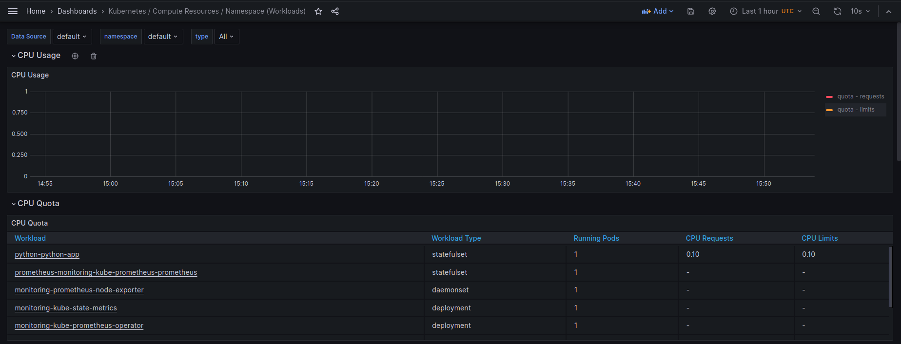
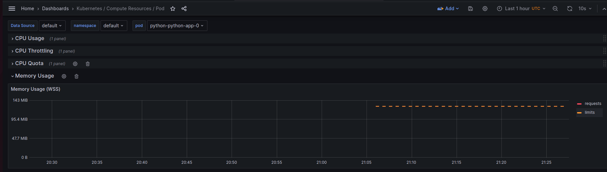
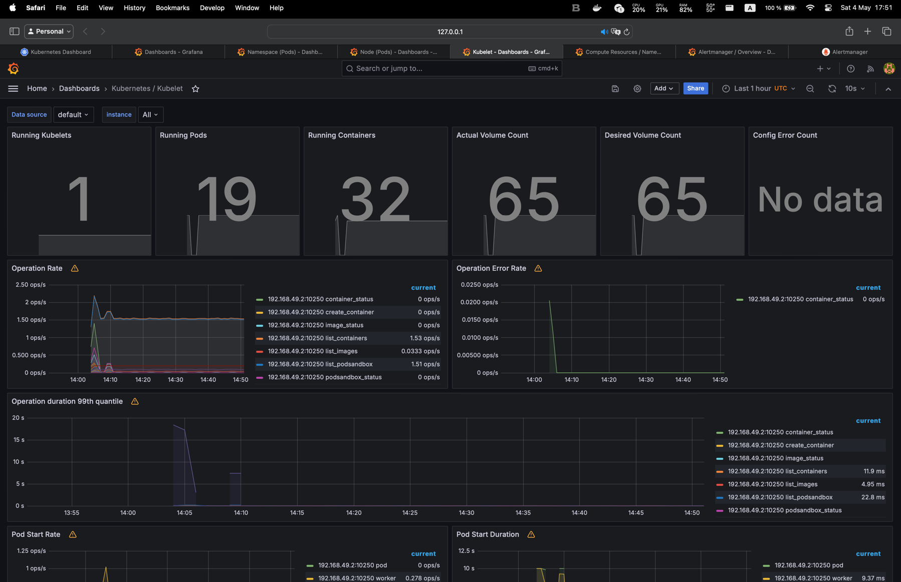
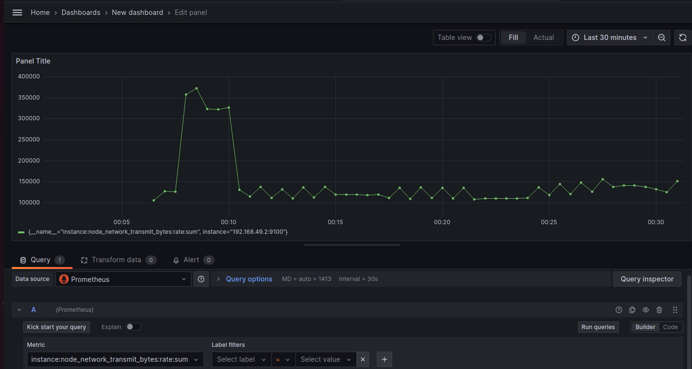
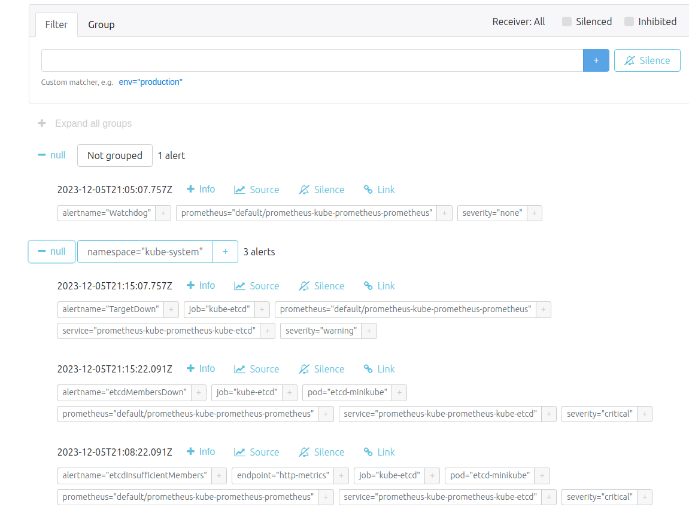

# Kubernetes Monitoring and Init Containers

## Kubernetes Cluster Monitoring with Prometheus

### Components of the Kube Prometheus Stack

* The Prometheus Operator: provides Kubernetes native support for monitoring using Prometheus and Grafana. It includes a set of predefined configurations and best practices for deploying and managing Prometheus and Grafana instances
* Highly available Prometheus: the core of monitoring and alerting; collects metrics from targets, stores them, and makes them available for querying and visualization
* Highly available Alertmanager: handles alerts sent by Prometheus server and manages the routing and grouping of alerts
* Prometheus node-exporter: exports hardware and OS metrics from a *NIX system.
* Prometheus Adapter for Kubernetes Metrics APIs: allows Prometheus to retrieve custom metrics from Kubernetes, enabling users  for scaling and monitoring their applications
* kube-state-metrics: service that listens to the Kubernetes API server components to collect metrics about the state of the objects inside (e.g. deployments, nodes, pods)
* Grafana: A platform for monitoring and observability that allows users to query, visualize, and understand metrics no matter where they are stored

### Install the Kube Prometheus Stack to your Kubernetes cluster

```shell
helm install prometheus prometheus-community/kube-prometheus-stack
```

### Describe kubectl

`kubectl get po` shows running pods of Kube Prometheus Stack components and python-app chart

```shell
(venv) shredding@SHREDDING-2 k8s % kubectl get po
NAME                                                     READY   STATUS    RESTARTS   AGE
alertmanager-prometheus-kube-prometheus-alertmanager-0   2/2     Running   0          5m11s
prometheus-grafana-57b6ff6465-czxrm                      3/3     Running   0          5m32s
prometheus-kube-prometheus-operator-59757c6644-pjxdz     1/1     Running   0          5m32s
prometheus-kube-state-metrics-6cd846d5cf-bc8fq           1/1     Running   0          5m32s
prometheus-prometheus-kube-prometheus-prometheus-0       2/2     Running   0          5m11s
prometheus-prometheus-node-exporter-ts9x6                1/1     Running   0          5m32s
python-app-python-0                                      1/1     Running   0          4m58s
python-app-python-1                                      1/1     Running   0          4m58s
python-app-python-2                                      1/1     Running   0          4m58s
```

`kubectl get sts` shows 3 stateful sets: alertmanager, prometheus and python-app

```shell
(venv) shredding@SHREDDING-2 k8s % kubectl get sts
NAME                                                   READY   AGE
alertmanager-prometheus-kube-prometheus-alertmanager   1/1     7m30s
prometheus-prometheus-kube-prometheus-prometheus       1/1     7m30s
python-app-python                                      3/3     7m17s
```

`kubectl get svc` show running services of prometheus stack and python chart

```shell
(venv) shredding@SHREDDING-2 k8s % kubectl get svc
NAME                                      TYPE           CLUSTER-IP       EXTERNAL-IP   PORT(S)                      AGE
alertmanager-operated                     ClusterIP      None             <none>        9093/TCP,9094/TCP,9094/UDP   12m
kubernetes                                ClusterIP      10.96.0.1        <none>        443/TCP                      5d21h
prometheus-grafana                        ClusterIP      10.101.177.124   <none>        80/TCP                       12m
prometheus-kube-prometheus-alertmanager   ClusterIP      10.111.97.1      <none>        9093/TCP,8080/TCP            12m
prometheus-kube-prometheus-operator       ClusterIP      10.96.4.52       <none>        443/TCP                      12m
prometheus-kube-prometheus-prometheus     ClusterIP      10.107.204.77    <none>        9090/TCP,8080/TCP            12m
prometheus-kube-state-metrics             ClusterIP      10.103.225.209   <none>        8080/TCP                     12m
prometheus-operated                       ClusterIP      None             <none>        9090/TCP                     12m
prometheus-prometheus-node-exporter       ClusterIP      10.105.113.250   <none>        9100/TCP                     12m
python-app-python                         LoadBalancer   10.101.38.247    <pending>     8080:30915/TCP               12m
```

`kubectl get pvc` shows persistent volume claims, it includes only python chart volumes

```shell
(venv) shredding@SHREDDING-2 k8s %  kubectl get pvc
NAME                                STATUS   VOLUME                                     CAPACITY   ACCESS MODES   STORAGECLASS   AGE
config-volume-python-app-python-0   Bound    pvc-1cf6be0f-27c6-4845-99f0-66119daa1d0a   1Gi        RWO            standard       5d21h
config-volume-python-app-python-1   Bound    pvc-a7c3c11c-e15b-4bb9-8aaa-f53d12958459   1Gi        RWO            standard       5d21h
config-volume-python-app-python-2   Bound    pvc-944933e3-5521-4de1-a935-f1d6b778f26f   1Gi        RWO            standard       5d21h
visits-data-python-app-python-0     Bound    pvc-a92bc1e4-6efa-4033-b8ac-5e2efbc9d2de   1Gi        RWO            standard       5d20h
visits-data-python-app-python-1     Bound    pvc-3741a0bb-4f87-4b27-9069-aa0d07cff32b   1Gi        RWO            standard       5d20h
visits-data-python-app-python-2     Bound    pvc-8d1c3841-1b15-4507-8a7c-e0357230dc5d   1Gi        RWO            standard       5d20h
```

`kubectl get cm` shows a big number of config maps for Kube Prometheus Stack and one for python-app

```shell
(venv) shredding@SHREDDING-2 k8s %  kubectl get cm
NAME                                                           DATA   AGE
kube-root-ca.crt                                               1      5d21h
prometheus-grafana                                             1      17m
prometheus-grafana-config-dashboards                           1      17m
prometheus-kube-prometheus-alertmanager-overview               1      17m
prometheus-kube-prometheus-apiserver                           1      17m
prometheus-kube-prometheus-cluster-total                       1      17m
prometheus-kube-prometheus-controller-manager                  1      17m
prometheus-kube-prometheus-etcd                                1      17m
prometheus-kube-prometheus-grafana-datasource                  1      17m
prometheus-kube-prometheus-grafana-overview                    1      17m
prometheus-kube-prometheus-k8s-coredns                         1      17m
prometheus-kube-prometheus-k8s-resources-cluster               1      17m
prometheus-kube-prometheus-k8s-resources-multicluster          1      17m
prometheus-kube-prometheus-k8s-resources-namespace             1      17m
prometheus-kube-prometheus-k8s-resources-node                  1      17m
prometheus-kube-prometheus-k8s-resources-pod                   1      17m
prometheus-kube-prometheus-k8s-resources-workload              1      17m
prometheus-kube-prometheus-k8s-resources-workloads-namespace   1      17m
prometheus-kube-prometheus-kubelet                             1      17m
prometheus-kube-prometheus-namespace-by-pod                    1      17m
prometheus-kube-prometheus-namespace-by-workload               1      17m
prometheus-kube-prometheus-node-cluster-rsrc-use               1      17m
prometheus-kube-prometheus-node-rsrc-use                       1      17m
prometheus-kube-prometheus-nodes                               1      17m
prometheus-kube-prometheus-nodes-darwin                        1      17m
prometheus-kube-prometheus-persistentvolumesusage              1      17m
prometheus-kube-prometheus-pod-total                           1      17m
prometheus-kube-prometheus-prometheus                          1      17m
prometheus-kube-prometheus-proxy                               1      17m
prometheus-kube-prometheus-scheduler                           1      17m
prometheus-kube-prometheus-workload-total                      1      17m
prometheus-prometheus-kube-prometheus-prometheus-rulefiles-0   34     16m
app-python-configmap                                           2      16m
```

### Utilize Grafana Dashboards

I could not access grafana dashboard with minikube (however launched the minikube as recommended in the course chat), so I used kubectl port-forward

```shell
(venv) shredding@SHREDDING-2 k8s % kubectl port-forward service/prometheus-grafana 3000:80
```

The default grafana password:

```shell
(venv) shredding@SHREDDING-2 k8s % helm show values prometheus-community/kube-prometheus-stack | grep admin
adminPassword: prom-operator
```

* CPU and Memory consumption of StatefulSets




So, I tried to look at prometheus data and grepped some info



For CPU usage I found total CPU usage in seconds



According to this info the highest CPU usage has pod kube-apiserver-minikube; lowest - alert-manager

* Pods with higher and lower CPU usage



* Monitor node memory usage in percentage and megabytes

I only found how to get concrete pod memory usage in MB



* Count the number of pods and containers managed by the Kubelet service



* Evaluate network usage of Pods in the default namespace



* Determine the number of active alerts; also check the Web UI with minikube service monitoring-kube-prometheus-alertmanager

4 active alerts


Web UI



## Init containers

### Download file container

```shell
(venv) shredding@SHREDDING-2 k8s %  kubectl exec python-python-app-0 -- cat init_data/index.html
Defaulted container "app-python" out of: app-python, install (init), queue-one (init), queue-two (init), queue-three (init)
<html><head></head><body><header>
<title>http://info.cern.ch</title>
</header>

<h1>http://info.cern.ch - home of the first website</h1>
<p>From here you can:</p>
<ul>
<li><a href="http://info.cern.ch/hypertext/WWW/TheProject.html">Browse the first website</a></li>
<li><a href="http://line-mode.cern.ch/www/hypertext/WWW/TheProject.html">Browse the first website using the line-mode browser simulator</a></li>
<li><a href="http://home.web.cern.ch/topics/birth-web">Learn about the birth of the web</a></li>
<li><a href="http://home.web.cern.ch/about">Learn about CERN, the physics laboratory where the web was born</a></li>
</ul>
</body></html>
```

### Queue containers write lines to file

```shell
(venv) shredding@SHREDDING-2 k8s %$ kubectl exec python-python-app-0 -- cat init_data/queue.txt
Defaulted container "app-python" out of: app-python, install (init), queue-one (init), queue-two (init), queue-three (init)
line_one
line_two
line_three
```