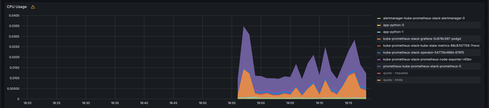
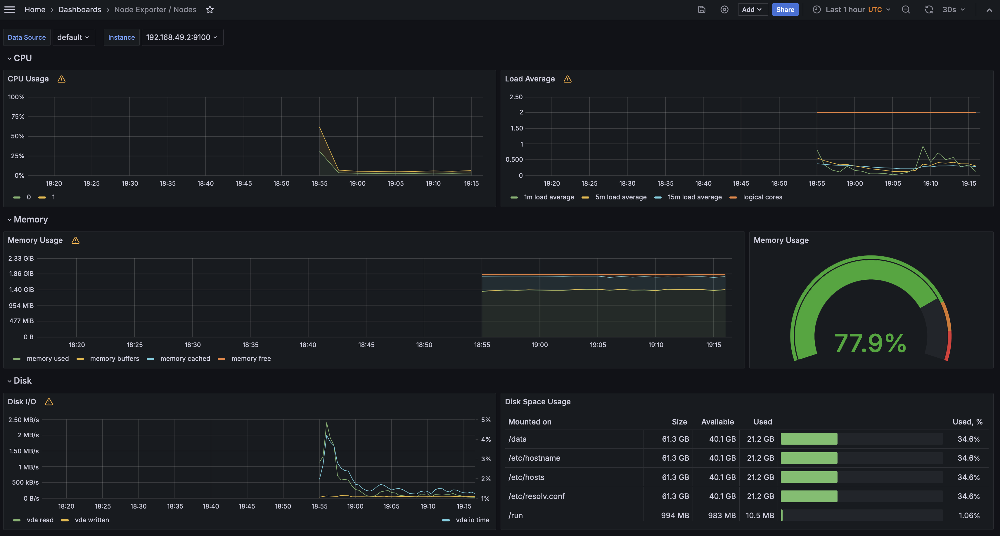
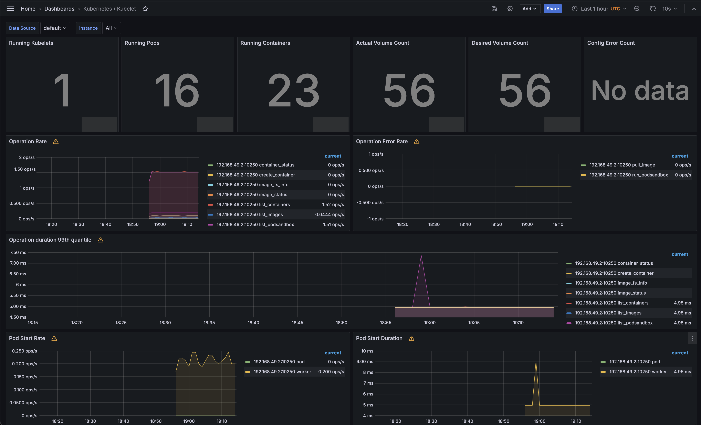
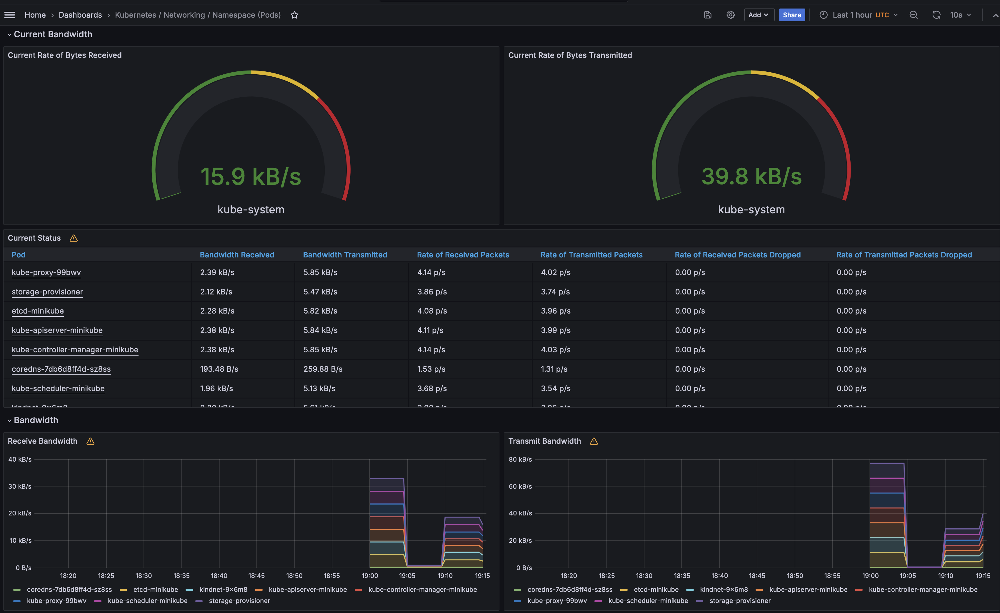
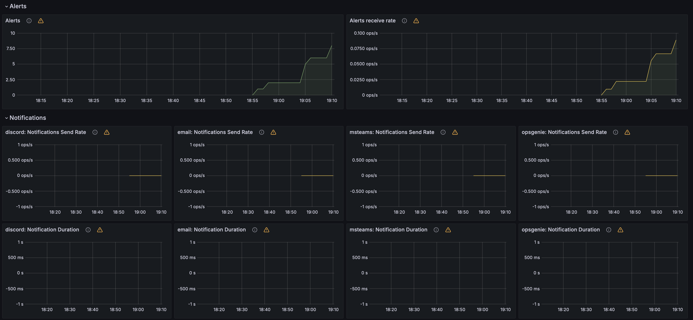
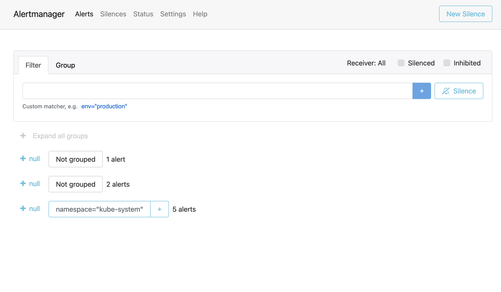

# Lab 14

## Task 1.2: Components of the Kube Prometheus Stack

- **The Prometheus Operator**: Manages and operates Prometheus and related
  monitoring components within a Kubernetes cluster.
- **Highly available Prometheus**: A Prometheus instance configured for high
  availability, ensuring reliable and redundant monitoring data collection.
- **Highly available Alertmanager**: Handles alerts generated by Prometheus,
  providing reliable and redundant alert management.
- **Prometheus node-exporter**: Collects and exposes various hardware and
  kernel-related metrics from the nodes in a Kubernetes cluster.
- **Prometheus blackbox-exporter**: Allows blackbox monitoring of endpoints over
  HTTP, HTTPS, DNS, TCP, and ICMP.
- **Prometheus Adapter for Kubernetes Metrics APIs**: Exposes Kubernetes resource
  metrics to the Kubernetes Metrics API, enabling integration with Kubernetes
  autoscaling features.
- **kube-state-metrics**: Listens to the Kubernetes API server and generates metrics
  about the state of Kubernetes objects.
- **Grafana**: A data visualization and monitoring platform that integrates with
  Prometheus, allowing users to create custom dashboards and visualizations for
  the collected metrics.

```bash
❯ kubectl get po,sts,svc,pvc
NAME                                                            READY   STATUS    RESTARTS   AGE
pod/alertmanager-kube-prometheus-stack-alertmanager-0           2/2     Running   0          53s
pod/app-python-0                                                1/1     Running   0          3m24s
pod/app-python-1                                                1/1     Running   0          3m24s
pod/kube-prometheus-stack-grafana-5c878c597-pxdgd               3/3     Running   0          2m12s
pod/kube-prometheus-stack-kube-state-metrics-68c87d7759-7rwvc   1/1     Running   0          2m12s
pod/kube-prometheus-stack-operator-54775b488d-676f5             1/1     Running   0          2m12s
pod/kube-prometheus-stack-prometheus-node-exporter-r45bv        1/1     Running   0          2m12s
pod/prometheus-kube-prometheus-stack-prometheus-0               2/2     Running   0          52s

NAME                                                               READY   AGE
statefulset.apps/alertmanager-kube-prometheus-stack-alertmanager   1/1     53s
statefulset.apps/app-python                                        2/2     3m24s
statefulset.apps/prometheus-kube-prometheus-stack-prometheus       1/1     52s

NAME                                                     TYPE        CLUSTER-IP       EXTERNAL-IP   PORT(S)                      AGE
service/alertmanager-operated                            ClusterIP   None             <none>        9093/TCP,9094/TCP,9094/UDP   53s
service/app-python                                       ClusterIP   10.101.235.254   <none>        80/TCP                       3m24s
service/kube-prometheus-stack-alertmanager               ClusterIP   10.108.91.99     <none>        9093/TCP,8080/TCP            2m12s
service/kube-prometheus-stack-grafana                    ClusterIP   10.100.42.176    <none>        80/TCP                       2m12s
service/kube-prometheus-stack-kube-state-metrics         ClusterIP   10.102.83.17     <none>        8080/TCP                     2m12s
service/kube-prometheus-stack-operator                   ClusterIP   10.105.76.172    <none>        443/TCP                      2m12s
service/kube-prometheus-stack-prometheus                 ClusterIP   10.98.194.20     <none>        9090/TCP,8080/TCP            2m12s
service/kube-prometheus-stack-prometheus-node-exporter   ClusterIP   10.106.157.90    <none>        9100/TCP                     2m12s
service/kubernetes                                       ClusterIP   10.96.0.1        <none>        443/TCP                      6m21s
service/prometheus-operated                              ClusterIP   None             <none>        9090/TCP                     52s

NAME                                     STATUS   VOLUME                                     CAPACITY   ACCESS MODES   STORAGECLASS   VOLUMEATTRIBUTESCLASS   AGE
persistentvolumeclaim/www-app-python-0   Bound    pvc-e58f661e-c9dc-437d-828c-5fb486dafbaa   1Gi        RWO            standard       <unset>                 5m19s
persistentvolumeclaim/www-app-python-1   Bound    pvc-71ca44b0-df5f-465c-a42c-44e922b27345   1Gi        RWO            standard       <unset>                 3m24s
```

1. **Pods (pod/\*)**: all the pods in the cluster, including their names,
   readiness status, restart count, and age.
2. **StatefulSets (statefulset.apps/\*)**: the StatefulSets in the cluster,
   including their names and the number of ready replicas.
3. **Services (service/\*)**: the services in the cluster, including their
   names, types, cluster IP addresses, and the ports they are listening on.
4. **Persistent Volume Claims (persistentvolumeclaim/\*)**: the persistent
   volume claims (PVCs) in the cluster, including their names, status, volume,
   capacity, access modes, and storage class.
5. **ConfigMaps (configmap/\*)**: the ConfigMaps in the cluster, including their
   names and the number of data items they contain.

## Task 1.5: Grafana Dashboards

Check CPU and Memory consumption of your StatefulSet:


Identify Pods with higher and lower CPU usage in the default namespace:


Monitor node memory usage in percentage and megabytes:


Count the number of pods and containers managed by the Kubelet service:


Evaluate network usage of Pods in the default namespace:


Determine the number of active alerts; also check the Web UI with minikube service monitoring-kube-prometheus-alertmanager:



## Task 2.1: Init Containers

```
❯ kubectl exec pod/app-python-0 -- cat /work-dir/index.html
Defaulted container "app-python" out of: app-python, install (init)
<html><head></head><body><header>
<title>http://info.cern.ch</title>
</header>
<h1>http://info.cern.ch - home of the first website</h1>
<p>From here you can:</p>
<ul>
<li><a href="http://info.cern.ch/hypertext/WWW/TheProject.html">Browse the first website</a></li>
<li><a href="http://line-mode.cern.ch/www/hypertext/WWW/TheProject.html">Browse the first website using the line-mode browser simulator</a></li>
<li><a href="http://home.web.cern.ch/topics/birth-web">Learn about the birth of the web</a></li>
<li><a href="http://home.web.cern.ch/about">Learn about CERN, the physics laboratory where the web was born</a></li>
</ul>
</body></html>
```

```
❯ kubectl exec pod/app-python-0 -- cat /work-dir/queue
Defaulted container "app-python" out of: app-python, install (init), queue-1 (init), queue-2 (init)
hello
world
```
