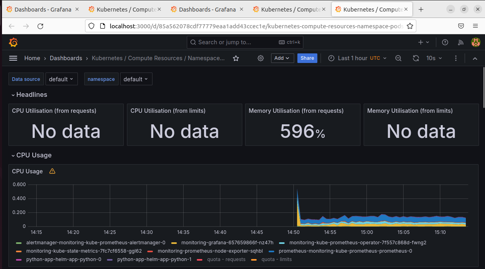
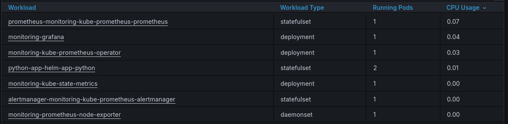
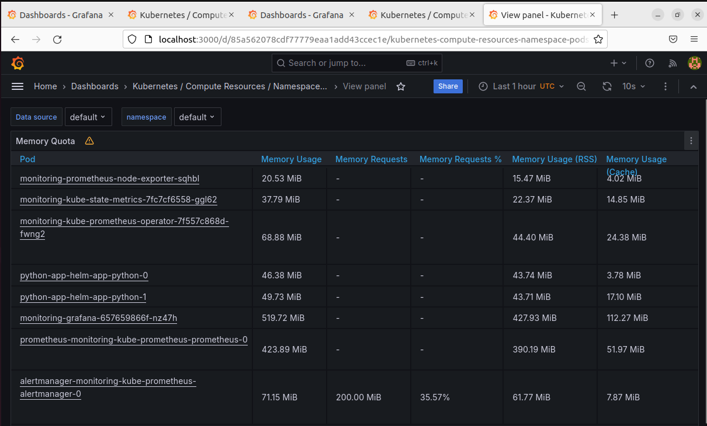
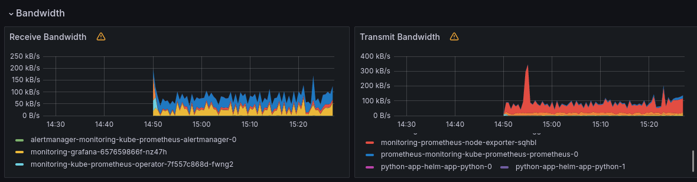
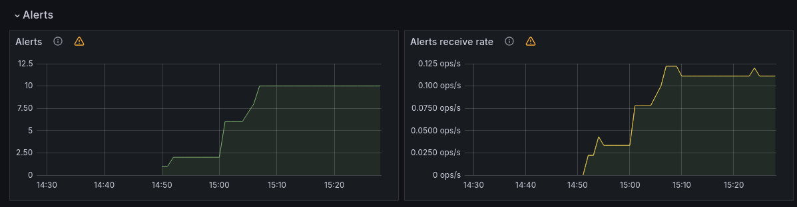

# Lab 14: Kubernetes Monitoring and Init Containers

## Task 1

### Components included in the kube-prometheus-stack

- The Prometheus Operator - provides automation of scaling and config of Prometheus.
- Highly available Prometheus - collects and stores metrics from all sources.
- Highly available Alertmanager - handles delivery of Prometheus alerts and notifications to the user.
- Prometheus node-exporter - collects os and hardware related metrics from k8s nodes.
- Prometheus blackbox-exporter - checks endpoints and external sources for their responses.
- Prometheus Adapter for Kubernetes Metrics APIs - collects k8s resources metrics.
- kube-state-metrics - collects information on state and health of k8s cluster.
- Grafana - provides visualization of metrics collected by components above.

### Command output

```bash
$ kubectl get po,sts,svc,pvc,cm
NAME                                                         READY   STATUS    RESTARTS        AGE
pod/alertmanager-monitoring-kube-prometheus-alertmanager-0   2/2     Running   0               80s
pod/monitoring-grafana-657659866f-nz47h                      3/3     Running   0               83s
pod/monitoring-kube-prometheus-operator-7f557c868d-fwng2     1/1     Running   0               83s
pod/monitoring-kube-state-metrics-7fc7cf6558-ggl62           1/1     Running   0               83s
pod/monitoring-prometheus-node-exporter-sqhbl                1/1     Running   0               83s
pod/prometheus-monitoring-kube-prometheus-prometheus-0       2/2     Running   0               79s
pod/python-app-helm-app-python-0                             1/1     Running   6 (5m15s ago)   7d1h
pod/python-app-helm-app-python-1                             1/1     Running   5 (5m15s ago)   7d1h

NAME                                                                    READY   AGE
statefulset.apps/alertmanager-monitoring-kube-prometheus-alertmanager   1/1     80s
statefulset.apps/prometheus-monitoring-kube-prometheus-prometheus       1/1     79s
statefulset.apps/python-app-helm-app-python                             2/2     7d1h

NAME                                              TYPE           CLUSTER-IP       EXTERNAL-IP   PORT(S)                      AGE
service/alertmanager-operated                     ClusterIP      None             <none>        9093/TCP,9094/TCP,9094/UDP   80s
service/kubernetes                                ClusterIP      10.96.0.1        <none>        443/TCP                      22d
service/monitoring-grafana                        ClusterIP      10.97.128.240    <none>        80/TCP                       84s
service/monitoring-kube-prometheus-alertmanager   ClusterIP      10.101.106.135   <none>        9093/TCP,8080/TCP            84s
service/monitoring-kube-prometheus-operator       ClusterIP      10.110.93.132    <none>        443/TCP                      84s
service/monitoring-kube-prometheus-prometheus     ClusterIP      10.98.18.216     <none>        9090/TCP,8080/TCP            84s
service/monitoring-kube-state-metrics             ClusterIP      10.100.110.42    <none>        8080/TCP                     84s
service/monitoring-prometheus-node-exporter       ClusterIP      10.103.162.15    <none>        9100/TCP                     84s
service/prometheus-grafana-ext                    NodePort       10.96.232.60     <none>        80:32738/TCP                 20h
service/prometheus-operated                       ClusterIP      None             <none>        9090/TCP                     79s
service/python-app-helm-app-python                LoadBalancer   10.98.212.9      <pending>     8080:32280/TCP               7d1h

NAME                                                                     DATA   AGE
configmap/helm-python-app-configmap                                      1      7d1h
configmap/kube-root-ca.crt                                               1      22d
configmap/monitoring-grafana                                             1      84s
configmap/monitoring-grafana-config-dashboards                           1      84s
configmap/monitoring-kube-prometheus-alertmanager-overview               1      84s
configmap/monitoring-kube-prometheus-apiserver                           1      84s
configmap/monitoring-kube-prometheus-cluster-total                       1      84s
configmap/monitoring-kube-prometheus-controller-manager                  1      84s
configmap/monitoring-kube-prometheus-etcd                                1      84s
configmap/monitoring-kube-prometheus-grafana-datasource                  1      84s
configmap/monitoring-kube-prometheus-grafana-overview                    1      84s
configmap/monitoring-kube-prometheus-k8s-coredns                         1      84s
configmap/monitoring-kube-prometheus-k8s-resources-cluster               1      84s
configmap/monitoring-kube-prometheus-k8s-resources-multicluster          1      84s
configmap/monitoring-kube-prometheus-k8s-resources-namespace             1      84s
configmap/monitoring-kube-prometheus-k8s-resources-node                  1      84s
configmap/monitoring-kube-prometheus-k8s-resources-pod                   1      84s
configmap/monitoring-kube-prometheus-k8s-resources-workload              1      84s
configmap/monitoring-kube-prometheus-k8s-resources-workloads-namespace   1      84s
configmap/monitoring-kube-prometheus-kubelet                             1      84s
configmap/monitoring-kube-prometheus-namespace-by-pod                    1      84s
configmap/monitoring-kube-prometheus-namespace-by-workload               1      84s
configmap/monitoring-kube-prometheus-node-cluster-rsrc-use               1      84s
configmap/monitoring-kube-prometheus-node-rsrc-use                       1      84s
configmap/monitoring-kube-prometheus-nodes                               1      84s
configmap/monitoring-kube-prometheus-nodes-darwin                        1      84s
configmap/monitoring-kube-prometheus-persistentvolumesusage              1      84s
configmap/monitoring-kube-prometheus-pod-total                           1      84s
configmap/monitoring-kube-prometheus-prometheus                          1      84s
configmap/monitoring-kube-prometheus-proxy                               1      84s
configmap/monitoring-kube-prometheus-scheduler                           1      84s
configmap/monitoring-kube-prometheus-workload-total                      1      84s
configmap/prometheus-monitoring-kube-prometheus-prometheus-rulefiles-0   35     79s
```

#### Explanation

- pod/alertmanager-monitoring-kube-prometheus-alertmanager-0, statefulset.apps/alertmanager-monitoring-kube-prometheus-alertmanager, service/alertmanager-operated, service/monitoring-kube-prometheus-alertmanager - **Highly available Alertmanager**
- pod/monitoring-grafana-657659866f-nz47h,service/monitoring-grafana, service/prometheus-grafana-ext - **Grafana**
- pod/monitoring-kube-prometheus-operator-7f557c868d-fwng2, service/monitoring-kube-prometheus-operator - **The Prometheus Operator**
- pod/monitoring-kube-state-metrics-7fc7cf6558-ggl62, service/monitoring-kube-state-metrics - **kube-state-metrics**
- pod/monitoring-prometheus-node-exporter-sqhbl, service/monitoring-prometheus-node-exporter - **Prometheus node-exporter**
- pod/prometheus-monitoring-kube-prometheus-prometheus-0, statefulset.apps/prometheus-monitoring-kube-prometheus-prometheus, service/monitoring-kube-prometheus-prometheus, service/prometheus-operated - **Highly available Prometheus**
- pod/python-app-helm-app-python-0, pod/python-app-helm-app-python-1, statefulset.apps/python-app-helm-app-python, service/python-app-helm-app-python - **2 replicas of my app**
- service/kubernetes - **Kubernetes itself**

### Screenshots of Grafana dashboards

- Check CPU and Memory consumption of your StatefulSet.
  
  
- Identify Pods with higher and lower CPU usage in the default namespace.
  
- Monitor node memory usage in percentage and megabytes.
  
- Count the number of pods and containers managed by the Kubelet service.
  
- Evaluate network usage of Pods in the default namespace.
  
- Determine the number of active alerts; also check the Web UI
  
  

## Task 2

```bash
$ kubectl exec pod/python-app-helm-app-python-0 -- cat /work-dir/index.html

Defaulted container "python-app-helm-app-python" out of: python-app-helm-app-python, get-page (init)
<html><head></head><body><header>
<title>http://info.cern.ch</title>
</header>

<h1>http://info.cern.ch - home of the first website</h1>
<p>From here you can:</p>
<ul>
<li><a href="http://info.cern.ch/hypertext/WWW/TheProject.html">Browse the first website</a></li>
<li><a href="http://line-mode.cern.ch/www/hypertext/WWW/TheProject.html">Browse the first website using the line-mode browser simulator</a></li>
<li><a href="http://home.web.cern.ch/topics/birth-web">Learn about the birth of the web</a></li>
<li><a href="http://home.web.cern.ch/about">Learn about CERN, the physics laboratory where the web was born</a></li>
</ul>
</body></html>
```
