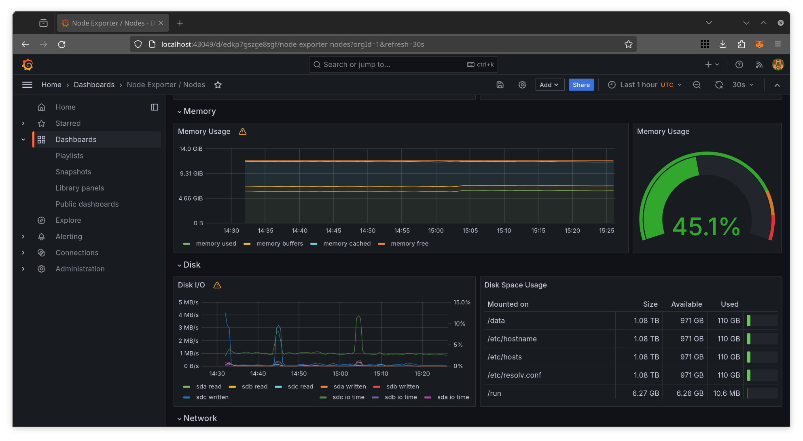
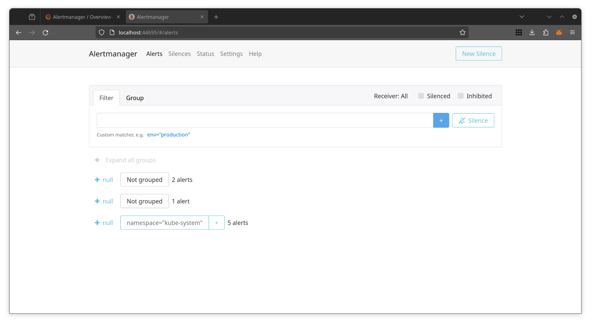

# Kubernetes Monitoring and Init Containers

## Explanation of components

- **Prometheus Operator**: Streamlines the deployment of a Prometheus stack to a
  Kubernetes cluster.

- **Prometheus**: Handles application metrics collection and storage.

- **Alertmanager**: Manages the alerts generated by Prometheus and directs them
  to predefined channels such as email or Telegram.

- **Prometheus Node Exporter**: Collects hardware and OS metrics for Prometheus.

- **Prometheus Blackbox Exporter**: Probes endpoints over HTTP, HTTPS, DNS, TCP,
  and ICMP to test service availability.

- **Prometheus Adapter for Kubernetes Metrics APIs**: Gathers metrics from
  Kubernetes and provides them for Prometheus.

- **kube-state-metrics**: A service that monitors the Kubernetes API server and
  produces metrics about object states for Prometheus.

- **Grafana**: Assists in data visualization through dashboards.

## Helm Charts Installation

Let's consider the output of the following command:

```bash
kubectl get po,sts,svc,pvc,cm
```

First section is a list of pods currently running in the cluster:

> ```bash
> NAME                                                            READY   STATUS    RESTARTS   AGE
> pod/alertmanager-kube-prometheus-stack-alertmanager-0           2/2     Running   0          5m41s
> pod/app-python-0                                                1/1     Running   0          54s
> pod/app-python-1                                                1/1     Running   0          54s
> pod/kube-prometheus-stack-grafana-7cf5785ff8-6kp56              3/3     Running   0          5m44s
> pod/kube-prometheus-stack-kube-state-metrics-65594f9476-k7rff   1/1     Running   0          5m44s
> pod/kube-prometheus-stack-operator-8655ff687b-wxjl6             1/1     Running   0          5m44s
> pod/kube-prometheus-stack-prometheus-node-exporter-9qfxt        1/1     Running   0          5m44s
> pod/prometheus-kube-prometheus-stack-prometheus-0               2/2     Running   0          5m40s
> ```

Second section is a list of stateful sets with their status and age:

> ```bash
> NAME                                                               READY   AGE
> statefulset.apps/alertmanager-kube-prometheus-stack-alertmanager   1/1     5m43s
> statefulset.apps/app-python                                        2/2     55s
> statefulset.apps/prometheus-kube-prometheus-stack-prometheus       1/1     5m41s
> ```

Third section is a list of services with their cluster IPs and ports:

> ```bash
> NAME                                                     TYPE        CLUSTER-IP       EXTERNAL-IP   PORT(S)                      AGE
> service/alertmanager-operated                            ClusterIP   None             <none>        9093/TCP,9094/TCP,9094/UDP   5m43s
> service/app-python                                       NodePort    10.99.78.188     <none>        80:30536/TCP                 55s
> service/kube-prometheus-stack-alertmanager               ClusterIP   10.106.200.53    <none>        9093/TCP,8080/TCP            5m45s
> service/kube-prometheus-stack-grafana                    ClusterIP   10.106.125.81    <none>        80/TCP                       5m45s
> service/kube-prometheus-stack-kube-state-metrics         ClusterIP   10.101.23.214    <none>        8080/TCP                     5m45s
> service/kube-prometheus-stack-operator                   ClusterIP   10.104.117.253   <none>        443/TCP                      5m45s
> service/kube-prometheus-stack-prometheus                 ClusterIP   10.107.111.232   <none>        9090/TCP,8080/TCP            5m45s
> service/kube-prometheus-stack-prometheus-node-exporter   ClusterIP   10.111.27.131    <none>        9100/TCP                     5m45s
> service/kubernetes                                       ClusterIP   10.96.0.1        <none>        443/TCP                      3h17m
> service/prometheus-operated                              ClusterIP   None             <none>        9090/TCP                     5m41s
> ```

Fourth section is a list of persistent volume claims with their capacity and
storage class. All of them are created by my app:

> ```bash
> NAME                                      STATUS   VOLUME                                     CAPACITY   ACCESS MODES   STORAGECLASS   AGE
> persistentvolumeclaim/data-app-python-0   Bound    pvc-3bd335ff-b2ba-471f-84b8-dc1dfcc839a8   1Mi        RWO            standard       55s
> persistentvolumeclaim/data-app-python-1   Bound    pvc-3373d425-a959-4a47-9d73-62c1d6bbc13f   1Mi        RWO            standard       55s
> ```

Fifth section is a list of config maps with their data and age. The first one is
mine, the others are from the Prometheus stack:

> ```bash
> NAME                                                                DATA   AGE
> configmap/config                                                    1      55s
> configmap/kube-prometheus-stack-alertmanager-overview               1      5m45s
> configmap/kube-prometheus-stack-apiserver                           1      5m45s
> configmap/kube-prometheus-stack-cluster-total                       1      5m45s
> configmap/kube-prometheus-stack-controller-manager                  1      5m45s
> configmap/kube-prometheus-stack-etcd                                1      5m45s
> configmap/kube-prometheus-stack-grafana                             1      5m45s
> configmap/kube-prometheus-stack-grafana-config-dashboards           1      5m45s
> configmap/kube-prometheus-stack-grafana-datasource                  1      5m45s
> configmap/kube-prometheus-stack-grafana-overview                    1      5m45s
> configmap/kube-prometheus-stack-k8s-coredns                         1      5m45s
> configmap/kube-prometheus-stack-k8s-resources-cluster               1      5m45s
> configmap/kube-prometheus-stack-k8s-resources-multicluster          1      5m45s
> configmap/kube-prometheus-stack-k8s-resources-namespace             1      5m45s
> configmap/kube-prometheus-stack-k8s-resources-node                  1      5m45s
> configmap/kube-prometheus-stack-k8s-resources-pod                   1      5m45s
> configmap/kube-prometheus-stack-k8s-resources-workload              1      5m45s
> configmap/kube-prometheus-stack-k8s-resources-workloads-namespace   1      5m45s
> configmap/kube-prometheus-stack-kubelet                             1      5m45s
> configmap/kube-prometheus-stack-namespace-by-pod                    1      5m45s
> configmap/kube-prometheus-stack-namespace-by-workload               1      5m45s
> configmap/kube-prometheus-stack-node-cluster-rsrc-use               1      5m45s
> configmap/kube-prometheus-stack-node-rsrc-use                       1      5m45s
> configmap/kube-prometheus-stack-nodes                               1      5m45s
> configmap/kube-prometheus-stack-nodes-darwin                        1      5m45s
> configmap/kube-prometheus-stack-persistentvolumesusage              1      5m45s
> configmap/kube-prometheus-stack-pod-total                           1      5m45s
> configmap/kube-prometheus-stack-prometheus                          1      5m45s
> configmap/kube-prometheus-stack-proxy                               1      5m45s
> configmap/kube-prometheus-stack-scheduler                           1      5m45s
> configmap/kube-prometheus-stack-workload-total                      1      5m45s
> configmap/kube-root-ca.crt                                          1      3h17m
> configmap/prometheus-kube-prometheus-stack-prometheus-rulefiles-0   35     5m42s
> ```

## Information about cluster

1. Check CPU and Memory consumption of your StatefulSet.

   CPU time: 0.004%
   Memory usage: 177 MB

   

1. Identify Pods with higher and lower CPU usage in the default namespace.

    Highest CPU usage: prometheus
    Lowest CPU usage: node-exporter

    

1. Monitor node memory usage in percentage and megabytes.

    Memory usage: 6.05 GiB (45.3%)

    

1. Count the number of pods and containers managed by the Kubelet service.

    Pods: 16
    Containers: 23

    

1. Evaluate network usage of Pods in the default namespace.

    Download speed: 18.4 kB/s
    Upload speed: 100 kB/s

    

1. Determine the number of active alerts; also check the Web UI with `minikube
   service monitoring-kube-prometheus-alertmanager`.

    Active alerts: 8

    
    

## Init containers

```bash
$ kubectl exec app-python-1 -- cat /work-dir/index.html
Defaulted container "app-python" out of: app-python, init-example (init)
<html><head></head><body><header>
<title>http://info.cern.ch</title>
</header>

<h1>http://info.cern.ch - home of the first website</h1>
<p>From here you can:</p>
<ul>
<li><a href="http://info.cern.ch/hypertext/WWW/TheProject.html">Browse the first website</a></li>
<li><a href="http://line-mode.cern.ch/www/hypertext/WWW/TheProject.html">Browse the first website using the line-mode browser simulator</a></li>
<li><a href="http://home.web.cern.ch/topics/birth-web">Learn about the birth of the web</a></li>
<li><a href="http://home.web.cern.ch/about">Learn about CERN, the physics laboratory where the web was born</a></li>
</ul>
</body></html>
```

## Bonus: App Metrics

As one can notice, my application is listed in Prometheus targets as up and
running.


Also, I am able to retrieve some metrics.


## Bonus: Init Container Queue

```bash
$ kubectl exec app-python-1 -- cat /work-dir/ping-pong
Defaulted container "app-python" out of: app-python, install (init), ping (init), pong (init)
ping
pong
```
