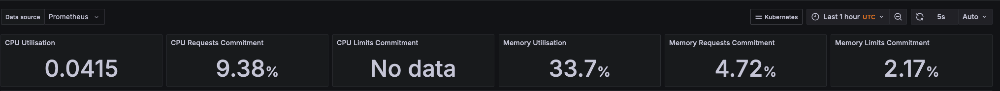
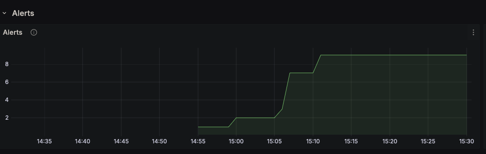

# Kubernetes Monitoring and Init Containers

## Task 1

1. __Prometheus Operator__ - deploys Prometheus + manages
2. __Prometheus__ - collects and aggregates metrics
3. __Alertmanager__ - Prometheus alert handling
4. __Node-exporter__ - collects hardware metrics from nodes
5. __Prometheus Adapter__ - allows k8s to utilise Prometheus data
6. __Kube State Metrics__ - facilitates collection of metrics from k8s data
7. __Grafana__ - metrics dashboard


### Output of `kubectl get po,sts,svc,pvc,cm` (annotated)
```
>>> Running pods(time-app, grafana, prometheus operator, node exporter, alertmanager, prometheus and leftover vault stuff):

NAME                                                          READY   STATUS        RESTARTS   AGE
pod/alertmanager-time-app-prometheus-kube-p-alertmanager-0    2/2     Running       0          5m16s
pod/prometheus-time-app-prometheus-kube-p-prometheus-0        2/2     Running       0          5m15s
pod/time-app-0                                                1/1     Terminating   0          14m
pod/time-app-1                                                1/1     Terminating   0          14m
pod/time-app-2                                                1/1     Terminating   0          14m
pod/time-app-prometheus-grafana-7d8f446c55-57sng              3/3     Running       0          5m24s
pod/time-app-prometheus-kube-p-operator-f8667f95-7w6tf        1/1     Running       0          5m24s
pod/time-app-prometheus-kube-state-metrics-6985d65979-7vk5n   1/1     Running       0          5m24s
pod/time-app-prometheus-prometheus-node-exporter-gj4hx        1/1     Running       0          5m24s
pod/vault-0                                                   1/1     Running       0          3h22m
pod/vault-agent-injector-84b987db6f-g9v4c                     1/1     Running       0          3h22m

>>> Running statefulsets(nb: altertmanager and prometheus):

NAME                                                                    READY   AGE
statefulset.apps/alertmanager-time-app-prometheus-kube-p-alertmanager   1/1     5m16s
statefulset.apps/prometheus-time-app-prometheus-kube-p-prometheus       1/1     5m15s
statefulset.apps/time-app                                               0/3     13s
statefulset.apps/vault                                                  1/1     3h22m

>>> Active services:

NAME                                                   TYPE        CLUSTER-IP       EXTERNAL-IP   PORT(S)                      AGE
service/alertmanager-operated                          ClusterIP   None             <none>        9093/TCP,9094/TCP,9094/UDP   5m16s
service/kubernetes                                     ClusterIP   10.96.0.1        <none>        443/TCP                      23h
service/prometheus-operated                            ClusterIP   None             <none>        9090/TCP                     5m15s
service/time-app-prometheus-grafana                    ClusterIP   10.101.129.56    <none>        80/TCP                       5m24s
service/time-app-prometheus-kube-p-alertmanager        ClusterIP   10.109.111.160   <none>        9093/TCP,8080/TCP            5m24s
service/time-app-prometheus-kube-p-operator            ClusterIP   10.99.175.2      <none>        443/TCP                      5m24s
service/time-app-prometheus-kube-p-prometheus          ClusterIP   10.103.161.149   <none>        9090/TCP,8080/TCP            5m24s
service/time-app-prometheus-kube-state-metrics         ClusterIP   10.104.74.124    <none>        8080/TCP                     5m24s
service/time-app-prometheus-prometheus-node-exporter   ClusterIP   10.104.73.184    <none>        9100/TCP                     5m24s
service/vault                                          ClusterIP   10.109.72.252    <none>        8200/TCP,8201/TCP            3h22m
service/vault-agent-injector-svc                       ClusterIP   10.103.229.196   <none>        443/TCP                      3h22m
service/vault-internal                                 ClusterIP   None             <none>        8200/TCP,8201/TCP            3h22m

>>> Persistent volumes(from previous labs):
NAME                                           STATUS   VOLUME                                     CAPACITY   ACCESS MODES   STORAGECLASS   VOLUMEATTRIBUTESCLASS   AGE
persistentvolumeclaim/katmetadata-time-app-0   Bound    pvc-b8e3e361-1114-426f-8e92-078abb9aaea2   200M       RWO            standard       <unset>                 27m
persistentvolumeclaim/katmetadata-time-app-1   Bound    pvc-0f822780-eb84-4c73-8299-fe5d30de241a   200M       RWO            standard       <unset>                 26m
persistentvolumeclaim/katmetadata-time-app-2   Bound    pvc-f0d5c811-6b18-4d5e-aad3-8a49a1e96553   200M       RWO            standard       <unset>                 26m

>>> Configmaps(mostly for k8s and prometheus):
NAME                                                                     DATA   AGE
configmap/config                                                         1      13s
configmap/kube-root-ca.crt                                               1      23h
configmap/prometheus-time-app-prometheus-kube-p-prometheus-rulefiles-0   35     5m15s
configmap/time-app-prometheus-grafana                                    1      5m24s
configmap/time-app-prometheus-grafana-config-dashboards                  1      5m24s
configmap/time-app-prometheus-kube-p-alertmanager-overview               1      5m24s
configmap/time-app-prometheus-kube-p-apiserver                           1      5m24s
configmap/time-app-prometheus-kube-p-cluster-total                       1      5m24s
configmap/time-app-prometheus-kube-p-controller-manager                  1      5m24s
configmap/time-app-prometheus-kube-p-etcd                                1      5m24s
configmap/time-app-prometheus-kube-p-grafana-datasource                  1      5m24s
configmap/time-app-prometheus-kube-p-grafana-overview                    1      5m24s
configmap/time-app-prometheus-kube-p-k8s-coredns                         1      5m24s
configmap/time-app-prometheus-kube-p-k8s-resources-cluster               1      5m24s
configmap/time-app-prometheus-kube-p-k8s-resources-multicluster          1      5m24s
configmap/time-app-prometheus-kube-p-k8s-resources-namespace             1      5m24s
configmap/time-app-prometheus-kube-p-k8s-resources-node                  1      5m24s
configmap/time-app-prometheus-kube-p-k8s-resources-pod                   1      5m24s
configmap/time-app-prometheus-kube-p-k8s-resources-workload              1      5m24s
configmap/time-app-prometheus-kube-p-k8s-resources-workloads-namespace   1      5m24s
configmap/time-app-prometheus-kube-p-kubelet                             1      5m24s
configmap/time-app-prometheus-kube-p-namespace-by-pod                    1      5m24s
configmap/time-app-prometheus-kube-p-namespace-by-workload               1      5m24s
configmap/time-app-prometheus-kube-p-node-cluster-rsrc-use               1      5m24s
configmap/time-app-prometheus-kube-p-node-rsrc-use                       1      5m24s
configmap/time-app-prometheus-kube-p-nodes                               1      5m24s
configmap/time-app-prometheus-kube-p-nodes-aix                           1      5m24s
configmap/time-app-prometheus-kube-p-nodes-darwin                        1      5m24s
configmap/time-app-prometheus-kube-p-persistentvolumesusage              1      5m24s
configmap/time-app-prometheus-kube-p-pod-total                           1      5m24s
configmap/time-app-prometheus-kube-p-prometheus                          1      5m24s
configmap/time-app-prometheus-kube-p-proxy                               1      5m24s
configmap/time-app-prometheus-kube-p-scheduler                           1      5m24s
configmap/time-app-prometheus-kube-p-workload-total                      1      5m24s
```

CPU and Memory usage:



Kubelet pods and containers:


Network usage:


Active alerts:


