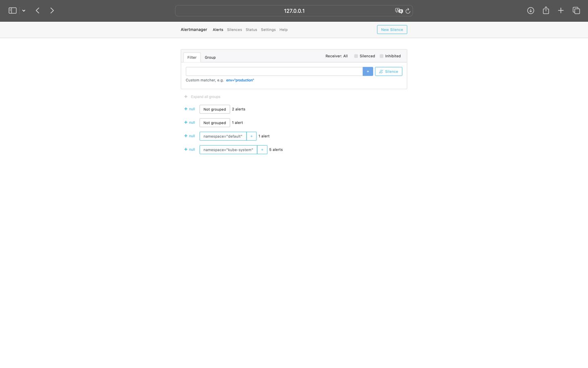

#  Prometheus Stack:
## The Kube Prometheus Stack:
is a set of Kubernetes manifests, Helm charts, and components for running Prometheus monitoring in Kubernetes environments. It includes:
- Prometheus: Collects metrics from various sources like Kubernetes nodes, pods, and services.
- Alertmanager: Handles alerts from Prometheus, allowing you to configure alert rules and send notifications.
- Grafana: Visualizes the metrics gathered by Prometheus in dashboards.
- Node Exporter: Exposes hardware and OS metrics like CPU, memory, and disk usage.
- Kube-State-Metrics: Exposes metrics about the state of Kubernetes objects, like deployments, pods, and nodes.
- Prometheus Operator: Manages Prometheus instances and configurations, allowing for easier setup and management.
## Report on pods: 
```bash
(venv) smasiner@smasIners-MacBook-Pro k8s % kubectl get po,sts,svc,pvc,cm
NAME                                                            READY   STATUS    RESTARTS   AGE
pod/alertmanager-kube-prometheus-stack-alertmanager-0           2/2     Running   0          4m35s
pod/helmapp-0                                                   1/1     Running   0          2m38s
pod/helmapp-1                                                   1/1     Running   0          2m38s
pod/helmapp-2                                                   1/1     Running   0          2m38s
pod/kube-prometheus-stack-grafana-7f48c8d7c8-g248t              3/3     Running   0          5m
pod/kube-prometheus-stack-kube-state-metrics-847c7bf499-k4zzb   1/1     Running   0          5m
pod/kube-prometheus-stack-operator-76d8665f7f-4thh6             1/1     Running   0          5m
pod/kube-prometheus-stack-prometheus-node-exporter-p8qq9        1/1     Running   0          5m
pod/prometheus-kube-prometheus-stack-prometheus-0               2/2     Running   0          4m31s

NAME                                                               READY   AGE
statefulset.apps/alertmanager-kube-prometheus-stack-alertmanager   1/1     4m35s
statefulset.apps/helmapp                                           3/3     2m38s
statefulset.apps/prometheus-kube-prometheus-stack-prometheus       1/1     4m31s

NAME                                                     TYPE        CLUSTER-IP       EXTERNAL-IP   PORT(S)                      AGE
service/alertmanager-operated                            ClusterIP   None             <none>        9093/TCP,9094/TCP,9094/UDP   4m35s
service/helmapp                                          ClusterIP   10.97.217.139    <none>        8080/TCP                     2m38s
service/kube-prometheus-stack-alertmanager               ClusterIP   10.102.85.87     <none>        9093/TCP,8080/TCP            5m1s
service/kube-prometheus-stack-grafana                    ClusterIP   10.106.155.234   <none>        80/TCP                       5m1s
service/kube-prometheus-stack-kube-state-metrics         ClusterIP   10.105.62.73     <none>        8080/TCP                     5m1s
service/kube-prometheus-stack-operator                   ClusterIP   10.109.158.30    <none>        443/TCP                      5m1s
service/kube-prometheus-stack-prometheus                 ClusterIP   10.107.216.83    <none>        9090/TCP,8080/TCP            5m1s
service/kube-prometheus-stack-prometheus-node-exporter   ClusterIP   10.99.7.100      <none>        9100/TCP                     5m1s
service/kubernetes                                       ClusterIP   10.96.0.1        <none>        443/TCP                      7h29m
service/prometheus-operated                              ClusterIP   None             <none>        9090/TCP                     4m32s

NAME                                                                DATA   AGE
configmap/config-configmap                                          1      2m38s
configmap/env-configmap                                             1      2m38s
configmap/kube-prometheus-stack-alertmanager-overview               1      5m1s
configmap/kube-prometheus-stack-apiserver                           1      5m1s
configmap/kube-prometheus-stack-cluster-total                       1      5m1s
configmap/kube-prometheus-stack-controller-manager                  1      5m1s
configmap/kube-prometheus-stack-etcd                                1      5m1s
configmap/kube-prometheus-stack-grafana                             1      5m1s
configmap/kube-prometheus-stack-grafana-config-dashboards           1      5m1s
configmap/kube-prometheus-stack-grafana-datasource                  1      5m1s
configmap/kube-prometheus-stack-grafana-overview                    1      5m1s
configmap/kube-prometheus-stack-k8s-coredns                         1      5m1s
configmap/kube-prometheus-stack-k8s-resources-cluster               1      5m1s
configmap/kube-prometheus-stack-k8s-resources-multicluster          1      5m1s
configmap/kube-prometheus-stack-k8s-resources-namespace             1      5m1s
configmap/kube-prometheus-stack-k8s-resources-node                  1      5m1s
configmap/kube-prometheus-stack-k8s-resources-pod                   1      5m1s
configmap/kube-prometheus-stack-k8s-resources-workload              1      5m1s
configmap/kube-prometheus-stack-k8s-resources-workloads-namespace   1      5m1s
configmap/kube-prometheus-stack-kubelet                             1      5m1s
configmap/kube-prometheus-stack-namespace-by-pod                    1      5m1s
configmap/kube-prometheus-stack-namespace-by-workload               1      5m1s
configmap/kube-prometheus-stack-node-cluster-rsrc-use               1      5m1s
configmap/kube-prometheus-stack-node-rsrc-use                       1      5m1s
configmap/kube-prometheus-stack-nodes                               1      5m1s
configmap/kube-prometheus-stack-nodes-aix                           1      5m1s
configmap/kube-prometheus-stack-nodes-darwin                        1      5m1s
configmap/kube-prometheus-stack-persistentvolumesusage              1      5m1s
configmap/kube-prometheus-stack-pod-total                           1      5m1s
configmap/kube-prometheus-stack-prometheus                          1      5m1s
configmap/kube-prometheus-stack-proxy                               1      5m1s
configmap/kube-prometheus-stack-scheduler                           1      5m1s
configmap/kube-prometheus-stack-workload-total                      1      5m1s
configmap/kube-root-ca.crt                                          1      4d
configmap/prometheus-kube-prometheus-stack-prometheus-rulefiles-0   35     4m32s
(venv) smasiner@smasIners-MacBook-Pro k8s % 
```
### Pods:
Pods are the smallest deployable units in Kubernetes that contain one or more containers.
### StatefulSets:
A StatefulSet is a Kubernetes resource used for managing stateful applications that require persistent storage and stable network identities.
### Services:
Services in Kubernetes provide stable networking for Pods, allowing them to be accessed even if the Pods are replaced or scaled
### ConfigMaps:
ConfigMaps are used to store non-sensitive configuration data in key-value pairs. The output lists all ConfigMaps available in the cluster, showing their names and the amount of data they contain.

# Graphana:
- Check CPU and Memory consumption of your StatefulSet:

- Identify Pods with higher and lower CPU usage in the default namespace:

- Monitor node memory usage in percentage and megabytes:


- Count the number of pods and containers managed by the Kubelet service:

- Evaluate network usage of Pods in the default namespace:

- Determine the number of active alerts; also check the Web UI with minikube service monitoring-kube-prometheus-alertmanager:


9 alerts
Alertmanager:



# Part 2:
I created separate prod for convenience.
```bash
(venv) smasiner@smasIners-MacBook-Pro k8s % helm install init-container-demo ./init-container-demo 
NAME: init-container-demo
LAST DEPLOYED: Sun Nov 17 06:01:10 2024
NAMESPACE: default
STATUS: deployed
REVISION: 1
NOTES:
1. Get the application URL by running these commands:
  export POD_NAME=$(kubectl get pods --namespace default -l "app.kubernetes.io/name=init-container-demo,app.kubernetes.io/instance=init-container-demo" -o jsonpath="{.items[0].metadata.name}")
  export CONTAINER_PORT=$(kubectl get pod --namespace default $POD_NAME -o jsonpath="{.spec.containers[0].ports[0].containerPort}")
  echo "Visit http://127.0.0.1:8080 to use your application"
  kubectl --namespace default port-forward $POD_NAME 8080:$CONTAINER_PORT
(venv) smasiner@smasIners-MacBook-Pro k8s % kubectl get pods
NAME                                   READY   STATUS    RESTARTS   AGE
init-container-demo-6774fcbf47-86frw   1/1     Running   0          8s
(venv) smasiner@smasIners-MacBook-Pro k8s % kubectl exec init-container-demo-6774fcbf47-86frw  -- cat /usr/share/nginx/html/index.html
Defaulted container "init-container-demo" out of: init-container-demo, init-container (init)
<html><head></head><body><header>
<title>http://info.cern.ch</title>
</header>

<h1>http://info.cern.ch - home of the first website</h1>
<p>From here you can:</p>
<ul>
<li><a href="http://info.cern.ch/hypertext/WWW/TheProject.html">Browse the first website</a></li>
<li><a href="http://line-mode.cern.ch/www/hypertext/WWW/TheProject.html">Browse the first website using the line-mode browser simulator</a></li>
<li><a href="http://home.web.cern.ch/topics/birth-web">Learn about the birth of the web</a></li>
<li><a href="http://home.web.cern.ch/about">Learn about CERN, the physics laboratory where the web was born</a></li>
</ul>
</body></html>
(venv) smasiner@smasIners-MacBook-Pro k8s % 
```

