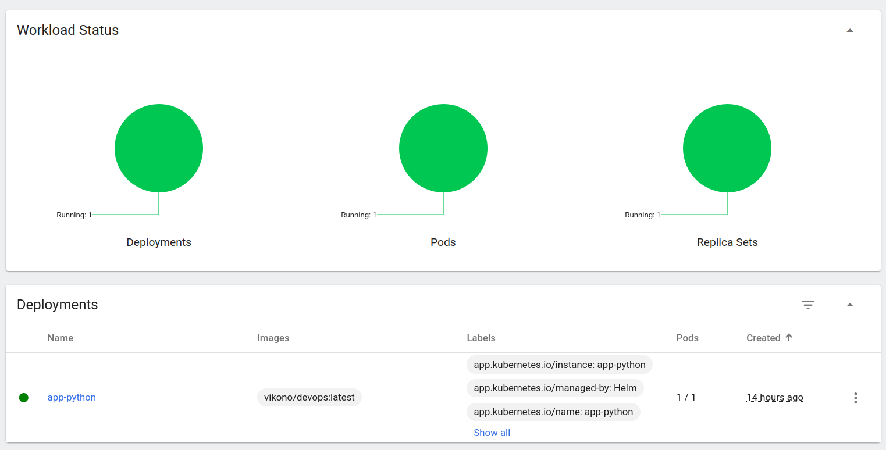

## HELM

```bash
$minikube dashboard
```



```bash
$kubectl get pods,svc
NAME                              READY   STATUS    RESTARTS   AGE
pod/app-python-7f9454cf97-jmctl   1/1     Running   0          5m12s

NAME                 TYPE        CLUSTER-IP       EXTERNAL-IP   PORT(S)    AGE
service/app-python   ClusterIP   10.111.134.150   <none>        5001/TCP   5m12s
service/kubernetes   ClusterIP   10.96.0.1        <none>        443/TCP    6m54s
```