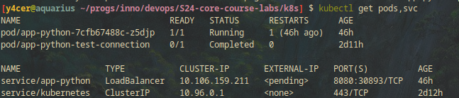
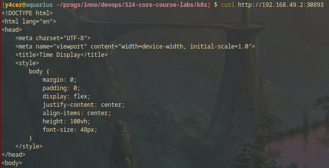

# HELM

## Output of the `minikube service app-python`

```
|-----------|------------|-------------|---------------------------|
| NAMESPACE |    NAME    | TARGET PORT |            URL            |
|-----------|------------|-------------|---------------------------|
| default   | app-python | http/8080   | http://192.168.49.2:30893 |
|-----------|------------|-------------|---------------------------|
```




