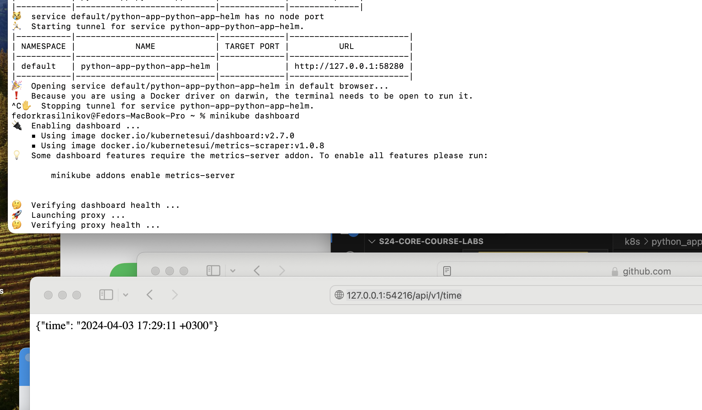
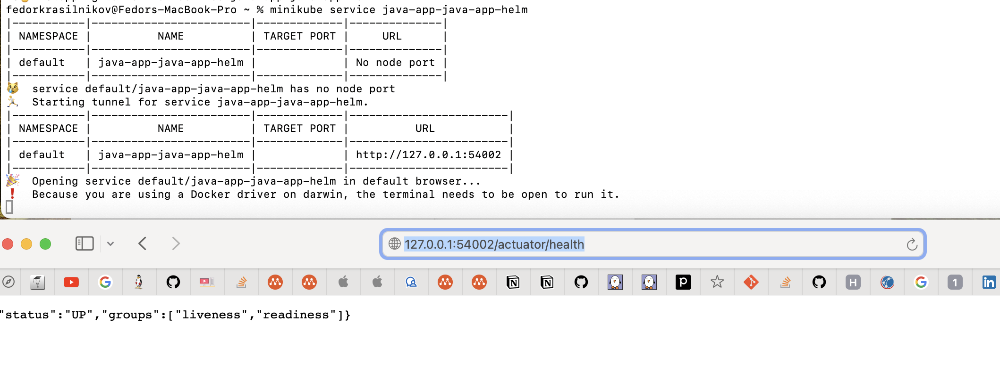
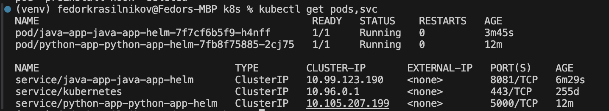

## Basic HELM setup 
After I installed the basic configuration I got the following output of `kubectl get pods,svc`
```
NAME                                              READY   STATUS    RESTARTS   AGE
pod/python-app-python-app-helm-7fb8f75885-sq4q5   1/1     Running   0          22h

NAME                                 TYPE        CLUSTER-IP      EXTERNAL-IP   PORT(S)    AGE
service/kubernetes                   ClusterIP   10.96.0.1       <none>        443/TCP    255d
service/python-app-python-app-helm   ClusterIP   10.106.10.184   <none>        5000/TCP   22h
```

Here is the screenshot of the working setup 


## After hooks setup 
Output of `kubectl get po`
```
NAME                                          READY   STATUS      RESTARTS   AGE
postinstall-hook                              0/1     Completed   0          3m56s
preinstall-hook                               0/1     Completed   0          4m19s
python-app-python-app-helm-7fb8f75885-jqnqd   1/1     Running     0          3m56s
```

Output of `kubectl describe po  preinstall-hook`
```
Name:             preinstall-hook
Namespace:        default
Priority:         0
Service Account:  default
Node:             minikube/192.168.49.2
Start Time:       Wed, 03 Apr 2024 20:48:05 +0300
Labels:           <none>
Annotations:      helm.sh/hook: pre-install
Status:           Succeeded
IP:               10.244.0.55
IPs:
  IP:  10.244.0.55
Containers:
  pre-install-container:
    Container ID:  docker://6d2f3f70f3c16f09e948cd90e1e3363a0c980b67caccd38ce72ff6a2eac26bba
    Image:         busybox
    Image ID:      docker-pullable://busybox@sha256:c3839dd800b9eb7603340509769c43e146a74c63dca3045a8e7dc8ee07e53966
    Port:          <none>
    Host Port:     <none>
    Command:
      sh
      -c
      echo The pre-install hook is running && sleep 20
    State:          Terminated
      Reason:       Completed
      Exit Code:    0
      Started:      Wed, 03 Apr 2024 20:48:06 +0300
      Finished:     Wed, 03 Apr 2024 20:48:26 +0300
    Ready:          False
    Restart Count:  0
    Environment:    <none>
    Mounts:
      /var/run/secrets/kubernetes.io/serviceaccount from kube-api-access-729tz (ro)
Conditions:
  Type              Status
  Initialized       True 
  Ready             False 
  ContainersReady   False 
  PodScheduled      True 
Volumes:
  kube-api-access-729tz:
    Type:                    Projected (a volume that contains injected data from multiple sources)
    TokenExpirationSeconds:  3607
    ConfigMapName:           kube-root-ca.crt
    ConfigMapOptional:       <nil>
    DownwardAPI:             true
QoS Class:                   BestEffort
Node-Selectors:              <none>
Tolerations:                 node.kubernetes.io/not-ready:NoExecute op=Exists for 300s
                             node.kubernetes.io/unreachable:NoExecute op=Exists for 300s
Events:
  Type    Reason     Age    From               Message
  ----    ------     ----   ----               -------
  Normal  Scheduled  5m41s  default-scheduler  Successfully assigned default/preinstall-hook to minikube
  Normal  Pulled     5m40s  kubelet            Container image "busybox" already present on machine
  Normal  Created    5m40s  kubelet            Created container pre-install-container
  Normal  Started    5m40s  kubelet            Started container pre-install-container
```

Output of `kubectl describe po  postinstall-hook`
```
Name:             postinstall-hook
Namespace:        default
Priority:         0
Service Account:  default
Node:             minikube/192.168.49.2
Start Time:       Wed, 03 Apr 2024 20:48:28 +0300
Labels:           <none>
Annotations:      helm.sh/hook: post-install
Status:           Succeeded
IP:               10.244.0.56
IPs:
  IP:  10.244.0.56
Containers:
  post-install-container:
    Container ID:  docker://4d718f9527df41b88e12d84b33c596f3ea7ab87bc52e70ed79dad0620a87e9a8
    Image:         busybox
    Image ID:      docker-pullable://busybox@sha256:c3839dd800b9eb7603340509769c43e146a74c63dca3045a8e7dc8ee07e53966
    Port:          <none>
    Host Port:     <none>
    Command:
      sh
      -c
      echo The post-install hook is running && sleep 15
    State:          Terminated
      Reason:       Completed
      Exit Code:    0
      Started:      Wed, 03 Apr 2024 20:49:02 +0300
      Finished:     Wed, 03 Apr 2024 20:49:17 +0300
    Ready:          False
    Restart Count:  0
    Environment:    <none>
    Mounts:
      /var/run/secrets/kubernetes.io/serviceaccount from kube-api-access-2xjts (ro)
Conditions:
  Type              Status
  Initialized       True 
  Ready             False 
  ContainersReady   False 
  PodScheduled      True 
Volumes:
  kube-api-access-2xjts:
    Type:                    Projected (a volume that contains injected data from multiple sources)
    TokenExpirationSeconds:  3607
    ConfigMapName:           kube-root-ca.crt
    ConfigMapOptional:       <nil>
    DownwardAPI:             true
QoS Class:                   BestEffort
Node-Selectors:              <none>
Tolerations:                 node.kubernetes.io/not-ready:NoExecute op=Exists for 300s
                             node.kubernetes.io/unreachable:NoExecute op=Exists for 300s
Events:
  Type    Reason     Age    From               Message
  ----    ------     ----   ----               -------
  Normal  Scheduled  5m42s  default-scheduler  Successfully assigned default/postinstall-hook to minikube
  Normal  Pulling    5m41s  kubelet            Pulling image "busybox"
  Normal  Pulled     5m8s   kubelet            Successfully pulled image "busybox" in 33.654554348s
  Normal  Created    5m8s   kubelet            Created container post-install-container
  Normal  Started    5m8s   kubelet            Started container post-install-container
```

## Hook delete policy 
I configured the hook pods to get deleted after successfull execution with 

```
"helm.sh/hook-delete-policy": hook-succeeded
```

# Bonus 

## Additional app 
Here is the screenshot of the working setup 


Here is the screenshot of `kubectl get pods,svc` 


### Library chart 
I followed the [tutorial](https://austindewey.com/2020/08/17/how-to-reduce-helm-chart-boilerplate-with-library-charts/) and the result can be found in the library-chart folder and in the python_app-helm and java_app-helm
