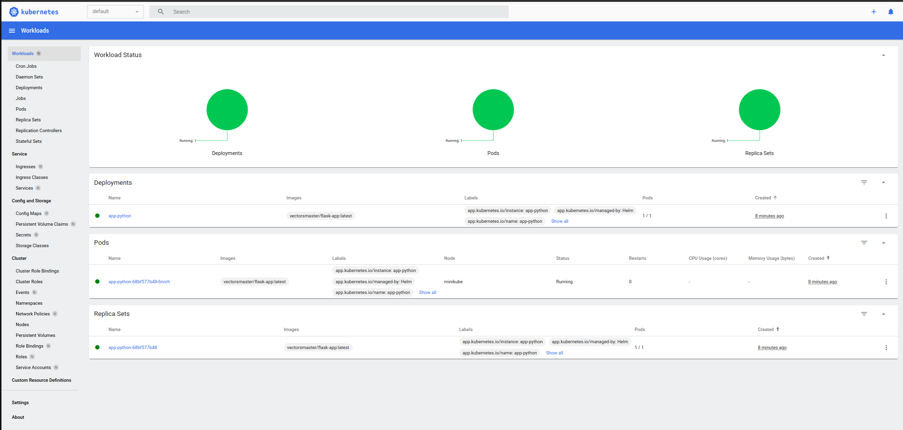

# Lab10
## Task1
1. **`helm install app-python app-python`**
    ```
    NAME: app-python
    LAST DEPLOYED: Wed Apr 10 03:55:20 2024
    NAMESPACE: default
    STATUS: deployed
    REVISION: 1
    NOTES:
    1. Get the application URL by running these commands:
        export POD_NAME=$(kubectl get pods --namespace default -l "app.kubernetes.io/name=app-python,app.kubernetes.io/instance=app-python" -o jsonpath="{.items[0].metadata.name}")
        export CONTAINER_PORT=$(kubectl get pod --namespace default $POD_NAME -o jsonpath="{.spec.containers[0].ports[0].containerPort}")
        echo "Visit http://127.0.0.1:8080 to use your application"
        kubectl --namespace default port-forward $POD_NAME 8080:$CONTAINER_PORT
    ```
2. **`minikube service app-python`**
    ```
    |-----------|------------|-------------|----------------------------|
    | NAMESPACE |    NAME    | TARGET PORT |            URL             |
    |-----------|------------|-------------|----------------------------|
    | default   | app-python | http/5000   | http://192.168.184.2:32722 |
    |-----------|------------|-------------|----------------------------|
    🎉  Opening service default/app-python in default browser...
    ```

    

3. **`kubectl get pods,svc`**
    ```
    NAME                              READY   STATUS    RESTARTS   AGE
    pod/app-python-68bf577b48-6nnrh   1/1     Running   0          7m6s

    NAME                 TYPE           CLUSTER-IP     EXTERNAL-IP   PORT(S)          AGE
    service/app-python   LoadBalancer   10.105.81.37   <pending>     5000:32722/TCP   7m7s
    service/kubernetes   ClusterIP      10.96.0.1      <none>        443/TCP          9d
    ```

4. **`minikube dashboard`**
    


## Task2

1. **`kubectl get po`**
    ```
    NAME                          READY   STATUS      RESTARTS   AGE
    app-python-68bf577b48-gvtk6   1/1     Running     0          2m23s
    postinstall-hook              0/1     Completed   0          2m49s
    preinstall-hook               0/1     Completed   0          3m22s
    ```
2. **`kubectl describe po preinstall-hook`**
    ```    
    Name:             preinstall-hook
    Namespace:        default
    Priority:         0
    Service Account:  default
    Node:             minikube/192.168.184.2
    Start Time:       Wed, 10 Apr 2024 04:49:05 +0300
    Labels:           <none>
    Annotations:      helm.sh/hook: pre-install
    Status:           Succeeded
    IP:               10.244.0.42
    IPs:
    IP:  10.244.0.42
    Containers:
    pre-install-container:
        Container ID:  docker://058968aa182315c18da473593975f479d40a7c0f086ed2cd51011b56644af8a8
        Image:         busybox
        Image ID:      docker-pullable://busybox@sha256:c3839dd800b9eb7603340509769c43e146a74c63dca3045a8e7dc8ee07e53966
        Port:          <none>
        Host Port:     <none>
        Command:
        sh
        -c
        echo The pre-install hook is running && sleep 20
        State:          Terminated
        Reason:       Completed
        Exit Code:    0
        Started:      Wed, 10 Apr 2024 04:49:12 +0300
        Finished:     Wed, 10 Apr 2024 04:49:32 +0300
        Ready:          False
        Restart Count:  0
        Environment:    <none>
        Mounts:
        /var/run/secrets/kubernetes.io/serviceaccount from kube-api-access-47gcf (ro)
    Conditions:
    Type              Status
    Initialized       True 
    Ready             False 
    ContainersReady   False 
    PodScheduled      True 
    Volumes:
    kube-api-access-47gcf:
        Type:                    Projected (a volume that contains injected data from multiple sources)
        TokenExpirationSeconds:  3607
        ConfigMapName:           kube-root-ca.crt
        ConfigMapOptional:       <nil>
        DownwardAPI:             true
    QoS Class:                   BestEffort
    Node-Selectors:              <none>
    Tolerations:                 node.kubernetes.io/not-ready:NoExecute op=Exists for 300s
                                node.kubernetes.io/unreachable:NoExecute op=Exists for 300s
    Events:
        Type    Reason     Age    From               Message
        ----    ------     ----   ----               -------
        Normal  Scheduled  5m37s  default-scheduler  Successfully assigned default/preinstall-hook to minikube
        Normal  Pulled     5m33s  kubelet            Container image "busybox" already present on machine
        Normal  Created    5m30s  kubelet            Cre    ated container pre-install-container
        Normal  Started    5m30s  kubelet            Started container pre-install-container
    ```

3. **`kubectl describe po postinstall-hook`**
    ```
    Name:             postinstall-hook
    Namespace:        default
    Priority:         0
    Service Account:  default
    Node:             minikube/192.168.184.2
    Start Time:       Wed, 10 Apr 2024 04:49:38 +0300
    Labels:           <none>
    Annotations:      helm.sh/hook: post-install
    Status:           Succeeded
    IP:               10.244.0.44
    IPs:
    IP:  10.244.0.44
    Containers:
    post-install-container:
        Container ID:  docker://43f412a1f076c2434d631b834f674bfd631503beb70711d75ac7a05138dc215d
        Image:         busybox
        Image ID:      docker-pullable://busybox@sha256:c3839dd800b9eb7603340509769c43e146a74c63dca3045a8e7dc8ee07e53966
        Port:          <none>
        Host Port:     <none>
        Command:
        sh
        -c
        echo The post-install hook is running && sleep 15
        State:          Terminated
        Reason:       Completed
        Exit Code:    0
        Started:      Wed, 10 Apr 2024 04:49:50 +0300
        Finished:     Wed, 10 Apr 2024 04:50:05 +0300
        Ready:          False
        Restart Count:  0
        Environment:    <none>
        Mounts:
        /var/run/secrets/kubernetes.io/serviceaccount from kube-api-access-2md2d (ro)
    Conditions:
    Type              Status
    Initialized       True 
    Ready             False 
    ContainersReady   False 
    PodScheduled      True 
    Volumes:
    kube-api-access-2md2d:
        Type:                    Projected (a volume that contains injected data from multiple sources)
        TokenExpirationSeconds:  3607
        ConfigMapName:           kube-root-ca.crt
        ConfigMapOptional:       <nil>
        DownwardAPI:             true
    QoS Class:                   BestEffort
    Node-Selectors:              <none>
    Tolerations:                 node.kubernetes.io/not-ready:NoExecute op=Exists for 300s
                                node.kubernetes.io/unreachable:NoExecute op=Exists for 300s
    Events:
    Type    Reason     Age    From               Message
    ----    ------     ----   ----               -------
    Normal  Scheduled  7m8s   default-scheduler  Successfully assigned default/postinstall-hook to minikube
    Normal  Pulling    7m3s   kubelet            Pulling image "busybox"
    Normal  Pulled     7m     kubelet            Successfully pulled image "busybox" in 3.646s (3.646s including waiting)
    Normal  Created    6m56s  kubelet            Created container post-install-container
    Normal  Started    6m55s  kubelet            Started container post-install-container
    ```

4. **hook delete policy**
    I added the following to hooks yaml files in `metadata.annotations`:
    - `"helm.sh/hook-delete-policy": hook-succeeded`
         

5. **`kubectl get pods,svc`** 
    ```
    NAME                              READY   STATUS    RESTARTS   AGE
    pod/app-python-68bf577b48-cwk7r   1/1     Running   0          67s

    NAME                 TYPE           CLUSTER-IP     EXTERNAL-IP   PORT(S)          AGE
    service/app-python   LoadBalancer   10.102.29.15   <pending>     5000:31786/TCP   68s
    service/kubernetes   ClusterIP      10.96.0.1      <none>        443/TCP          9d
    ```