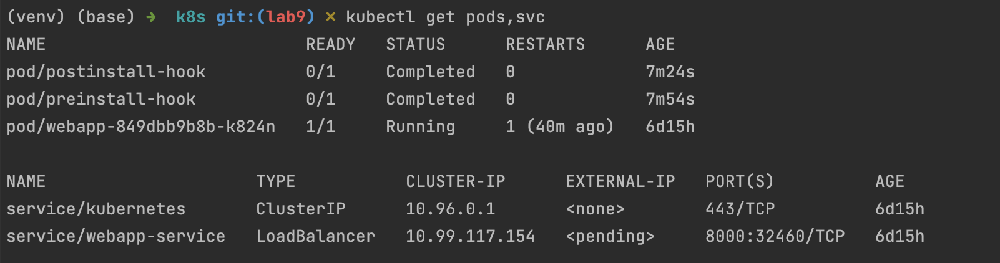
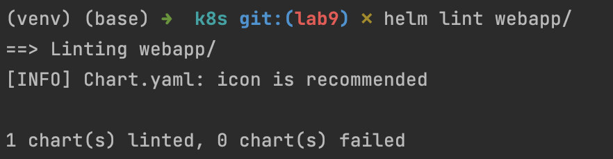
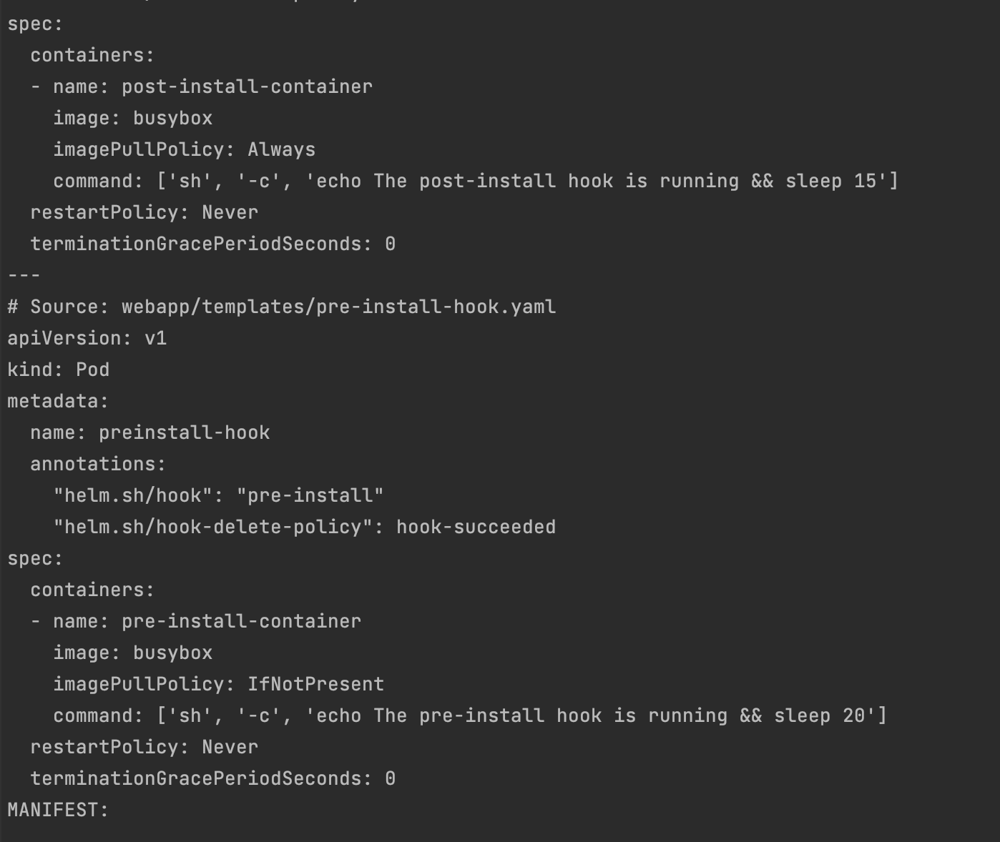
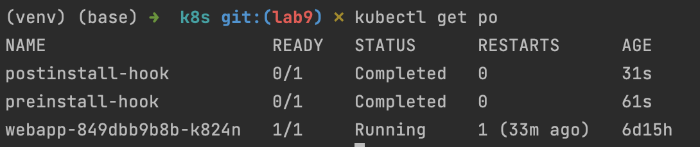
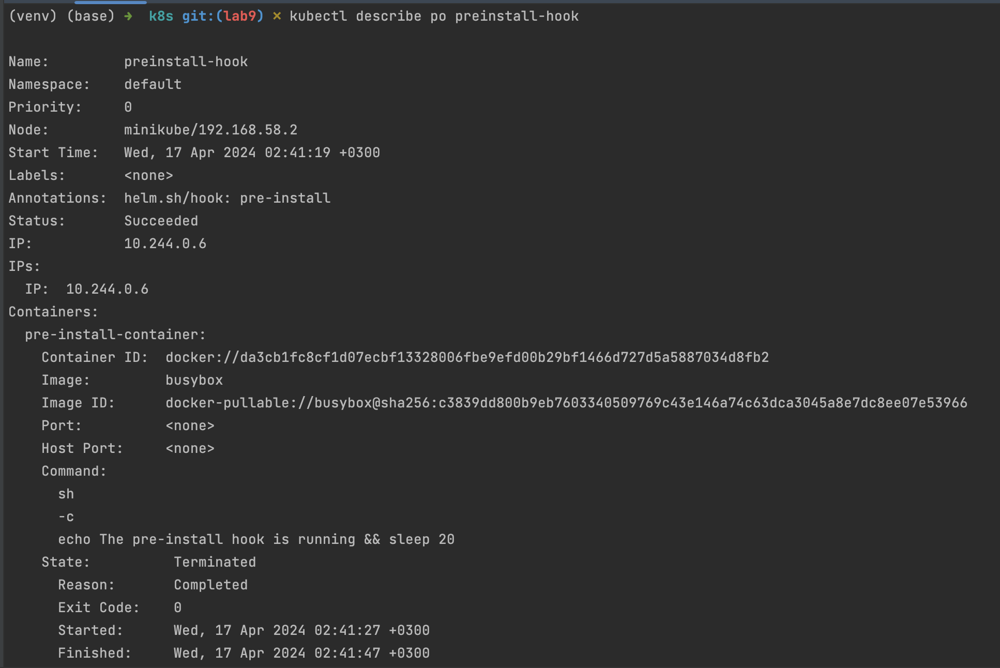
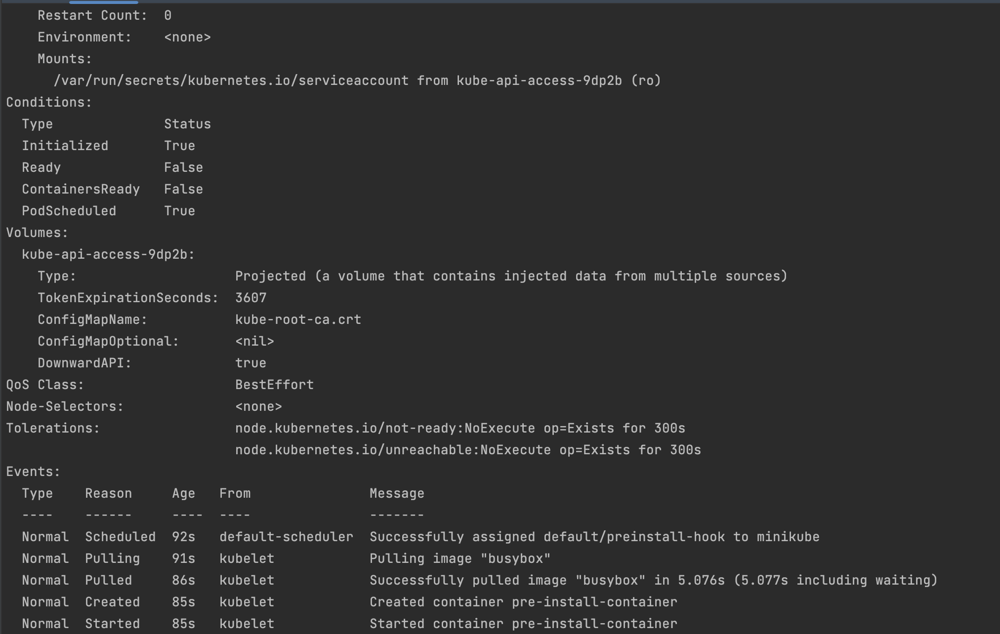
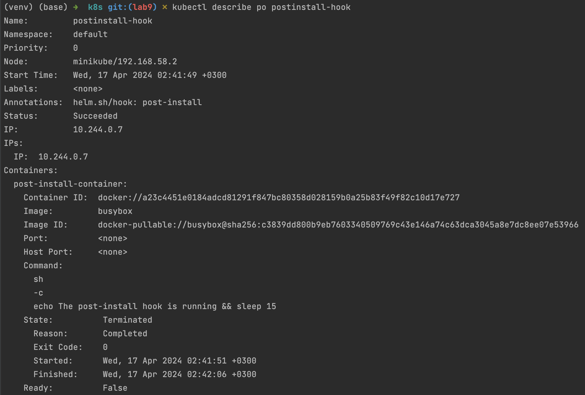
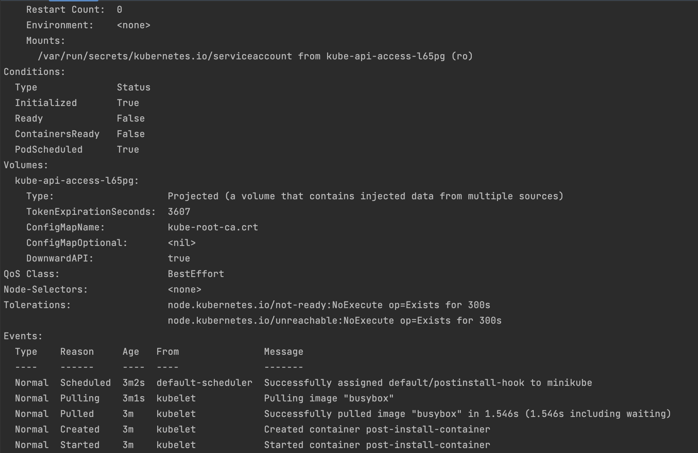
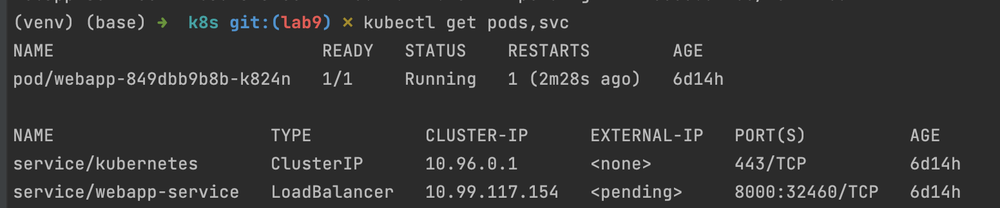

# Helm

### Task 1

1. Check via `kubectl get pods,svc` command:

# Task 2: Helm hooks

## Helm Chart Hooks

### Lint the Helm chart

### Perform dry-run of the Helm chart

### Verify the Helm chart hooks
- `kubectl get po`

- `kubectl describe po preinstall-hook`

- `kubectl describe po postinstall-hook`

### After adding hook delete policy, only webapp is running
- `kubectl get pods,svc`
