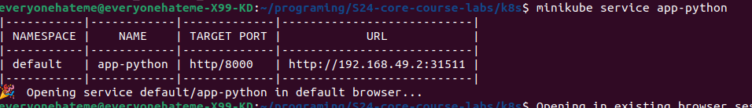

# Helm

## Task 1

### Install Helm Chart

```sh
$ helm install app-python app-python
NAME: app-python
LAST DEPLOYED: Tue Apr  9 14:44:27 2024
NAMESPACE: default
STATUS: deployed
REVISION: 1
NOTES:
1. Get the application URL by running these commands:
  export NODE_PORT=$(kubectl get --namespace default -o jsonpath="{.spec.ports[0].nodePort}" services app-python)
  export NODE_IP=$(kubectl get nodes --namespace default -o jsonpath="{.items[0].status.addresses[0].address}")
  echo http://$NODE_IP:$NODE_PORT
```

### The Workloads page in the Minikube dashboard


### Access the Application



### The output of the `kubectl get pods,svc` command

```sh
$ kubectl get pods,svc
NAME                              READY   STATUS    RESTARTS   AGE
pod/app-python-7f7b696cc7-kn8sf   1/1     Running   0          12m

NAME                 TYPE        CLUSTER-IP      EXTERNAL-IP   PORT(S)          AGE
service/app-python   NodePort    10.105.232.12   <none>        8000:31511/TCP   12m
service/kubernetes   ClusterIP   10.96.0.1       <none>        443/TCP          8d

```

## Task 2

### The output of the `kubectl get po` command

```sh
$ kubectl get po
NAME                          READY   STATUS      RESTARTS   AGE
app-python-7f7b696cc7-q2zmf   1/1     Running     0          72s
postinstall-hook              0/1     Completed   0          72s
preinstall-hook               0/1     Completed   0          95s

```

### The output of the `kubectl describe po preinstall-hook` command

```sh
$ kubectl describe po preinstall-hook
Name:             preinstall-hook
Namespace:        default
Priority:         0
Service Account:  default
Node:             minikube/192.168.49.2
Start Time:       Tue, 09 Apr 2024 15:40:20 +0300
Labels:           <none>
Annotations:      helm.sh/hook: pre-install
Status:           Succeeded
IP:               10.244.0.29
IPs:
  IP:  10.244.0.29
Containers:
  pre-install-container:
    Container ID:  docker://c8b189bd84e457836c01b7196d916413915274defdc5c300cc500196dcb94416
    Image:         busybox
    Image ID:      docker-pullable://busybox@sha256:c3839dd800b9eb7603340509769c43e146a74c63dca3045a8e7dc8ee07e53966
    Port:          <none>
    Host Port:     <none>
    Command:
      sh
      -c
      echo The pre-install hook is running && sleep 20
    State:          Terminated
      Reason:       Completed
      Exit Code:    0
      Started:      Tue, 09 Apr 2024 15:40:21 +0300
      Finished:     Tue, 09 Apr 2024 15:40:41 +0300
    Ready:          False
    Restart Count:  0
    Environment:    <none>
    Mounts:
      /var/run/secrets/kubernetes.io/serviceaccount from kube-api-access-tqfhc (ro)
Conditions:
  Type              Status
  Initialized       True 
  Ready             False 
  ContainersReady   False 
  PodScheduled      True 
Volumes:
  kube-api-access-tqfhc:
    Type:                    Projected (a volume that contains injected data from multiple sources)
    TokenExpirationSeconds:  3607
    ConfigMapName:           kube-root-ca.crt
    ConfigMapOptional:       <nil>
    DownwardAPI:             true
QoS Class:                   BestEffort
Node-Selectors:              <none>
Tolerations:                 node.kubernetes.io/not-ready:NoExecute op=Exists for 300s
                             node.kubernetes.io/unreachable:NoExecute op=Exists for 300s
Events:
  Type    Reason     Age   From               Message
  ----    ------     ----  ----               -------
  Normal  Scheduled  104s  default-scheduler  Successfully assigned default/preinstall-hook to minikube
  Normal  Pulled     103s  kubelet            Container image "busybox" already present on machine
  Normal  Created    103s  kubelet            Created container pre-install-container
  Normal  Started    103s  kubelet            Started container pre-install-container
```

### The output of the `kubectl describe po postinstall-hook` command

```sh
$ kubectl describe po postinstall-hook
Name:             postinstall-hook
Namespace:        default
Priority:         0
Service Account:  default
Node:             minikube/192.168.49.2
Start Time:       Tue, 09 Apr 2024 15:40:43 +0300
Labels:           <none>
Annotations:      helm.sh/hook: post-install
Status:           Succeeded
IP:               10.244.0.31
IPs:
  IP:  10.244.0.31
Containers:
  post-install-container:
    Container ID:  docker://71bbb0f1a121e27cb72ec3558b27206a32ee839c899d3365226bd8b13b622c46
    Image:         busybox
    Image ID:      docker-pullable://busybox@sha256:c3839dd800b9eb7603340509769c43e146a74c63dca3045a8e7dc8ee07e53966
    Port:          <none>
    Host Port:     <none>
    Command:
      sh
      -c
      echo The post-install hook is running && sleep 15
    State:          Terminated
      Reason:       Completed
      Exit Code:    0
      Started:      Tue, 09 Apr 2024 15:40:45 +0300
      Finished:     Tue, 09 Apr 2024 15:41:00 +0300
    Ready:          False
    Restart Count:  0
    Environment:    <none>
    Mounts:
      /var/run/secrets/kubernetes.io/serviceaccount from kube-api-access-dxk7h (ro)
Conditions:
  Type              Status
  Initialized       True 
  Ready             False 
  ContainersReady   False 
  PodScheduled      True 
Volumes:
  kube-api-access-dxk7h:
    Type:                    Projected (a volume that contains injected data from multiple sources)
    TokenExpirationSeconds:  3607
    ConfigMapName:           kube-root-ca.crt
    ConfigMapOptional:       <nil>
    DownwardAPI:             true
QoS Class:                   BestEffort
Node-Selectors:              <none>
Tolerations:                 node.kubernetes.io/not-ready:NoExecute op=Exists for 300s
                             node.kubernetes.io/unreachable:NoExecute op=Exists for 300s
Events:
  Type    Reason     Age   From               Message
  ----    ------     ----  ----               -------
  Normal  Scheduled  87s   default-scheduler  Successfully assigned default/postinstall-hook to minikube
  Normal  Pulling    87s   kubelet            Pulling image "busybox"
  Normal  Pulled     85s   kubelet            Successfully pulled image "busybox" in 1.796s (1.796s including waiting)
  Normal  Created    85s   kubelet            Created container post-install-container
  Normal  Started    85s   kubelet            Started container post-install-container
```

### The output of the `kubectl get pods,svc` command

```sh
$ kubectl get pods,svc
NAME                              READY   STATUS      RESTARTS   AGE
pod/app-python-7f7b696cc7-q2zmf   1/1     Running     0          108s
pod/postinstall-hook              0/1     Completed   0          108s
pod/preinstall-hook               0/1     Completed   0          2m11s

NAME                 TYPE        CLUSTER-IP     EXTERNAL-IP   PORT(S)          AGE
service/app-python   NodePort    10.97.249.49   <none>        8000:31026/TCP   109s
service/kubernetes   ClusterIP   10.96.0.1      <none>        443/TCP          8d

```

## Bonus Task

I created a simple library chart. It is located in the `library-chart` directory and includes a "labels" template.


