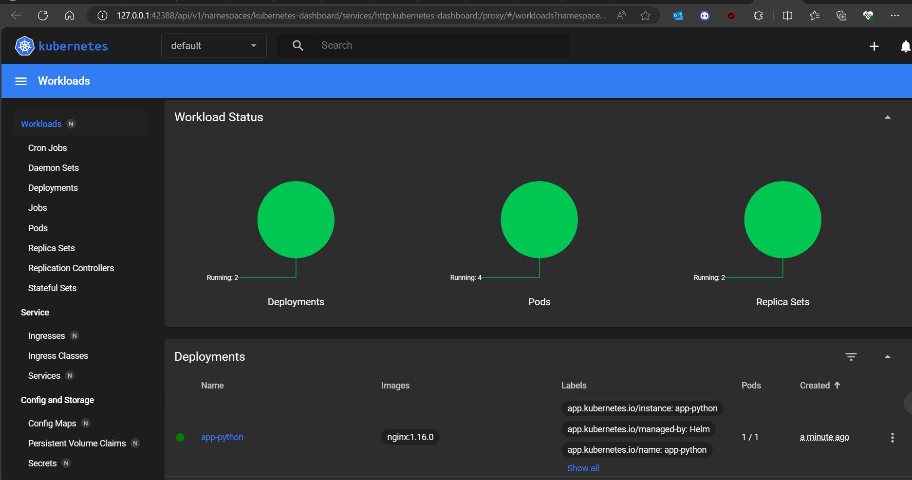
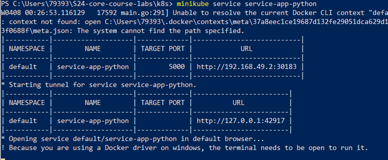
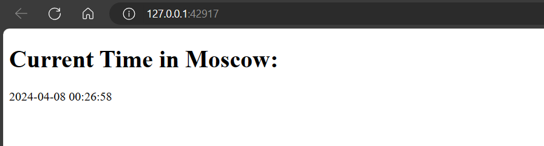
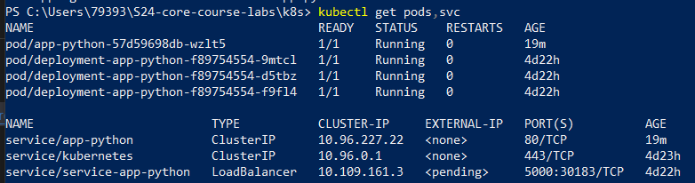
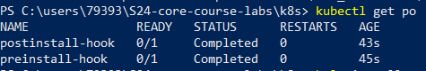

# HELM

## Checkings

After the installing the Helm Chart we could view the Workloads using `minikube dashboard`



Then running the `minikube service service-app-python` to check the similarity of the ports





## Output of command `kubectl get pods,svc`  



## Task 2

### Outputs of 2-3 points

### Outputs of 4th point

    1. `kubectl get po`

    

    2. `kubectl describe po preinstall-hook`

    ```bash
        Name:             preinstall-hook
        Namespace:        default
        Priority:         0
        Service Account:  default
        Node:             minikube/192.168.49.2
        Start Time:       Mon, 08 Apr 2024 01:39:43 +0300
        Labels:           <none>
        Annotations:      helm.sh/hook: pre-install
        Status:           Succeeded
        IP:               10.244.0.31
        IPs:
        IP:               10.244.0.31
        Containers:
        pre-install-container:
            Container ID:  docker://c1538ab0b4d3fd43c368b6d2ee5ecd34e7f19bb80e0d146fb90e55cbea3e9f85
            Image:         hugowea123/devops-labs-py
            Image ID:      docker-pullable://hugowea123/devops-labs-py@sha256:568e9243e7fbcd373b53be500f2ad2eea9a659ad5e7038bf70646ce4b48ccc1d
            Port:          <none>
            Host Port:     <none>
            Command:
            sh
            -c
            echo The pre-install hook is running
            State:          Terminated
            Reason:       Completed
            Exit Code:    0
            Started:      Mon, 08 Apr 2024 01:39:44 +0300
            Finished:     Mon, 08 Apr 2024 01:39:44 +0300
            Ready:          False
            Restart Count:  0
            Environment:    <none>
            Mounts:
            /var/run/secrets/kubernetes.io/serviceaccount from kube-api-access-zvg6m (ro)
        Conditions:
        Type              Status
        Initialized       True
        Ready             False
        ContainersReady   False
        PodScheduled      True
        Volumes:
        kube-api-access-zvg6m:
            Type:                    Projected (a volume that contains injected data from multiple sources)
            TokenExpirationSeconds:  3607
            ConfigMapName:           kube-root-ca.crt
            ConfigMapOptional:       <nil>
            DownwardAPI:             true
        QoS Class:                   BestEffort
        Node-Selectors:              <none>
        Tolerations:                 node.kubernetes.io/not-ready:NoExecute op=Exists for 300s
                                    node.kubernetes.io/unreachable:NoExecute op=Exists for 300s
        Events:
        Type    Reason     Age   From               Message
        ----    ------     ----  ----               -------
        Normal  Scheduled  119s  default-scheduler  Successfully assigned default/preinstall-hook to minikube
        Normal  Pulled     118s  kubelet            Container image "hugowea123/devops-labs-py" already present on machine
        Normal  Created    118s  kubelet            Created container pre-install-container
        Normal  Started    118s  kubelet            Started container pre-install-container
    ```

    3. `kubectl describe po postinstall-hook`

    ```bash
        Name:             postinstall-hook
        Namespace:        default
        Priority:         0
        Service Account:  default
        Node:             minikube/192.168.49.2
        Start Time:       Mon, 08 Apr 2024 01:39:45 +0300
        Labels:           <none>
        Annotations:      helm.sh/hook: post-install
        Status:           Succeeded
        IP:               10.244.0.32
        IPs:
        IP:  10.244.0.32
        Containers:
        post-install-container:
            Container ID:  docker://9a4c169ce59a55472986034d4c669db91387791c8616a166a3498c89c3a8690b
            Image:         hugowea123/devops-labs-py
            Image ID:      docker-pullable://hugowea123/devops-labs-py@sha256:568e9243e7fbcd373b53be500f2ad2eea9a659ad5e7038bf70646ce4b48ccc1d
            Port:          <none>
            Host Port:     <none>
            Command:
            sh
            -c
            echo The post-install hook is running
            State:          Terminated
            Reason:       Completed
            Exit Code:    0
            Started:      Mon, 08 Apr 2024 01:39:47 +0300
            Finished:     Mon, 08 Apr 2024 01:39:47 +0300
            Ready:          False
            Restart Count:  0
            Environment:    <none>
            Mounts:
            /var/run/secrets/kubernetes.io/serviceaccount from kube-api-access-jghvx (ro)
        Conditions:
        Type              Status
        Initialized       True
        Ready             False
        ContainersReady   False
        PodScheduled      True
        Volumes:
        kube-api-access-jghvx:
            Type:                    Projected (a volume that contains injected data from multiple sources)
            TokenExpirationSeconds:  3607
            ConfigMapName:           kube-root-ca.crt
            ConfigMapOptional:       <nil>
            DownwardAPI:             true
        QoS Class:                   BestEffort
        Node-Selectors:              <none>
        Tolerations:                 node.kubernetes.io/not-ready:NoExecute op=Exists for 300s
                                    node.kubernetes.io/unreachable:NoExecute op=Exists for 300s
        Events:
        Type    Reason     Age   From               Message
        ----    ------     ----  ----               -------
        Normal  Scheduled  106s  default-scheduler  Successfully assigned default/postinstall-hook to minikube
        Normal  Pulling    105s  kubelet            Pulling image "hugowea123/devops-labs-py"
        Normal  Pulled     104s  kubelet            Successfully pulled image "hugowea123/devops-labs-py" in 1.599s (1.599s including waiting)
        Normal  Created    104s  kubelet            Created container post-install-container
        Normal  Started    104s  kubelet            Started container post-install-container
    ```

### Adding the hook delete policy

    ```bash
        annotations:
        "helm.sh/hook": "post-install"
        "helm.sh/hook-delete-policy": hook-succeeded
    ```
