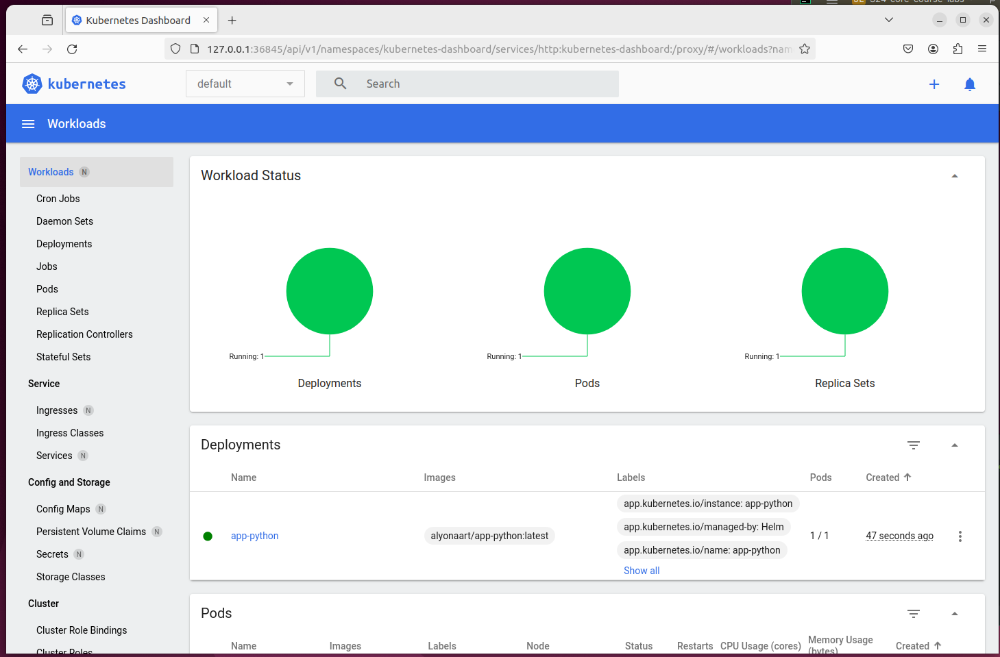
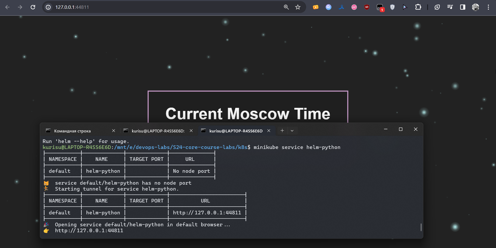

## Deployment

Minikube dashboard after installing helm chart:


`$ minikube service helm-python`:


`$ kubectl get pods,svc`:
```
NAME                               READY   STATUS    RESTARTS       AGE
pod/app-python-686d9b45-4qdbm      1/1     Running   2 (161m ago)   10d
pod/app-python-686d9b45-hwjnq      1/1     Running   2 (160m ago)   10d
pod/app-python-686d9b45-tvgsx      1/1     Running   3 (58m ago)    10d
pod/helm-python-69ccc4886f-mbbhj   1/1     Running   0              4m29s

NAME                         TYPE           CLUSTER-IP      EXTERNAL-IP   PORT(S)          AGE
service/app-python-service   LoadBalancer   10.103.27.41    <pending>     5000:32305/TCP   10d
service/helm-python          ClusterIP      10.99.213.254   <none>        5000/TCP         4m29s
service/kubernetes           ClusterIP      10.96.0.1       <none>        443/TCP          10d
```

## Hooks

Commands below are executed with hooks installed without hook delete policy
`$ kubectl get po`
```
NAME                                      READY   STATUS      RESTARTS        AGE
app-python-686d9b45-4qdbm                 1/1     Running     2 (3h13m ago)   10d
app-python-686d9b45-hwjnq                 1/1     Running     2 (3h13m ago)   10d
app-python-686d9b45-tvgsx                 1/1     Running     3 (90m ago)     10d
helm-hooks-helm-python-5dbb69859c-l8rcn   1/1     Running     0               61s
helm-python-69ccc4886f-mbbhj              1/1     Running     0               36m
postinstall-hook                          0/1     Completed   0               61s
preinstall-hook                           0/1     Completed   0               84s
```

`$ kubectl describe po preinstall-hook`
```
Name:             preinstall-hook
Namespace:        default
Priority:         0
Service Account:  default
Node:             minikube/192.168.49.2
Start Time:       Wed, 10 Apr 2024 01:48:37 +0300
Labels:           <none>
Annotations:      helm.sh/hook: pre-install
Status:           Succeeded
IP:               10.244.0.28
IPs:
  IP:  10.244.0.28
Containers:
  pre-install-container:
    Container ID:  docker://2630c5992aa831bd09d6622d88bf0c13f1ba80294be9db02fdc76418c49e5855
    Image:         busybox
    Image ID:      docker-pullable://busybox@sha256:c3839dd800b9eb7603340509769c43e146a74c63dca3045a8e7dc8ee07e53966
    Port:          <none>
    Host Port:     <none>
    Command:
      sh
      -c
      echo The pre-install hook is running && sleep 20
    State:          Terminated
      Reason:       Completed
      Exit Code:    0
      Started:      Wed, 10 Apr 2024 01:48:38 +0300
      Finished:     Wed, 10 Apr 2024 01:48:58 +0300
    Ready:          False
    Restart Count:  0
    Environment:    <none>
    Mounts:
      /var/run/secrets/kubernetes.io/serviceaccount from kube-api-access-hgt4d (ro)
Conditions:
  Type              Status
  Initialized       True
  Ready             False
  ContainersReady   False
  PodScheduled      True
Volumes:
  kube-api-access-hgt4d:
    Type:                    Projected (a volume that contains injected data from multiple sources)
    TokenExpirationSeconds:  3607
    ConfigMapName:           kube-root-ca.crt
    ConfigMapOptional:       <nil>
    DownwardAPI:             true
QoS Class:                   BestEffort
Node-Selectors:              <none>
Tolerations:                 node.kubernetes.io/not-ready:NoExecute op=Exists for 300s
                             node.kubernetes.io/unreachable:NoExecute op=Exists for 300s
Events:
  Type    Reason     Age   From               Message
  ----    ------     ----  ----               -------
  Normal  Scheduled  111s  default-scheduler  Successfully assigned default/preinstall-hook to minikube
  Normal  Pulled     111s  kubelet            Container image "busybox" already present on machine
  Normal  Created    111s  kubelet            Created container pre-install-container
  Normal  Started    111s  kubelet            Started container pre-install-container
```

`$ kubectl describe po postinstall-hook`:
```
Name:             postinstall-hook
Namespace:        default
Priority:         0
Service Account:  default
Node:             minikube/192.168.49.2
Start Time:       Wed, 10 Apr 2024 01:49:00 +0300
Labels:           <none>
Annotations:      helm.sh/hook: post-install
Status:           Succeeded
IP:               10.244.0.30
IPs:
  IP:  10.244.0.30
Containers:
  post-install-container:
    Container ID:  docker://7c57e23cbb7023935e268a5a4a02de2c3a5bff35fddd8801f07c1c9f2befb7fc
    Image:         busybox
    Image ID:      docker-pullable://busybox@sha256:c3839dd800b9eb7603340509769c43e146a74c63dca3045a8e7dc8ee07e53966
    Port:          <none>
    Host Port:     <none>
    Command:
      sh
      -c
      echo The post-install hook is running && sleep 15
    State:          Terminated
      Reason:       Completed
      Exit Code:    0
      Started:      Wed, 10 Apr 2024 01:49:27 +0300
      Finished:     Wed, 10 Apr 2024 01:49:42 +0300
    Ready:          False
    Restart Count:  0
    Environment:    <none>
    Mounts:
      /var/run/secrets/kubernetes.io/serviceaccount from kube-api-access-5fxvj (ro)
Conditions:
  Type              Status
  Initialized       True
  Ready             False
  ContainersReady   False
  PodScheduled      True
Volumes:
  kube-api-access-5fxvj:
    Type:                    Projected (a volume that contains injected data from multiple sources)
    TokenExpirationSeconds:  3607
    ConfigMapName:           kube-root-ca.crt
    ConfigMapOptional:       <nil>
    DownwardAPI:             true
QoS Class:                   BestEffort
Node-Selectors:              <none>
Tolerations:                 node.kubernetes.io/not-ready:NoExecute op=Exists for 300s
                             node.kubernetes.io/unreachable:NoExecute op=Exists for 300s
Events:
  Type    Reason     Age    From               Message
  ----    ------     ----   ----               -------
  Normal  Scheduled  2m13s  default-scheduler  Successfully assigned default/postinstall-hook to minikube
  Normal  Pulling    2m13s  kubelet            Pulling image "busybox"
  Normal  Pulled     107s   kubelet            Successfully pulled image "busybox" in 26.443s (26.444s including waiting)
  Normal  Created    107s   kubelet            Created container post-install-container
  Normal  Started    107s   kubelet            Started container post-install-container
```