# Helm

## Task 1

Initially, I create an chart app-python by using:
`helm create app-python`

Then, start minikube by using:
`minikube start`

After successfull starting of the minikube I can install app-python by using:
`helm install app-python app-python`

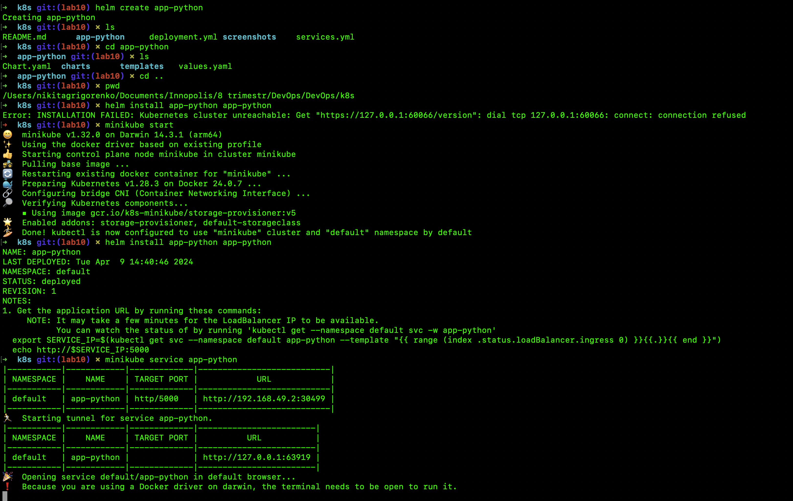

To show the page in the browser I can run: `minikube service app-python`

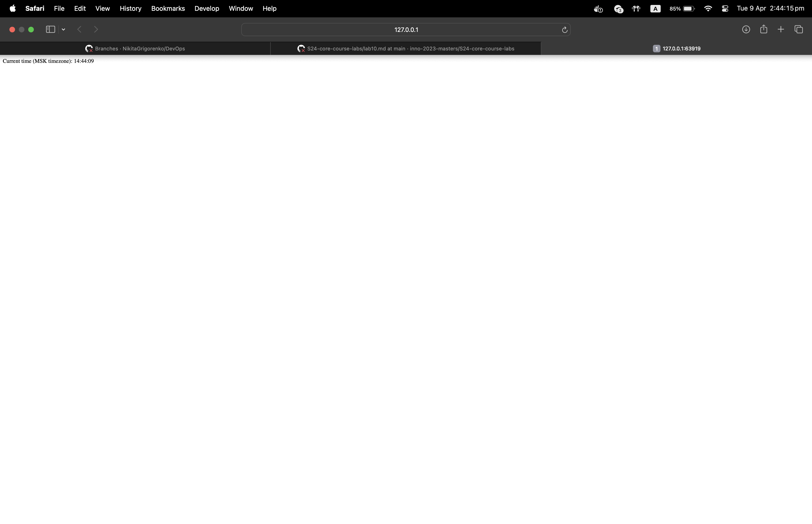

Now we can see the output:
`kubectl get pods,svc`

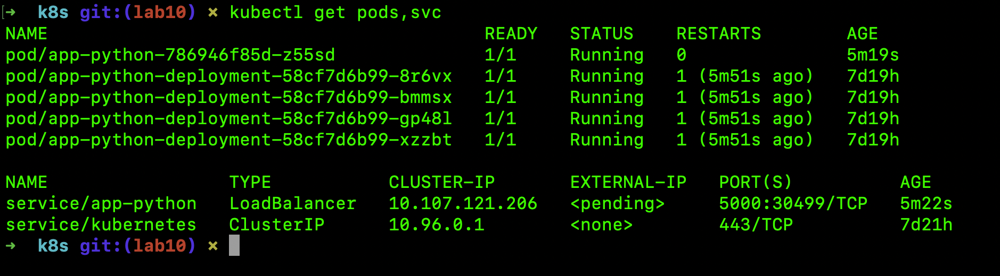

And also a workload page in the dashboard:
`minikube dashboard`

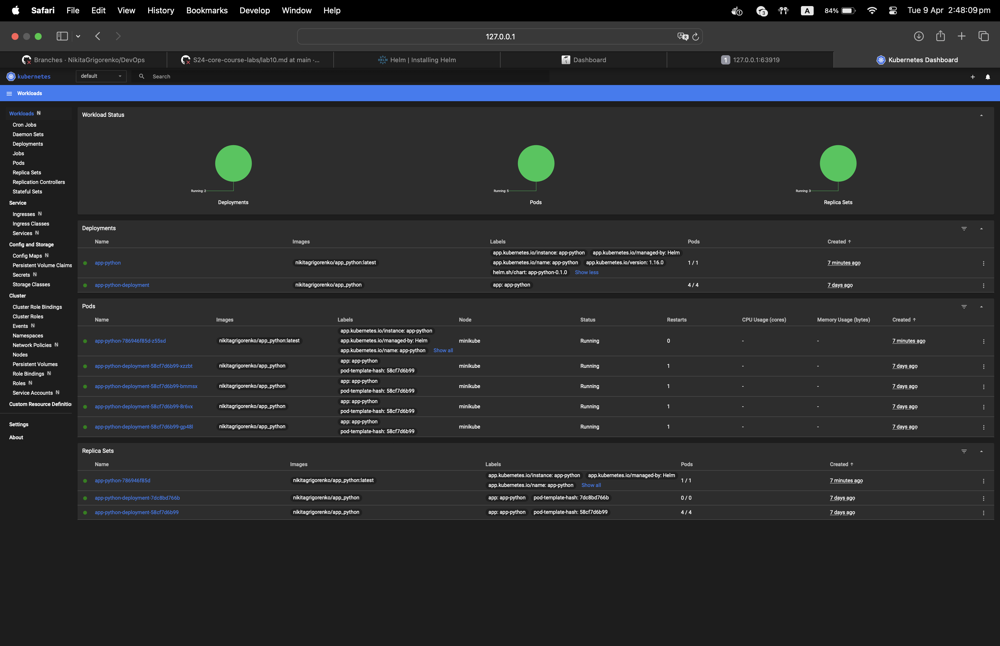

## Task 2

At first, we need to create to files `post-install-hook.yaml` and `pre-install-hook.yaml`

Next, we can run the following command `helm lint app-python/` and see the following output:

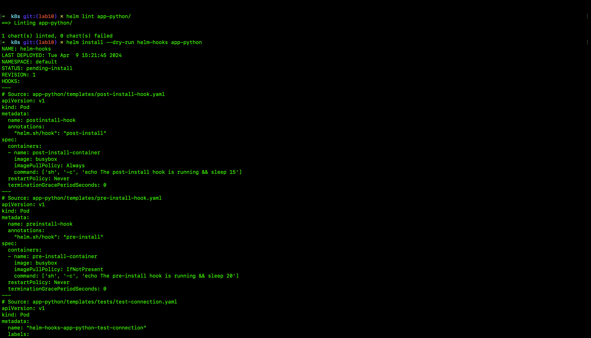

Then, we can run `helm install --dry-run helm-hooks app-python` to debug:

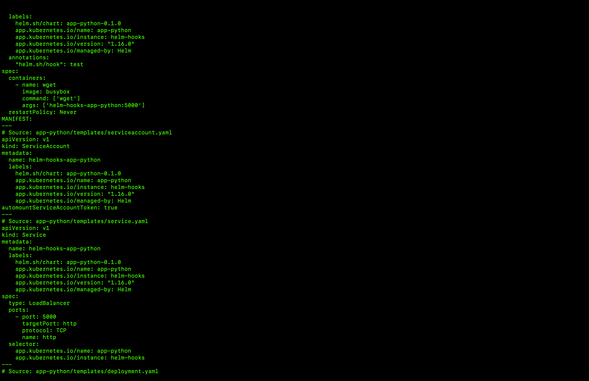
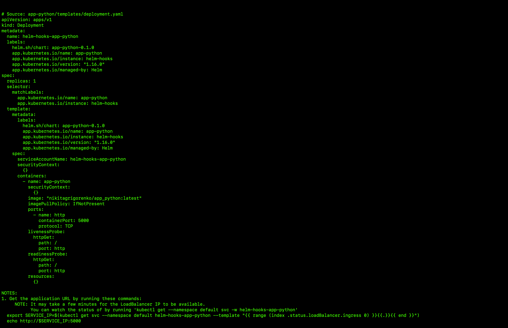

Next, run `kubectl get po` to get all pods: 

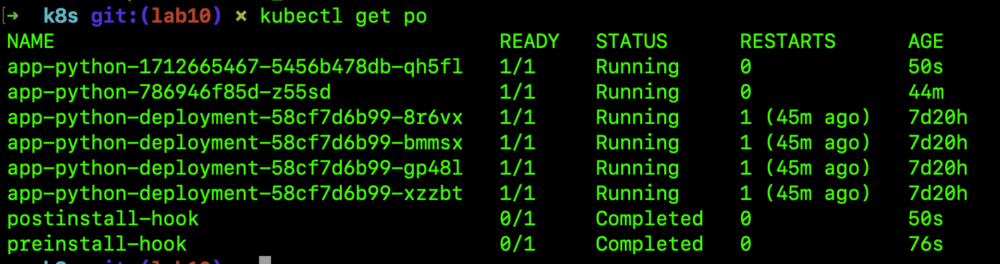

Next, run `kubectl describe po postinstall-hook` to get info about post-install hook: 

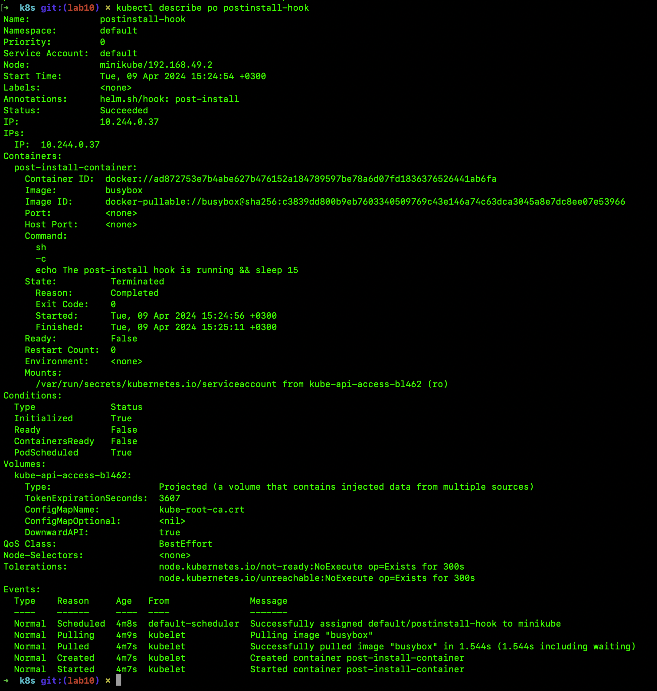

Next, run `kubectl describe po preinstall-hook` to get info about pre-install hook: 

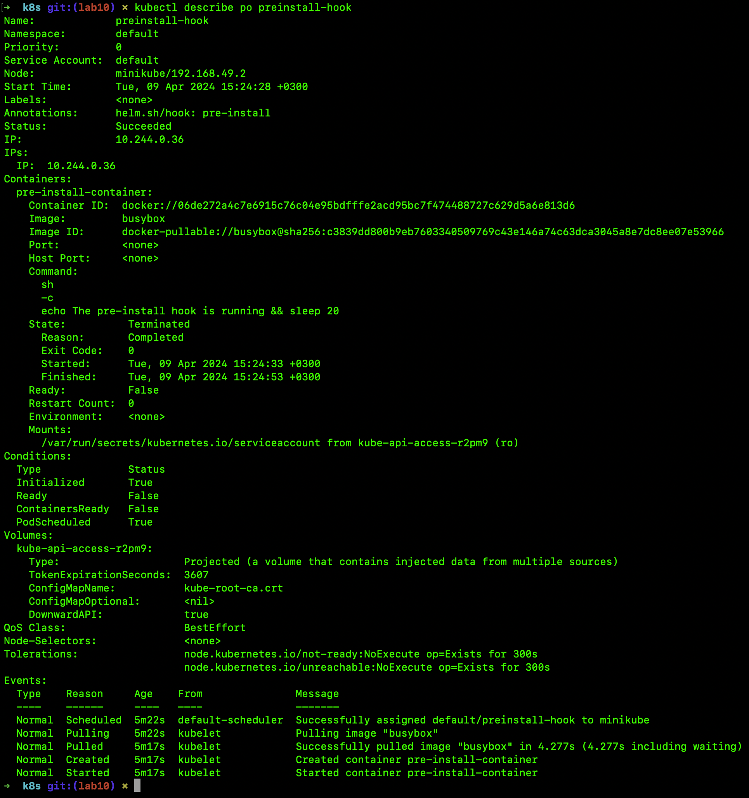

To make a delete policy we can add the following `"helm.sh/hook-delete-policy": hook-succeeded` in the annotations field in .yaml hooks files

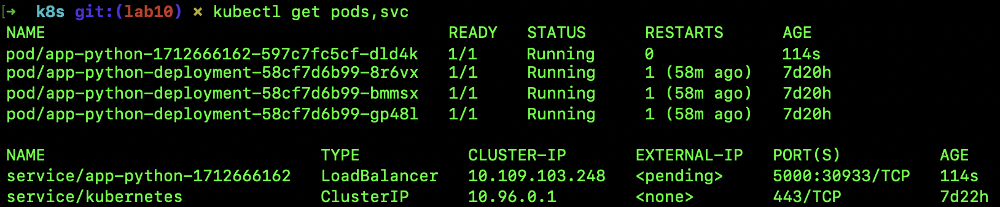
