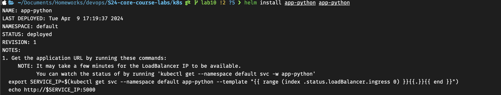
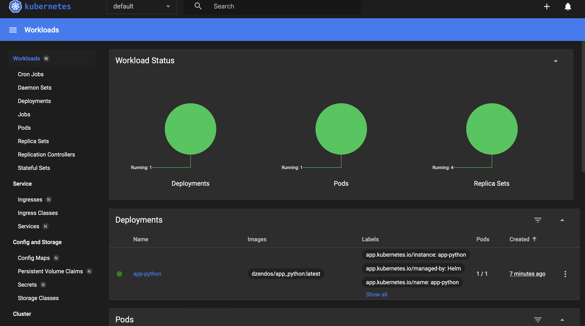
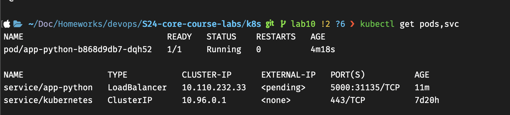
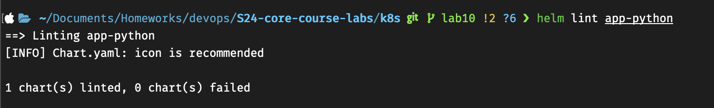

`helm install --dry-run helm-hooks app-python`
```
NAME: helm-hooks
LAST DEPLOYED: Tue Apr  9 17:31:54 2024
NAMESPACE: default
STATUS: pending-install
REVISION: 1
HOOKS:
---
# Source: app-python/templates/tests/test-connection.yaml
apiVersion: v1
kind: Pod
metadata:
  name: "helm-hooks-app-python-test-connection"
  labels:
    helm.sh/chart: app-python-0.1.0
    app.kubernetes.io/name: app-python
    app.kubernetes.io/instance: helm-hooks
    app.kubernetes.io/version: "1.16.0"
    app.kubernetes.io/managed-by: Helm
  annotations:
    "helm.sh/hook": test
spec:
  containers:
    - name: wget
      image: busybox
      command: ['wget']
      args: ['helm-hooks-app-python:5000']
  restartPolicy: Never
MANIFEST:
---
# Source: app-python/templates/serviceaccount.yaml
apiVersion: v1
kind: ServiceAccount
metadata:
  name: helm-hooks-app-python
  labels:
    helm.sh/chart: app-python-0.1.0
    app.kubernetes.io/name: app-python
    app.kubernetes.io/instance: helm-hooks
    app.kubernetes.io/version: "1.16.0"
    app.kubernetes.io/managed-by: Helm
---
# Source: app-python/templates/service.yaml
apiVersion: v1
kind: Service
metadata:
  name: helm-hooks-app-python
  labels:
    helm.sh/chart: app-python-0.1.0
    app.kubernetes.io/name: app-python
    app.kubernetes.io/instance: helm-hooks
    app.kubernetes.io/version: "1.16.0"
    app.kubernetes.io/managed-by: Helm
spec:
  type: LoadBalancer
  ports:
    - port: 5000
      targetPort: http
      protocol: TCP
      name: http
  selector:
    app.kubernetes.io/name: app-python
    app.kubernetes.io/instance: helm-hooks
---
# Source: app-python/templates/deployment.yaml
apiVersion: apps/v1
kind: Deployment
metadata:
  name: helm-hooks-app-python
  labels:
    helm.sh/chart: app-python-0.1.0
    app.kubernetes.io/name: app-python
    app.kubernetes.io/instance: helm-hooks
    app.kubernetes.io/version: "1.16.0"
    app.kubernetes.io/managed-by: Helm
spec:
  replicas: 1
  selector:
    matchLabels:
      app.kubernetes.io/name: app-python
      app.kubernetes.io/instance: helm-hooks
  template:
    metadata:
      labels:
        app.kubernetes.io/name: app-python
        app.kubernetes.io/instance: helm-hooks
    spec:
      serviceAccountName: helm-hooks-app-python
      securityContext:
        {}
      containers:
        - name: app-python
          securityContext:
            {}
          image: "dzendos/app_python:latest"
          imagePullPolicy: IfNotPresent
          ports:
            - name: http
              containerPort: 5000
              protocol: TCP
          # livenessProbe:
          #   httpGet:
          #     path: /
          #     port: http
          # readinessProbe:
          #   httpGet:
          #     path: /
          #     port: http
          resources:
            {}

NOTES:
1. Get the application URL by running these commands:
     NOTE: It may take a few minutes for the LoadBalancer IP to be available.
           You can watch the status of by running 'kubectl get --namespace default svc -w helm-hooks-app-python'
  export SERVICE_IP=$(kubectl get svc --namespace default helm-hooks-app-python --template "{{ range (index .status.loadBalancer.ingress 0) }}{{.}}{{ end }}")
  echo http://$SERVICE_IP:5000
```
`kubectl get po`
```
NAME                                      READY   STATUS      RESTARTS   AGE
helm-hooks-post-install-hook-j5pnr        0/1     Completed   0          23s
helm-hooks-pre-install-hook-6xd31         0/1     Completed   0          48s
helm-hooks-app-python-767c7c6476-tvn45    1/1     Running     0          17s
```
`kubectl describe po helm-hooks-pre-install-hook-6xd31`
```
Name:             helm-hooks-app-python-767c7c6476-tvn45
Namespace:        default
Priority:         0
Service Account:  helm-hooks-app-python
Node:             minikube/192.168.49.2
Start Time:       Tue, 09 Apr 2024 17:46:56 +0300
Labels:           app.kubernetes.io/instance=helm-hooks
                  app.kubernetes.io/name=app-python
                  pod-template-hash=767c7c6476
Annotations:      <none>
Status:           Running
IP:               10.244.0.113
IPs:
  IP:           10.244.0.113
Controlled By:  Job/helm-hooks-pre-install-hook
Containers:
  app-python:
    Container ID:   docker://01037eef7debdf76993a3af959f6b87b3758434623e1cbbd92d702d8f1671e70
    Image:          dzendos/app_python:latest
    Image ID:       docker-pullable://dzendos/app_python@sha256:8134a601cd24a5bba9256b569cfee6e35d55f60d8435426b1b9e1530644b15e4
    Port:           5000/TCP
    Host Port:      0/TCP
    State:          Running
      Started:      Tue, 09 Apr 2024 17:46:56 +0300
    Ready:          True
    Restart Count:  0
    Environment:    <none>
    Mounts:
      /var/run/secrets/kubernetes.io/serviceaccount from kube-api-access-jhptz (ro)
Conditions:
  Type              Status
  Initialized       True 
  Ready             True 
  ContainersReady   True 
  PodScheduled      True 
Volumes:
  kube-api-access-jhptz:
    Type:                    Projected (a volume that contains injected data from multiple sources)
    TokenExpirationSeconds:  3607
    ConfigMapName:           kube-root-ca.crt
    ConfigMapOptional:       <nil>
    DownwardAPI:             true
QoS Class:                   BestEffort
Node-Selectors:              <none>
Tolerations:                 node.kubernetes.io/not-ready:NoExecute op=Exists for 300s
                             node.kubernetes.io/unreachable:NoExecute op=Exists for 300s
Events:
  Type    Reason     Age   From               Message
  ----    ------     ----  ----               -------
  Normal  Scheduled  2m1s  default-scheduler  Successfully assigned default/helm-hooks-pre-install-hook-4xf5s to minikube
  Normal  Pulling    2m    kubelet            Pulling image "alpine"
  Normal  Pulled     119s  kubelet            Successfully pulled image "alpine" in 1.576s (1.576s including waiting)
  Normal  Created    119s  kubelet            Created container pre-install-job
  Normal  Started    119s  kubelet            Started container pre-install-job
```
`kubectl describe po helm-hooks-post-install-hook-j5pnr`

```
Name:             helm-hooks-post-install-hook-j5pnr
Namespace:        default
Priority:         0
Service Account:  helm-hooks-app-python
Node:             minikube/192.168.49.2
Start Time:       Tue, 09 Apr 2024 17:46:56 +0300
Labels:           app.kubernetes.io/instance=helm-hooks
                  app.kubernetes.io/name=app-python
                  pod-template-hash=767c7c6476
Annotations:      <none>
Status:           Running
IP:               10.244.0.113
IPs:
  IP:           10.244.0.113
Controlled By:  Job/helm-hooks-post-install-hook
Containers:
  app-python:
    Container ID:   docker://01037eef7debdf76993a3af959f6b87b3758434623e1cbbd92d702d8f1671e70
    Image:          dzendos/app_python:latest
    Image ID:       docker-pullable://dzendos/app_python@sha256:8134a601cd24a5bba9256b569cfee6e35d55f60d8435426b1b9e1530644b15e4
    Port:           5000/TCP
    Host Port:      0/TCP
    State:          Running
      Started:      Tue, 09 Apr 2024 17:46:56 +0300
    Ready:          True
    Restart Count:  0
    Environment:    <none>
    Mounts:
      /var/run/secrets/kubernetes.io/serviceaccount from kube-api-access-jhptz (ro)
Conditions:
  Type              Status
  Initialized       True 
  Ready             True 
  ContainersReady   True 
  PodScheduled      True 
Volumes:
  kube-api-access-jhptz:
    Type:                    Projected (a volume that contains injected data from multiple sources)
    TokenExpirationSeconds:  3607
    ConfigMapName:           kube-root-ca.crt
    ConfigMapOptional:       <nil>
    DownwardAPI:             true
QoS Class:                   BestEffort
Node-Selectors:              <none>
Tolerations:                 node.kubernetes.io/not-ready:NoExecute op=Exists for 300s
                             node.kubernetes.io/unreachable:NoExecute op=Exists for 300s
Events:
  Type    Reason     Age    From               Message
  ----    ------     ----   ----               -------
  Normal  Scheduled  2m13s  default-scheduler  Successfully assigned default/helm-hooks-post-install-hook-j5pnr to minikube
  Normal  Pulling    2m12s  kubelet            Pulling image "alpine"
  Normal  Pulled     2m13s  kubelet            Successfully pulled image "alpine" in 1.442s (1.442s including waiting)
  Normal  Created    2m14s  kubelet            Created container post-install-job
  Normal  Started    2m14s  kubelet            Started container post-install-job
```
