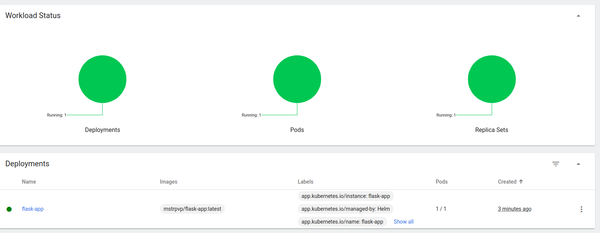
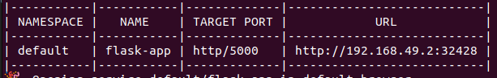
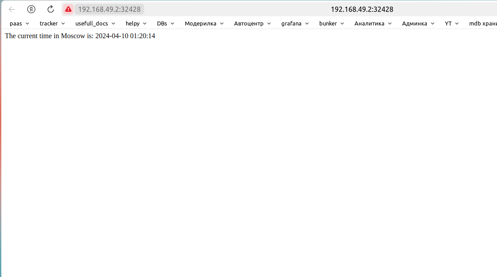
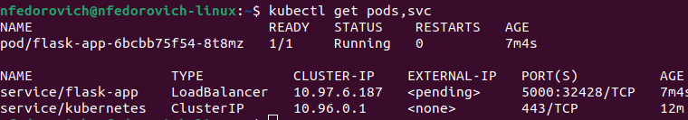
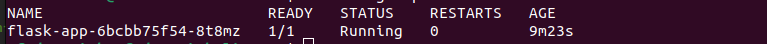

# HELM

## Task 1: Helm Setup and Chart Creation:

`minikube dashboard`



`minikube service flask-app`






`kubectl get pods,svc`




# Task 2: Helm Chart Hooks:

Verify the Helm chart hooks (without hook delete policy) 

`kubectl get po:`


`kubectl describe po preinstall-hook:`

```
Name:             preinstall-hook
Namespace:        default
Priority:         0
Service Account:  default
Node:             minikube/192.168.49.2
Start Time:       Wed, 10 Apr 2024 01:15:16 +0300
Labels:           <none>
Annotations:      helm.sh/hook: pre-install
Status:           Succeeded
IP:               10.244.0.9
IPs:
  IP:           10.244.0.9
Containers:
  pre-install-container:
    Container ID:   docker://65b0e49ec2efa9163ca11d6eaad0b559efc0717284ffc311e8a41d97bcb02273
    Image:          busybox
    Image ID:       docker-pullable://busybox@sha256:944ae86f222ac929a495567de0198531c9a042986650cff65ad0bfc78290691a
    Port:           <none>
    Host Port:      <none>
        Command:
      sh
      -c
      echo The pre-install hook is running && sleep 20
    State:          Terminated
      Reason:       Completed
      Exit Code:    0
      Started:      Wed, 10 Apr 2024 01:15:17 +0300
      Finished:     Wed, 10 Apr 2024 01:15:37 +0300
    Ready:          False
    Restart Count:  0
    Liveness:       http-get http://:http/ delay=0s timeout=1s period=10s #success=1 #failure=3
    Readiness:      http-get http://:http/ delay=0s timeout=1s period=10s #success=1 #failure=3
    Environment:    <none>
    Mounts:
      /var/run/secrets/kubernetes.io/serviceaccount from kube-api-access-zsd9h (ro)
Conditions:
  Type              Status
  Initialized       True 
  Ready             False 
  ContainersReady   False 
  PodScheduled      True 
Volumes:
  kube-api-access-zsd9h:
    Type:                    Projected (a volume that contains injected data from multiple sources)
    TokenExpirationSeconds:  3607
    ConfigMapName:           kube-root-ca.crt
    ConfigMapOptional:       <nil>
    DownwardAPI:             true
QoS Class:                   BestEffort
Node-Selectors:              <none>
Tolerations:                 node.kubernetes.io/not-ready:NoExecute op=Exists for 300s
                             node.kubernetes.io/unreachable:NoExecute op=Exists for 300s
Events:
  Type     Reason     Age   From               Message
  ----     ------     ----  ----               -------
  Normal   Scheduled  13m   default-scheduler  Successfully assigned default/preinstall-hook to minikube
  Normal   Pulled     13m   kubelet            Container image "busybox" already present on machine
  Normal   Created    13m   kubelet            Created container pre-install-container
  Normal   Started    13m   kubelet            Started container pre-install-container
```

`kubectl describe po postinstall-hook:`

```
Name:             postinstall-hook
Namespace:        default
Priority:         0
Service Account:  default
Node:             minikube/192.168.49.2
Start Time:       Wed, 10 Apr 2024 01:15:16 +0300
Labels:           <none>
Annotations:      helm.sh/hook: pre-install
Status:           Succeeded
IP:               10.244.0.9
IPs:
  IP:           10.244.0.9
Containers:
  pre-install-container:
    Container ID:   docker://65b0e49ec2efa9163ca11d6eaad0b559efc0717284ffc311e8a41d97bcb02273
    Image:          busybox
    Image ID:       docker-pullable://busybox@sha256:944ae86f222ac929a495567de0198531c9a042986650cff65ad0bfc78290691a
    Port:           <none>
    Host Port:      <none>
        Command:
      sh
      -c
      echo The pre-install hook is running && sleep 20
    State:          Terminated
      Reason:       Completed
      Exit Code:    0
      Started:      Wed, 10 Apr 2024 01:15:17 +0300
      Finished:     Wed, 10 Apr 2024 01:15:37 +0300
    Ready:          False
    Restart Count:  0
    Liveness:       http-get http://:http/ delay=0s timeout=1s period=10s #success=1 #failure=3
    Readiness:      http-get http://:http/ delay=0s timeout=1s period=10s #success=1 #failure=3
    Environment:    <none>
    Mounts:
      /var/run/secrets/kubernetes.io/serviceaccount from kube-api-access-zsd9h (ro)
```