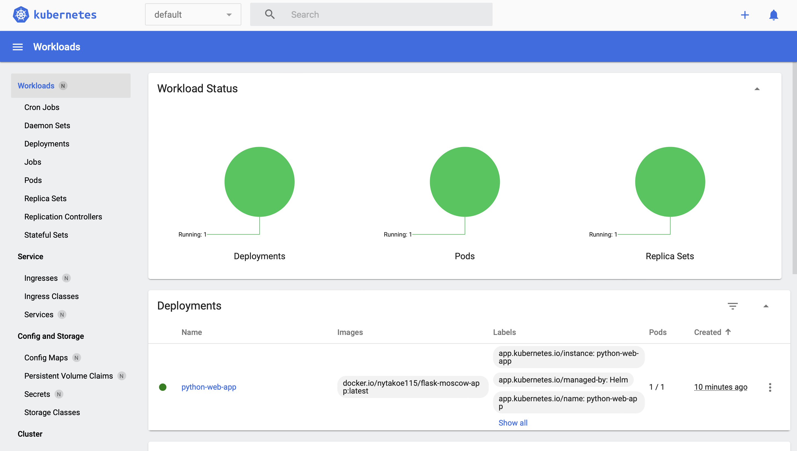

#HELM

##Task_1

Command
```
minikube dashboard
```

Output



Command
```
minikube service python-web-app
```
Output
```
(base) yanapavlova@MacBook-Air-Ana python-web-app % minikube service python-web-app
|-----------|----------------|-------------|--------------|
| NAMESPACE |      NAME      | TARGET PORT |     URL      |
|-----------|----------------|-------------|--------------|
| default   | python-web-app |             | No node port |
|-----------|----------------|-------------|--------------|
😿  service default/python-web-app has no node port
🏃  Starting tunnel for service python-web-app.
|-----------|----------------|-------------|------------------------|
| NAMESPACE |      NAME      | TARGET PORT |          URL           |
|-----------|----------------|-------------|------------------------|
| default   | python-web-app |             | http://127.0.0.1:50767 |
|-----------|----------------|-------------|------------------------|
🎉  Opening service default/python-web-app in default browser...
❗  Because you are using a Docker driver on darwin, the terminal needs to be open to run it.

```

Command
```
kubectl get pods, svc
```

Output

```
(base) yanapavlova@MacBook-Air-Ana python-web-app % kubectl get pods,svc
NAME                                  READY   STATUS    RESTARTS   AGE
pod/python-web-app-746748b4d5-sqnn7   1/1     Running   0          13m

NAME                     TYPE        CLUSTER-IP   EXTERNAL-IP   PORT(S)   AGE
service/kubernetes       ClusterIP   10.96.0.1    <none>        443/TCP   13d
service/python-web-app   ClusterIP   10.102.7.8   <none>        80/TCP    13m

```

##Task_2
Command
```
kubectl get po
```

Output

```
(base) yanapavlova@MacBook-Air-Ana k8s % kubectl get po                        
NAME                                         READY   STATUS      RESTARTS   AGE
helm-hooks-python-web-app-64cc6f78b7-tnpcq   1/1     Running     0          27s
postinstall-hook                             0/1     Completed   0          27s
preinstall-hook                              0/1     Completed   0          50s
python-web-app-746748b4d5-sqnn7              1/1     Running     0          167m
```

Command

```
kubectl describe po preinstall-hook
```

Output
```
(base) yanapavlova@MacBook-Air-Ana k8s % kubectl describe po preinstall-hook
Name:             preinstall-hook
Namespace:        default
Priority:         0
Service Account:  default
Node:             minikube/192.168.49.2
Start Time:       Tue, 16 Apr 2024 15:31:45 +0300
Labels:           <none>
Annotations:      helm.sh/hook: pre-install
Status:           Succeeded
IP:               10.244.0.19
IPs:
  IP:  10.244.0.19
Containers:
  pre-install-container:
    Container ID:  docker://72e75a748fc8ce90c8cbbd18313583d1542a2d4d8c61bf0dc2f0e54713176926
    Image:         busybox
    Image ID:      docker-pullable://busybox@sha256:c3839dd800b9eb7603340509769c43e146a74c63dca3045a8e7dc8ee07e53966
    Port:          <none>
    Host Port:     <none>
    Command:
      sh
      -c
      echo The pre-install hook is running && sleep 20
    State:          Terminated
      Reason:       Completed
      Exit Code:    0
      Started:      Tue, 16 Apr 2024 15:31:46 +0300
      Finished:     Tue, 16 Apr 2024 15:32:06 +0300
    Ready:          False
    Restart Count:  0
    Environment:    <none>
    Mounts:
      /var/run/secrets/kubernetes.io/serviceaccount from kube-api-access-sn57x (ro)
Conditions:
  Type              Status
  Initialized       True 
  Ready             False 
  ContainersReady   False 
  PodScheduled      True 
Volumes:
  kube-api-access-sn57x:
    Type:                    Projected (a volume that contains injected data from multiple sources)
    TokenExpirationSeconds:  3607
    ConfigMapName:           kube-root-ca.crt
    ConfigMapOptional:       <nil>
    DownwardAPI:             true
QoS Class:                   BestEffort
Node-Selectors:              <none>
Tolerations:                 node.kubernetes.io/not-ready:NoExecute op=Exists for 300s
                             node.kubernetes.io/unreachable:NoExecute op=Exists for 300s
Events:
  Type    Reason     Age    From               Message
  ----    ------     ----   ----               -------
  Normal  Scheduled  3m40s  default-scheduler  Successfully assigned default/preinstall-hook to minikube
  Normal  Pulled     3m39s  kubelet            Container image "busybox" already present on machine
  Normal  Created    3m39s  kubelet            Created container pre-install-container
  Normal  Started    3m39s  kubelet            Started container pre-install-container

```

Command

```
kubectl describe po postinstall-hook
```

Output

```
(base) yanapavlova@MacBook-Air-Ana k8s % kubectl describe po postinstall-hook
Name:             postinstall-hook
Namespace:        default
Priority:         0
Service Account:  default
Node:             minikube/192.168.49.2
Start Time:       Tue, 16 Apr 2024 15:32:08 +0300
Labels:           <none>
Annotations:      helm.sh/hook: post-install
Status:           Succeeded
IP:               10.244.0.21
IPs:
  IP:  10.244.0.21
Containers:
  post-install-container:
    Container ID:  docker://8c648e1fd5b3dc8e6be5b55f38665a9563b84ed989025f509284d88ca162c436
    Image:         busybox
    Image ID:      docker-pullable://busybox@sha256:c3839dd800b9eb7603340509769c43e146a74c63dca3045a8e7dc8ee07e53966
    Port:          <none>
    Host Port:     <none>
    Command:
      sh
      -c
      echo The post-install hook is running && sleep 15
    State:          Terminated
      Reason:       Completed
      Exit Code:    0
      Started:      Tue, 16 Apr 2024 15:32:10 +0300
      Finished:     Tue, 16 Apr 2024 15:32:25 +0300
    Ready:          False
    Restart Count:  0
    Environment:    <none>
    Mounts:
      /var/run/secrets/kubernetes.io/serviceaccount from kube-api-access-l2p9x (ro)
Conditions:
  Type              Status
  Initialized       True 
  Ready             False 
  ContainersReady   False 
  PodScheduled      True 
Volumes:
  kube-api-access-l2p9x:
    Type:                    Projected (a volume that contains injected data from multiple sources)
    TokenExpirationSeconds:  3607
    ConfigMapName:           kube-root-ca.crt
    ConfigMapOptional:       <nil>
    DownwardAPI:             true
QoS Class:                   BestEffort
Node-Selectors:              <none>
Tolerations:                 node.kubernetes.io/not-ready:NoExecute op=Exists for 300s
                             node.kubernetes.io/unreachable:NoExecute op=Exists for 300s
Events:
  Type    Reason     Age    From               Message
  ----    ------     ----   ----               -------
  Normal  Scheduled  4m44s  default-scheduler  Successfully assigned default/postinstall-hook to minikube
  Normal  Pulling    4m44s  kubelet            Pulling image "busybox"
  Normal  Pulled     4m42s  kubelet            Successfully pulled image "busybox" in 1.763s (1.763s including waiting)
  Normal  Created    4m42s  kubelet            Created container post-install-container
  Normal  Started    4m42s  kubelet            Started container post-install-container

```