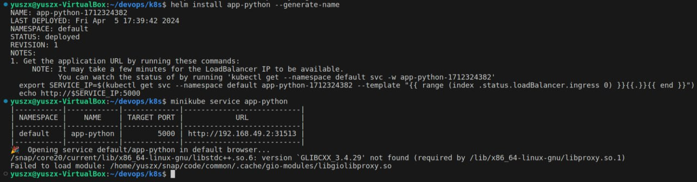
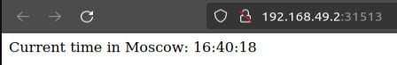

# Introduction to Helm

## Task 1





### Output of `kubectl get pods,svc`

```bash
NAME                                         READY   STATUS    RESTARTS        AGE
pod/app-python-1712324382-6fb54dd6dd-qbq47   1/1     Running   0               5m14s

NAME                            TYPE           CLUSTER-IP       EXTERNAL-IP   PORT(S)          AGE
service/app-python-1712324382   LoadBalancer   10.97.234.68     <pending>     5000:32737/TCP   5m14s
service/kubernetes              ClusterIP      10.96.0.1        <none>        443/TCP          3d23h
```

## Task 2

### Output of `kubectl get po`

```bash
NAME                                     READY   STATUS      RESTARTS        AGE
helm-hooks-app-python-7fb66f7dd5-76twv   1/1     Running     0               29s
postinstall-hook                         0/1     Completed   0               29s
preinstall-hook                          0/1     Completed   0               57s
```

### Output of `kubectl describe po preinstall-hook`

```bash
Name:             preinstall-hook
Namespace:        default
Priority:         0
Service Account:  default
Node:             minikube/192.168.49.2
Start Time:       Fri, 05 Apr 2024 18:19:55 +0400
Labels:           <none>
Annotations:      helm.sh/hook: pre-install
Status:           Succeeded
IP:               10.244.0.46
IPs:
  IP:  10.244.0.46
Containers:
  pre-install-container:
    Container ID:  docker://4bb2d096282640de135d8cd0f812422364377a899987da32bf255b3140092619
    Image:         busybox
    Image ID:      docker-pullable://busybox@sha256:c3839dd800b9eb7603340509769c43e146a74c63dca3045a8e7dc8ee07e53966
    Port:          <none>
    Host Port:     <none>
    Command:
      sh
      -c
      echo The pre-install hook is running && sleep 20
    State:          Terminated
      Reason:       Completed
      Exit Code:    0
      Started:      Fri, 05 Apr 2024 18:20:00 +0400
      Finished:     Fri, 05 Apr 2024 18:20:20 +0400
    Ready:          False
    Restart Count:  0
    Environment:    <none>
    Mounts:
      /var/run/secrets/kubernetes.io/serviceaccount from kube-api-access-hd4hk (ro)
Conditions:
  Type              Status
  Initialized       True 
  Ready             False 
  ContainersReady   False 
  PodScheduled      True 
Volumes:
  kube-api-access-hd4hk:
    Type:                    Projected (a volume that contains injected data from multiple sources)
    TokenExpirationSeconds:  3607
    ConfigMapName:           kube-root-ca.crt
    ConfigMapOptional:       <nil>
    DownwardAPI:             true
QoS Class:                   BestEffort
Node-Selectors:              <none>
Tolerations:                 node.kubernetes.io/not-ready:NoExecute op=Exists for 300s
                             node.kubernetes.io/unreachable:NoExecute op=Exists for 300s
Events:
  Type    Reason     Age    From               Message
  ----    ------     ----   ----               -------
  Normal  Scheduled  3m     default-scheduler  Successfully assigned default/preinstall-hook to minikube
  Normal  Pulling    3m     kubelet            Pulling image "busybox"
  Normal  Pulled     2m55s  kubelet            Successfully pulled image "busybox" in 4.293s (4.293s including waiting)
  Normal  Created    2m55s  kubelet            Created container pre-install-container
  Normal  Started    2m55s  kubelet            Started container pre-install-container
```

### Output of `kubectl describe po postinstall-hook`

```bash
Name:             postinstall-hook
Namespace:        default
Priority:         0
Service Account:  default
Node:             minikube/192.168.49.2
Start Time:       Fri, 05 Apr 2024 18:20:23 +0400
Labels:           <none>
Annotations:      helm.sh/hook: post-install
Status:           Succeeded
IP:               10.244.0.48
IPs:
  IP:  10.244.0.48
Containers:
  post-install-container:
    Container ID:  docker://7ee5c29a06026f20b4fb52756eab74d591a29c0fb951b8e69023280c95ed6845
    Image:         busybox
    Image ID:      docker-pullable://busybox@sha256:c3839dd800b9eb7603340509769c43e146a74c63dca3045a8e7dc8ee07e53966
    Port:          <none>
    Host Port:     <none>
    Command:
      sh
      -c
      echo The post-install hook is running && sleep 15
    State:          Terminated
      Reason:       Completed
      Exit Code:    0
      Started:      Fri, 05 Apr 2024 18:20:26 +0400
      Finished:     Fri, 05 Apr 2024 18:20:41 +0400
    Ready:          False
    Restart Count:  0
    Environment:    <none>
    Mounts:
      /var/run/secrets/kubernetes.io/serviceaccount from kube-api-access-nwvkf (ro)
Conditions:
  Type              Status
  Initialized       True 
  Ready             False 
  ContainersReady   False 
  PodScheduled      True 
Volumes:
  kube-api-access-nwvkf:
    Type:                    Projected (a volume that contains injected data from multiple sources)
    TokenExpirationSeconds:  3607
    ConfigMapName:           kube-root-ca.crt
    ConfigMapOptional:       <nil>
    DownwardAPI:             true
QoS Class:                   BestEffort
Node-Selectors:              <none>
Tolerations:                 node.kubernetes.io/not-ready:NoExecute op=Exists for 300s
                             node.kubernetes.io/unreachable:NoExecute op=Exists for 300s
Events:
  Type    Reason     Age    From               Message
  ----    ------     ----   ----               -------
  Normal  Scheduled  3m36s  default-scheduler  Successfully assigned default/postinstall-hook to minikube
  Normal  Pulling    3m35s  kubelet            Pulling image "busybox"
  Normal  Pulled     3m34s  kubelet            Successfully pulled image "busybox" in 1.696s (1.696s including waiting)
  Normal  Created    3m34s  kubelet            Created container post-install-container
  Normal  Started    3m33s  kubelet            Started container post-install-container
```

### Hook delete policy

Hook delete policy was implemented by `"helm.sh/hook-delete-policy": hook-succeeded` in `pre-install-hook.yaml` and `post-install-hook.yaml`.