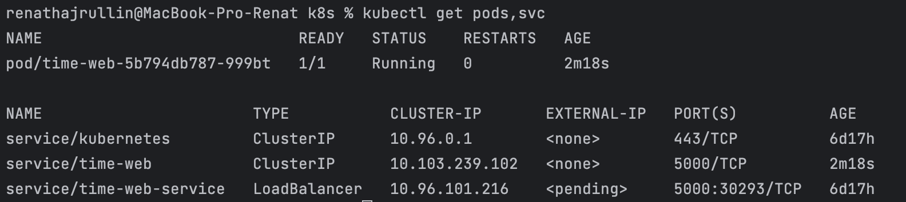
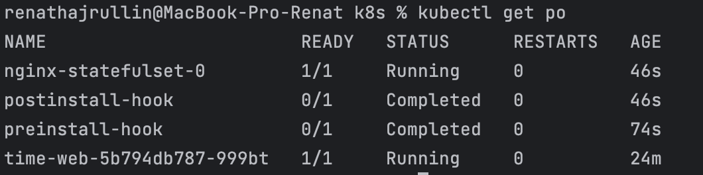

## get pods,svc
```kubectl get pods,svc``` result:


## get po
```kubectl get po``` results in task 2:



## Description of pods of preinstall hooks:
```shell
renathajrullin@MacBook-Pro-Renat k8s % kubectl describe po preinstall-hook   
Name:             preinstall-hook
Namespace:        default
Priority:         0
Service Account:  default
Node:             minikube/192.168.49.2
Start Time:       Tue, 09 Apr 2024 18:22:57 +0300
Labels:           <none>
Annotations:      helm.sh/hook: pre-install
Status:           Succeeded
IP:               10.244.0.22
IPs:
  IP:  10.244.0.22
Containers:
  pre-install-container:
    Container ID:  docker://6eae34537c6327b380bb421878b9af1b7ebc7f5f0e02d3d40fbaa9cf2a4b6e4b
    Image:         busybox
    Image ID:      docker-pullable://busybox@sha256:c3839dd800b9eb7603340509769c43e146a74c63dca3045a8e7dc8ee07e53966
    Port:          <none>
    Host Port:     <none>
    Command:
      sh
      -c
      echo The pre-install hook is running && sleep 20
    State:          Terminated
      Reason:       Completed
      Exit Code:    0
      Started:      Tue, 09 Apr 2024 18:23:03 +0300
      Finished:     Tue, 09 Apr 2024 18:23:23 +0300
    Ready:          False
    Restart Count:  0
    Environment:    <none>
    Mounts:
      /var/run/secrets/kubernetes.io/serviceaccount from kube-api-access-mv47r (ro)
Conditions:
  Type              Status
  Initialized       True 
  Ready             False 
  ContainersReady   False 
  PodScheduled      True 
Volumes:
  kube-api-access-mv47r:
    Type:                    Projected (a volume that contains injected data from multiple sources)
    TokenExpirationSeconds:  3607
    ConfigMapName:           kube-root-ca.crt
    ConfigMapOptional:       <nil>
    DownwardAPI:             true
QoS Class:                   BestEffort
Node-Selectors:              <none>
Tolerations:                 node.kubernetes.io/not-ready:NoExecute op=Exists for 300s
                             node.kubernetes.io/unreachable:NoExecute op=Exists for 300s
Events:
  Type    Reason     Age   From               Message
  ----    ------     ----  ----               -------
  Normal  Scheduled  2m9s  default-scheduler  Successfully assigned default/preinstall-hook to minikube
  Normal  Pulling    2m9s  kubelet            Pulling image "busybox"
  Normal  Pulled     2m4s  kubelet            Successfully pulled image "busybox" in 5.032s (5.033s including waiting)
  Normal  Created    2m4s  kubelet            Created container pre-install-container
  Normal  Started    2m4s  kubelet            Started container pre-install-container
```

## Description of pods of postinstall hooks
```shell
renathajrullin@MacBook-Pro-Renat k8s % kubectl describe po postinstall-hook
Name:             postinstall-hook
Namespace:        default
Priority:         0
Service Account:  default
Node:             minikube/192.168.49.2
Start Time:       Tue, 09 Apr 2024 18:23:25 +0300
Labels:           <none>
Annotations:      helm.sh/hook: post-install
Status:           Succeeded
IP:               10.244.0.24
IPs:
  IP:  10.244.0.24
Containers:
  post-install-container:
    Container ID:  docker://88fecfbb7aa55be7263115e691f7afe5bb5058ed1b5d7dbe15f4f389bc197b16
    Image:         busybox
    Image ID:      docker-pullable://busybox@sha256:c3839dd800b9eb7603340509769c43e146a74c63dca3045a8e7dc8ee07e53966
    Port:          <none>
    Host Port:     <none>
    Command:
      sh
      -c
      echo The post-install hook is running && sleep 15
    State:          Terminated
      Reason:       Completed
      Exit Code:    0
      Started:      Tue, 09 Apr 2024 18:23:38 +0300
      Finished:     Tue, 09 Apr 2024 18:23:53 +0300
    Ready:          False
    Restart Count:  0
    Environment:    <none>
    Mounts:
      /var/run/secrets/kubernetes.io/serviceaccount from kube-api-access-47wfj (ro)
Conditions:
  Type              Status
  Initialized       True 
  Ready             False 
  ContainersReady   False 
  PodScheduled      True 
Volumes:
  kube-api-access-47wfj:
    Type:                    Projected (a volume that contains injected data from multiple sources)
    TokenExpirationSeconds:  3607
    ConfigMapName:           kube-root-ca.crt
    ConfigMapOptional:       <nil>
    DownwardAPI:             true
QoS Class:                   BestEffort
Node-Selectors:              <none>
Tolerations:                 node.kubernetes.io/not-ready:NoExecute op=Exists for 300s
                             node.kubernetes.io/unreachable:NoExecute op=Exists for 300s
Events:
  Type    Reason     Age    From               Message
  ----    ------     ----   ----               -------
  Normal  Scheduled  4m17s  default-scheduler  Successfully assigned default/postinstall-hook to minikube
  Normal  Pulling    4m17s  kubelet            Pulling image "busybox"
  Normal  Pulled     4m6s   kubelet            Successfully pulled image "busybox" in 1.627s (11.646s including waiting)
  Normal  Created    4m6s   kubelet            Created container post-install-container
  Normal  Started    4m5s   kubelet            Started container post-install-container
```