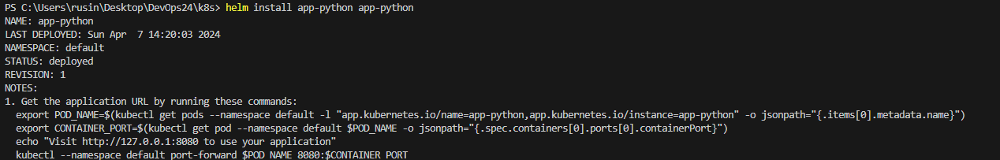
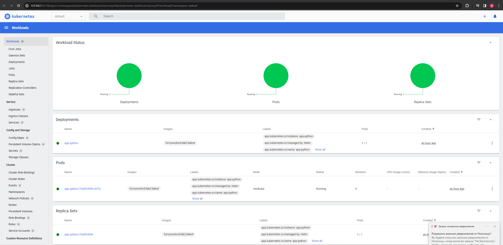
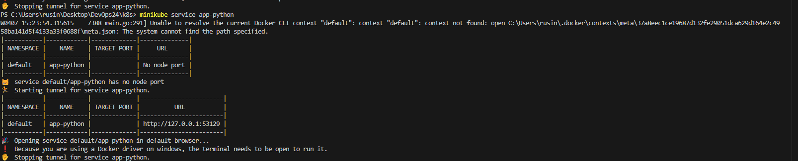
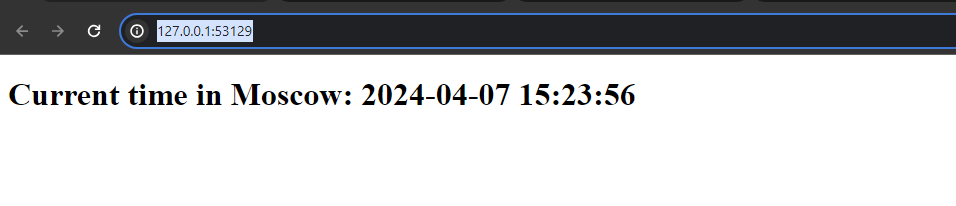
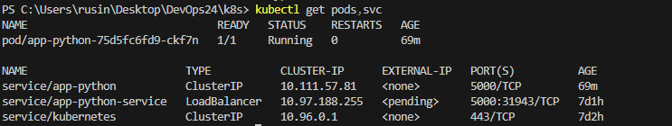

## Task 1: Helm Setup and Chart Creation

1. Install Helm:

2. Check minikube dashboard via `minikube dashboard`:

3. Check what our application running in the brauser on the same port:

4. Check via `kubectl get pods,svc` command:

