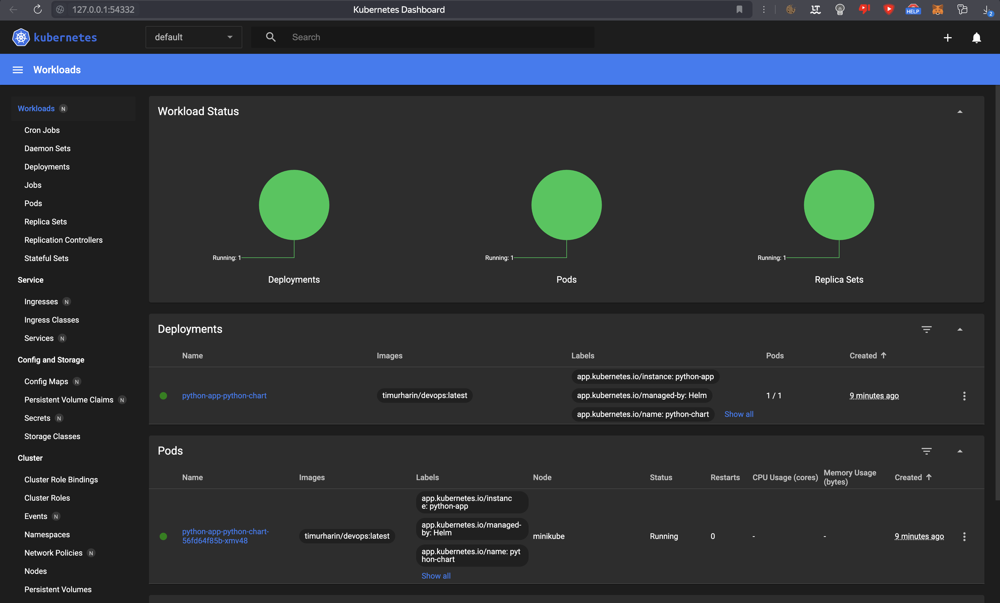
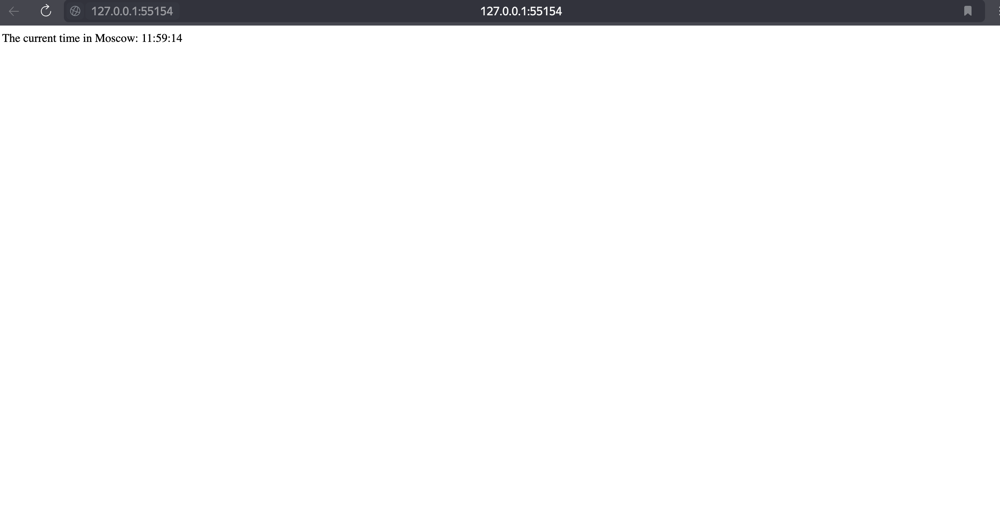
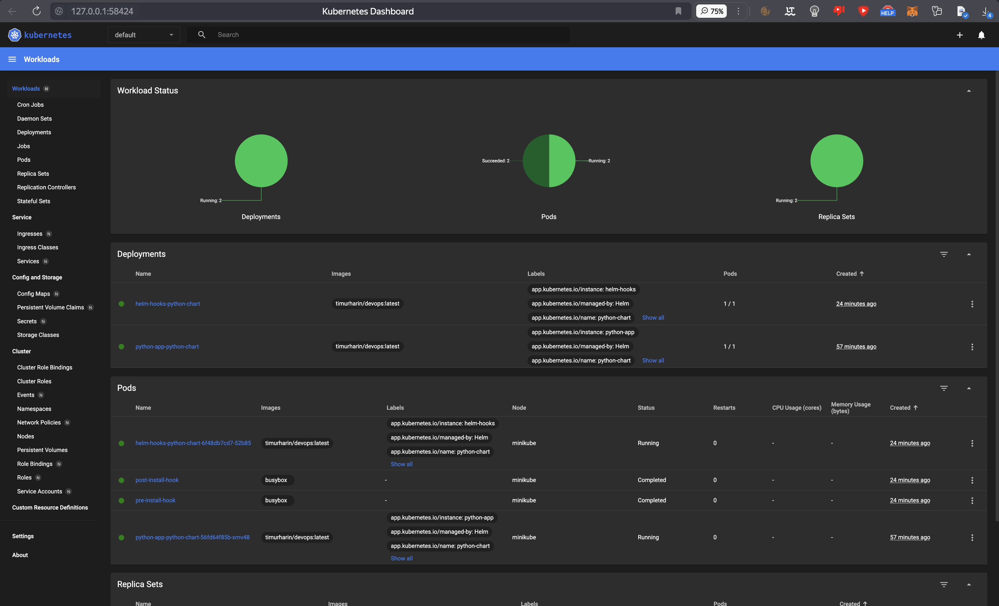
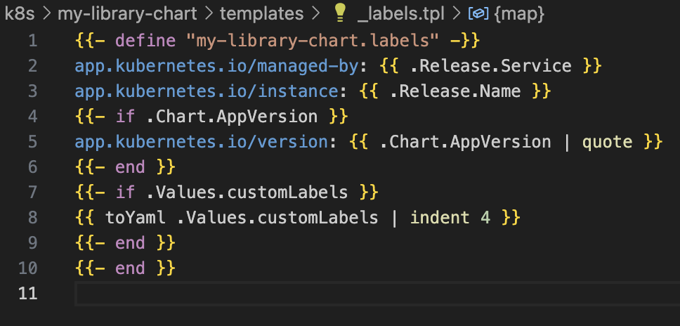
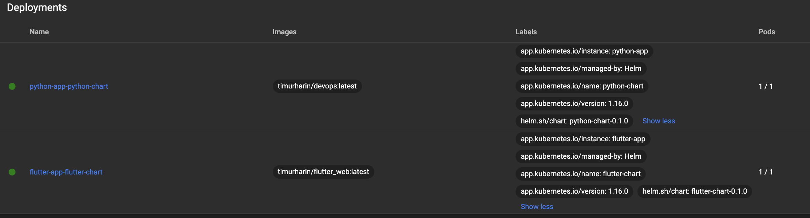

# HELM 

## install 

First I have issue with python_app and python_chart names because of "_", so I recreated them

```bash
helm install python-app python-chart/ --values python-chart/values.yaml
```

```bash 
NAME: python-app
LAST DEPLOYED: Wed Apr 10 9:53:24 2024
NAMESPACE: default
STATUS: deployed
REVISION: 1
NOTES:
1. Get the application URL by running these commands:
  export POD_NAME=$(kubectl get pods --namespace default -l "app.kubernetes.io/name=python-chart,app.kubernetes.io/instance=python-app" -o jsonpath="{.items[0].metadata.name}")
  export CONTAINER_PORT=$(kubectl get pod --namespace default $POD_NAME -o jsonpath="{.spec.containers[0].ports[0].containerPort}")
  echo "Visit http://127.0.0.1:8080 to use your application"
  kubectl --namespace default port-forward $POD_NAME 8080:$CONTAINER_PORT
```

## report

```bash 
kubectl get pods,svc
```


```bash
NAME                                           READY   STATUS    RESTARTS   AGE
pod/python-app-python-chart-56fd64f85b-xmv48   1/1     Running   0          10m

NAME                              TYPE        CLUSTER-IP      EXTERNAL-IP   PORT(S)    AGE
service/kubernetes                ClusterIP   10.96.0.1       <none>        443/TCP    53m
service/python-app-python-chart   ClusterIP   10.99.233.217   <none>        5000/TCP   10m
```

## dashboard

```bash
minikube dashboard         
```

```bash
🤔  Verifying dashboard health ...
🚀  Launching proxy ...
🤔  Verifying proxy health ...
🎉  Opening http://127.0.0.1:54332/api/v1/namespaces/kubernetes-dashboard/services/http:kubernetes-dashboard:/proxy/ in your default browser...
```



## service

```bash
minikube service python-app-python-chart         
```

```bash
|-----------|-------------------------|-------------|--------------|
| NAMESPACE |          NAME           | TARGET PORT |     URL      |
|-----------|-------------------------|-------------|--------------|
| default   | python-app-python-chart |             | No node port |
|-----------|-------------------------|-------------|--------------|
😿  service default/python-app-python-chart has no node port
🏃  Starting tunnel for service python-app-python-chart.
|-----------|-------------------------|-------------|------------------------|
| NAMESPACE |          NAME           | TARGET PORT |          URL           |
|-----------|-------------------------|-------------|------------------------|
| default   | python-app-python-chart |             | http://127.0.0.1:55154 |
|-----------|-------------------------|-------------|------------------------|
🎉  Opening service default/python-app-python-chart in default browser...
❗  Because you are using a Docker driver on darwin, the terminal needs to be open to run it.
```




## Hooks

post-install-hook.yml and pre-install-hook.yml files were added

### Lint

```bash
 helm lint   
```

```bash 
==> Linting .
[INFO] Chart.yaml: icon is recommended

1 chart(s) linted, 0 chart(s) failed
```

### Dry-run

```bash
helm install --dry-run helm-hooks . 
```

```bash
NAME: helm-hooks
LAST DEPLOYED: Wed Apr 10 10:09:24 2024
NAMESPACE: default
STATUS: pending-install
REVISION: 1
HOOKS:
---
# Source: python-chart/templates/post-install-hook.yaml
apiVersion: v1
kind: Pod
metadata:
   name: post-install-hook
   annotations:
       "helm.sh/hook": "post-install"
       "helm.sh/hook-delete-policy": hook-succeeded"
spec:
  containers:
  - name: post-install-container
    image: busybox
    imagePullPolicy: Always
    command: ['sh', '-c', 'echo The post-install hook is running && sleep 3' ]
  restartPolicy: Never
  terminationGracePeriodSeconds: 0
---
# Source: python-chart/templates/pre-install-hook.yaml
apiVersion: v1
kind: Pod
metadata:
   name: pre-install-hook
   annotations:
       "helm.sh/hook": "pre-install"
       "helm.sh/hook-delete-policy": hook-succeeded"
spec:
  containers:
  - name: pre-install-container
    image: busybox
    imagePullPolicy: IfNotPresent
    command: ['sh', '-c', 'echo The pre-install hook is running && sleep 3']
  restartPolicy: Never
  terminationGracePeriodSeconds: 0
---
# Source: python-chart/templates/tests/test-connection.yaml
apiVersion: v1
kind: Pod
metadata:
  name: "helm-hooks-python-chart-test-connection"
  labels:
    helm.sh/chart: python-chart-0.1.0
    app.kubernetes.io/name: python-chart
    app.kubernetes.io/instance: helm-hooks
    app.kubernetes.io/version: "1.16.0"
    app.kubernetes.io/managed-by: Helm
  annotations:
    "helm.sh/hook": test
spec:
  containers:
    - name: wget
      image: busybox
      command: ['wget']
      args: ['helm-hooks-python-chart:5000']
  restartPolicy: Never
MANIFEST:
---
# Source: python-chart/templates/serviceaccount.yaml
apiVersion: v1
kind: ServiceAccount
metadata:
  name: helm-hooks-python-chart
  labels:
    helm.sh/chart: python-chart-0.1.0
    app.kubernetes.io/name: python-chart
    app.kubernetes.io/instance: helm-hooks
    app.kubernetes.io/version: "1.16.0"
    app.kubernetes.io/managed-by: Helm
automountServiceAccountToken: true
---
# Source: python-chart/templates/service.yaml
apiVersion: v1
kind: Service
metadata:
  name: helm-hooks-python-chart
  labels:
    helm.sh/chart: python-chart-0.1.0
    app.kubernetes.io/name: python-chart
    app.kubernetes.io/instance: helm-hooks
    app.kubernetes.io/version: "1.16.0"
    app.kubernetes.io/managed-by: Helm
spec:
  type: ClusterIP
  ports:
    - port: 5000
      targetPort: http
      protocol: TCP
      name: http
  selector:
    app.kubernetes.io/name: python-chart
    app.kubernetes.io/instance: helm-hooks
---
# Source: python-chart/templates/deployment.yaml
apiVersion: apps/v1
kind: Deployment
metadata:
  name: helm-hooks-python-chart
  labels:
    helm.sh/chart: python-chart-0.1.0
    app.kubernetes.io/name: python-chart
    app.kubernetes.io/instance: helm-hooks
    app.kubernetes.io/version: "1.16.0"
    app.kubernetes.io/managed-by: Helm
spec:
  replicas: 1
  selector:
    matchLabels:
      app.kubernetes.io/name: python-chart
      app.kubernetes.io/instance: helm-hooks
  template:
    metadata:
      labels:
        helm.sh/chart: python-chart-0.1.0
        app.kubernetes.io/name: python-chart
        app.kubernetes.io/instance: helm-hooks
        app.kubernetes.io/version: "1.16.0"
        app.kubernetes.io/managed-by: Helm
    spec:
      serviceAccountName: helm-hooks-python-chart
      securityContext:
        {}
      containers:
        - name: python-chart
          securityContext:
            {}
          image: "timurharin/devops:latest"
          imagePullPolicy: IfNotPresent
          ports:
            - name: http
              containerPort: 5000
              protocol: TCP
          livenessProbe:
            httpGet:
              path: /
              port: http
          readinessProbe:
            httpGet:
              path: /
              port: http
          resources:
            {}

NOTES:
1. Get the application URL by running these commands:
  export POD_NAME=$(kubectl get pods --namespace default -l "app.kubernetes.io/name=python-chart,app.kubernetes.io/instance=helm-hooks" -o jsonpath="{.items[0].metadata.name}")
  export CONTAINER_PORT=$(kubectl get pod --namespace default $POD_NAME -o jsonpath="{.spec.containers[0].ports[0].containerPort}")
  echo "Visit http://127.0.0.1:8080 to use your application"
  kubectl --namespace default port-forward $POD_NAME 8080:$CONTAINER_PORT
```

### Install


```bash
helm install helm-hooks ./python-chart 
```

```bash
NAME: helm-hooks
LAST DEPLOYED: Wed Apr 10 10:22:03 2024
NAMESPACE: default
STATUS: deployed
REVISION: 1
NOTES:
1. Get the application URL by running these commands:
  export POD_NAME=$(kubectl get pods --namespace default -l "app.kubernetes.io/name=python-chart,app.kubernetes.io/instance=helm-hooks" -o jsonpath="{.items[0].metadata.name}")
  export CONTAINER_PORT=$(kubectl get pod --namespace default $POD_NAME -o jsonpath="{.spec.containers[0].ports[0].containerPort}")
  echo "Visit http://127.0.0.1:8080 to use your application"
  kubectl --namespace default port-forward $POD_NAME 8080:$CONTAINER_PORT
```

### Get

```bash
kubectl get po
```

```bash
NAME                                       READY   STATUS      RESTARTS   AGE
helm-hooks-python-chart-6f48db7cd7-52b85   1/1     Running     0          3m25s
post-install-hook                          0/1     Completed   0          3m25s
pre-install-hook                           0/1     Completed   0          3m34s
python-app-python-chart-56fd64f85b-xmv48   1/1     Running     0          36m
```

### Describe

```bash
kubectl describe po  pre-install-hook 
```

```bash
Name:             pre-install-hook
Namespace:        default
Priority:         0
Service Account:  default
Node:             minikube/192.168.49.2
Start Time:       Wed, 10 Apr 2024 10:22:04 +0300
Labels:           <none>
Annotations:      helm.sh/hook: pre-install
                  helm.sh/hook-delete-policy: hook-succeeded"
Status:           Succeeded
IP:               10.244.0.15
IPs:
  IP:  10.244.0.15
Containers:
  pre-install-container:
    Container ID:  docker://910f1ac6e6abd6102c1831e4aa85291944f4938709001aa83f04e444c3e51fc5
    Image:         busybox
    Image ID:      docker-pullable://busybox@sha256:6776a33c72b3af7582a5b301e3a08186f2c21a3409f0d2b52dfddbdbe24a5b04
    Port:          <none>
    Host Port:     <none>
    Command:
      sh
      -c
      echo The pre-install hook is running && sleep 3
    State:          Terminated
      Reason:       Completed
      Exit Code:    0
      Started:      Wed, 10 Apr 2024 10:22:09 +0300
      Finished:     Wed, 10 Apr 2024 10:22:12 +0300
    Ready:          False
    Restart Count:  0
    Environment:    <none>
    Mounts:
      /var/run/secrets/kubernetes.io/serviceaccount from kube-api-access-plvgw (ro)
Conditions:
  Type              Status
  Initialized       True 
  Ready             False 
  ContainersReady   False 
  PodScheduled      True 
Volumes:
  kube-api-access-plvgw:
    Type:                    Projected (a volume that contains injected data from multiple sources)
    TokenExpirationSeconds:  3607
    ConfigMapName:           kube-root-ca.crt
    ConfigMapOptional:       <nil>
    DownwardAPI:             true
QoS Class:                   BestEffort
Node-Selectors:              <none>
Tolerations:                 node.kubernetes.io/not-ready:NoExecute op=Exists for 300s
                             node.kubernetes.io/unreachable:NoExecute op=Exists for 300s
Events:
  Type    Reason     Age   From               Message
  ----    ------     ----  ----               -------
  Normal  Scheduled  5m8s  default-scheduler  Successfully assigned default/pre-install-hook to minikube
  Normal  Pulling    5m8s  kubelet            Pulling image "busybox"
  Normal  Pulled     5m3s  kubelet            Successfully pulled image "busybox" in 4.509s (4.509s including waiting)
  Normal  Created    5m3s  kubelet            Created container pre-install-container
  Normal  Started    5m3s  kubelet            Started container pre-install-container
```

```bash
 kubectl describe po  post-install-hook 
```

```bash
Name:             post-install-hook
Namespace:        default
Priority:         0
Service Account:  default
Node:             minikube/192.168.49.2
Start Time:       Wed, 10 Apr 2024 10:22:13 +0300
Labels:           <none>
Annotations:      helm.sh/hook: post-install
                  helm.sh/hook-delete-policy: hook-succeeded"
Status:           Succeeded
IP:               10.244.0.17
IPs:
  IP:  10.244.0.17
Containers:
  post-install-container:
    Container ID:  docker://0ce3fa4d318ad783ed603b32b046329d4548589506d826a3852af6c4c926db5e
    Image:         busybox
    Image ID:      docker-pullable://busybox@sha256:6776a33c72b3af7582a5b301e3a08186f2c21a3409f0d2b52dfddbdbe24a5b04
    Port:          <none>
    Host Port:     <none>
    Command:
      sh
      -c
      echo The post-install hook is running && sleep 3
    State:          Terminated
      Reason:       Completed
      Exit Code:    0
      Started:      Wed, 10 Apr 2024 10:22:15 +0300
      Finished:     Wed, 10 Apr 2024 10:22:18 +0300
    Ready:          False
    Restart Count:  0
    Environment:    <none>
    Mounts:
      /var/run/secrets/kubernetes.io/serviceaccount from kube-api-access-sjcpp (ro)
Conditions:
  Type              Status
  Initialized       True 
  Ready             False 
  ContainersReady   False 
  PodScheduled      True 
Volumes:
  kube-api-access-sjcpp:
    Type:                    Projected (a volume that contains injected data from multiple sources)
    TokenExpirationSeconds:  3607
    ConfigMapName:           kube-root-ca.crt
    ConfigMapOptional:       <nil>
    DownwardAPI:             true
QoS Class:                   BestEffort
Node-Selectors:              <none>
Tolerations:                 node.kubernetes.io/not-ready:NoExecute op=Exists for 300s
                             node.kubernetes.io/unreachable:NoExecute op=Exists for 300s
Events:
  Type    Reason     Age    From               Message
  ----    ------     ----   ----               -------
  Normal  Scheduled  6m42s  default-scheduler  Successfully assigned default/post-install-hook to minikube
  Normal  Pulling    6m42s  kubelet            Pulling image "busybox"
  Normal  Pulled     6m41s  kubelet            Successfully pulled image "busybox" in 1.536s (1.536s including waiting)
  Normal  Created    6m41s  kubelet            Created container post-install-container
  Normal  Started    6m41s  kubelet            Started container post-install-container
```

Updated dashboard



### Delete policy

I added the `helm.sh/hook-delete-policy": hook-succeeded` annotation to the hook pod specifications in post-install-hook.yml and pre-install.hook.yml files, so it is working

## Bonus

### Helm for flutter

```bash 
helm install flutter-app flutter-chart/ --values flutter-chart/values.yaml
```


```bash
NAME: flutter-app
LAST DEPLOYED: Wed Apr 10 11:01:20 2024
NAMESPACE: default
STATUS: deployed
REVISION: 1
NOTES:
1. Get the application URL by running these commands:
  export POD_NAME=$(kubectl get pods --namespace default -l "app.kubernetes.io/name=flutter-chart,app.kubernetes.io/instance=flutter-app" -o jsonpath="{.items[0].metadata.name}")
  export CONTAINER_PORT=$(kubectl get pod --namespace default $POD_NAME -o jsonpath="{.spec.containers[0].ports[0].containerPort}")
  echo "Visit http://127.0.0.1:8080 to use your application"
  kubectl --namespace default port-forward $POD_NAME 8080:$CONTAINER_PORT
```

### Library

I added this library and put it as dependency for charts



And after it I have these labels

