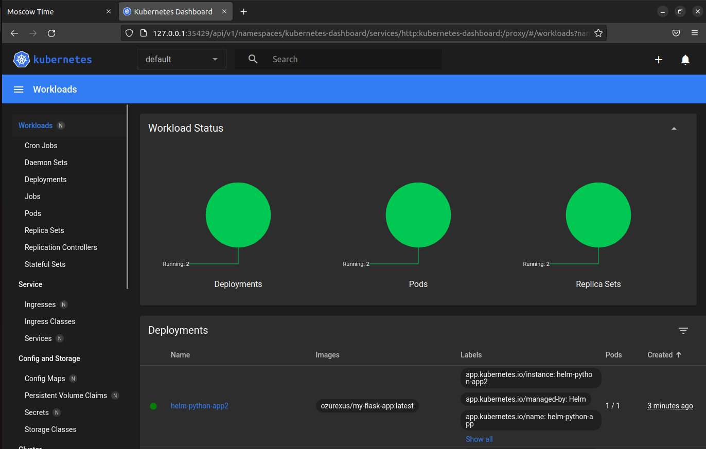

# Helm command outputs

## Task 1

```bash
$ kubectl get pods,svc
NAME                                      READY   STATUS    RESTARTS        AGE
pod/my-helm-app-python-86f7dfdcc9-d2kkq   1/1     Running   1 (3m55s ago)   22h

NAME                         TYPE           CLUSTER-IP     EXTERNAL-IP   PORT(S)          AGE
service/kubernetes           ClusterIP      10.96.0.1      <none>        443/TCP          8d
service/my-helm-app-python   LoadBalancer   10.98.66.143   <pending>     8080:32668/TCP   22h
```



## Task 2

### Note: delete policies are commented out to have hooks appear in the requiered commands outputs

```bash
$ kubectl get po
NAME                                          READY   STATUS      RESTARTS   AGE
helm-app-python-7c8856c6df-swmx4              1/1     Running     0          30s
postinstall-hook                              0/1     Completed   0          29s
preinstall-hook                               0/1     Completed   0          55s
```

```bash
$ kubectl describe po postinstall-hook
Name:             postinstall-hook
Namespace:        default
Priority:         0
Service Account:  default
Node:             minikube/192.168.49.2
Start Time:       Mon, 08 Apr 2024 15:01:38 +0300
Labels:           <none>
Annotations:      helm.sh/hook: post-install
Status:           Succeeded
IP:               10.244.0.78
IPs:
  IP:  10.244.0.78
Containers:
  post-install-container:
    Container ID:  docker://a81b4299b1375e98dab7d7a72986f3342645697a04ae0669865446edfab21fee
    Image:         busybox
    Image ID:      docker-pullable://busybox@sha256:c3839dd800b9eb7603340509769c43e146a74c63dca3045a8e7dc8ee07e53966
    Port:          <none>
    Host Port:     <none>
    Command:
      sh
      -c
      echo The post-install hook is running && sleep 15
    State:          Terminated
      Reason:       Completed
      Exit Code:    0
      Started:      Mon, 08 Apr 2024 15:01:46 +0300
      Finished:     Mon, 08 Apr 2024 15:02:01 +0300
    Ready:          False
    Restart Count:  0
    Environment:    <none>
    Mounts:
      /var/run/secrets/kubernetes.io/serviceaccount from kube-api-access-8nwgs (ro)
Conditions:
  Type              Status
  Initialized       True
  Ready             False
  ContainersReady   False
  PodScheduled      True
Volumes:
  kube-api-access-8nwgs:
    Type:                    Projected (a volume that contains injected data from multiple sources)
    TokenExpirationSeconds:  3607
    ConfigMapName:           kube-root-ca.crt
    ConfigMapOptional:       <nil>
    DownwardAPI:             true
QoS Class:                   BestEffort
Node-Selectors:              <none>
Tolerations:                 node.kubernetes.io/not-ready:NoExecute op=Exists for 300s
                             node.kubernetes.io/unreachable:NoExecute op=Exists for 300s
Events:
  Type    Reason     Age    From               Message
  ----    ------     ----   ----               -------
  Normal  Scheduled  2m12s  default-scheduler  Successfully assigned default/postinstall-hook to minikube
  Normal  Pulling    2m11s  kubelet            Pulling image "busybox"
  Normal  Pulled     2m6s   kubelet            Successfully pulled image "busybox" in 4.567s (4.567s including waiting)
  Normal  Created    2m5s   kubelet            Created container post-install-container
  Normal  Started    2m5s   kubelet            Started container post-install-container

```

```bash
$ kubectl describe po preinstall-hook
Name:             preinstall-hook
Namespace:        default
Priority:         0
Service Account:  default
Node:             minikube/192.168.49.2
Start Time:       Mon, 08 Apr 2024 15:01:12 +0300
Labels:           <none>
Annotations:      helm.sh/hook: pre-install
Status:           Succeeded
IP:               10.244.0.76
IPs:
  IP:  10.244.0.76
Containers:
  pre-install-container:
    Container ID:  docker://02dc33fd388d3514c893bbf3518cf8db4094afa908ae995fd5039ab7f4a561c4
    Image:         busybox
    Image ID:      docker-pullable://busybox@sha256:c3839dd800b9eb7603340509769c43e146a74c63dca3045a8e7dc8ee07e53966
    Port:          <none>
    Host Port:     <none>
    Command:
      sh
      -c
      echo The pre-install hook is running && sleep 20
    State:          Terminated
      Reason:       Completed
      Exit Code:    0
      Started:      Mon, 08 Apr 2024 15:01:15 +0300
      Finished:     Mon, 08 Apr 2024 15:01:35 +0300
    Ready:          False
    Restart Count:  0
    Environment:    <none>
    Mounts:
      /var/run/secrets/kubernetes.io/serviceaccount from kube-api-access-9vsvd (ro)
Conditions:
  Type              Status
  Initialized       True
  Ready             False
  ContainersReady   False
  PodScheduled      True
Volumes:
  kube-api-access-9vsvd:
    Type:                    Projected (a volume that contains injected data from multiple sources)
    TokenExpirationSeconds:  3607
    ConfigMapName:           kube-root-ca.crt
    ConfigMapOptional:       <nil>
    DownwardAPI:             true
QoS Class:                   BestEffort
Node-Selectors:              <none>
Tolerations:                 node.kubernetes.io/not-ready:NoExecute op=Exists for 300s
                             node.kubernetes.io/unreachable:NoExecute op=Exists for 300s
Events:
  Type    Reason     Age    From               Message
  ----    ------     ----   ----               -------
  Normal  Scheduled  2m59s  default-scheduler  Successfully assigned default/preinstall-hook to minikube
  Normal  Pulled     2m59s  kubelet            Container image "busybox" already present on machine
  Normal  Created    2m58s  kubelet            Created container pre-install-container
  Normal  Started    2m57s  kubelet            Started container pre-install-container
```

```bash
$ kubectl get pods,svc
NAME                                              READY   STATUS      RESTARTS   AGE
pod/helm-app-python-7c8856c6df-swmx4              1/1     Running     0          91s
pod/postinstall-hook                              0/1     Completed   0          90s
pod/preinstall-hook                               0/1     Completed   0          116s

NAME                                 TYPE           CLUSTER-IP       EXTERNAL-IP   PORT(S)          AGE
service/helm-app-python              LoadBalancer   10.108.255.81    <pending>     8080:30382/TCP   91s
service/kubernetes                   ClusterIP      10.96.0.1        <none>        443/TCP          9d
```
