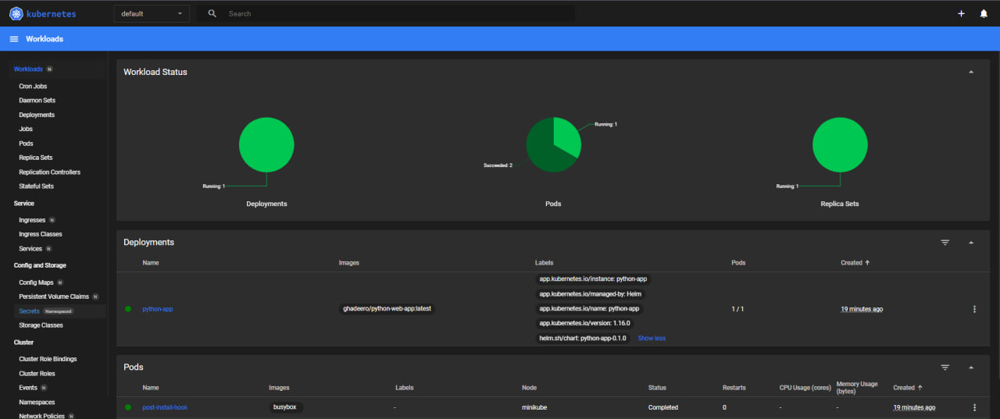

# Helm

## Helm Setup and Chart Creation

Created Helm chart template through the command:

```
helm create python-chart
```

Then, Installing the custom Helm chart after making sure minikube is running:

```bash
helm install python-app python-chart/ --values python-chart/values.yaml
```

Output:

```bash
NAME: python-app
LAST DEPLOYED: Wed Apr 10 02:58:54 2024
NAMESPACE: default
STATUS: deployed
REVISION: 1
NOTES:
1. Get the application URL by running these commands:
     NOTE: It may take a few minutes for the LoadBalancer IP to be available.
           You can watch the status of by running 'kubectl get --namespace default svc -w python-app'
  export SERVICE_IP=$(kubectl get svc --namespace default python-app --template "{{ range (index .status.loadBalancer.ingress 0) }}{{.}}{{ end }}")
  echo http://$SERVICE_IP:5000
```

View the pods and services through the command:

```
kubectl get pods,svc
```

Output:

```bash
NAME                             READY   STATUS    RESTARTS   AGE
pod/python-app-6f9978b89-xqjl9   1/1     Running   0          29s

NAME                 TYPE           CLUSTER-IP      EXTERNAL-IP   PORT(S)          AGE
service/kubernetes   ClusterIP      10.96.0.1       <none>        443/TCP          7d2h
service/python-app   LoadBalancer   10.96.221.124   <pending>     5000:32456/TCP   29s
```

Confirm the application is accessible `minikube service python-app`:

Output:

```bash
|-----------|------------|-------------|---------------------------|
| NAMESPACE |    NAME    | TARGET PORT |            URL            |
|-----------|------------|-------------|---------------------------|
| default   | python-app | http/5000   | http://192.168.49.2:32456 |
|-----------|------------|-------------|---------------------------|
🏃  Starting tunnel for service python-app.
|-----------|------------|-------------|------------------------|
| NAMESPACE |    NAME    | TARGET PORT |          URL           |
|-----------|------------|-------------|------------------------|
| default   | python-app |             | http://127.0.0.1:54632 |
|-----------|------------|-------------|------------------------|
🎉  Opening service default/python-app in default browser...
```

## Helm Chart Hooks

post-install-hook.yml and pre-install-hook.yml files were added

Linting: `helm lint python-app`

output:

```bash
==> Linting python-app
[INFO] Chart.yaml: icon is recommended

1 chart(s) linted, 0 chart(s) failed
```

Installing: `helm install --dry-run helm-hooks python-app`

---

**_Before Implementing hook delete policy_**

The output of the command `kubectl get pods,svc`:

```bash
NAME                             READY   STATUS      RESTARTS   AGE
pod/post-install-hook            0/1     Completed   0          26s
pod/pre-install-hook             0/1     Completed   0          39s
pod/python-app-6f9978b89-65ttp   1/1     Running     0          26s

NAME                 TYPE           CLUSTER-IP      EXTERNAL-IP   PORT(S)          AGE
service/kubernetes   ClusterIP      10.96.0.1       <none>        443/TCP          7d3h
service/python-app   LoadBalancer   10.107.36.208   <pending>     5000:31257/TCP   26s
```

The output of the command `kubectl get po`:

```bash
NAME                         READY   STATUS      RESTARTS   AGE
post-install-hook            0/1     Completed   0          103s
pre-install-hook             0/1     Completed   0          116s
python-app-6f9978b89-65ttp   1/1     Running     0          103s
```

The output of the command `kubectl describe po pre-install-hook`:

```bash
Name:             pre-install-hook
Namespace:        default
Priority:         0
Service Account:  default
Node:             minikube/192.168.49.2
Start Time:       Wed, 10 Apr 2024 04:28:20 +0300
Labels:           <none>
Annotations:      helm.sh/hook: pre-install
Status:           Succeeded
IP:               10.244.0.30
IPs:
  IP:  10.244.0.30
Containers:
  pre-install-container:
    Container ID:  docker://a5bfcfd0492001ee863c09caf6fd1bdfd2b0bae5b26ef5c4e93539b3acb226ee
    Image:         busybox
    Image ID:      docker-pullable://busybox@sha256:c3839dd800b9eb7603340509769c43e146a74c63dca3045a8e7dc8ee07e53966
    Port:          <none>
    Host Port:     <none>
    Command:
      sh
      -c
      echo The pre-install hook is running && sleep 5
    State:          Terminated
      Reason:       Completed
      Exit Code:    0
      Started:      Wed, 10 Apr 2024 04:28:26 +0300
      Finished:     Wed, 10 Apr 2024 04:28:31 +0300
    Ready:          False
    Restart Count:  0
    Environment:    <none>
    Mounts:
      /var/run/secrets/kubernetes.io/serviceaccount from kube-api-access-f7p9k (ro)
Conditions:
  Type              Status
  Initialized       True
  Ready             False
  ContainersReady   False
  PodScheduled      True
Volumes:
  kube-api-access-f7p9k:
    Type:                    Projected (a volume that contains injected data from multiple sources)
    TokenExpirationSeconds:  3607
    ConfigMapName:           kube-root-ca.crt
    ConfigMapOptional:       <nil>
    DownwardAPI:             true
QoS Class:                   BestEffort
Node-Selectors:              <none>
Tolerations:                 node.kubernetes.io/not-ready:NoExecute op=Exists for 300s
                             node.kubernetes.io/unreachable:NoExecute op=Exists for 300s
Events:
  Type    Reason     Age    From               Message
  ----    ------     ----   ----               -------
  Normal  Scheduled  8m56s  default-scheduler  Successfully assigned default/pre-install-hook to minikube
  Normal  Pulling    8m56s  kubelet            Pulling image "busybox"
  Normal  Pulled     8m50s  kubelet            Successfully pulled image "busybox" in 5.68s (5.68s including waiting)
  Normal  Created    8m50s  kubelet            Created container pre-install-container
  Normal  Started    8m50s  kubelet            Started container pre-install-container
```

The output of the command `kubectl describe po post-install-hook`:

```bash
Name:             post-install-hook
Namespace:        default
Priority:         0
Service Account:  default
Node:             minikube/192.168.49.2
Start Time:       Wed, 10 Apr 2024 04:28:33 +0300
Labels:           <none>
Annotations:      helm.sh/hook: post-install
Status:           Succeeded
IP:               10.244.0.32
IPs:
  IP:  10.244.0.32
Containers:
  post-install-container:
    Container ID:  docker://f3a4649dd50f4683033a8a03f400bb0376a8f32d697dfc721b9f5df1648af23a
    Image:         busybox
    Image ID:      docker-pullable://busybox@sha256:c3839dd800b9eb7603340509769c43e146a74c63dca3045a8e7dc8ee07e53966
    Port:          <none>
    Host Port:     <none>
    Command:
      sh
      -c
      echo The post-install hook is running && sleep 5
    State:          Terminated
      Reason:       Completed
      Exit Code:    0
      Started:      Wed, 10 Apr 2024 04:28:35 +0300
      Finished:     Wed, 10 Apr 2024 04:28:40 +0300
    Ready:          False
    Restart Count:  0
    Environment:    <none>
    Mounts:
      /var/run/secrets/kubernetes.io/serviceaccount from kube-api-access-t8mkh (ro)
Conditions:
  Type              Status
  Initialized       True
  Ready             False
  ContainersReady   False
  PodScheduled      True
Volumes:
  kube-api-access-t8mkh:
    Type:                    Projected (a volume that contains injected data from multiple sources)
    TokenExpirationSeconds:  3607
    ConfigMapName:           kube-root-ca.crt
    ConfigMapOptional:       <nil>
    DownwardAPI:             true
QoS Class:                   BestEffort
Node-Selectors:              <none>
Tolerations:                 node.kubernetes.io/not-ready:NoExecute op=Exists for 300s
                             node.kubernetes.io/unreachable:NoExecute op=Exists for 300s
Events:
  Type    Reason     Age   From               Message
  ----    ------     ----  ----               -------
  Normal  Scheduled  10m   default-scheduler  Successfully assigned default/post-install-hook to minikube
  Normal  Pulling    10m   kubelet            Pulling image "busybox"
  Normal  Pulled     10m   kubelet            Successfully pulled image "busybox" in 1.515s (1.515s including waiting)
  Normal  Created    10m   kubelet            Created container post-install-container
  Normal  Started    10m   kubelet            Started container post-install-container
```

---

Output of `minikube dashboard`



---

### Hook Delete Policy

I added the `helm.sh/hook-delete-policy": hook-succeeded` annotation to the hook pod specifications in post-install-hook.yml and pre-install.hook.yml files.
