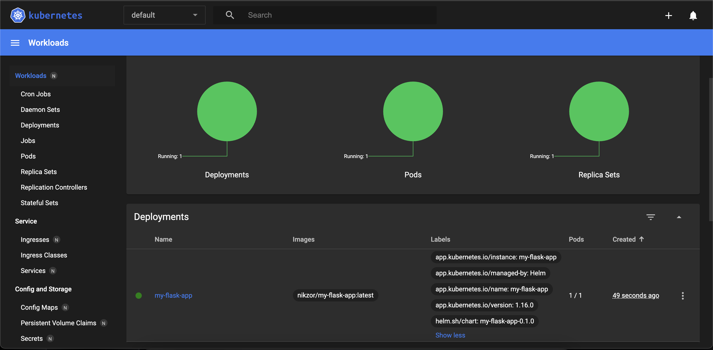

# Helm

## Helm Setup and Chart Creation
I ran the following commands to create the chart for the python and bonus apps: 
```shell
minikube start --driver=docker
helm install helm-app-python helm-app-python/ --values helm-app-python/values.yaml
helm install helm-app-javascript helm-app-javascript/ --values helm-app-javascript/values.yaml
```
### Output(s)
```shell 
wilson@wilson ~/D/S/k8s (lab10)> helm install helm-app-python helm-app-python/ --values helm-app-python/values.yaml
NAME: helm-app-python
LAST DEPLOYED: Tue Apr  9 00:36:02 2024
NAMESPACE: default
STATUS: deployed
REVISION: 1
NOTES:
1. Get the application URL by running these commands:
     NOTE: It may take a few minutes for the LoadBalancer IP to be available.
           You can watch the status of by running 'kubectl get --namespace default svc -w helm-app-python'
  export SERVICE_IP=$(kubectl get svc --namespace default helm-app-python --template "{{ range (index .status.loadBalancer.ingress 0) }}{{.}}{{ end }}")
  echo http://$SERVICE_IP:5000
```
```shell
wilson@wilson ~/D/S/k8s (lab10)> helm install helm-app-javascript helm-app-javascript/ --values helm-app-javascript/values.yaml
NAME: helm-app-javascript
LAST DEPLOYED: Tue Apr  9 00:36:20 2024
NAMESPACE: default
STATUS: deployed
REVISION: 1
NOTES:
1. Get the application URL by running these commands:
     NOTE: It may take a few minutes for the LoadBalancer IP to be available.
           You can watch the status of by running 'kubectl get --namespace default svc -w helm-app-javascript'
  export SERVICE_IP=$(kubectl get svc --namespace default helm-app-javascript --template "{{ range (index .status.loadBalancer.ingress 0) }}{{.}}{{ end }}")
  echo http://$SERVICE_IP:5001
```
```shell 
wilson@wilson ~/D/S/k8s (lab10)> kubectl get pods,svc
NAME                                       READY   STATUS    RESTARTS   AGE
pod/helm-app-javascript-7489d5f8db-g72lf   1/1     Running   0          53s
pod/helm-app-python-5768d4d8fb-flpb5       1/1     Running   0          71s

NAME                          TYPE           CLUSTER-IP       EXTERNAL-IP   PORT(S)          AGE
service/helm-app-javascript   LoadBalancer   10.109.219.101   <pending>     5001:32599/TCP   53s
service/helm-app-python       LoadBalancer   10.97.139.209    <pending>     5000:32122/TCP   72s
service/kubernetes            ClusterIP      10.96.0.1        <none>        443/TCP          116s
```

## Helm Chart Hooks
I added `pre-install-hook.yaml` and `post-install-hook.yaml` for both apps under `templates`. 

### Output(s) **without hook delete policy**.
```shell
wilson@wilson ~/D/S/k8s (lab10)> kubectl get po
NAME                                   READY   STATUS      RESTARTS   AGE
helm-app-javascript-7489d5f8db-mrnwp   1/1     Running     0          2m15s
helm-app-python-5768d4d8fb-q72wj       1/1     Running     0          3m34s
postinstall-hook                       0/1     Completed   0          2m15s
preinstall-hook                        0/1     Completed   0          2m38s
```
```shell
wilson@wilson ~/D/S/k8s (lab10)> kubectl describe po preinstall-hook
Name:             preinstall-hook
Namespace:        default
Priority:         0
Service Account:  default
Node:             minikube/192.168.49.2
Start Time:       Tue, 09 Apr 2024 01:56:25 +0300
Labels:           <none>
Annotations:      helm.sh/hook: pre-install
Status:           Succeeded
IP:               10.244.0.6
IPs:
  IP:  10.244.0.6
Containers:
  pre-install-container:
    Container ID:  docker://f85aeb93622554e4fcd17a5b2bbbb5e527f0ba87b5097cb9a9ed40dcbf36a892
    Image:         busybox
    Image ID:      docker-pullable://busybox@sha256:c3839dd800b9eb7603340509769c43e146a74c63dca3045a8e7dc8ee07e53966
    Port:          <none>
    Host Port:     <none>
    Command:
      sh
      -c
      echo The pre-install hook is running && sleep 20
    State:          Terminated
      Reason:       Completed
      Exit Code:    0
      Started:      Tue, 09 Apr 2024 01:56:27 +0300
      Finished:     Tue, 09 Apr 2024 01:56:47 +0300
    Ready:          False
    Restart Count:  0
    Environment:    <none>
    Mounts:
      /var/run/secrets/kubernetes.io/serviceaccount from kube-api-access-vfdpw (ro)
Conditions:
  Type              Status
  Initialized       True 
  Ready             False 
  ContainersReady   False 
  PodScheduled      True 
Volumes:
  kube-api-access-vfdpw:
    Type:                    Projected (a volume that contains injected data from multiple sources)
    TokenExpirationSeconds:  3607
    ConfigMapName:           kube-root-ca.crt
    ConfigMapOptional:       <nil>
    DownwardAPI:             true
QoS Class:                   BestEffort
Node-Selectors:              <none>
Tolerations:                 node.kubernetes.io/not-ready:NoExecute op=Exists for 300s
                             node.kubernetes.io/unreachable:NoExecute op=Exists for 300s
Events:
  Type    Reason     Age    From               Message
  ----    ------     ----   ----               -------
  Normal  Scheduled  3m19s  default-scheduler  Successfully assigned default/preinstall-hook to minikube
  Normal  Pulled     3m18s  kubelet            Container image "busybox" already present on machine
  Normal  Created    3m18s  kubelet            Created container pre-install-container
  Normal  Started    3m17s  kubelet            Started container pre-install-container
```
```shell
wilson@wilson ~/D/S/k8s (lab10)> kubectl describe po postinstall-hook
Name:             postinstall-hook
Namespace:        default
Priority:         0
Service Account:  default
Node:             minikube/192.168.49.2
Start Time:       Tue, 09 Apr 2024 01:56:49 +0300
Labels:           <none>
Annotations:      helm.sh/hook: post-install
Status:           Succeeded
IP:               10.244.0.8
IPs:
  IP:  10.244.0.8
Containers:
  post-install-container:
    Container ID:  docker://df23d846462a37f2c5d294c583cbeb9c60dbee4f110a3e54cfc605f4830fa04d
    Image:         busybox
    Image ID:      docker-pullable://busybox@sha256:c3839dd800b9eb7603340509769c43e146a74c63dca3045a8e7dc8ee07e53966
    Port:          <none>
    Host Port:     <none>
    Command:
      sh
      -c
      echo The post-install hook is running && sleep 20
    State:          Terminated
      Reason:       Completed
      Exit Code:    0
      Started:      Tue, 09 Apr 2024 01:57:29 +0300
      Finished:     Tue, 09 Apr 2024 01:57:49 +0300
    Ready:          False
    Restart Count:  0
    Environment:    <none>
    Mounts:
      /var/run/secrets/kubernetes.io/serviceaccount from kube-api-access-b29x5 (ro)
Conditions:
  Type              Status
  Initialized       True 
  Ready             False 
  ContainersReady   False 
  PodScheduled      True 
Volumes:
  kube-api-access-b29x5:
    Type:                    Projected (a volume that contains injected data from multiple sources)
    TokenExpirationSeconds:  3607
    ConfigMapName:           kube-root-ca.crt
    ConfigMapOptional:       <nil>
    DownwardAPI:             true
QoS Class:                   BestEffort
Node-Selectors:              <none>
Tolerations:                 node.kubernetes.io/not-ready:NoExecute op=Exists for 300s
                             node.kubernetes.io/unreachable:NoExecute op=Exists for 300s
Events:
  Type    Reason     Age    From               Message
  ----    ------     ----   ----               -------
  Normal  Scheduled  3m20s  default-scheduler  Successfully assigned default/postinstall-hook to minikube
  Normal  Pulling    3m19s  kubelet            Pulling image "busybox"
  Normal  Pulled     2m40s  kubelet            Successfully pulled image "busybox" in 2.849s (39.094s including waiting)
  Normal  Created    2m40s  kubelet            Created container post-install-container
  Normal  Started    2m40s  kubelet            Started container post-install-container
```
```shell
wilson@wilson ~/D/S/k8s (lab10)> kubectl get pods,svc
NAME                                       READY   STATUS      RESTARTS   AGE
pod/helm-app-javascript-7489d5f8db-mrnwp   1/1     Running     0          3m52s
pod/helm-app-python-5768d4d8fb-q72wj       1/1     Running     0          5m11s
pod/postinstall-hook                       0/1     Completed   0          3m52s
pod/preinstall-hook                        0/1     Completed   0          4m15s

NAME                          TYPE           CLUSTER-IP      EXTERNAL-IP   PORT(S)          AGE
service/helm-app-javascript   LoadBalancer   10.103.33.251   <pending>     5001:32496/TCP   3m52s
service/helm-app-python       LoadBalancer   10.104.61.162   <pending>     5000:31085/TCP   5m11s
service/kubernetes            ClusterIP      10.96.0.1       <none>        443/TCP          6m10s
```

I added a library chart for the bonus task under `/libchart`, added it as a dependency for both applications, and ran `helm dependency update`. 

### Viewing the labels from `minikube dashboard`
