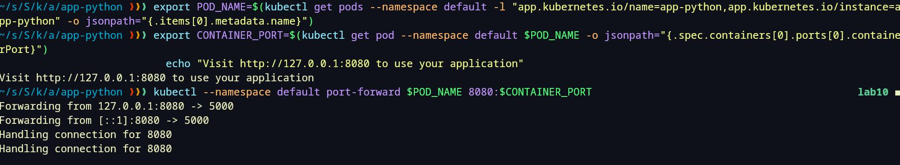
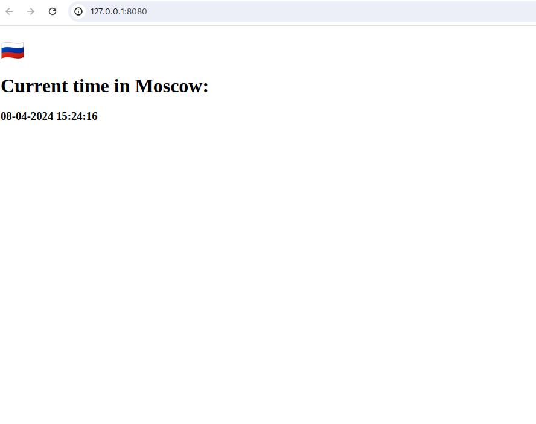
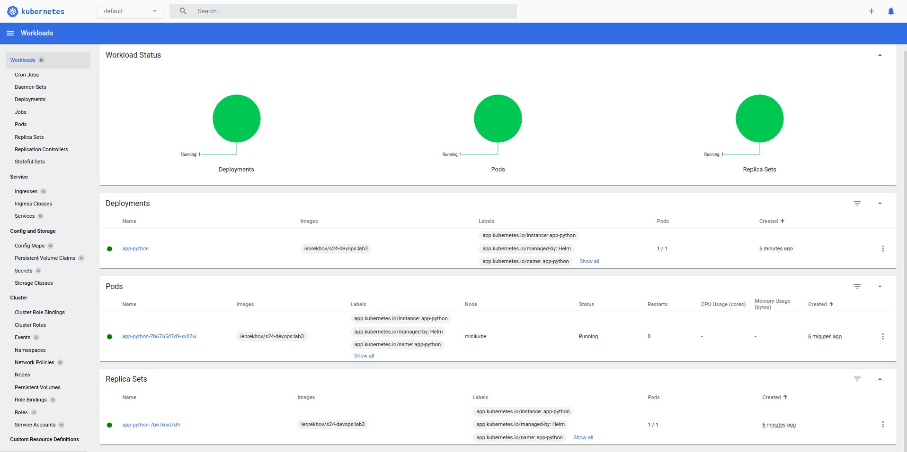

# Helm

## Task 1




```bash
~/s/S/k/app_python ❯❯❯ minikube service --all                                                                                         ✘ 14 lab10 ◼
|-----------|------------|-------------|--------------|
| NAMESPACE |    NAME    | TARGET PORT |     URL      |
|-----------|------------|-------------|--------------|
| default   | app-python |             | No node port |
|-----------|------------|-------------|--------------|
😿  service default/app-python has no node port
|-----------|------------|-------------|--------------|
| NAMESPACE |    NAME    | TARGET PORT |     URL      |
|-----------|------------|-------------|--------------|
| default   | kubernetes |             | No node port |
|-----------|------------|-------------|--------------|
😿  service default/kubernetes has no node port
```

```bash
~/s/S/k/app_python ❯❯❯ kubectl get pods,svc                                                                                                lab10 ◼
NAME                              READY   STATUS    RESTARTS   AGE
pod/app-python-7b6765d7d9-xv87w   1/1     Running   0          9m4s

NAME                 TYPE        CLUSTER-IP       EXTERNAL-IP   PORT(S)   AGE
service/app-python   ClusterIP   10.103.250.111   <none>        80/TCP    9m4s
service/kubernetes   ClusterIP   10.96.0.1        <none>        443/TCP   30m
```

## Task 2

