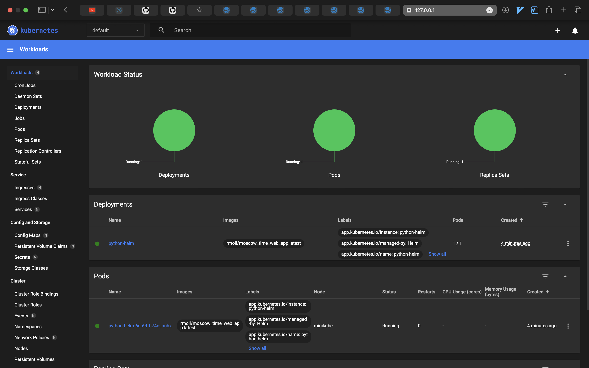

# Task1

## Install Helm Chart
```text
❯ helm install python-helm python-helm
NAME: python-helm
LAST DEPLOYED: Sun Apr  7 09:58:06 2024
NAMESPACE: default
STATUS: deployed
REVISION: 1
NOTES:
1. Get the application URL by running these commands:
     NOTE: It may take a few minutes for the LoadBalancer IP to be available.
           You can watch the status of by running 'kubectl get --namespace default svc -w python-helm'
  export SERVICE_IP=$(kubectl get svc --namespace default python-helm --template "{{ range (index .status.loadBalancer.ingress 0) }}{{.}}{{ end }}")
  echo http://$SERVICE_IP:8080
```

## Dashboard
 
 
## Access
```text
❯ curl http://127.0.0.1:53615
<!DOCTYPE html>
<html>
<head>
    <title>Moscow Time</title>
    <script>
        function updateTime() {
            const moscowTimeOffset = 3;
            let now = new Date(new Date().getTime() + moscowTimeOffset * 3600 * 1000);
            document.getElementById('time').innerHTML = now.toUTCString().replace(" GMT", "");
        }
        setInterval(updateTime, 1000);
    </script>
</head>
<body onload="updateTime()">
    <h1>The current time in Moscow is: <span id="time">10:05:27</span></h1>
</body>
</html>%    
```

## Deployment

```text
❯ kubectl get pods,svc
NAME                               READY   STATUS    RESTARTS   AGE
pod/python-helm-6db9ffb74c-jpnhx   1/1     Running   0          7m49s

NAME                  TYPE           CLUSTER-IP      EXTERNAL-IP   PORT(S)          AGE
service/kubernetes    ClusterIP      10.96.0.1       <none>        443/TCP          7d1h
service/python-helm   LoadBalancer   10.98.145.235   <pending>     8080:32346/TCP   7m49s
```

# Task 2

## Linting

```text
❯ helm lint python-helm
==> Linting python-helm
[INFO] Chart.yaml: icon is recommended

1 chart(s) linted, 0 chart(s) failed
```

## Simulate installation

```text
❯ helm install --dry-run helm-hooks python-helm
NAME: helm-hooks
LAST DEPLOYED: Sun Apr  7 10:41:24 2024
NAMESPACE: default
STATUS: pending-install
REVISION: 1
HOOKS:
---
# Source: python-helm/templates/tests/test-connection.yaml
apiVersion: v1
kind: Pod
metadata:
  name: "helm-hooks-python-helm-test-connection"
  labels:
    helm.sh/chart: python-helm-0.1.0
    app.kubernetes.io/name: python-helm
    app.kubernetes.io/instance: helm-hooks
    app.kubernetes.io/version: "1.16.0"
    app.kubernetes.io/managed-by: Helm
  annotations:
    "helm.sh/hook": test
spec:
  containers:
    - name: wget
      image: busybox
      command: ['wget']
      args: ['helm-hooks-python-helm:8080']
  restartPolicy: Never
---
# Source: python-helm/templates/post-install-hook.yaml
apiVersion: batch/v1
kind: Job
metadata:
  name: "helm-hooks-post-install-hook"
  annotations:
    "helm.sh/hook": post-install
    "helm.sh/hook-weight": "3"
    # "helm.sh/hook-delete-policy": hook-succeeded
spec:
  template:
    spec:
      containers:
      - name: post-install-job
        image: alpine
        command: ["/bin/sleep","20"]
      restartPolicy: OnFailure
---
# Source: python-helm/templates/pre-install-hook.yaml
apiVersion: batch/v1
kind: Job
metadata:
  name: "helm-hooks-pre-install-hook"
  annotations:
    "helm.sh/hook": pre-install
    "helm.sh/hook-weight": "-5"
    # "helm.sh/hook-delete-policy": hook-succeeded
spec:
  template:
    metadata:
      name: "helm-hooks-pre-install-hook"
    spec:
      containers:
      - name: pre-install-job
        image: alpine
        command: ["/bin/sh", "-c", "echo Running pre install hook && sleep 20"]
      restartPolicy: OnFailure
MANIFEST:
---
# Source: python-helm/templates/serviceaccount.yaml
apiVersion: v1
kind: ServiceAccount
metadata:
  name: helm-hooks-python-helm
  labels:
    helm.sh/chart: python-helm-0.1.0
    app.kubernetes.io/name: python-helm
    app.kubernetes.io/instance: helm-hooks
    app.kubernetes.io/version: "1.16.0"
    app.kubernetes.io/managed-by: Helm
automountServiceAccountToken: true
---
# Source: python-helm/templates/service.yaml
apiVersion: v1
kind: Service
metadata:
  name: helm-hooks-python-helm
  labels:
    helm.sh/chart: python-helm-0.1.0
    app.kubernetes.io/name: python-helm
    app.kubernetes.io/instance: helm-hooks
    app.kubernetes.io/version: "1.16.0"
    app.kubernetes.io/managed-by: Helm
spec:
  type: LoadBalancer
  ports:
    - port: 8080
      targetPort: http
      protocol: TCP
      name: http
  selector:
    app.kubernetes.io/name: python-helm
    app.kubernetes.io/instance: helm-hooks
---
# Source: python-helm/templates/deployment.yaml
apiVersion: apps/v1
kind: Deployment
metadata:
  name: helm-hooks-python-helm
  labels:
    helm.sh/chart: python-helm-0.1.0
    app.kubernetes.io/name: python-helm
    app.kubernetes.io/instance: helm-hooks
    app.kubernetes.io/version: "1.16.0"
    app.kubernetes.io/managed-by: Helm
spec:
  replicas: 1
  selector:
    matchLabels:
      app.kubernetes.io/name: python-helm
      app.kubernetes.io/instance: helm-hooks
  template:
    metadata:
      labels:
        helm.sh/chart: python-helm-0.1.0
        app.kubernetes.io/name: python-helm
        app.kubernetes.io/instance: helm-hooks
        app.kubernetes.io/version: "1.16.0"
        app.kubernetes.io/managed-by: Helm
    spec:
      serviceAccountName: helm-hooks-python-helm
      securityContext:
        {}
      containers:
        - name: python-helm
          securityContext:
            {}
          image: "rmoll/moscow_time_web_app:latest"
          imagePullPolicy: IfNotPresent
          ports:
            - name: http
              containerPort: 8080
              protocol: TCP
          livenessProbe:
            httpGet:
              path: /
              port: http
          readinessProbe:
            httpGet:
              path: /
              port: http
          resources:
            {}

NOTES:
1. Get the application URL by running these commands:
     NOTE: It may take a few minutes for the LoadBalancer IP to be available.
           You can watch the status of by running 'kubectl get --namespace default svc -w helm-hooks-python-helm'
  export SERVICE_IP=$(kubectl get svc --namespace default helm-hooks-python-helm --template "{{ range (index .status.loadBalancer.ingress 0) }}{{.}}{{ end }}")
  echo http://$SERVICE_IP:8080
```

## List pods

```text
❯ kubectl get po
NAME                                      READY   STATUS      RESTARTS   AGE
helm-hooks-post-install-hook-j5pnr        0/1     Completed   0          23s
helm-hooks-pre-install-hook-4xf5s         0/1     Completed   0          48s
helm-hooks-python-helm-85c5c7c8b7-8lrfp   1/1     Running     0          23s
```
## Pre-Install
```text
❯ kubectl describe po helm-hooks-pre-install-hook-4xf5s
Name:             helm-hooks-pre-install-hook-4xf5s
Namespace:        default
Priority:         0
Service Account:  default
Node:             minikube/192.168.49.2
Start Time:       Sun, 07 Apr 2024 10:42:11 +0300
Labels:           batch.kubernetes.io/controller-uid=4b7bcfdb-af3f-40a3-aff4-195030a5b248
                  batch.kubernetes.io/job-name=helm-hooks-pre-install-hook
                  controller-uid=4b7bcfdb-af3f-40a3-aff4-195030a5b248
                  job-name=helm-hooks-pre-install-hook
Annotations:      <none>
Status:           Succeeded
IP:               10.244.0.43
IPs:
  IP:           10.244.0.43
Controlled By:  Job/helm-hooks-pre-install-hook
Containers:
  pre-install-job:
    Container ID:  docker://4c22c0543232cbec9fac23f47f701c48e5061fb98d8ddd0203e0e74034263673
    Image:         alpine
    Image ID:      docker-pullable://alpine@sha256:c5b1261d6d3e43071626931fc004f70149baeba2c8ec672bd4f27761f8e1ad6b
    Port:          <none>
    Host Port:     <none>
    Command:
      /bin/sh
      -c
      echo Running pre install hook && sleep 20
    State:          Terminated
      Reason:       Completed
      Exit Code:    0
      Started:      Sun, 07 Apr 2024 10:42:13 +0300
      Finished:     Sun, 07 Apr 2024 10:42:33 +0300
    Ready:          False
    Restart Count:  0
    Environment:    <none>
    Mounts:
      /var/run/secrets/kubernetes.io/serviceaccount from kube-api-access-9726m (ro)
Conditions:
  Type              Status
  Initialized       True 
  Ready             False 
  ContainersReady   False 
  PodScheduled      True 
Volumes:
  kube-api-access-9726m:
    Type:                    Projected (a volume that contains injected data from multiple sources)
    TokenExpirationSeconds:  3607
    ConfigMapName:           kube-root-ca.crt
    ConfigMapOptional:       <nil>
    DownwardAPI:             true
QoS Class:                   BestEffort
Node-Selectors:              <none>
Tolerations:                 node.kubernetes.io/not-ready:NoExecute op=Exists for 300s
                             node.kubernetes.io/unreachable:NoExecute op=Exists for 300s
Events:
  Type    Reason     Age   From               Message
  ----    ------     ----  ----               -------
  Normal  Scheduled  2m1s  default-scheduler  Successfully assigned default/helm-hooks-pre-install-hook-4xf5s to minikube
  Normal  Pulling    2m    kubelet            Pulling image "alpine"
  Normal  Pulled     119s  kubelet            Successfully pulled image "alpine" in 1.576s (1.576s including waiting)
  Normal  Created    119s  kubelet            Created container pre-install-job
  Normal  Started    119s  kubelet            Started container pre-install-job
```

## Post-Install

```text
❯ kubectl describe po helm-hooks-post-install-hook-j5pnr
Name:             helm-hooks-post-install-hook-j5pnr
Namespace:        default
Priority:         0
Service Account:  default
Node:             minikube/192.168.49.2
Start Time:       Sun, 07 Apr 2024 10:42:36 +0300
Labels:           batch.kubernetes.io/controller-uid=8866c535-e47a-4b34-a716-0eec0599c65e
                  batch.kubernetes.io/job-name=helm-hooks-post-install-hook
                  controller-uid=8866c535-e47a-4b34-a716-0eec0599c65e
                  job-name=helm-hooks-post-install-hook
Annotations:      <none>
Status:           Succeeded
IP:               10.244.0.45
IPs:
  IP:           10.244.0.45
Controlled By:  Job/helm-hooks-post-install-hook
Containers:
  post-install-job:
    Container ID:  docker://f1383ae14ad0a804870239ffabaab1f9a5834d4511e664ca7969ba8442cae068
    Image:         alpine
    Image ID:      docker-pullable://alpine@sha256:c5b1261d6d3e43071626931fc004f70149baeba2c8ec672bd4f27761f8e1ad6b
    Port:          <none>
    Host Port:     <none>
    Command:
      /bin/sleep
      20
    State:          Terminated
      Reason:       Completed
      Exit Code:    0
      Started:      Sun, 07 Apr 2024 10:42:38 +0300
      Finished:     Sun, 07 Apr 2024 10:42:58 +0300
    Ready:          False
    Restart Count:  0
    Environment:    <none>
    Mounts:
      /var/run/secrets/kubernetes.io/serviceaccount from kube-api-access-p4tbt (ro)
Conditions:
  Type              Status
  Initialized       True 
  Ready             False 
  ContainersReady   False 
  PodScheduled      True 
Volumes:
  kube-api-access-p4tbt:
    Type:                    Projected (a volume that contains injected data from multiple sources)
    TokenExpirationSeconds:  3607
    ConfigMapName:           kube-root-ca.crt
    ConfigMapOptional:       <nil>
    DownwardAPI:             true
QoS Class:                   BestEffort
Node-Selectors:              <none>
Tolerations:                 node.kubernetes.io/not-ready:NoExecute op=Exists for 300s
                             node.kubernetes.io/unreachable:NoExecute op=Exists for 300s
Events:
  Type    Reason     Age    From               Message
  ----    ------     ----   ----               -------
  Normal  Scheduled  2m16s  default-scheduler  Successfully assigned default/helm-hooks-post-install-hook-j5pnr to minikube
  Normal  Pulling    2m15s  kubelet            Pulling image "alpine"
  Normal  Pulled     2m14s  kubelet            Successfully pulled image "alpine" in 1.442s (1.442s including waiting)
  Normal  Created    2m14s  kubelet            Created container post-install-job
  Normal  Started    2m14s  kubelet            Started container post-install-job
```

## With delete policy

```text
❯ kubectl get jobs,po
NAME                                          READY   STATUS    RESTARTS   AGE
pod/helm-hooks-python-helm-85c5c7c8b7-p26pf   1/1     Running   0          29s
```


# Extra

## Installation
```text
❯ helm install helm-hooks golang-helm
NAME: helm-hooks
LAST DEPLOYED: Sun Apr  7 10:51:03 2024
NAMESPACE: default
STATUS: deployed
REVISION: 1
NOTES:
1. Get the application URL by running these commands:
  export POD_NAME=$(kubectl get pods --namespace default -l "app.kubernetes.io/name=golang-helm,app.kubernetes.io/instance=helm-hooks" -o jsonpath="{.items[0].metadata.name}")
  export CONTAINER_PORT=$(kubectl get pod --namespace default $POD_NAME -o jsonpath="{.spec.containers[0].ports[0].containerPort}")
  echo "Visit http://127.0.0.1:8080 to use your application"
  kubectl --namespace default port-forward $POD_NAME 8080:$CONTAINER_PORT
```

## Deployment

```text
❯ kubectl get pods,svc
NAME                                          READY   STATUS    RESTARTS   AGE
pod/helm-hooks-golang-helm-584ffb4fb7-c8mf5   1/1     Running   0          57s

NAME                             TYPE        CLUSTER-IP       EXTERNAL-IP   PORT(S)    AGE
service/helm-hooks-golang-helm   ClusterIP   10.106.226.100   <none>        8081/TCP   57s
service/kubernetes               ClusterIP   10.96.0.1        <none>        443/TCP    7d2h
```

## Access

```text
❯ curl  http://127.0.0.1:54257
Current time in Moscow: 10:53:29%   
```