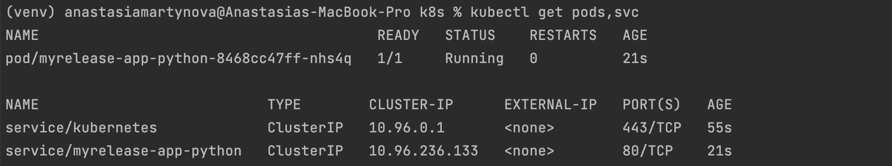
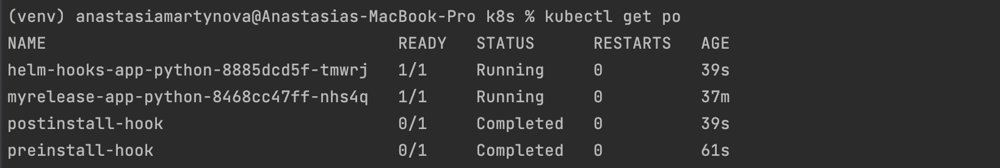

## Helm Setup and Chart Creation

```bash
kubectl get pods,svc
```


## Helm Chart Hooks

```bash
kubectl get po
```


#### Output of ```kubectl describe po preinstall-hook``` command

```
(venv) anastasiamartynova@Anastasias-MacBook-Pro k8s % kubectl describe po preinstall-hook                          
Name:             preinstall-hook
Namespace:        default
Priority:         0
Service Account:  default
Node:             minikube/192.168.49.2
Start Time:       Mon, 08 Apr 2024 15:30:41 +0300
Labels:           <none>
Annotations:      helm.sh/hook: pre-install
Status:           Succeeded
IP:               10.244.0.8
IPs:
  IP:  10.244.0.8
Containers:
  pre-install-container:
    Container ID:  docker://f19b0c99f0ef58f8667c07a2a746beb136b5f01feb66a89f80488691cd75948d
    Image:         busybox
    Image ID:      docker-pullable://busybox@sha256:c3839dd800b9eb7603340509769c43e146a74c63dca3045a8e7dc8ee07e53966
    Port:          <none>
    Host Port:     <none>
    Command:
      sh
      -c
      echo The pre-install hook is running && sleep 20
    State:          Terminated
      Reason:       Completed
      Exit Code:    0
      Started:      Mon, 08 Apr 2024 15:30:41 +0300
      Finished:     Mon, 08 Apr 2024 15:31:01 +0300
    Ready:          False
    Restart Count:  0
    Environment:    <none>
    Mounts:
      /var/run/secrets/kubernetes.io/serviceaccount from kube-api-access-llcm7 (ro)
Conditions:
  Type              Status
  Initialized       True 
  Ready             False 
  ContainersReady   False 
  PodScheduled      True 
Volumes:
  kube-api-access-llcm7:
    Type:                    Projected (a volume that contains injected data from multiple sources)
    TokenExpirationSeconds:  3607
    ConfigMapName:           kube-root-ca.crt
    ConfigMapOptional:       <nil>
    DownwardAPI:             true
QoS Class:                   BestEffort
Node-Selectors:              <none>
Tolerations:                 node.kubernetes.io/not-ready:NoExecute op=Exists for 300s
                             node.kubernetes.io/unreachable:NoExecute op=Exists for 300s
Events:
  Type    Reason     Age   From               Message
  ----    ------     ----  ----               -------
  Normal  Scheduled  4m3s  default-scheduler  Successfully assigned default/preinstall-hook to minikube
  Normal  Pulled     4m3s  kubelet            Container image "busybox" already present on machine
  Normal  Created    4m3s  kubelet            Created container pre-install-container
  Normal  Started    4m3s  kubelet            Started container pre-install-container

```


#### Output of ```kubectl describe po postinstall-hook``` command

```
(venv) anastasiamartynova@Anastasias-MacBook-Pro k8s % kubectl describe po postinstall-hook 
Name:             postinstall-hook
Namespace:        default
Priority:         0
Service Account:  default
Node:             minikube/192.168.49.2
Start Time:       Mon, 08 Apr 2024 15:31:03 +0300
Labels:           <none>
Annotations:      helm.sh/hook: post-install
Status:           Succeeded
IP:               10.244.0.10
IPs:
  IP:  10.244.0.10
Containers:
  post-install-container:
    Container ID:  docker://bba164c18bcf77fd07998ac5f29db8ea3cfa861cf707251a090f4df1444f8184
    Image:         busybox
    Image ID:      docker-pullable://busybox@sha256:c3839dd800b9eb7603340509769c43e146a74c63dca3045a8e7dc8ee07e53966
    Port:          <none>
    Host Port:     <none>
    Command:
      sh
      -c
      echo The post-install hook is running && sleep 15
    State:          Terminated
      Reason:       Completed
      Exit Code:    0
      Started:      Mon, 08 Apr 2024 15:31:06 +0300
      Finished:     Mon, 08 Apr 2024 15:31:21 +0300
    Ready:          False
    Restart Count:  0
    Environment:    <none>
    Mounts:
      /var/run/secrets/kubernetes.io/serviceaccount from kube-api-access-d5f7s (ro)
Conditions:
  Type              Status
  Initialized       True 
  Ready             False 
  ContainersReady   False 
  PodScheduled      True 
Volumes:
  kube-api-access-d5f7s:
    Type:                    Projected (a volume that contains injected data from multiple sources)
    TokenExpirationSeconds:  3607
    ConfigMapName:           kube-root-ca.crt
    ConfigMapOptional:       <nil>
    DownwardAPI:             true
QoS Class:                   BestEffort
Node-Selectors:              <none>
Tolerations:                 node.kubernetes.io/not-ready:NoExecute op=Exists for 300s
                             node.kubernetes.io/unreachable:NoExecute op=Exists for 300s
Events:
  Type    Reason     Age    From               Message
  ----    ------     ----   ----               -------
  Normal  Scheduled  5m21s  default-scheduler  Successfully assigned default/postinstall-hook to minikube
  Normal  Pulling    5m20s  kubelet            Pulling image "busybox"
  Normal  Pulled     5m18s  kubelet            Successfully pulled image "busybox" in 2.337s (2.337s including waiting)
  Normal  Created    5m18s  kubelet            Created container post-install-container
  Normal  Started    5m18s  kubelet            Started container post-install-container

```

