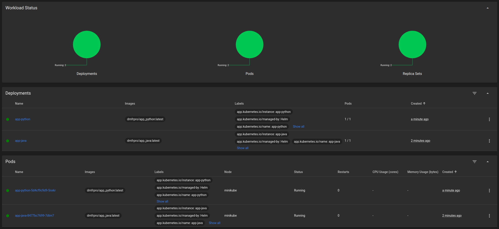

# HELM

## Deploy app-python and app-java

Deploy both apps:

```bash
$ helm create app-python
$ helm create app-java

$ helm install app-python app-python
NAME: app-python
LAST DEPLOYED: Mon Apr  8 18:40:48 2024
NAMESPACE: default
STATUS: deployed
REVISION: 1
NOTES:
1. Get the application URL by running these commands:
  export NODE_PORT=$(kubectl get --namespace default -o jsonpath="{.spec.ports[0].nodePort}" services app-python)
  export NODE_IP=$(kubectl get nodes --namespace default -o jsonpath="{.items[0].status.addresses[0].address}")
  echo http://$NODE_IP:$NODE_PORT

$ helm install app-java app-java
NAME: app-java
LAST DEPLOYED: Mon Apr  8 18:40:39 2024
NAMESPACE: default
STATUS: deployed
REVISION: 1
NOTES:
1. Get the application URL by running these commands:
  export NODE_PORT=$(kubectl get --namespace default -o jsonpath="{.spec.ports[0].nodePort}" services app-java)
  export NODE_IP=$(kubectl get nodes --namespace default -o jsonpath="{.items[0].status.addresses[0].address}")
  echo http://$NODE_IP:$NODE_PORT

$ kubectl get pods,svc
NAME                              READY   STATUS    RESTARTS   AGE
pod/app-java-8477bc7699-7dtm7     1/1     Running   0          52s
pod/app-python-5d4cf9c9d9-5nxkr   1/1     Running   0          43s

NAME                 TYPE        CLUSTER-IP      EXTERNAL-IP   PORT(S)          AGE
service/app-java     NodePort    10.105.193.24   <none>        8080:30758/TCP   52s
service/app-python   NodePort    10.106.119.99   <none>        8080:31852/TCP   43s
service/kubernetes   ClusterIP   10.96.0.1       <none>        443/TCP          34m
```

Validate:

```bash
$ minikube service --all
|-----------|----------|-------------|---------------------------|
| NAMESPACE |   NAME   | TARGET PORT |            URL            |
|-----------|----------|-------------|---------------------------|
| default   | app-java | http/8080   | http://192.168.49.2:30758 |
|-----------|----------|-------------|---------------------------|
|-----------|------------|-------------|---------------------------|
| NAMESPACE |    NAME    | TARGET PORT |            URL            |
|-----------|------------|-------------|---------------------------|
| default   | app-python | http/8080   | http://192.168.49.2:31852 |
|-----------|------------|-------------|---------------------------|
|-----------|------------|-------------|--------------|
| NAMESPACE |    NAME    | TARGET PORT |     URL      |
|-----------|------------|-------------|--------------|
| default   | kubernetes |             | No node port |
|-----------|------------|-------------|--------------|
😿  service default/kubernetes has no node port
🎉  Opening service default/app-java in default browser...
🎉  Opening service default/app-python in default browser...

$ curl http://192.168.49.2:31852
<!DOCTYPE html>
<html>
<head>
    <title>Current Time in Moscow</title>
</head>
<body>
    <h1>Current Time in Moscow:</h1>
    <p>2024-04-08 18:47:58.837736+03:00</p>
</body>

$ curl http://192.168.49.2:30758
<!DOCTYPE html>
<html>
<head>
    <title>Current Time in Samara</title>
</head>
<body>
<h1>Current Time in Samara:</h1>
<p>2024-04-08 19:48:25</p>
</body>
</html>
```

Minikube dashboard:

```bash
$ minikube dashboard
🔌  Enabling dashboard ...
    ▪ Using image docker.io/kubernetesui/metrics-scraper:v1.0.8
    ▪ Using image docker.io/kubernetesui/dashboard:v2.7.0
💡  Some dashboard features require the metrics-server addon. To enable all features please run:

        minikube addons enable metrics-server


🤔  Verifying dashboard health ...
🚀  Launching proxy ...
🤔  Verifying proxy health ...
🎉  Opening http://127.0.0.1:43067/api/v1/namespaces/kubernetes-dashboard/services/http:kubernetes-dashboard:/proxy/ in your default browser...
```



## Helm Chart Hooks

Dry-run install:

```bash
$ helm install --dry-run helm-hooks app-java
NAME: helm-hooks
LAST DEPLOYED: Mon Apr  8 19:37:21 2024
NAMESPACE: default
STATUS: pending-install
REVISION: 1
HOOKS:
---
# Source: app-java/templates/post-install-hook.yaml
apiVersion: v1
kind: Pod
metadata:
   name: postinstall-hook
   annotations:
       "helm.sh/hook": "post-install"
       "helm.sh/hook-delete-policy": hook-succeeded
spec:
  containers:
  - name: post-install-container
    image: busybox
    imagePullPolicy: Always
    command: ['sh', '-c', 'echo The post-install hook is running && sleep 15' ]
  restartPolicy: Never
  terminationGracePeriodSeconds: 0
---
# Source: app-java/templates/pre-install-hook.yaml
apiVersion: v1
kind: Pod
metadata:
   name: preinstall-hook
   annotations:
       "helm.sh/hook": "pre-install"
       "helm.sh/hook-delete-policy": hook-succeeded
spec:
  containers:
  - name: pre-install-container
    image: busybox
    imagePullPolicy: IfNotPresent
    command: ['sh', '-c', 'echo The pre-install hook is running && sleep 20' ]
  restartPolicy: Never
  terminationGracePeriodSeconds: 0
---
...  # Truncated


$ helm install --dry-run helm-hooks app-python
NAME: helm-hooks
LAST DEPLOYED: Mon Apr  8 19:38:43 2024
NAMESPACE: default
STATUS: pending-install
REVISION: 1
HOOKS:
---
# Source: app-python/templates/post-install-hook.yaml
apiVersion: v1
kind: Pod
metadata:
   name: postinstall-hook
   annotations:
       "helm.sh/hook": "post-install"
       "helm.sh/hook-delete-policy": hook-succeeded
spec:
  containers:
  - name: post-install-container
    image: busybox
    imagePullPolicy: Always
    command: ['sh', '-c', 'echo The post-install hook is running && sleep 15' ]
  restartPolicy: Never
  terminationGracePeriodSeconds: 0
---
# Source: app-python/templates/pre-install-hook.yaml
apiVersion: v1
kind: Pod
metadata:
   name: preinstall-hook
   annotations:
       "helm.sh/hook": "pre-install"
       "helm.sh/hook-delete-policy": hook-succeeded
spec:
  containers:
  - name: pre-install-container
    image: busybox
    imagePullPolicy: IfNotPresent
    command: ['sh', '-c', 'echo The pre-install hook is running && sleep 20' ]
  restartPolicy: Never
  terminationGracePeriodSeconds: 0
---
... # Truncated
```

Verify without delete policy:

```bash
$ kubectl get po
NAME                                    READY   STATUS      RESTARTS   AGE
app-java-8477bc7699-7dtm7               1/1     Running     0          50m
helm-hooks-app-python-cbb669676-68bsl   1/1     Running     0          41s
postinstall-hook                        0/1     Completed   0          41s
preinstall-hook                         0/1     Completed   0          64s

$ kubectl describe po preinstall-hook
Name:             preinstall-hook
Namespace:        default
Priority:         0
Service Account:  default
Node:             minikube/192.168.49.2
Start Time:       Mon, 08 Apr 2024 19:30:06 +0300
Labels:           <none>
Annotations:      helm.sh/hook: pre-install
Status:           Succeeded
IP:               10.244.0.25
IPs:
  IP:  10.244.0.25
Containers:
  pre-install-container:
    Container ID:  docker://9c3835d15b663c85538325b9caf260cd681ec33d362951f0164ee23558d2404d
    Image:         busybox
    Image ID:      docker-pullable://busybox@sha256:c3839dd800b9eb7603340509769c43e146a74c63dca3045a8e7dc8ee07e53966
    Port:          <none>
    Host Port:     <none>
    Command:
      sh
      -c
      echo The pre-install hook is running && sleep 20
    State:          Terminated
      Reason:       Completed
      Exit Code:    0
      Started:      Mon, 08 Apr 2024 19:30:07 +0300
      Finished:     Mon, 08 Apr 2024 19:30:27 +0300
    Ready:          False
    Restart Count:  0
    Environment:    <none>
    Mounts:
      /var/run/secrets/kubernetes.io/serviceaccount from kube-api-access-w2sl7 (ro)
Conditions:
  Type              Status
  Initialized       True 
  Ready             False 
  ContainersReady   False 
  PodScheduled      True 
Volumes:
  kube-api-access-w2sl7:
    Type:                    Projected (a volume that contains injected data from multiple sources)
    TokenExpirationSeconds:  3607
    ConfigMapName:           kube-root-ca.crt
    ConfigMapOptional:       <nil>
    DownwardAPI:             true
QoS Class:                   BestEffort
Node-Selectors:              <none>
Tolerations:                 node.kubernetes.io/not-ready:NoExecute op=Exists for 300s
                             node.kubernetes.io/unreachable:NoExecute op=Exists for 300s
Events:
  Type    Reason     Age   From               Message
  ----    ------     ----  ----               -------
  Normal  Scheduled  81s   default-scheduler  Successfully assigned default/preinstall-hook to minikube
  Normal  Pulled     81s   kubelet            Container image "busybox" already present on machine
  Normal  Created    81s   kubelet            Created container pre-install-container
  Normal  Started    80s   kubelet            Started container pre-install-container

$ kubectl describe po postinstall-hook
Name:             postinstall-hook
Namespace:        default
Priority:         0
Service Account:  default
Node:             minikube/192.168.49.2
Start Time:       Mon, 08 Apr 2024 19:30:29 +0300
Labels:           <none>
Annotations:      helm.sh/hook: post-install
Status:           Succeeded
IP:               10.244.0.27
IPs:
  IP:  10.244.0.27
Containers:
  post-install-container:
    Container ID:  docker://787a1ea149cdf22c91876db71d99d60c548842f702ee36ba5b6db9c9d0fcacd8
    Image:         busybox
    Image ID:      docker-pullable://busybox@sha256:c3839dd800b9eb7603340509769c43e146a74c63dca3045a8e7dc8ee07e53966
    Port:          <none>
    Host Port:     <none>
    Command:
      sh
      -c
      echo The post-install hook is running && sleep 15
    State:          Terminated
      Reason:       Completed
      Exit Code:    0
      Started:      Mon, 08 Apr 2024 19:30:31 +0300
      Finished:     Mon, 08 Apr 2024 19:30:46 +0300
    Ready:          False
    Restart Count:  0
    Environment:    <none>
    Mounts:
      /var/run/secrets/kubernetes.io/serviceaccount from kube-api-access-6pffd (ro)
Conditions:
  Type              Status
  Initialized       True 
  Ready             False 
  ContainersReady   False 
  PodScheduled      True 
Volumes:
  kube-api-access-6pffd:
    Type:                    Projected (a volume that contains injected data from multiple sources)
    TokenExpirationSeconds:  3607
    ConfigMapName:           kube-root-ca.crt
    ConfigMapOptional:       <nil>
    DownwardAPI:             true
QoS Class:                   BestEffort
Node-Selectors:              <none>
Tolerations:                 node.kubernetes.io/not-ready:NoExecute op=Exists for 300s
                             node.kubernetes.io/unreachable:NoExecute op=Exists for 300s
Events:
  Type    Reason     Age   From               Message
  ----    ------     ----  ----               -------
  Normal  Scheduled  110s  default-scheduler  Successfully assigned default/postinstall-hook to minikube
  Normal  Pulling    110s  kubelet            Pulling image "busybox"
  Normal  Pulled     108s  kubelet            Successfully pulled image "busybox" in 1.961s (1.961s including waiting)
  Normal  Created    108s  kubelet            Created container post-install-container
  Normal  Started    108s  kubelet            Started container post-install-container
```

Install with delete policy and validate:

```bash
$ helm upgrade --install helm-hooks app-java
Release "helm-hooks" has been upgraded. Happy Helming!
NAME: helm-hooks
LAST DEPLOYED: Mon Apr  8 19:45:48 2024
NAMESPACE: default
STATUS: deployed
REVISION: 4
NOTES:
1. Get the application URL by running these commands:
  export NODE_PORT=$(kubectl get --namespace default -o jsonpath="{.spec.ports[0].nodePort}" services helm-hooks-app-java)
  export NODE_IP=$(kubectl get nodes --namespace default -o jsonpath="{.items[0].status.addresses[0].address}")
  echo http://$NODE_IP:$NODE_PORT

# Note that only one application is running with delete policy
$ kubectl get svc,pods
NAME                                     READY   STATUS    RESTARTS   AGE
pod/helm-hooks-app-java-996d5644-6qn82   0/1     Running   0          2s

NAME                          TYPE        CLUSTER-IP      EXTERNAL-IP   PORT(S)          AGE
service/helm-hooks-app-java   NodePort    10.107.36.171   <none>        8080:31530/TCP   2s
service/kubernetes            ClusterIP   10.96.0.1       <none>        443/TCP          99m

$ helm upgrade --install helm-hooks app-python
Release "helm-hooks" has been upgraded. Happy Helming!
NAME: helm-hooks
LAST DEPLOYED: Mon Apr  8 19:47:19 2024
NAMESPACE: default
STATUS: deployed
REVISION: 5
NOTES:
1. Get the application URL by running these commands:
  export NODE_PORT=$(kubectl get --namespace default -o jsonpath="{.spec.ports[0].nodePort}" services helm-hooks-app-python)
  export NODE_IP=$(kubectl get nodes --namespace default -o jsonpath="{.items[0].status.addresses[0].address}")
  echo http://$NODE_IP:$NODE_PORT

# Note that only one application is running with delete policy
$ kubectl get svc,pods
NAME                                        READY   STATUS    RESTARTS   AGE
pod/helm-hooks-app-python-cbb669676-gdjx9   1/1     Running   0          38s

NAME                            TYPE        CLUSTER-IP       EXTERNAL-IP   PORT(S)          AGE
service/helm-hooks-app-python   NodePort    10.105.189.219   <none>        8080:32389/TCP   38s
service/kubernetes              ClusterIP   10.96.0.1        <none>        443/TCP          101m
```

## Library chart

Update dependencies:

```bash
$ helm dependency update app-python
Saving 1 charts
Deleting outdated charts

$ helm dependency update app-java
Saving 1 charts
Deleting outdated charts
```

Install:

```bash
$ helm install app-python-library app-python
NAME: app-python-library
LAST DEPLOYED: Mon Apr  8 21:05:45 2024
NAMESPACE: default
STATUS: deployed
REVISION: 1
NOTES:
1. Get the application URL by running these commands:
  export NODE_PORT=$(kubectl get --namespace default -o jsonpath="{.spec.ports[0].nodePort}" services app-python-library)
  export NODE_IP=$(kubectl get nodes --namespace default -o jsonpath="{.items[0].status.addresses[0].address}")
  echo http://$NODE_IP:$NODE_PORT

$ helm install app-java-library app-java
NAME: app-java-library
LAST DEPLOYED: Mon Apr  8 21:07:01 2024
NAMESPACE: default
STATUS: deployed
REVISION: 1
NOTES:
1. Get the application URL by running these commands:
  export NODE_PORT=$(kubectl get --namespace default -o jsonpath="{.spec.ports[0].nodePort}" services app-java-library)
  export NODE_IP=$(kubectl get nodes --namespace default -o jsonpath="{.items[0].status.addresses[0].address}")
  echo http://$NODE_IP:$NODE_PORT
```

Validate:

```bash
$ kubectl get svc,pods
NAME                            TYPE        CLUSTER-IP       EXTERNAL-IP   PORT(S)          AGE
service/app-java-library        NodePort    10.107.253.43    <none>        8080:31797/TCP   32s
service/app-python-library      NodePort    10.101.234.223   <none>        8080:30680/TCP   108s
service/helm-hooks-app-python   NodePort    10.105.189.219   <none>        8080:32389/TCP   80m
service/kubernetes              ClusterIP   10.96.0.1        <none>        443/TCP          3h1m

NAME                                        READY   STATUS    RESTARTS   AGE
pod/app-java-library-68bf8b9454-2tq75       1/1     Running   0          32s
pod/app-python-library-6cfbbb9596-ntv8s     1/1     Running   0          108s
pod/helm-hooks-app-python-cbb669676-gdjx9   1/1     Running   0          80m
```
