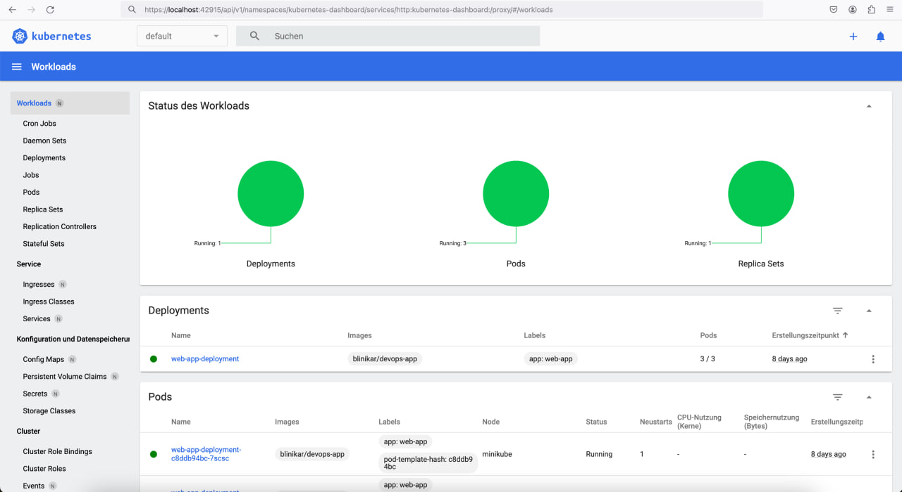

# Helm

## Helm intro

```
helm install app-python k8s
NAME: app-python
LAST DEPLOYED: Mon Apr  8 13:54:14 2024
NAMESPACE: default
STATUS: deployed
REVISION: 1
TEST SUITE: None
```



```
minikube service web-app-service
|-----------|-----------------|-------------|---------------------------|
| NAMESPACE |      NAME       | TARGET PORT |            URL            |
|-----------|-----------------|-------------|---------------------------|
| default   | web-app-service |        5000 | http://192.168.49.2:31540 |
|-----------|-----------------|-------------|---------------------------|
🎉  Opening service default/web-app-service in default browser...
👉  http://192.168.49.2:31540
```

```
kubectl get pods,svc
NAME                                     READY   STATUS    RESTARTS      AGE
pod/web-app-deployment-c8ddb94bc-7scsc   1/1     Running   2 (75s ago)   8d
pod/web-app-deployment-c8ddb94bc-qdq8p   1/1     Running   2 (75s ago)   8d
pod/web-app-deployment-c8ddb94bc-wvqgl   1/1     Running   2 (75s ago)   8d

NAME                      TYPE           CLUSTER-IP       EXTERNAL-IP   PORT(S)          AGE
service/kubernetes        ClusterIP      10.96.0.1        <none>        443/TCP          8d
service/web-app-service   LoadBalancer   10.110.153.226   <pending>     5000:31540/TCP   8d
```

## Helm hooks

Lint:

```
==> Linting app-python/

1 chart(s) linted, 0 chart(s) failed
```

```
helm install --dry-run helm-hooks ./k8s/
NAME: helm-hooks
LAST DEPLOYED: Mon Apr  8 16:06:14 2024
NAMESPACE: default
STATUS: pending-install
REVISION: 1
HOOKS:
---
# Source: app-python/templates/post-install-hook.yaml
apiVersion: v1
kind: Pod
metadata:
  name: postinstall-hook
  annotations:
    "helm.sh/hook": "post-install"
    "helm.sh/hook-delete-policy": hook-succeeded
spec:
  containers:
  - name: post-install-container
    image: busybox
    imagePullPolicy: Always
    command: ['sh', '-c', 'echo The post-install hook is running && sleep 15']
  restartPolicy: Never
  terminationGracePeriodSeconds: 0
---
# Source: app-python/templates/pre-install-hook.yaml
apiVersion: v1
kind: Pod
metadata:
  name: preinstall-hook
  annotations:
    "helm.sh/hook": "pre-install"
    "helm.sh/hook-delete-policy": hook-succeeded
spec:
  containers:
  - name: pre-install-container
    image: busybox
    imagePullPolicy: IfNotPresent
    command: ['sh', '-c', 'echo The pre-install hook is running && sleep 20']
  restartPolicy: Never
  terminationGracePeriodSeconds: 0
---
....
```

```
kubectl get po
NAME                                     READY   STATUS      RESTARTS   AGE
helm-hooks-app-python-gnjh124ni-hnmeod   1/1     Running     0          5m36s
postinstall-hook                         0/1     Completed   0          5m36s
preinstall-hook                          0/1     Completed   0          7m3s

$ kubectl describe po preinstall-hook
Name:             preinstall-hook
Namespace:        default
Priority:         0
Service Account:  default
Node:             minikube/192.168.49.1
Start Time:       Mon, 08 Apr 2024 19:12:35 +0300
Labels:           <none>
Annotations:      helm.sh/hook: pre-install
Status:           Succeeded
IP:               10.244.0.8
IPs:
IP:  10.244.0.8
Containers:
pre-install-container:
    Container ID:  docker://d9c8c9c7b6b413a9989e7d0360e2332fbe65aa125fa5d3fb5e42b1759fdf2e17
    Image:         busybox
    Image ID:      docker-pullable://busybox@sha256:1d7f33a6d87c359d3615508670c763d8aa3c49e7f3feb778e0364446b74fd33e
    Port:          <none>
    Host Port:     <none>
    Command:
    sh
    -c
    echo The pre-install hook is running && sleep 20
    State:          Terminated
    Reason:       Completed
    Exit Code:    0
    Started:      Mon, 08 Apr 2024 19:12:35 +0300
    Finished:     Mon, 08 Apr 2024 19:12:35 +0300
    Ready:          False
    Restart Count:  0
    Environment:    <none>
    Mounts:
    /var/run/secrets/kubernetes.io/serviceaccount from kube-api-access-5z5qm (ro)
Conditions:
Type              Status
Initialized       True 
Ready             False 
ContainersReady   False 
PodScheduled      True 
Volumes:
kube-api-access-5z5qm:
    Type:                    Projected (a volume that contains injected data from multiple sources)
    TokenExpirationSeconds:  3607
    ConfigMapName:           kube-root-ca.crt
    ConfigMapOptional:       <nil>
    DownwardAPI:             true
QoS Class:                   BestEffort
Node-Selectors:              <none>
Tolerations:                 node.kubernetes.io/not-ready:NoExecute op=Exists for 300s
                            node.kubernetes.io/unreachable:NoExecute op=Exists for 300s
Events:
Type     Reason     Age                   From               Message
----     ------     ----                  ----               -------
Normal   Scheduled  7m10s                 default-scheduler  Successfully assigned default/preinstall-hook to minikube
Warning  Failed     6m53s                 kubelet            Failed to pull image "busybox": Error response from daemon: Head "https://registry-1.docker.io/v2/library/busybox/manifests/latest": Get "https://auth.docker.io/token?scope=repository%3Alibrary%2Fbusybox%3Apull&service=registry.docker.io": context deadline exceeded (Client.Timeout exceeded while awaiting headers)
Normal   Pulling    6m40s (x2 over 7m9s)  kubelet            Pulling image "busybox"
Normal   Pulled     6m5s                  kubelet            Successfully pulled image "busybox" in 35.012s (35.012s including waiting)
Normal   Created    6m5s                  kubelet            Created container pre-install-container
Normal   Started    6m5s                  kubelet            Started container pre-install-container

$ kubectl describe po postinstall-hook
Name:             postinstall-hook
Namespace:        default
Priority:         0
Service Account:  default
Node:             minikube/192.168.49.1
Start Time:       Mon, 08 Apr 2024 19:12:35 +0300
Labels:           <none>
Annotations:      helm.sh/hook: post-install
Status:           Succeeded
IP:               10.244.0.10
IPs:
IP:  10.244.0.10
Containers:
post-install-container:
    Container ID:  docker://d9c8c9c7b6b413a9989e7d0360e2332fbe65aa125fa5d3fb5e42b1759fdf2e17
    Image:         busybox
    Image ID:      docker-pullable://busybox@sha256:1d7f33a6d87c359d3615508670c763d8aa3c49e7f3feb778e0364446b74fd33e
    Port:          <none>
    Host Port:     <none>
    Command:
    sh
    -c
    echo The post-install hook is running && sleep 15
    State:          Terminated
    Reason:       Completed
    Exit Code:    0
    Started:      Mon, 08 Apr 2024 19:13:24 +0300
    Finished:     Mon, 08 Apr 2024 19:13:24 +0300
    Ready:          False
    Restart Count:  0
    Environment:    <none>
    Mounts:
    /var/run/secrets/kubernetes.io/serviceaccount from kube-api-access-fcnkf (ro)
Conditions:
Type              Status
Initialized       True 
Ready             False 
ContainersReady   False 
PodScheduled      True 
Volumes:
kube-api-access-fcnkf:
    Type:                    Projected (a volume that contains injected data from multiple sources)
    TokenExpirationSeconds:  3607
    ConfigMapName:           kube-root-ca.crt
    ConfigMapOptional:       <nil>
    DownwardAPI:             true
QoS Class:                   BestEffort
Node-Selectors:              <none>
Tolerations:                 node.kubernetes.io/not-ready:NoExecute op=Exists for 300s
                            node.kubernetes.io/unreachable:NoExecute op=Exists for 300s
Events:
Type    Reason     Age    From               Message
----    ------     ----   ----               -------
Normal  Scheduled  5m47s  default-scheduler  Successfully assigned default/postinstall-hook to minikube
Normal  Pulling    5m46s  kubelet            Pulling image "busybox"
Normal  Pulled     5m31s  kubelet            Successfully pulled image "busybox" in 14.47s (14.47s including waiting)
Normal  Created    5m31s  kubelet            Created container post-install-container
Normal  Started    5m31s  kubelet            Started container post-install-container
```

```
$ kubectl get pods,svc
NAME                                                       READY   STATUS    RESTARTS   AGE
pod/hooks-with-delete-policy-app-python-5f8d6745bc-9pv4b   1/1     Running   0          15s
```

## Helm library

```
helm install app-python-library ./k8s
NAME: app-python-library
LAST DEPLOYED: Mon Apr  8 14:45:26 2024
NAMESPACE: default
STATUS: deployed
REVISION: 1
TEST SUITE: None
```

```
kubectl get pods,svc
NAME                                     READY   STATUS    RESTARTS        AGE
pod/web-app-deployment-c8ddb94bc-7scsc   1/1     Running   2 (8m17s ago)   8d
pod/web-app-deployment-c8ddb94bc-qdq8p   1/1     Running   2 (8m17s ago)   8d
pod/web-app-deployment-c8ddb94bc-wvqgl   1/1     Running   2 (8m17s ago)   8d

NAME                      TYPE           CLUSTER-IP       EXTERNAL-IP   PORT(S)          AGE
service/kubernetes        ClusterIP      10.96.0.1        <none>        443/TCP          8d
service/web-app-service   LoadBalancer   10.110.153.226   <pending>     5000:31540/TCP   8d
```