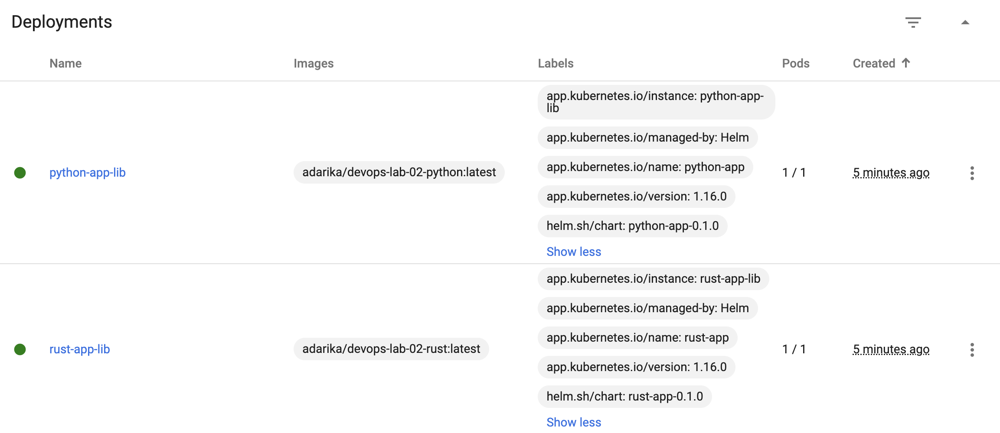

## Deploy via helm

- `helm create python-app`
some magic in `values.yaml` with repository and tag fields: replace to my web-app image

- `helm install python-app python-app`

```
NAME: python-app
LAST DEPLOYED: Sun Apr  7 22:01:26 2024
NAMESPACE: default
STATUS: deployed
REVISION: 1
NOTES:
1. Get the application URL by running these commands:
  export POD_NAME=$(kubectl get pods --namespace default -l "app.kubernetes.io/name=python-app,app.kubernetes.io/instance=python-app" -o jsonpath="{.items[0].metadata.name}")
  export CONTAINER_PORT=$(kubectl get pod --namespace default $POD_NAME -o jsonpath="{.spec.containers[0].ports[0].containerPort}")
  echo "Visit http://127.0.0.1:8080 to use your application"
  kubectl --namespace default port-forward $POD_NAME 8080:$CONTAINER_PORT
```

- `kubectl get pods,svc`
```
NAME                              READY   STATUS    RESTARTS   AGE
pod/python-app-6f8f87f9b6-ctl6v   1/1     Running   0          32s

NAME                 TYPE        CLUSTER-IP       EXTERNAL-IP   PORT(S)    AGE
service/kubernetes   ClusterIP   10.96.0.1        <none>        443/TCP    46s
service/python-app   ClusterIP   10.110.152.252   <none>        8000/TCP   35s
```

## Helm chart hooks

- `kubectl get po`

without hook delete policy `"helm.sh/hook-delete-policy": hook-succeeded`

```
NAME                          READY   STATUS      RESTARTS   AGE
postinstall-hook              0/1     Completed   0          28s
preinstall-hook               0/1     Completed   0          41s
python-app-6f8f87f9b6-g8xsx   1/1     Running     0          28s
```

- `kubectl describe po preinstall-hook `
```
Name:         preinstall-hook
Namespace:    default
Priority:     0
Node:         minikube/192.168.49.2
Start Time:   Sun, 07 Apr 2024 23:47:38 +0300
Labels:       <none>
Annotations:  helm.sh/hook: pre-install
Status:       Succeeded
IP:           10.244.0.6
IPs:
  IP:  10.244.0.6
Containers:
  pre-install-container:
    Container ID:  docker://80a281300d0053f0eba46736f97e26359752f56bc8c4130a6e195f2b09700c3b
    Image:         busybox
    Image ID:      docker-pullable://busybox@sha256:c3839dd800b9eb7603340509769c43e146a74c63dca3045a8e7dc8ee07e53966
    Port:          <none>
    Host Port:     <none>
    Command:
      sh
      -c
      echo pre-install hook is running! && sleep 10
    State:          Terminated
      Reason:       Completed
      Exit Code:    0
      Started:      Sun, 07 Apr 2024 23:47:39 +0300
      Finished:     Sun, 07 Apr 2024 23:47:49 +0300
    Ready:          False
    Restart Count:  0
    Environment:    <none>
    Mounts:
      /var/run/secrets/kubernetes.io/serviceaccount from kube-api-access-clkph (ro)
Conditions:
  Type              Status
  Initialized       True 
  Ready             False 
  ContainersReady   False 
  PodScheduled      True 
Volumes:
  kube-api-access-clkph:
    Type:                    Projected (a volume that contains injected data from multiple sources)
    TokenExpirationSeconds:  3607
    ConfigMapName:           kube-root-ca.crt
    ConfigMapOptional:       <nil>
    DownwardAPI:             true
QoS Class:                   BestEffort
Node-Selectors:              <none>
Tolerations:                 node.kubernetes.io/not-ready:NoExecute op=Exists for 300s
                             node.kubernetes.io/unreachable:NoExecute op=Exists for 300s
Events:
  Type    Reason     Age   From               Message
  ----    ------     ----  ----               -------
  Normal  Scheduled  114s  default-scheduler  Successfully assigned default/preinstall-hook to minikube
  Normal  Pulled     113s  kubelet            Container image "busybox" already present on machine
  Normal  Created    113s  kubelet            Created container pre-install-container
  Normal  Started    113s  kubelet            Started container pre-install-container
```

- `kubectl describe po postinstall-hook`
```
Name:         postinstall-hook
Namespace:    default
Priority:     0
Node:         minikube/192.168.49.2
Start Time:   Sun, 07 Apr 2024 23:47:51 +0300
Labels:       <none>
Annotations:  helm.sh/hook: post-install
Status:       Succeeded
IP:           10.244.0.8
IPs:
  IP:  10.244.0.8
Containers:
  post-install-container:
    Container ID:  docker://bd535d4016c470b2fb2dc1186fdadcd74c8edbedd85c98172b413a50b35ab42b
    Image:         busybox
    Image ID:      docker-pullable://busybox@sha256:c3839dd800b9eb7603340509769c43e146a74c63dca3045a8e7dc8ee07e53966
    Port:          <none>
    Host Port:     <none>
    Command:
      sh
      -c
      echo post-install hook is running!! && sleep 20
    State:          Terminated
      Reason:       Completed
      Exit Code:    0
      Started:      Sun, 07 Apr 2024 23:47:55 +0300
      Finished:     Sun, 07 Apr 2024 23:48:15 +0300
    Ready:          False
    Restart Count:  0
    Environment:    <none>
    Mounts:
      /var/run/secrets/kubernetes.io/serviceaccount from kube-api-access-858qr (ro)
Conditions:
  Type              Status
  Initialized       True 
  Ready             False 
  ContainersReady   False 
  PodScheduled      True 
Volumes:
  kube-api-access-858qr:
    Type:                    Projected (a volume that contains injected data from multiple sources)
    TokenExpirationSeconds:  3607
    ConfigMapName:           kube-root-ca.crt
    ConfigMapOptional:       <nil>
    DownwardAPI:             true
QoS Class:                   BestEffort
Node-Selectors:              <none>
Tolerations:                 node.kubernetes.io/not-ready:NoExecute op=Exists for 300s
                             node.kubernetes.io/unreachable:NoExecute op=Exists for 300s
Events:
  Type    Reason     Age    From               Message
  ----    ------     ----   ----               -------
  Normal  Scheduled  2m46s  default-scheduler  Successfully assigned default/postinstall-hook to minikube
  Normal  Pulling    2m46s  kubelet            Pulling image "busybox"
  Normal  Pulled     2m42s  kubelet            Successfully pulled image "busybox" in 3.065s (3.065s including waiting)
  Normal  Created    2m42s  kubelet            Created container post-install-container
  Normal  Started    2m42s  kubelet            Started container post-install-container
```

### Helm library chart

I've provided detailed installation output only for `rust-app` (extra app)

- `helm dependency update rust-app`
```
Saving 1 charts
Deleting outdated charts
```

- `helm install rust-app-lib rust-app`

```
NAME: rust-app-lib
LAST DEPLOYED: Mon Apr  8 00:23:04 2024
NAMESPACE: default
STATUS: deployed
REVISION: 1
NOTES:
1. Get the application URL by running these commands:
  export POD_NAME=$(kubectl get pods --namespace default -l "app.kubernetes.io/name=rust-app,app.kubernetes.io/instance=rust-app-lib" -o jsonpath="{.items[0].metadata.name}")
  export CONTAINER_PORT=$(kubectl get pod --namespace default $POD_NAME -o jsonpath="{.spec.containers[0].ports[0].containerPort}")
  echo "Visit http://127.0.0.1:8080 to use your application"
  kubectl --namespace default port-forward $POD_NAME 8080:$CONTAINER_PORT
```

- `kubectl get pods,svc`

```
NAME                                 READY   STATUS    RESTARTS   AGE
pod/python-app-lib-97f5cd49b-lh429   1/1     Running   0          43s
pod/rust-app-lib-66b7db6bdd-5sl7b    1/1     Running   0          6s

NAME                     TYPE        CLUSTER-IP      EXTERNAL-IP   PORT(S)          AGE
service/kubernetes       ClusterIP   10.96.0.1       <none>        443/TCP          65m
service/python-app-lib   NodePort    10.97.250.202   <none>        8000:32135/TCP   43s
service/rust-app-lib     NodePort    10.99.69.234    <none>        8000:30538/TCP   6s
```

- check labels in `minikube dashboard`

