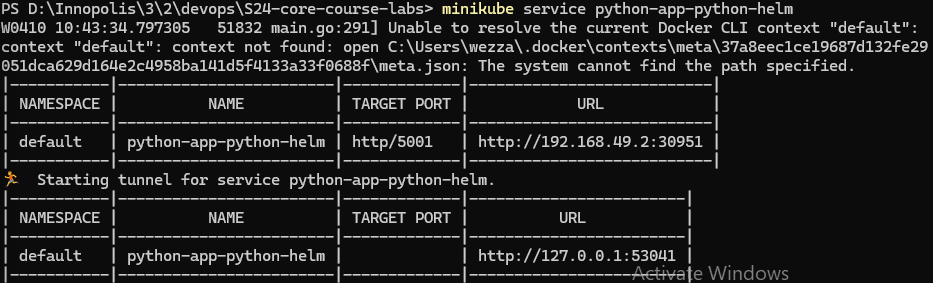
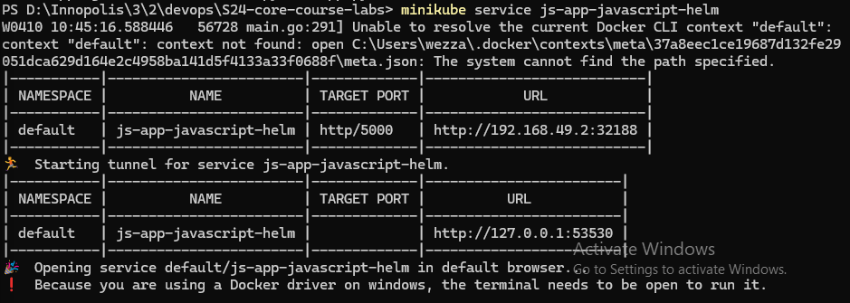
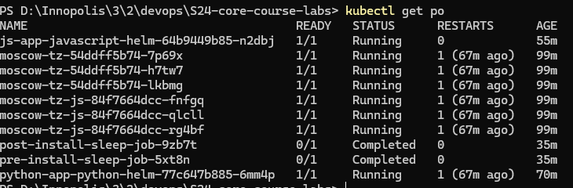
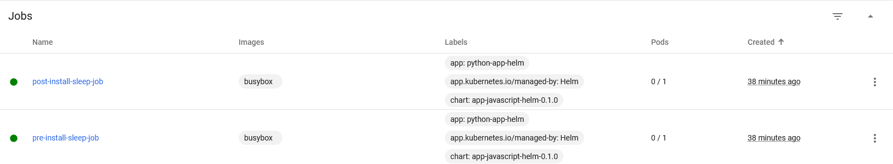
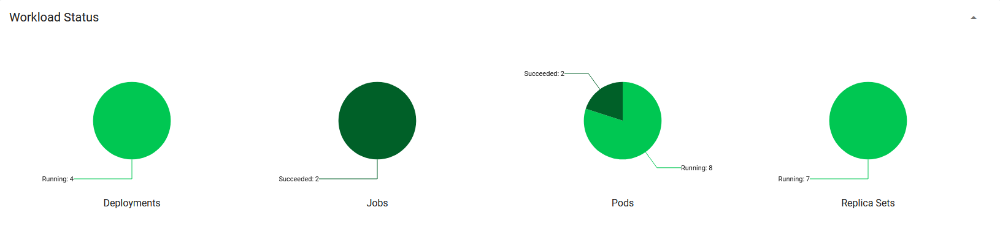

# Lab 10: Introduction to Helm

## Task 1: Helm Setup and Chart Creation

1. Install Helm:
   1.1 Install Helm by following the instructions provided in the [Helm Installation Guide](https://helm.sh/docs/intro/install/).

   1.2 Initialize the Chart repository using the following commands:

   ```shell
   helm repo add stable https://charts.helm.sh/stable
   helm repo update
   ```

2. Create Your Own Helm Chart:

   2.1 Generate a Helm chart template for your application:

   ```shell
   helm create app_python_helm
   helm create app_javascript_helm
   ```

   2.2 Modify the `values.yaml` file to set the default values for your application. `image name`, `image tag`, and `service port`.

   2.3 Modify the `templates` directory to include the necessary Kubernetes resources for your application.

   2.4 Use `minikube dashboard` for monitoring and troubleshooting with the Kubernetes dashboard.

## Install Helm Chart

1. Install the Helm chart using the following command:

```shell
helm install python ./app_python_helm
helm install js ./app_javascript_helm
```




## Task 2: Helm Chart Hooks

1.  Create a new file called `post-install-sleep.yaml` in the `templates` directory:

    ```yaml
    apiVersion: batch/v1
    kind: Job
    metadata:
    name: post-install-sleep-job
    labels:
    app: python-app-helm
    chart: {{ .Chart.Name }}-{{ .Chart.Version | replace "+" "_" }}
    annotations:
    "helm.sh/hook-delete-policy": hook-succeeded # Add this annotation
    spec:
    template:
    metadata:
    name: post-install-sleep-pod
    labels:
    app: js-app-javascript-helm
    chart: {{ .Chart.Name }}-{{ .Chart.Version | replace "+" "_" }}
    spec:
    containers: - name: sleep-container
    image: busybox
    command: ["sleep", "20"]
    restartPolicy: OnFailure
    ```

2.  Create a new file called `pre-install-sleep.yaml` in the `templates` directory:

```yaml
apiVersion: batch/v1
kind: Job
metadata:
  name: pre-install-sleep-job
  labels:
    app: python-app-helm
    chart: {{ .Chart.Name }}-{{ .Chart.Version | replace "+" "_" }}
  annotations:
    "helm.sh/hook-delete-policy": hook-succeeded  # Add this annotation
spec:
  template:
    metadata:
      name: pre-install-sleep-pod
      labels:
        app: js-app-javascript-helm
        chart: {{ .Chart.Name }}-{{ .Chart.Version | replace "+" "_" }}
    spec:
      containers:
        - name: sleep-container
          image: busybox
          command: ["sleep", "20"]
      restartPolicy: OnFailure
```

3. Lint the Helm chart to ensure that the syntax is correct:

```shell
helm lint ./app_python_helm
helm lint ./app_javascript_helm
```

4. Install the Helm chart using the following command:

```shell
helm install python ./app_python_helm
helm install js ./app_javascript_helm
```

5. Verify that the `pre-install-sleep-job` and `post-install-sleep-job` jobs are created:

```shell
kubectl get po
```



```shell
$ kubectl describe po post-install-sleep-job-9zb7t

Name:             post-install-sleep-job-9zb7t
Namespace:        default
Priority:         0
Service Account:  default
Node:             minikube/192.168.49.2
Start Time:       Wed, 10 Apr 2024 10:15:34 +0300
Labels:           app=js-app-javascript-helm
                  batch.kubernetes.io/controller-uid=b37b4786-3803-40cb-9ac1-f1b4ee305800
                  batch.kubernetes.io/job-name=post-install-sleep-job
                  chart=app-javascript-helm-0.1.0
                  controller-uid=b37b4786-3803-40cb-9ac1-f1b4ee305800
                  job-name=post-install-sleep-job
Annotations:      <none>
Status:           Succeeded
IP:               10.244.0.31
IPs:
  IP:           10.244.0.31
Controlled By:  Job/post-install-sleep-job
Containers:
  sleep-container:
    Container ID:  docker://2af6f5256c624712f36cfbb1b806f92083bf5c2397d900ee0bcd6c24501dea14
    Image:         busybox
    Image ID:      docker-pullable://busybox@sha256:c3839dd800b9eb7603340509769c43e146a74c63dca3045a8e7dc8ee07e53966
    Port:          <none>
    Host Port:     <none>
    Command:
      sleep
      20
    State:          Terminated
      Reason:       Completed
      Exit Code:    0
      Started:      Wed, 10 Apr 2024 10:15:39 +0300
      Finished:     Wed, 10 Apr 2024 10:15:59 +0300
    Ready:          False
    Restart Count:  0
    Environment:    <none>
    Mounts:
      /var/run/secrets/kubernetes.io/serviceaccount from kube-api-access-jhx79 (ro)
Conditions:
  Type              Status
  Initialized       True
  Ready             False
  ContainersReady   False
  PodScheduled      True
Volumes:
  kube-api-access-jhx79:
    Type:                    Projected (a volume that contains injected data from multiple sources)
    TokenExpirationSeconds:  3607
    ConfigMapName:           kube-root-ca.crt
    ConfigMapOptional:       <nil>
    DownwardAPI:             true
QoS Class:                   BestEffort
Node-Selectors:              <none>
Tolerations:                 node.kubernetes.io/not-ready:NoExecute op=Exists for 300s
                             node.kubernetes.io/unreachable:NoExecute op=Exists for 300s
Events:
  Type    Reason     Age   From               Message
  ----    ------     ----  ----               -------
  Normal  Scheduled  36m   default-scheduler  Successfully assigned default/post-install-sleep-job-9zb7t to minikube
  Normal  Pulling    36m   kubelet            Pulling image "busybox"
  Normal  Pulled     36m   kubelet            Successfully pulled image "busybox" in 4.18s (4.181s including waiting)
  Normal  Created    36m   kubelet            Created container sleep-container
  Normal  Started    36m   kubelet            Started container sleep-container
```

```shell
$ kubectl describe po pre-install-sleep-job-5xt8n

Name:             pre-install-sleep-job-5xt8n
Namespace:        default
Priority:         0
Service Account:  default
Node:             minikube/192.168.49.2
Start Time:       Wed, 10 Apr 2024 10:15:34 +0300
Labels:           app=js-app-javascript-helm
                  batch.kubernetes.io/controller-uid=9efc406f-3b9a-4fac-85a0-dbfd64c8a3b6
                  batch.kubernetes.io/job-name=pre-install-sleep-job
                  chart=app-javascript-helm-0.1.0
                  controller-uid=9efc406f-3b9a-4fac-85a0-dbfd64c8a3b6
                  job-name=pre-install-sleep-job
Annotations:      <none>
Status:           Succeeded
IP:               10.244.0.32
IPs:
  IP:           10.244.0.32
Controlled By:  Job/pre-install-sleep-job
Containers:
  sleep-container:
    Container ID:  docker://390eaef8af203aeb8502bbc263b6c49c2db73a533d2bedccb55c14fd58f4b547
    Image:         busybox
    Image ID:      docker-pullable://busybox@sha256:c3839dd800b9eb7603340509769c43e146a74c63dca3045a8e7dc8ee07e53966
    Port:          <none>
    Host Port:     <none>
    Command:
      sleep
      20
    State:          Terminated
      Reason:       Completed
      Exit Code:    0
      Started:      Wed, 10 Apr 2024 10:15:40 +0300
      Finished:     Wed, 10 Apr 2024 10:16:00 +0300
    Ready:          False
    Restart Count:  0
    Environment:    <none>
    Mounts:
      /var/run/secrets/kubernetes.io/serviceaccount from kube-api-access-x4qzl (ro)
Conditions:
  Type              Status
  Initialized       True
  Ready             False
  ContainersReady   False
  PodScheduled      True
Volumes:
  kube-api-access-x4qzl:
    Type:                    Projected (a volume that contains injected data from multiple sources)
    TokenExpirationSeconds:  3607
    ConfigMapName:           kube-root-ca.crt
    ConfigMapOptional:       <nil>
    DownwardAPI:             true
QoS Class:                   BestEffort
Node-Selectors:              <none>
Tolerations:                 node.kubernetes.io/not-ready:NoExecute op=Exists for 300s
                             node.kubernetes.io/unreachable:NoExecute op=Exists for 300s
Events:
  Type    Reason     Age   From               Message
  ----    ------     ----  ----               -------
  Normal  Scheduled  37m   default-scheduler  Successfully assigned default/pre-install-sleep-job-5xt8n to minikube
  Normal  Pulling    37m   kubelet            Pulling image "busybox"
  Normal  Pulled     37m   kubelet            Successfully pulled image "busybox" in 1.504s (5.685s including waiting)
  Normal  Created    37m   kubelet            Created container sleep-container
  Normal  Started    37m   kubelet            Started container sleep-container

```



- output of get pod, svc
  

- Workloads
  

# Bonus Task: Helm Library Chart

1. Prepare a Helm chart for an additional application.

- Done review the previous tasks.

2. Create a Library Chart:
