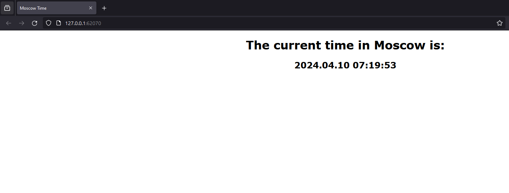
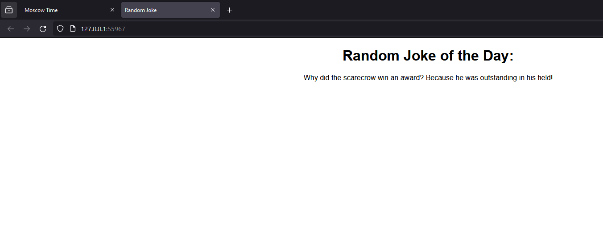
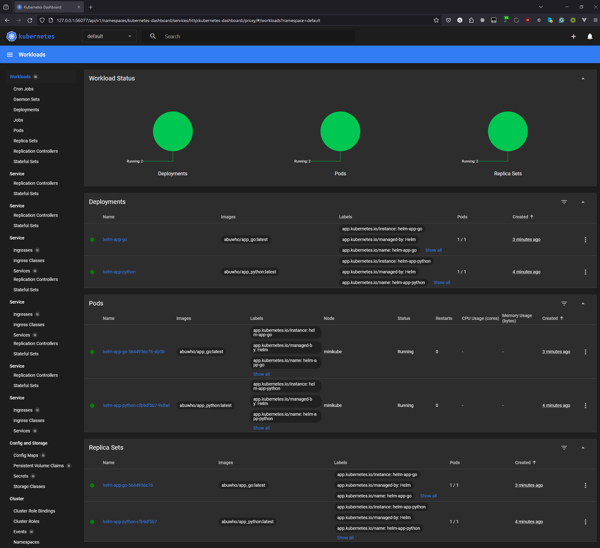

# HELM

### Task 1

- Creating Helm instances
    ```bash
    $ helm create helm-app-python
    Creating helm-app-go
    ```
    ```bash
    $ helm create helm-app-go
    Creating helm-app-go
    ```


- `helm install`
    ```bash
    $ helm install helm-app-python helm-app-python/ --values helm-app-python/values.yaml
    NAME: helm-app-python
    LAST DEPLOYED: Wed Apr 10 07:19:05 2024
    NAMESPACE: default
    STATUS: deployed
    REVISION: 1
    NOTES:
    1. Get the application URL by running these commands:
    export POD_NAME=$(kubectl get pods --namespace default -l "app.kubernetes.io/name=helm-app-python,app.kubernetes.io/instance=helm-app-python" -o jsonpath="{.items[0].metadata.name}")
    export CONTAINER_PORT=$(kubectl get pod --namespace default $POD_NAME -o jsonpath="{.spec.containers[0].ports[0].containerPort}")
    echo "Visit http://127.0.0.1:8080 to use your application"
    kubectl --namespace default port-forward $POD_NAME 8080:$CONTAINER_PORT
    ```

    ```bash
    $ helm install helm-app-go helm-app-go/ --values helm-app-go/values.yaml
    NAME: helm-app-go
    LAST DEPLOYED: Wed Apr 10 07:19:30 2024
    NAMESPACE: default
    STATUS: deployed
    REVISION: 1
    NOTES:
    1. Get the application URL by running these commands:
    export POD_NAME=$(kubectl get pods --namespace default -l "app.kubernetes.io/name=helm-app-go,app.kubernetes.io/instance=helm-app-go" -o jsonpath="{.items[0].metadata.name}")     
    export CONTAINER_PORT=$(kubectl get pod --namespace default $POD_NAME -o jsonpath="{.spec.containers[0].ports[0].containerPort}")
    echo "Visit http://127.0.0.1:8080 to use your application"
    kubectl --namespace default port-forward $POD_NAME 8080:$CONTAINER_PORT
    ```

- Running the service:
    ```bash
    $ minikube service helm-app-python
    W0410 07:19:49.894711   18636 main.go:291] Unable to resolve the current Docker CLI context "default": context "default": context not found: open C:\Users\Admin\.docker\contexts\meta\37a8eec1ce19687d132fe29051dca629d164e2c4958ba141d5f4133a33f0688f\meta.json: The system cannot find the path specified.
    |-----------|-----------------|-------------|--------------|
    | NAMESPACE |      NAME       | TARGET PORT |     URL      |
    |-----------|-----------------|-------------|--------------|
    | default   | helm-app-python |             | No node port |
    |-----------|-----------------|-------------|--------------|
    😿  service default/helm-app-python has no node port
    🏃  Starting tunnel for service helm-app-python.
    |-----------|-----------------|-------------|------------------------|
    | NAMESPACE |      NAME       | TARGET PORT |          URL           |
    |-----------|-----------------|-------------|------------------------|
    | default   | helm-app-python |             | http://127.0.0.1:62070 |
    |-----------|-----------------|-------------|------------------------|
    🎉  Opening service default/helm-app-python in default browser...
    ❗  Because you are using a Docker driver on windows, the terminal needs to be open to run it.
    ```

    

    ```bash
    $ minikube service helm-app-go
    W0410 07:21:28.636901   26488 main.go:291] Unable to resolve the current Docker CLI context "default": context "default": context not found: open C:\Users\Admin\.docker\contexts\meta\37a8eec1ce19687d132fe29051dca629d164e2c4958ba141d5f4133a33f0688f\meta.json: The system cannot find the path specified.
    |-----------|-------------|-------------|--------------|
    | NAMESPACE |    NAME     | TARGET PORT |     URL      |
    |-----------|-------------|-------------|--------------|
    | default   | helm-app-go |             | No node port |
    |-----------|-------------|-------------|--------------|
    😿  service default/helm-app-go has no node port
    🏃  Starting tunnel for service helm-app-go.
    |-----------|-------------|-------------|------------------------|
    | NAMESPACE |    NAME     | TARGET PORT |          URL           |
    |-----------|-------------|-------------|------------------------|
    | default   | helm-app-go |             | http://127.0.0.1:55967 |
    |-----------|-------------|-------------|------------------------|
    🎉  Opening service default/helm-app-go in default browser...
    ❗  Because you are using a Docker driver on windows, the terminal needs to be open to run it.
    ```

    


- `kubectl get pods,svc`
    ```bash
    $ kubectl get pods,svc
    NAME                                  READY   STATUS    RESTARTS   AGE
    pod/helm-app-go-5644956c76-xlp5b      1/1     Running   0          3m33s
    pod/helm-app-python-cfb9df5b7-9x8wl   1/1     Running   0          3m58s

    NAME                      TYPE        CLUSTER-IP       EXTERNAL-IP   PORT(S)   AGE
    service/helm-app-go       ClusterIP   10.108.234.189   <none>        80/TCP    3m33s
    service/helm-app-python   ClusterIP   10.111.96.65     <none>        80/TCP    3m58s
    service/kubernetes        ClusterIP   10.96.0.1        <none>        443/TCP   6d23h
    ```

- `minikube dashboard`
    ```bash
    $ minikube dashboard
    W0410 07:23:22.313264     348 main.go:291] Unable to resolve the current Docker CLI context "default": context "default": context not found: open C:\Users\Admin\.docker\contexts\meta\37a8eec1ce19687d132fe29051dca629d164e2c4958ba141d5f4133a33f0688f\meta.json: The system cannot find the path specified.
    🤔  Verifying dashboard health ...
    🚀  Launching proxy ...
    🤔  Verifying proxy health ...
    🎉  Opening http://127.0.0.1:56077/api/v1/namespaces/kubernetes-dashboard/services/http:kubernetes-dashboard:/proxy/ in your default browser...
    ```
    


### Task 2

- `kubectl get po`
    ```bash
    $ kubectl get po
    NAME                              READY   STATUS      RESTARTS   AGE
    helm-app-go-5644956c76-b984p      1/1     Running     0          30s
    helm-app-python-cfb9df5b7-pw8qg   1/1     Running     0          95s
    postinstall-hook                  0/1     Completed   0          30s
    preinstall-hook                   0/1     Completed   0          52s
    ```

- `kubectl describe po preinstall-hook`
    ```bash
    $ kubectl describe po preinstall-hook
    Name:             preinstall-hook
    Namespace:        default
    Priority:         0
    Service Account:  default
    Node:             minikube/192.168.49.2
    Start Time:       Wed, 10 Apr 2024 07:38:18 +0300
    Labels:           <none>
    Annotations:      helm.sh/hook: pre-install
    Status:           Succeeded
    IP:               10.244.0.26
    IPs:
    IP:  10.244.0.26
    Containers:
    pre-install-container:
        Container ID:  docker://d249e771044f5398f3b62d7463325f1ca95df2442b9eedd83030d7a553d88684
        Image:         busybox
        Image ID:      docker-pullable://busybox@sha256:c3839dd800b9eb7603340509769c43e146a74c63dca3045a8e7dc8ee07e53966
        Port:          <none>
        Host Port:     <none>
        Command:
        sh
        -c
        echo The pre-install hook is running && sleep 20
        State:          Terminated
        Reason:       Completed
        Exit Code:    0
        Started:      Wed, 10 Apr 2024 07:38:18 +0300
        Finished:     Wed, 10 Apr 2024 07:38:38 +0300
        Ready:          False
        Restart Count:  0
        Environment:    <none>
        Mounts:
        /var/run/secrets/kubernetes.io/serviceaccount from kube-api-access-v94rv (ro)
    Conditions:
    Type              Status
    Initialized       True
    Ready             False
    ContainersReady   False
    PodScheduled      True
    Volumes:
    kube-api-access-v94rv:
        Type:                    Projected (a volume that contains injected data from multiple sources)
        TokenExpirationSeconds:  3607
        ConfigMapName:           kube-root-ca.crt
        ConfigMapOptional:       <nil>
        DownwardAPI:             true
    QoS Class:                   BestEffort
    Node-Selectors:              <none>
    Tolerations:                 node.kubernetes.io/not-ready:NoExecute op=Exists for 300s
                                node.kubernetes.io/unreachable:NoExecute op=Exists for 300s
    Events:
    Type    Reason     Age    From               Message
    ----    ------     ----   ----               -------
    Normal  Scheduled  3m39s  default-scheduler  Successfully assigned default/preinstall-hook to minikube
    Normal  Pulled     3m39s  kubelet            Container image "busybox" already present on machine
    Normal  Created    3m39s  kubelet            Created container pre-install-container
    Normal  Started    3m39s  kubelet            Started container pre-install-container
    ```

- `kubectl describe po postinstall-hook`
    ```bash
    $ kubectl describe po postinstall-hook
    Name:             postinstall-hook
    Namespace:        default
    Priority:         0
    Service Account:  default
    Node:             minikube/192.168.49.2
    Start Time:       Wed, 10 Apr 2024 07:38:40 +0300
    Labels:           <none>
    Annotations:      helm.sh/hook: post-install
    Status:           Succeeded
    IP:               10.244.0.28
    IPs:
    IP:  10.244.0.28
    Containers:
    post-install-container:
        Container ID:  docker://a0125e2d6c1cdbd8007fbc549cce8ac9b794777f03fe0020a69b3a4cf0c55861
        Image:         busybox
        Image ID:      docker-pullable://busybox@sha256:c3839dd800b9eb7603340509769c43e146a74c63dca3045a8e7dc8ee07e53966
        Port:          <none>
        Host Port:     <none>
        Command:
        sh
        -c
        echo The post-install hook is running && sleep 15
        State:          Terminated
        Reason:       Completed
        Exit Code:    0
        Started:      Wed, 10 Apr 2024 07:38:43 +0300
        Finished:     Wed, 10 Apr 2024 07:38:58 +0300
        Ready:          False
        Restart Count:  0
        Environment:    <none>
        Mounts:
        /var/run/secrets/kubernetes.io/serviceaccount from kube-api-access-27rvn (ro)
    Conditions:
    Type              Status
    Initialized       True
    Ready             False
    ContainersReady   False
    PodScheduled      True
    Volumes:
    kube-api-access-27rvn:
        Type:                    Projected (a volume that contains injected data from multiple sources)
        TokenExpirationSeconds:  3607
        ConfigMapName:           kube-root-ca.crt
        ConfigMapOptional:       <nil>
        DownwardAPI:             true
    QoS Class:                   BestEffort
    Node-Selectors:              <none>
    Tolerations:                 node.kubernetes.io/not-ready:NoExecute op=Exists for 300s
                                node.kubernetes.io/unreachable:NoExecute op=Exists for 300s
    Events:
    Type    Reason     Age    From               Message
    ----    ------     ----   ----               -------
    Normal  Scheduled  4m13s  default-scheduler  Successfully assigned default/postinstall-hook to minikube
    Normal  Pulling    4m12s  kubelet            Pulling image "busybox"
    Normal  Pulled     4m10s  kubelet            Successfully pulled image "busybox" in 2.172s (2.172s including waiting)
    Normal  Created    4m10s  kubelet            Created container post-install-container
    Normal  Started    4m10s  kubelet            Started container post-install-container
    ```
