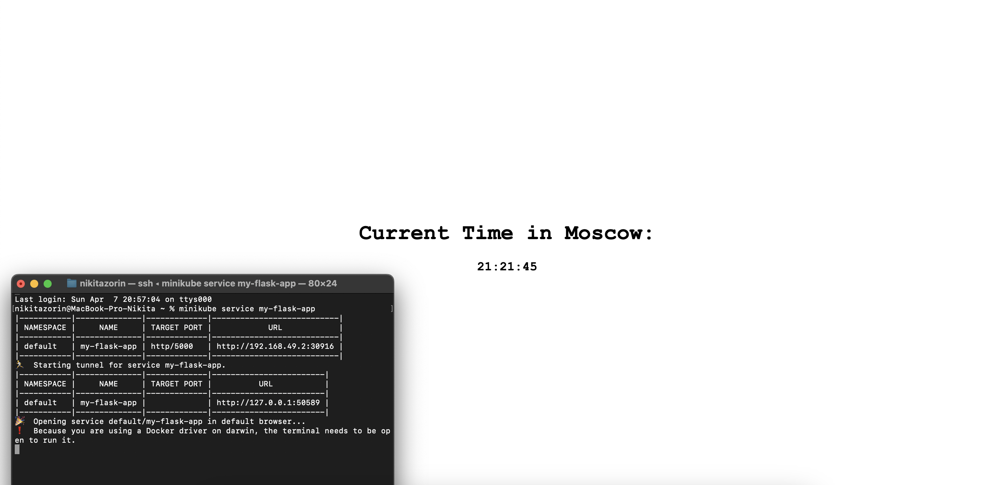
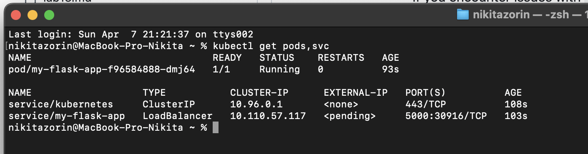
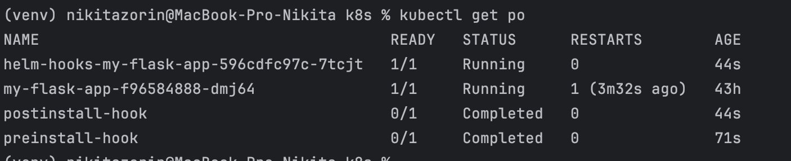
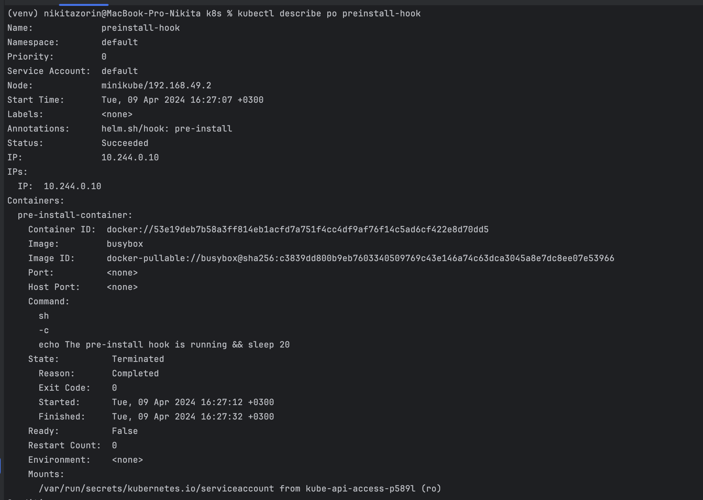
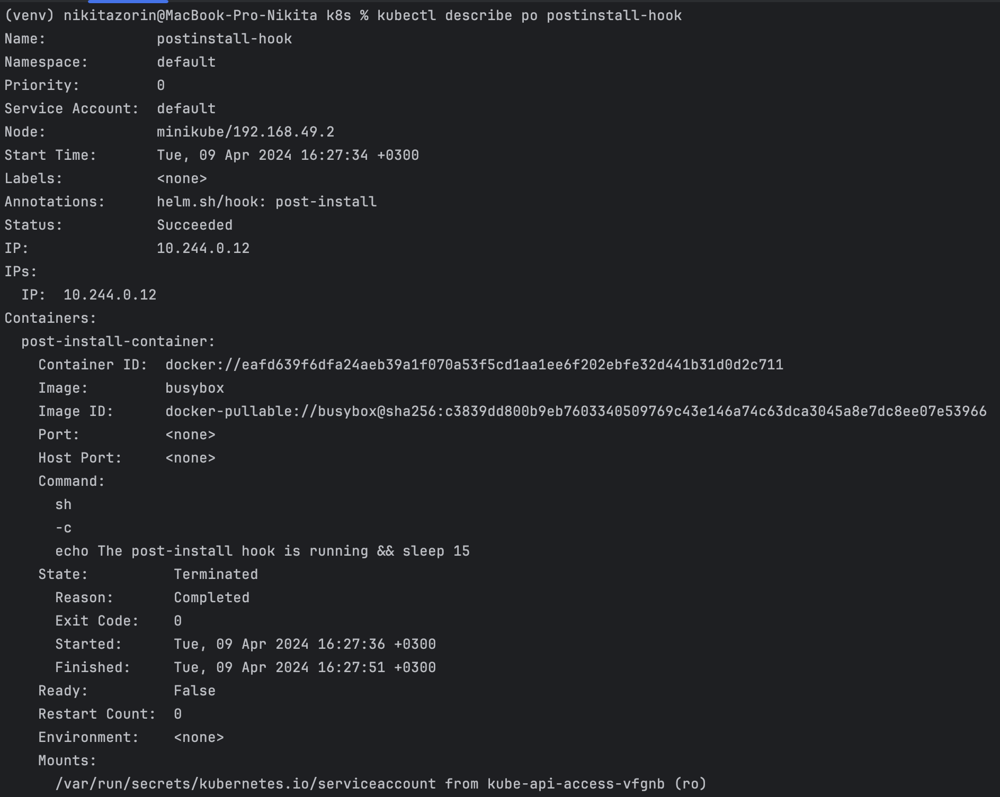

# HELM Lab 10

## Task 1

```bash
minikube dashboard
```

```bash
minikube service my-flask-app
```

```bash
kubectl get pods,svc
```


## Task 2
```bash
kubectl get po
```

```bash
kubectl describe po preinstall-hook
```

```bash
kubectl describe po postinstall-hook
```
