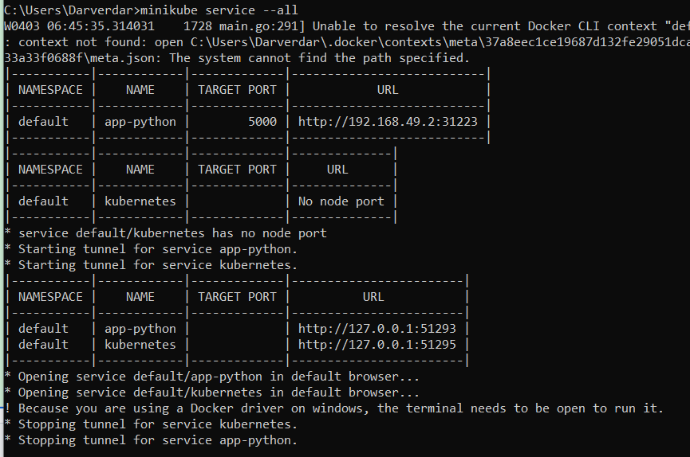

## Install Helm Chart

```console
$ helm install moscowtime-web moscowtime-web
NAME: moscowtime-web
LAST DEPLOYED: Mon Apr  8 21:04:25 2024
NAMESPACE: default
STATUS: deployed
REVISION: 1
NOTES:
1. Get the application URL by running these commands:
  export POD_NAME=$(kubectl get pods --namespace default -l "app.kubernetes.io/name=moscowtime-web,app.kubernetes.io/instance=moscowtime-web" -o jsonpath="{.items[0].metadata.name}")
  export CONTAINER_PORT=$(kubectl get pod --namespace default $POD_NAME -o jsonpath="{.spec.containers[0].ports[0].containerPort}")
  echo "Visit http://127.0.0.1:8080 to use your application"
  kubectl --namespace default port-forward $POD_NAME 8080:$CONTAINER_PORT
```



We can see that it is deployed successfully (I'll not show the screenshot of the browser as for this assignment this is not required)
```
$ minikube service moscowtime-web
|-----------|----------------|-------------|--------------|
| NAMESPACE |      NAME      | TARGET PORT |     URL      |
|-----------|----------------|-------------|--------------|
| default   | moscowtime-web |             | No node port |
|-----------|----------------|-------------|--------------|
😿  service default/moscowtime-web has no node port
🏃  Starting tunnel for service moscowtime-web.
|-----------|----------------|-------------|------------------------|
| NAMESPACE |      NAME      | TARGET PORT |          URL           |
|-----------|----------------|-------------|------------------------|
| default   | moscowtime-web |             | http://127.0.0.1:35351 |
|-----------|----------------|-------------|------------------------|
🎉  Opening service default/moscowtime-web in default browser...
👉  http://127.0.0.1:35351
❗  Because you are using a Docker driver on linux, the terminal needs to be open to run it.
```

```console
$ kubectl get pods,svc
NAME                                 READY   STATUS    RESTARTS   AGE
pod/moscowtime-web-fb88cdbbb-r79z8   1/1     Running   0          8m43s

NAME                     TYPE        CLUSTER-IP      EXTERNAL-IP   PORT(S)    AGE
service/kubernetes       ClusterIP   10.96.0.1       <none>        443/TCP    5d22h
service/moscowtime-web   ClusterIP   10.109.60.194   <none>        8080/TCP   8m43s
```

## Hooks

```console
$ helm lint moscowtime-web/
==> Linting moscowtime-web/
[INFO] Chart.yaml: icon is recommended

1 chart(s) linted, 0 chart(s) failed
```

```console
$ helm install --dry-run helm-hooks moscowtime-web
NAME: helm-hooks
LAST DEPLOYED: Mon Apr  8 21:39:11 2024
NAMESPACE: default
STATUS: pending-install
REVISION: 1
HOOKS:
---
# Source: moscowtime-web/templates/post-install-hook.yaml
apiVersion: v1
kind: Pod
metadata:
  name: post-install-hook
  annotations:
    "helm.sh/hook": "post-install"
    "helm.sh/hook-delete-policy": hook-succeeded
spec:
  containers:
  - name: post-install-container
    image: busybox
    imagePullPolicy: Always
    command: ['sh', '-c', 'echo The post-install hook is running && sleep 20']
  restartPolicy: Never
  terminationGracePeriodSeconds: 0
---
# Source: moscowtime-web/templates/pre-install-hook.yaml
apiVersion: v1
kind: Pod
metadata:
  name: pre-install-hook
  annotations:
    "helm.sh/hook": "pre-install"
    "helm.sh/hook-delete-policy": hook-succeeded
spec:
  containers:
  - name: pre-install-container
    image: busybox
    imagePullPolicy: IfNotPresent
    command: ['sh', '-c', 'echo The pre-install hook is running && sleep 20']
  restartPolicy: Never
  terminationGracePeriodSeconds: 0
---
# Source: moscowtime-web/templates/tests/test-connection.yaml
apiVersion: v1
kind: Pod
metadata:
  name: "helm-hooks-moscowtime-web-test-connection"
  labels:
    helm.sh/chart: moscowtime-web-0.1.0
    app.kubernetes.io/name: moscowtime-web
    app.kubernetes.io/instance: helm-hooks
    app.kubernetes.io/version: "1.16.0"
    app.kubernetes.io/managed-by: Helm
  annotations:
    "helm.sh/hook": test
spec:
  containers:
    - name: wget
      image: busybox
      command: ['wget']
      args: ['helm-hooks-moscowtime-web:8080']
  restartPolicy: Never
MANIFEST:
---
# Source: moscowtime-web/templates/serviceaccount.yaml
apiVersion: v1
kind: ServiceAccount
metadata:
  name: helm-hooks-moscowtime-web
  labels:
    helm.sh/chart: moscowtime-web-0.1.0
    app.kubernetes.io/name: moscowtime-web
    app.kubernetes.io/instance: helm-hooks
    app.kubernetes.io/version: "1.16.0"
    app.kubernetes.io/managed-by: Helm
automountServiceAccountToken: true
---
# Source: moscowtime-web/templates/service.yaml
apiVersion: v1
kind: Service
metadata:
  name: helm-hooks-moscowtime-web
  labels:
    helm.sh/chart: moscowtime-web-0.1.0
    app.kubernetes.io/name: moscowtime-web
    app.kubernetes.io/instance: helm-hooks
    app.kubernetes.io/version: "1.16.0"
    app.kubernetes.io/managed-by: Helm
spec:
  type: ClusterIP
  ports:
    - port: 8080
      targetPort: http
      protocol: TCP
      name: http
  selector:
    app.kubernetes.io/name: moscowtime-web
    app.kubernetes.io/instance: helm-hooks
---
# Source: moscowtime-web/templates/deployment.yaml
apiVersion: apps/v1
kind: Deployment
metadata:
  name: helm-hooks-moscowtime-web
  labels:
    helm.sh/chart: moscowtime-web-0.1.0
    app.kubernetes.io/name: moscowtime-web
    app.kubernetes.io/instance: helm-hooks
    app.kubernetes.io/version: "1.16.0"
    app.kubernetes.io/managed-by: Helm
spec:
  replicas: 1
  selector:
    matchLabels:
      app.kubernetes.io/name: moscowtime-web
      app.kubernetes.io/instance: helm-hooks
  template:
    metadata:
      labels:
        helm.sh/chart: moscowtime-web-0.1.0
        app.kubernetes.io/name: moscowtime-web
        app.kubernetes.io/instance: helm-hooks
        app.kubernetes.io/version: "1.16.0"
        app.kubernetes.io/managed-by: Helm
    spec:
      serviceAccountName: helm-hooks-moscowtime-web
      securityContext:
        {}
      containers:
        - name: moscowtime-web
          securityContext:
            {}
          image: "nabuki/moscowtime-web:latest"
          imagePullPolicy: IfNotPresent
          ports:
            - name: http
              containerPort: 8080
              protocol: TCP
          livenessProbe:
            httpGet:
              path: /
              port: http
          readinessProbe:
            httpGet:
              path: /
              port: http
          resources:
            {}

NOTES:
1. Get the application URL by running these commands:
  export POD_NAME=$(kubectl get pods --namespace default -l "app.kubernetes.io/name=moscowtime-web,app.kubernetes.io/instance=helm-hooks" -o jsonpath="{.items[0].metadata.name}")
  export CONTAINER_PORT=$(kubectl get pod --namespace default $POD_NAME -o jsonpath="{.spec.containers[0].ports[0].containerPort}")
  echo "Visit http://127.0.0.1:8080 to use your application"
  kubectl --namespace default port-forward $POD_NAME 8080:$CONTAINER_PORT
```

```console
$ helm install helm-hooks moscowtime-web
NAME: helm-hooks
LAST DEPLOYED: Mon Apr  8 22:07:59 2024
NAMESPACE: default
STATUS: deployed
REVISION: 1
NOTES:
1. Get the application URL by running these commands:
  export POD_NAME=$(kubectl get pods --namespace default -l "app.kubernetes.io/name=moscowtime-web,app.kubernetes.io/instance=helm-hooks" -o jsonpath="{.items[0].metadata.name}")
  export CONTAINER_PORT=$(kubectl get pod --namespace default $POD_NAME -o jsonpath="{.spec.containers[0].ports[0].containerPort}")
  echo "Visit http://127.0.0.1:8080 to use your application"
  kubectl --namespace default port-forward $POD_NAME 8080:$CONTAINER_PORT
```

Before preinstall finished:

```console
$ kubectl get po
NAME               READY   STATUS    RESTARTS   AGE
pre-install-hook   1/1     Running   0          3s
```

```console
$ kubectl describe po pre-install-hook
Name:             pre-install-hook
Namespace:        default
Priority:         0
Service Account:  default
Node:             minikube/192.168.49.2
Start Time:       Mon, 08 Apr 2024 22:07:59 +0300
Labels:           <none>
Annotations:      helm.sh/hook: pre-install
                  helm.sh/hook-delete-policy: hook-succeeded
Status:           Running
IP:               10.244.0.27
IPs:
  IP:  10.244.0.27
Containers:
  pre-install-container:
    Container ID:  docker://f7c1b2041ae4c640e5dfff3cc928a807641067130ae0e9fb169dd0430d96f6f8
    Image:         busybox
    Image ID:      docker-pullable://busybox@sha256:c3839dd800b9eb7603340509769c43e146a74c63dca3045a8e7dc8ee07e53966
    Port:          <none>
    Host Port:     <none>
    Command:
      sh
      -c
      echo The pre-install hook is running && sleep 20
    State:          Running
      Started:      Mon, 08 Apr 2024 22:08:00 +0300
    Ready:          True
    Restart Count:  0
    Environment:    <none>
    Mounts:
      /var/run/secrets/kubernetes.io/serviceaccount from kube-api-access-9d5vf (ro)
Conditions:
  Type              Status
  Initialized       True 
  Ready             True 
  ContainersReady   True 
  PodScheduled      True 
Volumes:
  kube-api-access-9d5vf:
    Type:                    Projected (a volume that contains injected data from multiple sources)
    TokenExpirationSeconds:  3607
    ConfigMapName:           kube-root-ca.crt
    ConfigMapOptional:       <nil>
    DownwardAPI:             true
QoS Class:                   BestEffort
Node-Selectors:              <none>
Tolerations:                 node.kubernetes.io/not-ready:NoExecute op=Exists for 300s
                             node.kubernetes.io/unreachable:NoExecute op=Exists for 300s
Events:
  Type    Reason     Age   From               Message
  ----    ------     ----  ----               -------
  Normal  Scheduled  6s    default-scheduler  Successfully assigned default/pre-install-hook to minikube
  Normal  Pulled     6s    kubelet            Container image "busybox" already present on machine
  Normal  Created    5s    kubelet            Created container pre-install-container
  Normal  Started    5s    kubelet            Started container pre-install-container
```

Post install is not found that as expected on the preinstall phase
```console
$ kubectl describe po post-install-hook
Error from server (NotFound): pods "post-install-hook" not found
```

After preinstall finished

```
$ kubectl get pods,svc
NAME                                            READY   STATUS    RESTARTS   AGE
pod/helm-hooks-moscowtime-web-8795d6c6c-fz7f9   1/1     Running   0          3m57s

NAME                                TYPE        CLUSTER-IP     EXTERNAL-IP   PORT(S)    AGE
service/helm-hooks-moscowtime-web   ClusterIP   10.104.94.73   <none>        8080/TCP   3m57s
service/kubernetes                  ClusterIP   10.96.0.1      <none>        443/TCP    5d23h
```

Hooks are also autodeleting after finished