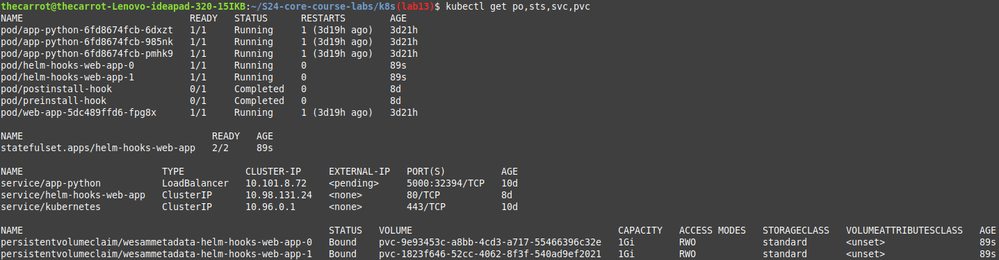

## Task1




## Task 2 (Hooks)


```bash
~/gh/scripts_uni/uni/3.2-de/k8s (lab10*) » kubectl get pods,svc                                                                                 void@archlinux
NAME                             READY   STATUS             RESTARTS      AGE
pod/app-python-5ccfb944c-6cz6n   1/1     Running            0             18m
pod/app-python-5ccfb944c-8j8v5   1/1     Running            0             18m
pod/app-python-5ccfb944c-q9fq9   1/1     Running            0             18m
pod/post-install-hook            0/1     CrashLoopBackOff   5 (45s ago)   6m3s
pod/pre-install-hook             0/1     CrashLoopBackOff   5 (28s ago)   6m3s

NAME                 TYPE           CLUSTER-IP       EXTERNAL-IP   PORT(S)        AGE
service/app-python   LoadBalancer   10.106.236.137   <pending>     80:31953/TCP   18m
service/kubernetes   ClusterIP      10.96.0.1        <none>        443/TCP        95m
---------------------------------------------------------------------------------------
```

```bash
~/gh/scripts_uni/uni/3.2-de/k8s (lab10*) » kubectl describe po pre-install-hook                                                                 void@archlinux
Name:             pre-install-hook
Namespace:        default
Priority:         0
Service Account:  default
Node:             minikube/192.168.49.2
Start Time:       Sat, 06 Apr 2024 11:03:06 +0300
Labels:           app.kubernetes.io/managed-by=Helm
Annotations:      meta.helm.sh/release-name: app-python
                  meta.helm.sh/release-namespace: default
Status:           Running
IP:               10.244.0.17
IPs:
  IP:  10.244.0.17
Containers:
  pre-install-hook:
    Container ID:  docker://1ed294aa77e1958c714149a4d17d173fa90f92edd69eeec7c3c161dca6f581fe
    Image:         busybox
    Image ID:      docker-pullable://busybox@sha256:c3839dd800b9eb7603340509769c43e146a74c63dca3045a8e7dc8ee07e53966
    Port:          <none>
    Host Port:     <none>
    Command:
      sleep
      20
    State:          Waiting
      Reason:       CrashLoopBackOff
    Last State:     Terminated
      Reason:       Completed
      Exit Code:    0
      Started:      Sat, 06 Apr 2024 11:05:28 +0300
      Finished:     Sat, 06 Apr 2024 11:05:48 +0300
    Ready:          False
    Restart Count:  3
    Environment:    <none>
    Mounts:
      /var/run/secrets/kubernetes.io/serviceaccount from kube-api-access-9fdck (ro)
Conditions:
  Type              Status
  Initialized       True
  Ready             False
  ContainersReady   False
  PodScheduled      True
Volumes:
  kube-api-access-9fdck:
    Type:                    Projected (a volume that contains injected data from multiple sources)
    TokenExpirationSeconds:  3607
    ConfigMapName:           kube-root-ca.crt
    ConfigMapOptional:       <nil>
    DownwardAPI:             true
QoS Class:                   BestEffort
Node-Selectors:              <none>
Tolerations:                 node.kubernetes.io/not-ready:NoExecute op=Exists for 300s
                             node.kubernetes.io/unreachable:NoExecute op=Exists for 300s
Events:
  Type     Reason     Age                  From               Message
  ----     ------     ----                 ----               -------
  Normal   Scheduled  3m1s                 default-scheduler  Successfully assigned default/pre-install-hook to minikube
  Normal   Pulled     2m31s                kubelet            Successfully pulled image "busybox" in 7.544s (28.629s including waiting)
  Normal   Pulled     2m4s                 kubelet            Successfully pulled image "busybox" in 6.475s (6.475s including waiting)
  Normal   Pulled     87s                  kubelet            Successfully pulled image "busybox" in 1.985s (1.985s including waiting)
  Normal   Pulling    42s (x4 over 3m)     kubelet            Pulling image "busybox"
  Normal   Created    39s (x4 over 2m31s)  kubelet            Created container pre-install-hook
  Normal   Started    39s (x4 over 2m31s)  kubelet            Started container pre-install-hook
  Normal   Pulled     39s                  kubelet            Successfully pulled image "busybox" in 2.42s (2.42s including waiting)
  Warning  BackOff    3s (x5 over 103s)    kubelet            Back-off restarting failed container pre-install-hook in pod pre-install-hook_default(a447918f-35f0-48c4-9ed9-df49de3b7302)
---------------------------------------------------------------------------------------------------------------------------------------------------------------
````

```bash
~/gh/scripts_uni/uni/3.2-de/k8s (lab10*) » kubectl describe po post-install-hook                                                                void@archlinux
Name:             post-install-hook
Namespace:        default
Priority:         0
Service Account:  default
Node:             minikube/192.168.49.2
Start Time:       Sat, 06 Apr 2024 11:03:06 +0300
Labels:           app.kubernetes.io/managed-by=Helm
Annotations:      meta.helm.sh/release-name: app-python
                  meta.helm.sh/release-namespace: default
Status:           Running
IP:               10.244.0.16
IPs:
  IP:  10.244.0.16
Containers:
  post-install-hook:
    Container ID:  docker://e5890f8230c123c1f7b58bcfddc50a63e04e6a9186d914f19f7b30095aace1af
    Image:         busybox
    Image ID:      docker-pullable://busybox@sha256:c3839dd800b9eb7603340509769c43e146a74c63dca3045a8e7dc8ee07e53966
    Port:          <none>
    Host Port:     <none>
    Command:
      sleep
      20
    State:          Waiting
      Reason:       CrashLoopBackOff
    Last State:     Terminated
      Reason:       Completed
      Exit Code:    0
      Started:      Sat, 06 Apr 2024 11:06:21 +0300
      Finished:     Sat, 06 Apr 2024 11:06:41 +0300
    Ready:          False
    Restart Count:  4
    Environment:    <none>
    Mounts:
      /var/run/secrets/kubernetes.io/serviceaccount from kube-api-access-kc5g2 (ro)
Conditions:
  Type              Status
  Initialized       True
  Ready             False
  ContainersReady   False
  PodScheduled      True
Volumes:
  kube-api-access-kc5g2:
    Type:                    Projected (a volume that contains injected data from multiple sources)
    TokenExpirationSeconds:  3607
    ConfigMapName:           kube-root-ca.crt
    ConfigMapOptional:       <nil>
    DownwardAPI:             true
QoS Class:                   BestEffort
Node-Selectors:              <none>
Tolerations:                 node.kubernetes.io/not-ready:NoExecute op=Exists for 300s
                             node.kubernetes.io/unreachable:NoExecute op=Exists for 300s
Events:
  Type     Reason     Age                   From               Message
  ----     ------     ----                  ----               -------
  Normal   Scheduled  3m56s                 default-scheduler  Successfully assigned default/post-install-hook to minikube
  Normal   Pulled     3m34s                 kubelet            Successfully pulled image "busybox" in 21.096s (21.097s including waiting)
  Normal   Pulled     3m10s                 kubelet            Successfully pulled image "busybox" in 2.377s (2.377s including waiting)
  Normal   Pulled     2m35s                 kubelet            Successfully pulled image "busybox" in 2.331s (2.331s including waiting)
  Normal   Pulled     105s                  kubelet            Successfully pulled image "busybox" in 2.303s (2.303s including waiting)
  Normal   Started    104s (x4 over 3m33s)  kubelet            Started container post-install-hook
  Warning  BackOff    59s (x6 over 2m49s)   kubelet            Back-off restarting failed container post-install-hook in pod post-install-hook_default(4a80ffb9-aed0-44c9-9e52-dd93f086904d)
  Normal   Pulling    44s (x5 over 3m55s)   kubelet            Pulling image "busybox"
  Normal   Created    42s (x5 over 3m33s)   kubelet            Created container post-install-hook
  Normal   Pulled     42s                   kubelet            Successfully pulled image "busybox" in 2.298s (2.298s including waiting)
```
