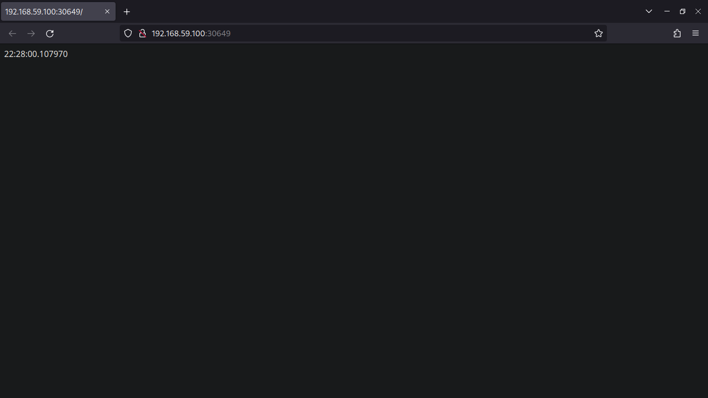

## Task 1 

* `kubectl create deployment app-python --image=maintheme/flask-msktime-app:v1 --port=5000`

* `kubectl expose deployment app-python --type=LoadBalancer --port=5000`

* `kubectl get pods,svc`
    ```bash 
    NAME                              READY   STATUS    RESTARTS   AGE
    pod/app-python-5d87999cfb-4hgk7   1/1     Running   0          47s

    NAME                 TYPE           CLUSTER-IP       EXTERNAL-IP   PORT(S)          AGE
    service/app-python   LoadBalancer   10.104.164.125   <pending>     5000:32214/TCP   42s
    service/kubernetes   ClusterIP      10.96.0.1        <none>        443/TCP          4m7s ```

* `kubectl delete service app-python`

* `kubectl delete deployment app-python`

## Task 2

* `kubectl apply -f deployment.yml`

* `kubectl apply -f service.yml`

* `kubectl get pods,svc `
    ```bash
    NAME                                        READY   STATUS    RESTARTS   AGE
    pod/app-python-deployment-79d7bb9cf-fftcl   1/1     Running   0          4m19s
    pod/app-python-deployment-79d7bb9cf-h62wz   1/1     Running   0          4m19s
    pod/app-python-deployment-79d7bb9cf-vb5s5   1/1     Running   0          4m19s

    NAME                         TYPE           CLUSTER-IP       EXTERNAL-IP   PORT(S)          AGE
    service/app-python-service   LoadBalancer   10.107.223.208   <pending>     5000:30649/TCP   4m15s
    service/kubernetes           ClusterIP      10.96.0.1        <none>        443/TCP          50m
    ```

* `minikube service --all`
    ```bash
    |-----------|--------------------|-------------|-----------------------------|
    | NAMESPACE |        NAME        | TARGET PORT |             URL             |
    |-----------|--------------------|-------------|-----------------------------|
    | default   | app-python-service |        5000 | http://192.168.59.100:30649 |
    |-----------|--------------------|-------------|-----------------------------|
    |-----------|------------|-------------|--------------|
    | NAMESPACE |    NAME    | TARGET PORT |     URL      |
    |-----------|------------|-------------|--------------|
    | default   | kubernetes |             | No node port |
    |-----------|------------|-------------|--------------|
    😿  service default/kubernetes has no node port
    🎉  Opening service default/app-python-service in default browser...
    ```

