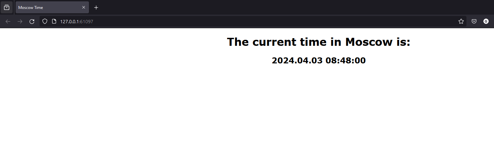
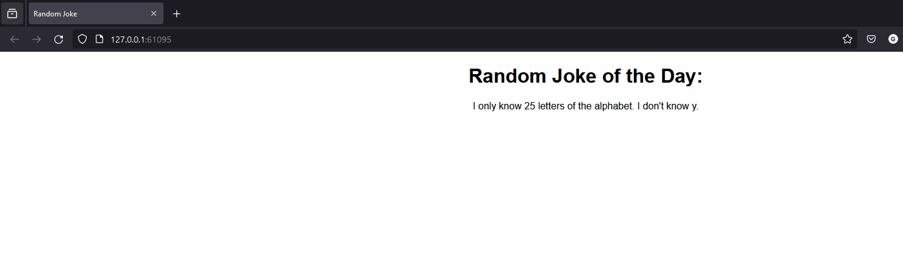
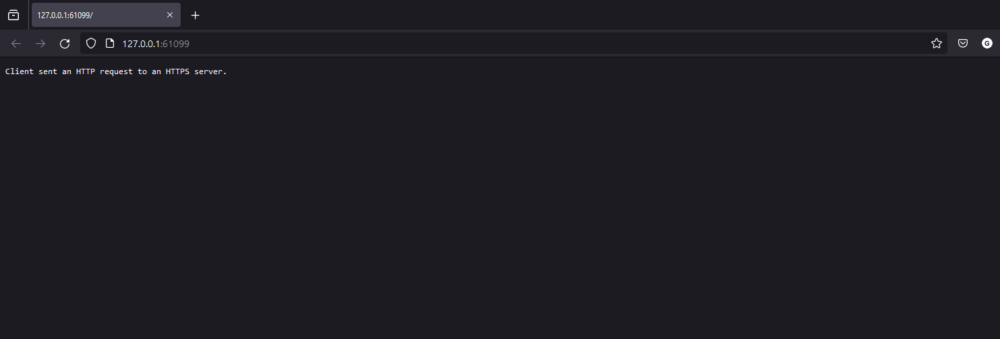

# Kubernetes

### Installation
Running this module requires installing `kubectl`and `minikube`. Please install them using `choco install` commands. 

### Steps

- `minikube start`
```bash
$ minikube start
😄  minikube v1.32.0 on Microsoft Windows 11 Enterprise 10.0.22631.3296 Build 22631.3296
✨  Using the docker driver based on existing profile
👍  Starting control plane node minikube in cluster minikube
🚜  Pulling base image ...
🔥  Creating docker container (CPUs=2, Memory=6000MB) ...
🐳  Preparing Kubernetes v1.28.3 on Docker 24.0.7 ...
    ▪ Generating certificates and keys ...
    ▪ Booting up control plane ...
    ▪ Configuring RBAC rules ...
🔗  Configuring bridge CNI (Container Networking Interface) ...
🔎  Verifying Kubernetes components...
    ▪ Using image gcr.io/k8s-minikube/storage-provisioner:v5
🌟  Enabled addons: storage-provisioner, default-storageclass
🏄  Done! kubectl is now configured to use "minikube" cluster and "default" namespace by default
```

- Create a deployments:

```bash
$ kubectl create deployment app-python --image abuwho/app_python:latest
deployment.apps/app-python created
```
```bash
$ kubectl create deployment app-go --image abuwho/app_go:latest
deployment.apps/app-go created
```

- Show the deployments
```bash
$ kubectl get deployments
NAME         READY   UP-TO-DATE   AVAILABLE   AGE
app-go       1/1     1            1           33s
app-python   1/1     1            1           39s
```

- Expose 
```bash
$ kubectl expose deployment app-python --type=LoadBalancer --port=5000 --target-port=5000
service/app-python exposed

$ kubectl expose deployment app-go --type=LoadBalancer --port=8080 --target-port=8080
service/app-go exposed
```

- Show pods and services
```bash
$ kubectl get pods,services
NAME                              READY   STATUS    RESTARTS   AGE
pod/app-go-65678c557f-c8xp2       1/1     Running   0          2m38s
pod/app-python-7b4ffb4c56-8t44h   1/1     Running   0          2m44s

NAME                 TYPE           CLUSTER-IP       EXTERNAL-IP   PORT(S)          AGE
service/app-go       LoadBalancer   10.107.246.30    <pending>     8080:30128/TCP   22s
service/app-python   LoadBalancer   10.104.117.119   <pending>     5000:31310/TCP   52s
service/kubernetes   ClusterIP      10.96.0.1        <none>        443/TCP          45m
```

- Start service
```bash
$ minikube service --all
W0403 08:47:55.639145   20656 main.go:291] Unable to resolve the current Docker CLI context "default": context "default": context not found: open C:\Users\Admin\.docker\contexts\meta\37a8eec1ce19687d132fe29051dca629d164e2c4958ba141d5f4133a33f0688f\meta.json: The system cannot find the path specified.
|-----------|--------|-------------|---------------------------|
| NAMESPACE |  NAME  | TARGET PORT |            URL            |
|-----------|--------|-------------|---------------------------|
| default   | app-go |        8080 | http://192.168.49.2:30128 |
|-----------|--------|-------------|---------------------------|
|-----------|------------|-------------|---------------------------|
| NAMESPACE |    NAME    | TARGET PORT |            URL            |
|-----------|------------|-------------|---------------------------|
| default   | app-python |        5000 | http://192.168.49.2:31310 |
|-----------|------------|-------------|---------------------------|
|-----------|------------|-------------|--------------|
| NAMESPACE |    NAME    | TARGET PORT |     URL      |
|-----------|------------|-------------|--------------|
| default   | kubernetes |             | No node port |
|-----------|------------|-------------|--------------|
😿  service default/kubernetes has no node port
🏃  Starting tunnel for service app-go.
🏃  Starting tunnel for service app-python.
🏃  Starting tunnel for service kubernetes.
|-----------|------------|-------------|------------------------|
| NAMESPACE |    NAME    | TARGET PORT |          URL           |
|-----------|------------|-------------|------------------------|
| default   | app-go     |             | http://127.0.0.1:61095 |
| default   | app-python |             | http://127.0.0.1:61097 |
| default   | kubernetes |             | http://127.0.0.1:61099 |
|-----------|------------|-------------|------------------------|
🎉  Opening service default/app-go in default browser...
🎉  Opening service default/app-python in default browser...
🎉  Opening service default/kubernetes in default browser...
❗  Because you are using a Docker driver on windows, the terminal needs to be open to run it.
```

- On browser: 
    - app-python service
        
    - app-go service
        
    - kubernetes service
        


- Cleanup: delete services
```bash
$ kubectl delete service app-python app-go
service "app-python" deleted
service "app-go" deleted
```

- Cleanup: delete deployments
```bash
$ kubectl delete deployment app-python app-go
deployment.apps "app-python" deleted
deployment.apps "app-go" deleted
```

- Status after cleanup
```bash
$ kubectl get pods,services
NAME                 TYPE        CLUSTER-IP   EXTERNAL-IP   PORT(S)   AGE
service/kubernetes   ClusterIP   10.96.0.1    <none>        443/TCP   55m
```