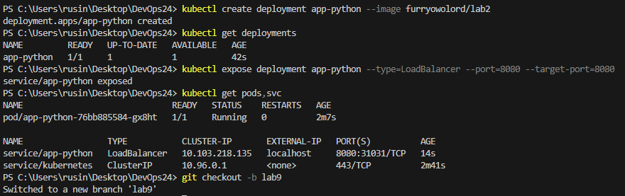
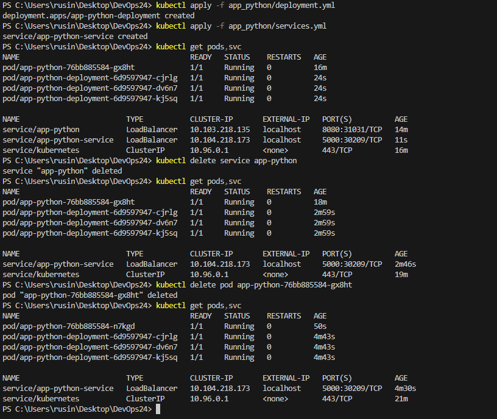
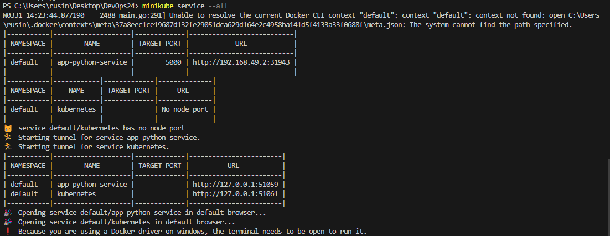
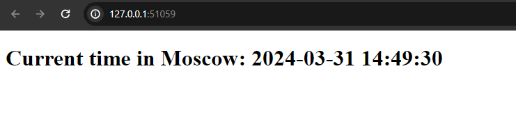

# k8s

The process of deployment, including ```kubectl get pods,svc``` output:



The process of deployment using .yml files. Also with deletion of previosly created resorces.



`minikube service --all` output



Verify what IP matches in the browser

