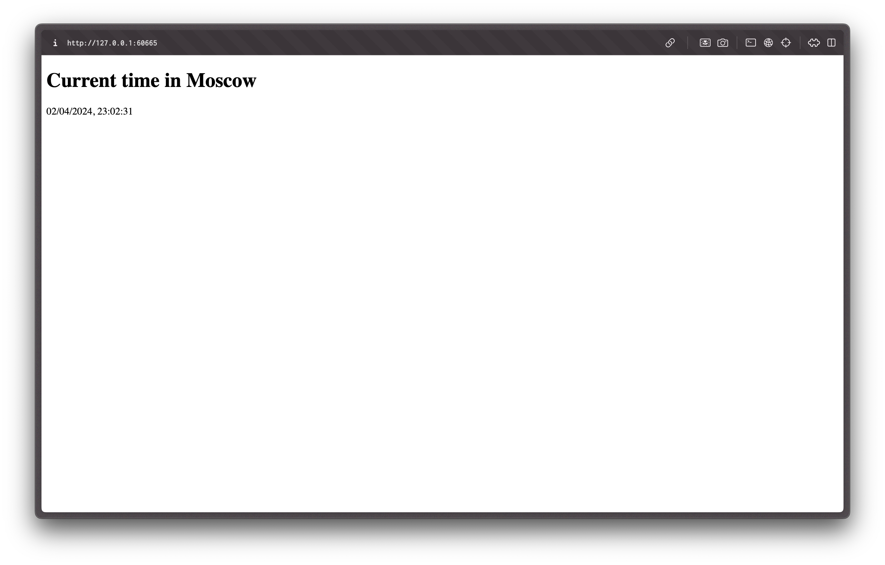

# Kubernetes

## Task 1

```bash
§ kubectl get pods,svc
NAME                             READY   STATUS    RESTARTS   AGE
pod/hello-node-7c8474484-47xmk   1/1     Running   0          3m4s

NAME                 TYPE           CLUSTER-IP     EXTERNAL-IP   PORT(S)          AGE
service/hello-node   LoadBalancer   10.97.253.90   <pending>     8080:32669/TCP   108s
service/kubernetes   ClusterIP      10.96.0.1      <none>        443/TCP          16m
```

## Task 2

```bash
§ kubectl get pods,svc
NAME                                          READY   STATUS    RESTARTS   AGE
pod/moscow-time-deployment-7bfc8c688d-4zx2z   1/1     Running   0          15s
pod/moscow-time-deployment-7bfc8c688d-fkvrl   1/1     Running   0          15s
pod/moscow-time-deployment-7bfc8c688d-vnlfx   1/1     Running   0          15s

NAME                          TYPE           CLUSTER-IP       EXTERNAL-IP   PORT(S)          AGE
service/kubernetes            ClusterIP      10.96.0.1        <none>        443/TCP          61m
service/moscow-time-service   LoadBalancer   10.107.208.170   <pending>     8000:32332/TCP   13s
```

```bash
§ minikube service --all
|-----------|------------|-------------|--------------|
| NAMESPACE |    NAME    | TARGET PORT |     URL      |
|-----------|------------|-------------|--------------|
| default   | kubernetes |             | No node port |
|-----------|------------|-------------|--------------|
😿  service default/kubernetes has no node port
|-----------|---------------------|-------------|---------------------------|
| NAMESPACE |        NAME         | TARGET PORT |            URL            |
|-----------|---------------------|-------------|---------------------------|
| default   | moscow-time-service |        8000 | http://192.168.49.2:32332 |
|-----------|---------------------|-------------|---------------------------|
🏃  Starting tunnel for service kubernetes.
🏃  Starting tunnel for service moscow-time-service.
|-----------|---------------------|-------------|------------------------|
| NAMESPACE |        NAME         | TARGET PORT |          URL           |
|-----------|---------------------|-------------|------------------------|
| default   | kubernetes          |             | http://127.0.0.1:60663 |
| default   | moscow-time-service |             | http://127.0.0.1:60665 |
|-----------|---------------------|-------------|------------------------|
🎉  Opening service default/kubernetes in default browser...
🎉  Opening service default/moscow-time-service in default browser...
❗  Because you are using a Docker driver on darwin, the terminal needs to be open to run it.
```

Screenshot:


