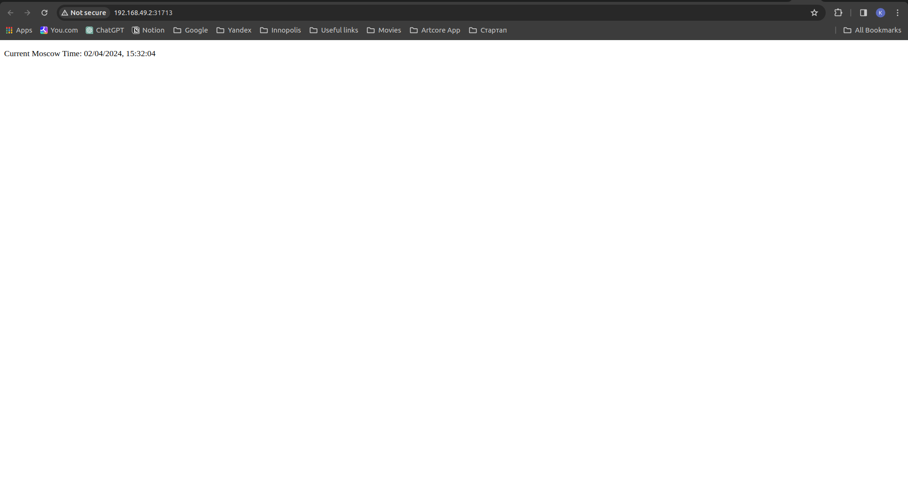

# Basic deployment

## How I deployed my application

1. I created a Deployment resource using `kubectl create deployment app-python-node --image=almetovkamil/app_python:v2`

2. I created a Service resource using `kubectl expose deployment app-python-node --type=LoadBalancer --port=5000`

## How to access the deployed app

1. Create an environment variable called NODE_PORT that has the value of the Node port assigned:

`export NODE_PORT="$(kubectl get services/app-python-node -o go-template='{{(index .spec.ports 0).nodePort}}')"`

2. Now the app is available by `curl http://"$(minikube ip):$NODE_PORT"`

## Output of `kubectl get pods,svc`


```
NAME                                   READY   STATUS    RESTARTS   AGE
pod/app-python-node-54c8b94859-nprz2   1/1     Running   0          33m

NAME                      TYPE           CLUSTER-IP     EXTERNAL-IP   PORT(S)          AGE
service/app-python-node   LoadBalancer   10.98.141.76   <pending>     5000:32245/TCP   3m22s
service/kubernetes        ClusterIP      10.96.0.1      <none>        443/TCP          45m
```

# Deploying with Manifests

## Applying manifests

```
kubectl apply -f k8s/deployment.yml
kubectl apply -f k8s/service.yml
```

## Output of `kubectl get pods,svc`

```
NAME                                        READY   STATUS    RESTARTS   AGE
pod/app-python-deployment-c68868b78-7cgc4   1/1     Running   0          10m
pod/app-python-deployment-c68868b78-dt59b   1/1     Running   0          10m
pod/app-python-deployment-c68868b78-rwmt5   1/1     Running   0          10m

NAME                         TYPE        CLUSTER-IP     EXTERNAL-IP   PORT(S)          AGE
service/app-python-service   NodePort    10.96.89.164   <none>        5000:31713/TCP   5m44s
service/kubernetes           ClusterIP   10.96.0.1      <none>        443/TCP          23h
```

## Output of `minikube service --all`

```
|-----------|--------------------|-------------|---------------------------|
| NAMESPACE |        NAME        | TARGET PORT |            URL            |
|-----------|--------------------|-------------|---------------------------|
| default   | app-python-service |        5000 | http://192.168.49.2:31713 |
|-----------|--------------------|-------------|---------------------------|
|-----------|------------|-------------|--------------|
| NAMESPACE |    NAME    | TARGET PORT |     URL      |
|-----------|------------|-------------|--------------|
| default   | kubernetes |             | No node port |
|-----------|------------|-------------|--------------|
😿  service default/kubernetes has no node port
🎉  Opening service default/app-python-service in default browser...
Opening in existing browser session.
```

