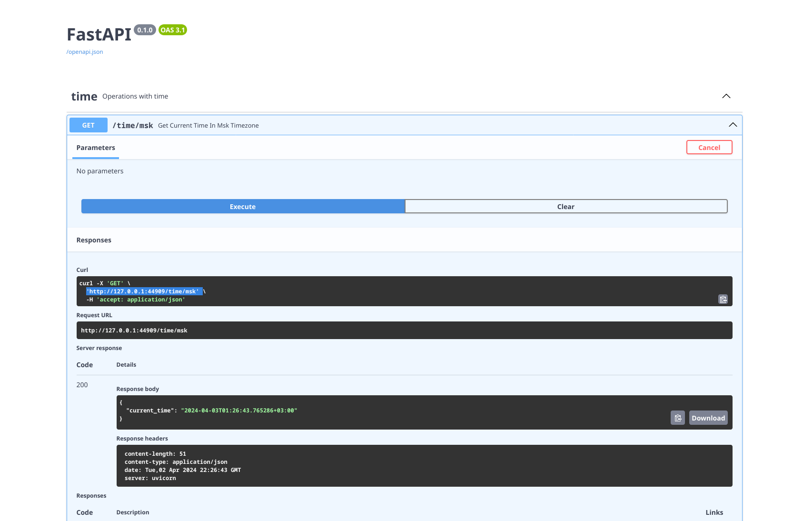

# Kubernetes

## Basic deployment

After `minikube kubectl --  create deployment web-app --image dirakon/devops-py:latest`:

```shell
deployment.apps/web-app created
```

Confirming via `minikube kubectl --  get deployments`:

```shell
NAME      READY   UP-TO-DATE   AVAILABLE   AGE
web-app   1/1     1            1           8m2s
```

Make it accessible via `minikube kubectl -- expose deployment web-app --type=LoadBalancer --port=80`:

```shell
service/web-app exposed
```

Create a tunnel using `minikube tunnel`

See `minikube kubectl get services`:

```shell
NAME         TYPE           CLUSTER-IP      EXTERNAL-IP   PORT(S)        AGE
kubernetes   ClusterIP      10.96.0.1       <none>        443/TCP        34m
web-app      LoadBalancer   10.106.233.46   127.0.0.1     80:31667/TCP   7m17s
```

Check that everything works as expected by visiting `http://127.0.0.1:80/docs` and seeing swagger

After running `minikube kubectl get pods,svc`

```shell
NAME                           READY   STATUS    RESTARTS   AGE
pod/web-app-56bc85fd79-qpncx   1/1     Running   0          3m42s

NAME                 TYPE           CLUSTER-IP       EXTERNAL-IP   PORT(S)        AGE
service/kubernetes   ClusterIP      10.96.0.1        <none>        443/TCP        40m
service/web-app      LoadBalancer   10.104.231.163   127.0.0.1     80:32168/TCP   2m37s
```

Finally, remove created items using `minikube kubectl delete service web-app` and `minikube kubectl --  delete deploy web-app`

## Declarative deployment

Apply deployment manifest via `minikube kubectl -- apply -f deployment.yml`

Apply service manifest via `minikube kubectl -- apply -f service.yml`

Check that everything works by setting up tunnel and checking swagger, just as done before.

After running `minikube kubectl get pods,svc`

```shell
NAME                                      READY   STATUS    RESTARTS   AGE
pod/web-app-deployment-5959d9cff9-2p8px   1/1     Running   0          97s
pod/web-app-deployment-5959d9cff9-97g8s   1/1     Running   0          97s
pod/web-app-deployment-5959d9cff9-qgwr9   1/1     Running   0          97s

NAME                      TYPE           CLUSTER-IP       EXTERNAL-IP   PORT(S)        AGE
service/kubernetes        ClusterIP      10.96.0.1        <none>        443/TCP        49m
service/web-app-service   LoadBalancer   10.100.231.108   127.0.0.1     80:30859/TCP   67s
```

After running `minikube service --all`:

```shell
|-----------|------------|-------------|--------------|
| NAMESPACE |    NAME    | TARGET PORT |     URL      |
|-----------|------------|-------------|--------------|
| default   | kubernetes |             | No node port |
|-----------|------------|-------------|--------------|
😿  service default/kubernetes has no node port
|-----------|-----------------|-------------|---------------------------|
| NAMESPACE |      NAME       | TARGET PORT |            URL            |
|-----------|-----------------|-------------|---------------------------|
| default   | web-app-service |          80 | http://192.168.49.2:30859 |
|-----------|-----------------|-------------|---------------------------|
🏃  Starting tunnel for service kubernetes.
🏃  Starting tunnel for service web-app-service.
|-----------|-----------------|-------------|------------------------|
| NAMESPACE |      NAME       | TARGET PORT |          URL           |
|-----------|-----------------|-------------|------------------------|
| default   | kubernetes      |             | http://127.0.0.1:42403 |
| default   | web-app-service |             | http://127.0.0.1:43233 |
|-----------|-----------------|-------------|------------------------|
🎉  Opening service default/kubernetes in default browser...
🎉  Opening service default/web-app-service in default browser...
❗  Because you are using a Docker driver on linux, the terminal needs to be open to run it.
```

Browser opens, I can add `/docs` to path, and see this:


