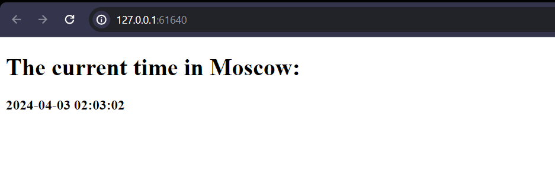
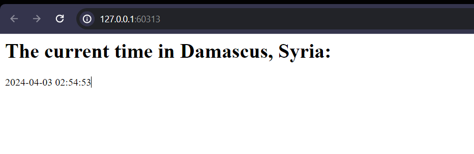
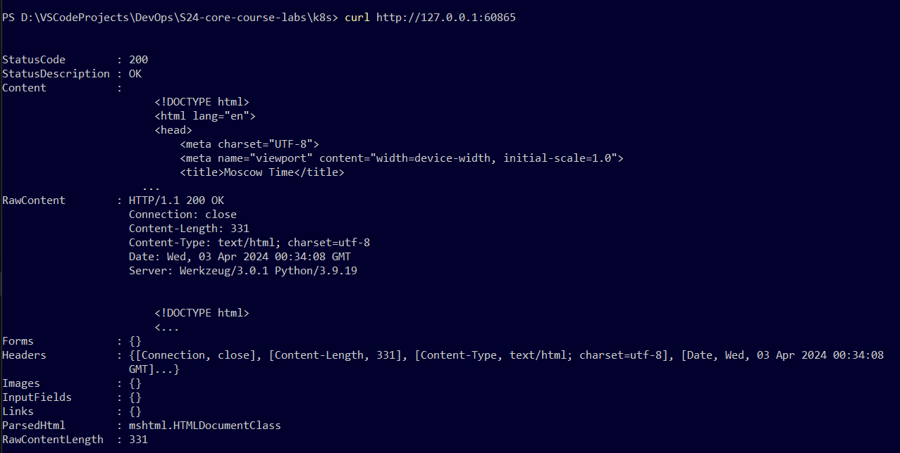
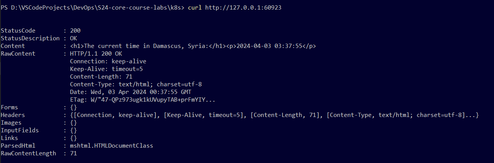

# Kubernetes

## Kubernetes Setup and Basic Deployment

### Deploying python app

Creating:

```bash
PS D:\VSCodeProjects\DevOps\S24-core-course-labs\k8s> kubectl create deployment python-app --image ghadeero/python-web-app
deployment.apps/python-app created
```

Exposing

```bash
PS D:\VSCodeProjects\DevOps\S24-core-course-labs\k8s> kubectl expose deployment python-app --type=NodePort --port=5000
service/python-app exposed
```

Viewing the pods and services:

```bash
PS D:\VSCodeProjects\DevOps\S24-core-course-labs\k8s> kubectl get pods,svc
NAME                              READY   STATUS    RESTARTS   AGE
pod/python-app-869d6bd47f-rl4qf   1/1     Running   0          14s

NAME                 TYPE        CLUSTER-IP    EXTERNAL-IP   PORT(S)          AGE
service/kubernetes   ClusterIP   10.96.0.1     <none>        443/TCP          56m
service/python-app   NodePort    10.96.81.20   <none>        5000:31576/TCP   5s
```

---

### Cleanup

Deleting the deployment:

```bash
PS D:\VSCodeProjects\DevOps\S24-core-course-labs\k8s> kubectl delete deployment python-app
deployment.apps "python-app" deleted
```

Deleting the service:

```bash
PS D:\VSCodeProjects\DevOps\S24-core-course-labs\k8s> kubectl delete service python-app
service "python-app" deleted
```

---

## Declarative Kubernetes Manifests

### Manifesting python app:

Running the command `kubectl apply -f python-app`

```bash
PS D:\VSCodeProjects\DevOps\S24-core-course-labs\k8s> kubectl apply -f python-app
deployment.apps/python-app-deployment created
service/python-app-service created
```

Viewing the pods and services through `kubectl get pods,svc`

```bash
PS D:\VSCodeProjects\DevOps\S24-core-course-labs\k8s> kubectl get pods,svc
NAME                                         READY   STATUS        RESTARTS   AGE
pod/python-app-869d6bd47f-rl4qf              1/1     Terminating   0          30m
pod/python-app-deployment-686f88486d-fsd68   1/1     Running       0          2m29s
pod/python-app-deployment-686f88486d-jtzw7   1/1     Running       0          2m29s
pod/python-app-deployment-686f88486d-x9dls   1/1     Running       0          2m29s

NAME                         TYPE           CLUSTER-IP     EXTERNAL-IP   PORT(S)          AGE
service/kubernetes           ClusterIP      10.96.0.1      <none>        443/TCP          86m
service/python-app-service   LoadBalancer   10.96.217.74   <pending>     5000:31400/TCP   2m29s
```

Running the command `minikube service --all`

outputs:

```bash
PS D:\VSCodeProjects\DevOps\S24-core-course-labs\k8s> minikube service --all
|-----------|------------|-------------|--------------|
| NAMESPACE |    NAME    | TARGET PORT |     URL      |
|-----------|------------|-------------|--------------|
| default   | kubernetes |             | No node port |
|-----------|------------|-------------|--------------|
😿  service default/kubernetes has no node port
|-----------|--------------------|-------------|---------------------------|
| NAMESPACE |        NAME        | TARGET PORT |            URL            |
|-----------|--------------------|-------------|---------------------------|
| default   | python-app-service |        5000 | http://192.168.49.2:31400 |
|-----------|--------------------|-------------|---------------------------|
🏃  Starting tunnel for service kubernetes.
🏃  Starting tunnel for service python-app-service.
|-----------|--------------------|-------------|------------------------|
| NAMESPACE |        NAME        | TARGET PORT |          URL           |
|-----------|--------------------|-------------|------------------------|
| default   | kubernetes         |             | http://127.0.0.1:61638 |
| default   | python-app-service |             | http://127.0.0.1:61640 |
|-----------|--------------------|-------------|------------------------|
🎉  Opening service default/kubernetes in default browser...
🎉  Opening service default/python-app-service in default browser...
❗  Because you are using a Docker driver on windows, the terminal needs to be open to run it.
```

Navigating to the url:



---

### Manifesting Javascript app:

Running the command `kubectl apply -f js-app`

outputs:

```bash
PS D:\VSCodeProjects\DevOps\S24-core-course-labs\k8s> kubectl apply -f js-app
deployment.apps/js-app-deployment created
service/js-app-service created
```

Viewing the pods and services through `kubectl get pods,svc`

```bash
PS D:\VSCodeProjects\DevOps\S24-core-course-labs\k8s> kubectl get pods,svc
NAME                                         READY   STATUS    RESTARTS      AGE
pod/js-app-deployment-6f9dcf4959-4mn55       1/1     Running   0             116s
pod/js-app-deployment-6f9dcf4959-kbc75       1/1     Running   0             116s
pod/js-app-deployment-6f9dcf4959-zmdhm       1/1     Running   0             116s
pod/python-app-deployment-686f88486d-fsd68   1/1     Running   1 (10m ago)   56m
pod/python-app-deployment-686f88486d-jtzw7   1/1     Running   1 (10m ago)   56m
pod/python-app-deployment-686f88486d-x9dls   1/1     Running   1 (10m ago)   56m

NAME                         TYPE           CLUSTER-IP      EXTERNAL-IP   PORT(S)          AGE
service/js-app-service       LoadBalancer   10.102.101.36   <pending>     3000:31960/TCP   116s
service/kubernetes           ClusterIP      10.96.0.1       <none>        443/TCP          140m
service/python-app-service   LoadBalancer   10.96.217.74    <pending>     5000:31400/TCP   56m
```

Running the command `minikube service --all`

```bash
PS D:\VSCodeProjects\DevOps\S24-core-course-labs\k8s> minikube service --all
|-----------|----------------|-------------|---------------------------|
| NAMESPACE |      NAME      | TARGET PORT |            URL            |
|-----------|----------------|-------------|---------------------------|
| default   | js-app-service |        3000 | http://192.168.49.2:31960 |
|-----------|----------------|-------------|---------------------------|
|-----------|------------|-------------|--------------|
| NAMESPACE |    NAME    | TARGET PORT |     URL      |
|-----------|------------|-------------|--------------|
| default   | kubernetes |             | No node port |
|-----------|------------|-------------|--------------|
😿  service default/kubernetes has no node port
|-----------|--------------------|-------------|---------------------------|
| NAMESPACE |        NAME        | TARGET PORT |            URL            |
|-----------|--------------------|-------------|---------------------------|
| default   | python-app-service |        5000 | http://192.168.49.2:31400 |
|-----------|--------------------|-------------|---------------------------|
🏃  Starting tunnel for service js-app-service.
🏃  Starting tunnel for service kubernetes.
🏃  Starting tunnel for service python-app-service.
|-----------|--------------------|-------------|------------------------|
| NAMESPACE |        NAME        | TARGET PORT |          URL           |
|-----------|--------------------|-------------|------------------------|
| default   | js-app-service     |             | http://127.0.0.1:60313 |
| default   | kubernetes         |             | http://127.0.0.1:60315 |
| default   | python-app-service |             | http://127.0.0.1:60317 |
|-----------|--------------------|-------------|------------------------|
🎉  Opening service default/js-app-service in default browser...
🎉  Opening service default/kubernetes in default browser...
🎉  Opening service default/python-app-service in default browser...
❗  Because you are using a Docker driver on windows, the terminal needs to be open to run it.
```

> **Note**: I restarted minikube and the python app process before starting the javascript one

Navigating to `http://127.0.0.1:60313`:



## Ingress

Applying ingress on both apps by running the command `kubectl apply -f ingress.yml`

```bash
PS D:\VSCodeProjects\DevOps\S24-core-course-labs\k8s> kubectl apply -f ingress.yml
ingress.networking.k8s.io/js-python-ingress created
```

then `minikube tunnel`

We get the python service url:

```bash
PS D:\VSCodeProjects\DevOps\S24-core-course-labs\k8s> minikube service python-app-service --url
http://127.0.0.1:60865
❗  Because you are using a Docker driver on windows, the terminal needs to be open to run it.
```

then we curl the given url:



---

We do the same for the js app:

```bash
PS D:\VSCodeProjects\DevOps\S24-core-course-labs\k8s> minikube service js-app-service --url    
http://127.0.0.1:60923
❗  Because you are using a Docker driver on windows, the terminal needs to be open to run it.
```

curl the given url:



