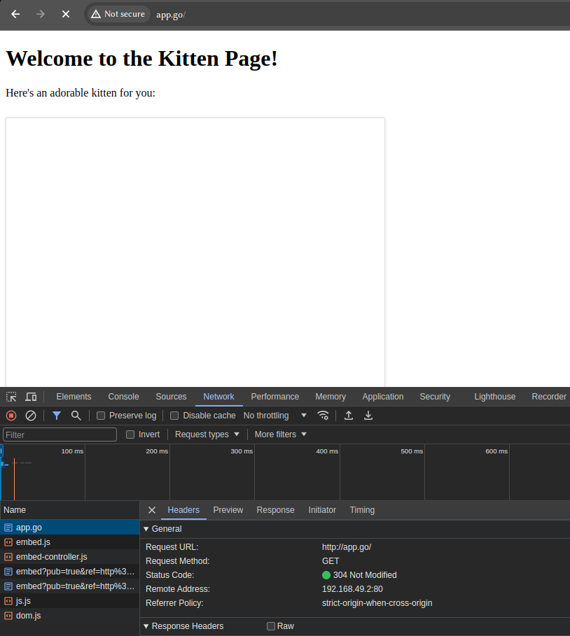

# Kubernetes

## Task 1
### Output of the `kubectl get pods,svc` command:

```sh
NAME                             READY   STATUS    RESTARTS   AGE
pod/app-python-6d8584bf7-zrcqm   1/1     Running   0          30m

NAME                 TYPE           CLUSTER-IP      EXTERNAL-IP   PORT(S)          AGE
service/app-python   LoadBalancer   10.109.253.93   <pending>     8080:31497/TCP   24m
service/kubernetes   ClusterIP      10.96.0.1       <none>        443/TCP          15h

```

## Task 2
### Output of the `kubectl get pods,svc` after service and deploy configurations:

```sh
NAME                              READY   STATUS    RESTARTS      AGE
pod/app-python-577b96c6c9-66nqs   1/1     Running   1 (26m ago)   70m
pod/app-python-577b96c6c9-lpxxb   1/1     Running   1 (26m ago)   70m
pod/app-python-577b96c6c9-sz97r   1/1     Running   1 (26m ago)   70m

NAME                 TYPE           CLUSTER-IP     EXTERNAL-IP   PORT(S)          AGE
service/app-python   LoadBalancer   10.105.89.10   <pending>     8080:30889/TCP   70m
service/kubernetes   ClusterIP      10.96.0.1      <none>        443/TCP          18h

```

### Output of the `minikube service --all` command:

```sh
|-----------|--------|-------------|---------------------------|
| NAMESPACE |  NAME  | TARGET PORT |            URL            |
|-----------|--------|-------------|---------------------------|
| default   | app-go |        8080 | http://192.168.49.2:31117 |
|-----------|--------|-------------|---------------------------|
|-----------|------------|-------------|---------------------------|
| NAMESPACE |    NAME    | TARGET PORT |            URL            |
|-----------|------------|-------------|---------------------------|
| default   | app-python |        8080 | http://192.168.49.2:30889 |
|-----------|------------|-------------|---------------------------|
|-----------|------------|-------------|--------------|
| NAMESPACE |    NAME    | TARGET PORT |     URL      |
|-----------|------------|-------------|--------------|
| default   | kubernetes |             | No node port |
|-----------|------------|-------------|--------------|
😿  service default/kubernetes has no node port
🎉  Opening service default/app-go in default browser...
Opening in existing browser session.
🎉  Opening service default/app-python in default browser...
Opening in existing browser session.

```


### Proof that the deployments for app\_python and app\_go are being run

### Output of the `minikube deployment --all` command:
```sh

```




![all deployments in dashboard][screenshots/deployments.png]
