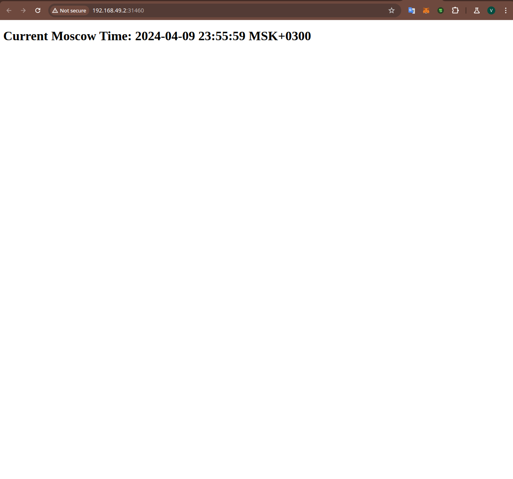

# Kubernetes

## Task 1

Output of the `kubectl get pods,svc` command:

```text
NAME                            READY   STATUS    RESTARTS   AGE
pod/app-node-7b5ccc46fb-245m7   1/1     Running   0          18m

NAME                 TYPE           CLUSTER-IP    EXTERNAL-IP   PORT(S)          AGE
service/app-node     LoadBalancer   10.96.183.9   <pending>     8000:31721/TCP   102s
service/kubernetes   ClusterIP      10.96.0.1     <none>        443/TCP          23m
```

## Task 2

Output of the same command after deploy and service configuration:

```text
NAME                              READY   STATUS    RESTARTS   AGE
pod/app-python-5bd76458b7-c4h62   1/1     Running   0          40s
pod/app-python-5bd76458b7-hkgq5   1/1     Running   0          40s
pod/app-python-5bd76458b7-rfg6j   1/1     Running   0          40s

NAME                 TYPE           CLUSTER-IP       EXTERNAL-IP   PORT(S)          AGE
service/app-python   LoadBalancer   10.104.188.148   <pending>     8000:31460/TCP   32s
service/kubernetes   ClusterIP      10.96.0.1        <none>        443/TCP          42m
```

## Task 3

Output of the `minikube service --all` command:

```text
|-----------|------------|-------------|---------------------------|
| NAMESPACE |    NAME    | TARGET PORT |            URL            |
|-----------|------------|-------------|---------------------------|
| default   | app-python |        8000 | http://192.168.49.2:31460 |
|-----------|------------|-------------|---------------------------|
|-----------|------------|-------------|--------------|
| NAMESPACE |    NAME    | TARGET PORT |     URL      |
|-----------|------------|-------------|--------------|
| default   | kubernetes |             | No node port |
|-----------|------------|-------------|--------------|
😿  service default/kubernetes has no node port
🎉  Opening service default/app-python in default browser..
```

Image of started application:


