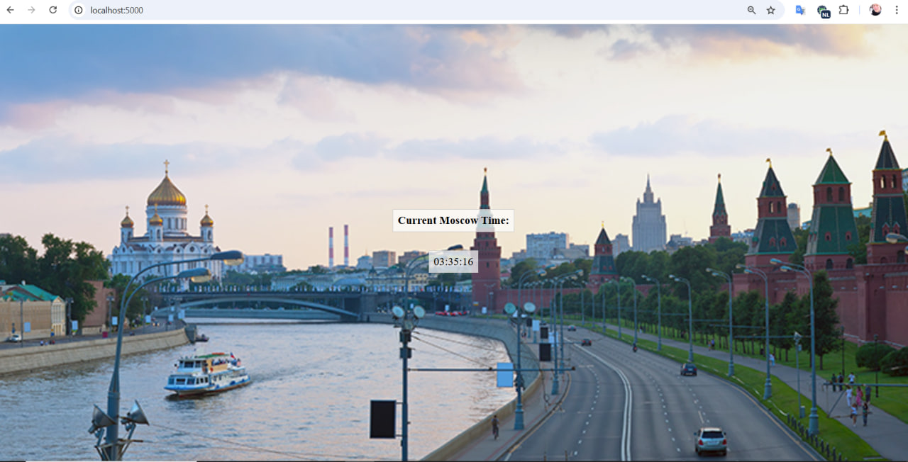
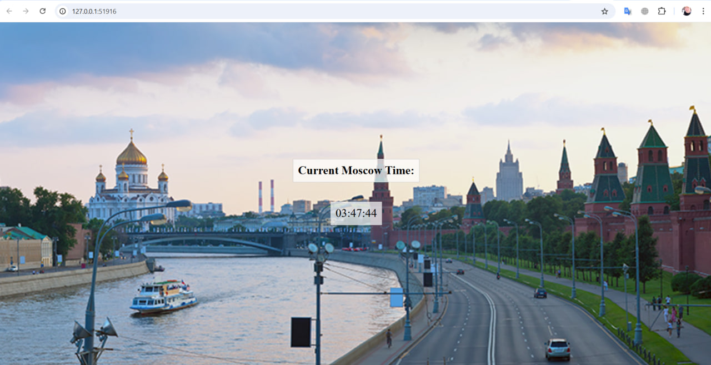

```bash
(venv) PS C:\Users\Ernest\Desktop\Matskevich\k8s> kubectl get pods
app-deployment-98c996f74-pblcx   1/1     Running   0          7s
```
```bash
(venv) PS C:\Users\Ernest\Desktop\Matskevich\k8s> kubectl get svc
NAME          TYPE        CLUSTER-IP    EXTERNAL-IP   PORT(S)          AGE
app-service   NodePort    10.102.20.6   <none>        5000:32128/TCP   106m
kubernetes    ClusterIP   10.96.0.1     <none>        443/TCP          112m
```
```bash
(venv) PS C:\Users\Ernest\Desktop\Matskevich\k8s> kubectl port-forward pod/app-deployment-98c996f74-pblcx 5000:5000
Forwarding from 127.0.0.1:5000 -> 5000
Forwarding from [::1]:5000 -> 5000
Handling connection for 5000
Handling connection for 5000
Handling connection for 5000
Handling connection for 5000
```


```bash
(venv) PS C:\Users\Ernest\Desktop\Matskevich\k8s> minikube service app-service               
|-----------|-------------|-------------|---------------------------|
| NAMESPACE |    NAME     | TARGET PORT |            URL            |
|-----------|-------------|-------------|---------------------------|
| default   | app-service |        5000 | http://192.168.49.2:32128 |
|-----------|-------------|-------------|---------------------------|
* Starting tunnel for service app-service.
|-----------|-------------|-------------|------------------------|
| NAMESPACE |    NAME     | TARGET PORT |          URL           |
|-----------|-------------|-------------|------------------------|
| default   | app-service |             | http://127.0.0.1:51916 |
|-----------|-------------|-------------|------------------------|
* Opening service default/app-service in default browser...
! Because you are using a Docker driver on windows, the terminal needs to be open to run it.

```



## Cleanup ##
```bash
(venv) PS C:\Users\Ernest\Desktop\Matskevich\k8s> kubectl delete deployment app-deployment
deployment.apps "app-deployment" deleted
```
```bash
(venv) PS C:\Users\Ernest\Desktop\Matskevich\k8s> kubectl delete service app-service
service "app-service" deleted
```
Code below shows terminating status
```bash
(venv) PS C:\Users\Ernest\Desktop\Matskevich\k8s> kubectl get all
NAME                                 READY   STATUS        RESTARTS   AGE
pod/app-deployment-98c996f74-pblcx   1/1     Terminating   0          26m

NAME                 TYPE        CLUSTER-IP   EXTERNAL-IP   PORT(S)   AGE
service/kubernetes   ClusterIP   10.96.0.1    <none>        443/TCP   128m
```
Code below shows that Kubernates enviroment is clear
```bash
(venv) PS C:\Users\Ernest\Desktop\Matskevich\k8s> kubectl get all
NAME                 TYPE        CLUSTER-IP   EXTERNAL-IP   PORT(S)   AGE
service/kubernetes   ClusterIP   10.96.0.1    <none>        443/TCP   128m
```