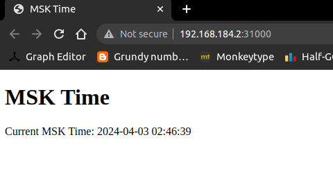

# lab9

## Task1

1. **Deloyment**

   ```
   $ kubectl create deployment flask-app --image=vectorsmaster/flask-app:latest
   deployment.apps/flask-app created

   $ kubectl get deployments
   NAME        READY   UP-TO-DATE   AVAILABLE   AGE
   flask-app   1/1     1            1           15m
   ```
2. **Expose the deployment**

   ```
   $ kubectl expose deployment flask-app --type=NodePort --port=5000
   service/flask-app exposed
   ```
3. **Access the application from the browser**

   ```
   $ kubectl port-forward service/flask-app 5000:5000
   Forwarding from 127.0.0.1:5000 -> 5000
   Forwarding from [::1]:5000 -> 5000
   Handling connection for 5000
   Handling connection for 5000
   ```
4. **utput of command:** `kubectl get pods, svc`

   ```
   NAME                             READY   STATUS    RESTARTS   AGE
   pod/flask-app-6bfd5d795d-jrq26   1/1     Running   0          6m47s

   NAME                 TYPE        CLUSTER-IP     EXTERNAL-IP   PORT(S)          AGE
   service/flask-app    NodePort    10.97.78.154   <none>        5000:31377/TCP   6m38s
   service/kubernetes   ClusterIP   10.96.0.1      <none>        443/TCP          31m
   ```
5. **clean up:**

   ```
   $ kubectl delete service flask-app
   service "flask-app" deleted

   $ kubectl delete deployment flask-app
   deployment.apps "flask-app" deleted
   ```

## Task2

1. **Create deployment and service**:
   navigate to k8s directory.

   ```
   $ kubectl apply -f .
   deployment.apps/flask-app-deployment created
   service/flask-app-service created

   ```
2. **Output of command:**
   $ kubectl get pods,svc
   NAME                                        READY   STATUS    RESTARTS   AGE
   pod/flask-app-deployment-64fd7cb84d-4hdjq   1/1     Running   0          44m
   pod/flask-app-deployment-64fd7cb84d-hksn6   1/1     Running   0          44m
   pod/flask-app-deployment-64fd7cb84d-sr7p2   1/1     Running   0          44m

   NAME                        TYPE        CLUSTER-IP     EXTERNAL-IP   PORT(S)          AGE
   service/flask-app-service   NodePort    10.110.51.67   `<none>`        5000:31000/TCP   44m
   service/kubernetes          ClusterIP   10.96.0.1      `<none>`        443/TCP          2d19h
3. **Output of command:**

   ```
   $ minikube service --all
   |-----------|-------------------|-------------|----------------------------|
   | NAMESPACE |       NAME        | TARGET PORT |            URL             |
   |-----------|-------------------|-------------|----------------------------|
   | default   | flask-app-service |        5000 | http://192.168.184.2:31000 |
   |-----------|-------------------|-------------|----------------------------|
   |-----------|------------|-------------|--------------|
   | NAMESPACE |    NAME    | TARGET PORT |     URL      |
   |-----------|------------|-------------|--------------|
   | default   | kubernetes |             | No node port |
   |-----------|------------|-------------|--------------|
   😿  service default/kubernetes has no node port
   🎉  Opening service default/flask-app-service in default browser...
   ```
4. **Screenshot:**


## Bonus Task

1. **`$ minikube service flask-app-service --url`**
    output:
    `http://192.168.184.2:31000`

2. **`$ curl http://192.168.184.2:31000`**
    output:
    ```
    <!DOCTYPE html>
    <html>
    <head>
        <title>MSK Time</title>
    </head>
    <body>
        <h1>MSK Time</h1>
        <p>Current MSK Time: 2024-04-03 03:01:21</p>
    </body>
    ```

3. **ingress:**
    ```
    $ minikube addons enable ingress
    💡  ingress is an addon maintained by Kubernetes. For any concerns contact minikube on GitHub.
    You can view the list of minikube maintainers at: https://github.com/kubernetes/minikube/blob/master/OWNERS
        ▪ Using image registry.k8s.io/ingress-nginx/controller:v1.9.4
        ▪ Using image registry.k8s.io/ingress-nginx/kube-webhook-certgen:v20231011-8b53cabe0
        ▪ Using image registry.k8s.io/ingress-nginx/kube-webhook-certgen:v20231011-8b53cabe0
    🔎  Verifying ingress addon...
    🌟  The 'ingress' addon is enabled

    $ kubectl get pods -n ingress-nginx
    NAME                                        READY   STATUS      RESTARTS   AGE
    ingress-nginx-admission-create-xg8zz        0/1     Completed   0          3m6s
    ingress-nginx-admission-patch-ff48h         0/1     Completed   1          3m6s
    ingress-nginx-controller-7c6974c4d8-tmvbp   1/1     Running     0          3m6s

    $ kubectl apply -f ingress.yml
    ingress.networking.k8s.io/flask-app-ingress created

    $ kubectl get ingress
    NAME                CLASS   HOSTS            ADDRESS         PORTS   AGE
    flask-app-ingress   nginx   flask-app.info   192.168.184.2   80      71s

    $ curl --resolve "flask-app.info:80:$( minikube ip )" -i http://flask-app.info
    HTTP/1.1 200 OK
    Date: Wed, 03 Apr 2024 00:07:26 GMT
    Content-Type: text/html; charset=utf-8
    Content-Length: 159
    Connection: keep-alive

    <!DOCTYPE html>
    <html>
    <head>
        <title>MSK Time</title>
    </head>
    <body>
        <h1>MSK Time</h1>
        <p>Current MSK Time: 2024-04-03 03:07:26</p>
    </body>
    ```

4. **screenshot:**


    
